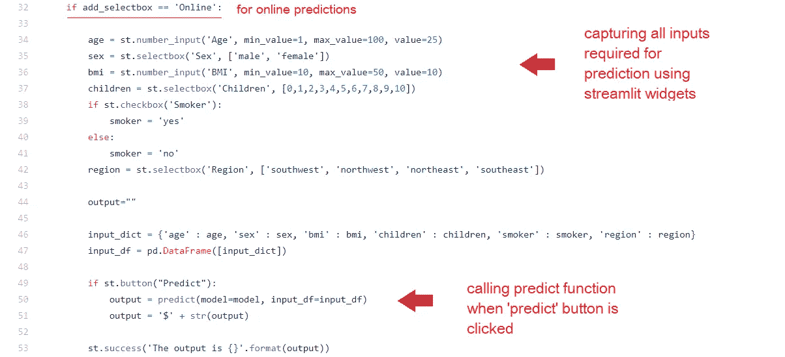
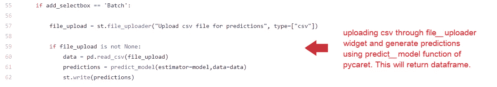

# 使用 PyCaret 和 Streamlit 构建和部署机器学习 web 应用程序

> 原文：<https://towardsdatascience.com/build-and-deploy-machine-learning-web-app-using-pycaret-and-streamlit-28883a569104?source=collection_archive---------12----------------------->

## 在 Heroku PaaS 上部署机器学习应用程序的初学者指南


# 概述

在我们关于在云中部署机器学习管道的[上一篇文章](/deploy-machine-learning-pipeline-on-aws-fargate-eb6e1c50507)中，我们演示了如何在 PyCaret 中开发机器学习管道，用 Docker 封装 Flask 应用程序，以及使用 AWS Fargate 部署无服务器。如果你以前没有听说过 PyCaret，你可以阅读这个[公告](/announcing-pycaret-an-open-source-low-code-machine-learning-library-in-python-4a1f1aad8d46)来了解更多。

在本教程中，我们将使用 PyCaret 训练一个机器学习管道，并使用 [Streamlit](https://www.streamlit.io/) 开源框架创建一个 web 应用。这个 web 应用程序将是一个简单的界面，供业务用户使用训练有素的机器学习管道在新的数据集上生成预测。

本教程结束时，您将能够构建一个功能完整的 web 应用程序，使用经过训练的机器学习模型来生成在线预测(逐个)和批量预测(通过上传 csv 文件)。最终的应用程序如下所示:


[https://pycaret-streamlit.herokuapp.com](https://pycaret-streamlit.herokuapp.com)

# 👉您将在本教程中学到什么

*   什么是部署，我们为什么要部署机器学习模型？
*   开发一个机器学习管道，用 PyCaret 训练模型。
*   使用 Streamlit 开源框架构建一个简单的 web 应用。
*   在“Heroku”上部署一个 web 应用程序，并查看运行中的模型。

本教程将涵盖整个工作流程，从训练机器学习模型和开发 Python 中的管道开始，使用 streamlit 开发简单的 web 应用程序，并在 Heroku 云平台上部署应用程序。

过去，我们讨论过使用 docker 的容器化以及在 Azure、GCP 和 AWS 等云平台上的部署。如果你有兴趣了解更多，你可以阅读下面的故事:

*   [在 AWS Fargate 上部署机器学习管道](/deploy-machine-learning-pipeline-on-aws-fargate-eb6e1c50507)
*   [在 Google Kubernetes 引擎上部署机器学习管道](/deploy-machine-learning-model-on-google-kubernetes-engine-94daac85108b)
*   [在 AWS Web 服务上部署机器学习管道](/deploy-machine-learning-pipeline-on-cloud-using-docker-container-bec64458dc01)
*   [在 Heroku PaaS 上构建和部署您的第一个机器学习 web 应用](/build-and-deploy-your-first-machine-learning-web-app-e020db344a99)

# 💻本教程的工具箱

# PyCaret

PyCaret 是 Python 中的一个开源、低代码机器学习库，用于训练和部署机器学习管道和模型到生产中。PyCaret 可以使用 pip 轻松安装。

```
pip install **pycaret**
```

# 细流

[Streamlit](https://www.streamlit.io/) 是一个开源的 Python 库，可以轻松地为机器学习和数据科学构建漂亮的定制 web 应用。使用 pip 可以轻松安装 Streamlit。

```
pip install **streamlit**
```

# 开源代码库

[GitHub](https://www.github.com/) 是一个基于云的服务，用于托管、管理和控制代码。假设你在一个大型团队中工作，团队中有很多人(有时有数百人)在做改变。PyCaret 本身就是一个开源项目的例子，在这个项目中，数百名社区开发人员不断地贡献源代码。如果你以前没有用过 GitHub，你可以[注册](https://github.com/join)免费账号。

# 赫罗库

[Heroku](https://www.heroku.com/) 是一个平台即服务(PaaS ),支持基于托管容器系统部署 web 应用，具有集成的数据服务和强大的生态系统。简而言之，这将允许您将应用程序从本地机器带到云中，这样任何人都可以使用 Web URL 访问它。在本教程中，我们选择了 Heroku 进行部署，因为当您注册新帐户时，它会提供免费资源。


机器学习工作流程(从培训到 PaaS 部署)

# ✔️Let's 开始吧…..

# 为什么要部署机器学习模型？

机器学习模型的部署是将模型投入生产的过程，以便 web 应用程序、企业软件和 API 可以使用经过训练的模型，并使用新的数据点生成预测。

通常构建机器学习模型，以便它们可以用于预测结果(二进制值，即用于分类[的 1 或 0](https://www.pycaret.org/classification)，用于回归[的连续值](https://www.pycaret.org/regression)，用于聚类[的标签](https://www.pycaret.org/clustering)等)。预测新数据点有两种主要方法:

# 👉**在线预测**

在线预测场景适用于您希望为每个数据点逐个生成预测的情况。例如，您可以使用预测来立即决定某个特定交易是否可能是欺诈性的。

# 👉**批量预测**

当您想要一次为一组观测值生成预测时，批量预测非常有用。例如，如果您想决定将哪些客户作为产品广告活动的目标，您将获得所有客户的预测分数，对这些分数进行排序以确定哪些客户最有可能购买，然后将最有可能购买的前 5%客户作为目标。

> 在本教程中，我们将建立一个应用程序，可以做到这两个；通过上传包含新数据点的 csv 文件进行在线预测和批量预测。

# 设置业务环境

一家保险公司希望通过使用住院时的人口统计和基本患者健康风险指标来更好地预测患者费用，从而改善其现金流预测。


*(* [*)数据来源*](https://www.kaggle.com/mirichoi0218/insurance#insurance.csv) *)*

# 目标

使用训练有素的机器学习模型和管道，构建支持在线(逐个)以及批量预测的 web 应用程序。

# 任务

*   使用 PyCaret 训练、验证和开发机器学习管道。
*   构建一个前端 web 应用程序，具有两个功能:(一)在线预测和(二)批量预测。
*   在 Heroku 上部署 web 应用程序。一旦部署，它将成为公开可用的，并可以通过网址访问。

# 👉任务 1 —模型训练和验证

培训和模型验证是在集成开发环境(IDE)或笔记本电脑中进行的，可以在本地机器上进行，也可以在云上进行。如果您以前没有使用过 PyCaret，[单击此处](/announcing-pycaret-an-open-source-low-code-machine-learning-library-in-python-4a1f1aad8d46)了解更多关于 PyCaret 的信息，或者在我们的[网站](https://www.pycaret.org/)上查看[入门教程](https://www.pycaret.org/tutorial)。

在本教程中，我们进行了两个实验。第一个实验是使用 PyCaret 中的默认预处理设置进行的。第二个实验有一些额外的预处理任务，如**缩放和归一化、自动特征工程和宁滨连续数据到区间**。参见第二个实验的设置代码:

```
**# Experiment No. 2**from **pycaret.regression** import *****r2 = **setup**(data, target = 'charges', session_id = 123,
           normalize = True,
           polynomial_features = True, trigonometry_features = True,
           feature_interaction=True, 
           bin_numeric_features= ['age', 'bmi'])
```


两个实验的信息网格比较

神奇的事情只发生在几行代码中。请注意，在**实验 2** 中，转换后的数据集有 62 个用于训练的特征，这些特征仅来自原始数据集中的 6 个特征。所有的新特性都是 PyCaret 中的转换和自动特性工程的结果。


转换后数据集中的列

PyCaret 中模型定型的示例代码:

```
# Model Training and Validation 
lr = **create_model**('lr')
```


线性回归模型的 10 倍交叉验证

注意转换和自动特征工程的影响。R2 不费吹灰之力就增加了 10%。我们可以比较两个实验的线性回归模型的**残差图**，并观察转换和特征工程对模型的**异方差**的影响。

```
# plot residuals of trained model **plot_model**(lr, plot = 'residuals')
```


线性回归模型的残差图

机器学习是一个迭代的过程。迭代的次数和其中使用的技术取决于任务的关键程度，以及预测错误时的影响。在医院的 ICU 中实时预测患者结果的机器学习模型的严重性和影响远远超过为预测客户流失而建立的模型。

在本教程中，我们只执行了两次迭代，第二次实验中的线性回归模型将用于部署。然而，在这个阶段，模型仍然只是笔记本/ IDE 中的一个对象。要将其保存为可以传输到其他应用程序并由其他应用程序使用的文件，请执行以下代码:

```
# save transformation pipeline and model 
**save_model**(lr, model_name = 'deployment_28042020')
```

当您在 PyCaret 中保存一个模型时，基于在 **setup()** 函数中定义的配置的整个转换管道被创建。所有的相互依赖都是自动编排的。查看存储在“deployment_28042020”变量中的管道和模型:


使用 PyCaret 创建的管道

我们已经完成了培训和模型选择。最终的机器学习管道和线性回归模型现在保存为 pickle 文件(deployment_28042020.pkl ),该文件将在 web 应用程序中用于生成对新数据点的预测。

# 👉任务 2 —构建 Web 应用程序

现在我们的机器学习管道和模型已经准备好了，我们将开始构建一个前端 web 应用程序，它可以在新的数据点上生成预测。该应用程序将通过 csv 文件上传支持“在线”以及“批量”预测。让我们将应用程序代码分成三个主要部分:

# **标题/布局**

该部分导入库，加载训练模型，并创建一个基本布局，顶部有一个徽标，一个 jpg 图像，边栏上有一个下拉菜单，用于在“在线”和“批量”预测之间切换。


app.py —代码片段第 1 部分

# **在线预测**

本节介绍应用程序的第一个功能，即在线(逐个)预测。我们使用 streamlit 小部件，如*数字输入、文本输入、下拉菜单和复选框*来收集用于训练模型的数据点，如年龄、性别、身体质量指数、儿童、吸烟者、地区。



app.py —代码片段第 2 部分

# **批量预测**

这部分处理第二个功能，即批量预测。我们已经使用 streamlit 的 **file_uploader** 小部件上传了一个 csv 文件，然后从 PyCaret 调用原生的 **predict_model()** 函数来生成使用 streamlit 的 write()函数显示的预测。



app.py —代码片段第 3 部分

如果您还记得上面的任务 1，我们最终确定了一个线性回归模型，该模型使用 6 个原始特征提取了 62 个特征。然而，我们的 web 应用程序的前端有一个输入表单，只收集六个特征，即年龄、性别、bmi、儿童、吸烟者、地区。

我们如何将新数据点的 6 个特征转换成用于训练模型的 62 个特征？我们不需要担心这一部分，因为 PyCaret 通过编排转换管道自动处理这一部分。当您在使用 PyCaret 定型的模型上调用 predict 函数时，在从定型模型生成预测之前，会自动(按顺序)应用所有转换。

在 Heroku 上发布应用程序之前的最后一步是在本地测试 web 应用程序。打开 Anaconda 提示符，导航到您的项目文件夹并执行以下代码:

```
**streamlit** run app.py
```


简化应用测试—在线预测


简化应用测试—批量预测

# 👉任务 3 —在 Heroku 上部署 Web 应用程序

既然模型已经训练好了，机器学习管道已经准备好了，应用程序也已经在我们的本地机器上测试过了，我们就可以开始在 Heroku 上部署了。有几种方法可以将你的应用程序源代码上传到 Heroku 上。最简单的方法是将 GitHub 库链接到您的 Heroku 帐户。

如果你愿意跟随，你可以从 GitHub 中派生出这个[库](https://www.github.com/pycaret/pycaret-deployment-streamlit)。如果你不知道怎么叉一个回购，请[看这个](https://help.github.com/en/github/getting-started-with-github/fork-a-repo)官方 GitHub 教程。


[https://www.github.com/pycaret/pycaret-deployment-streamlit](https://www.github.com/pycaret/pycaret-deployment-streamlit)

到目前为止，您已经熟悉了存储库中的所有文件，除了三个文件:“requirements.txt”、“setup.sh”和“Procfile”。让我们看看这些是什么:

# requirements.txt

**requirements.txt** 文件是一个文本文件，包含执行应用程序所需的 python 包的名称。如果这些软件包没有安装在应用程序运行的环境中，它将会失败。


requirements.txt

# setup.sh

setup.sh 是为 bash 编写的脚本。它包含用 Bash 语言编写的指令，类似 requirements.txt，它用于为我们的 streamlit 应用程序在云上运行创建必要的环境。


setup.sh

# **Procfile**

Procfile 只是一行代码，它向 web 服务器提供启动指令，指示当应用程序被触发时应该执行哪个文件。在本例中，“Procfile”用于执行 **setup.sh** ，这将为 streamlit 应用程序创建必要的环境，第二部分“streamlit run app.py”用于执行应用程序(这类似于您在本地计算机上执行 streamlit 应用程序的方式)。


Procfile

一旦所有文件都上传到 GitHub 存储库，我们现在就可以开始在 Heroku 上部署了。请遵循以下步骤:

**第一步——在 heroku.com 上注册，点击“创建新应用”**


Heroku 仪表板

**步骤 2 —输入应用名称和地区**


Heroku —创建新应用程序

**步骤 3 —连接到您的 GitHub 库**


Heroku —连接到 GitHub

**步骤 4 —部署分支**


Heroku —部署分支

**第 5 步—等待 10 分钟，然后爆炸**

App 发布到网址:[https://pycaret-streamlit.herokuapp.com/](https://pycaret-streamlit.herokuapp.com/)


[https://pycaret-streamlit.herokuapp.com/](https://pycaret-streamlit.herokuapp.com/)

# PyCaret 2.0.0 来了！

我们收到了来自社区的大力支持和反馈。我们正在积极改进 PyCaret，并准备我们的下一个版本。 **PyCaret 2.0.0 会更大更好**。如果您想分享您的反馈并帮助我们进一步改进，您可以[在网站上填写此表格](https://www.pycaret.org/feedback)，或者在我们的 [GitHub](https://www.github.com/pycaret/) 或 [LinkedIn](https://www.linkedin.com/company/pycaret/) 页面上发表评论。

关注我们的 [LinkedIn](https://www.linkedin.com/company/pycaret/) ，订阅我们的 [YouTube](https://www.youtube.com/channel/UCxA1YTYJ9BEeo50lxyI_B3g) 频道，了解更多关于 PyCaret 的信息。

# 想了解某个特定模块？

从第一个版本 1.0.0 开始，PyCaret 有以下模块可供使用。点击下面的链接，查看 Python 中的文档和工作示例。

[分类](https://www.pycaret.org/classification)
回归
聚类
[异常检测](https://www.pycaret.org/anomaly-detection) [自然语言处理](https://www.pycaret.org/nlp)
[关联规则挖掘](https://www.pycaret.org/association-rules)

# 另请参见:

笔记本中的 PyCaret 入门教程:

[聚类](https://www.pycaret.org/clu101)
[异常检测](https://www.pycaret.org/anom101)
[自然语言处理](https://www.pycaret.org/nlp101)
[关联规则挖掘](https://www.pycaret.org/arul101)
[回归](https://www.pycaret.org/reg101)
[分类](https://www.pycaret.org/clf101)

# 你愿意投稿吗？

PyCaret 是一个开源项目。欢迎每个人都来投稿。如果您愿意投稿，请随时关注[未决问题](https://github.com/pycaret/pycaret/issues)。dev-1.0.1 分支上的单元测试接受拉请求。

如果你喜欢 PyCaret，请给我们 GitHub 回购的⭐️。

中:[https://medium.com/@moez_62905/](https://medium.com/@moez_62905/machine-learning-in-power-bi-using-pycaret-34307f09394a)

领英:[https://www.linkedin.com/in/profile-moez/](https://www.linkedin.com/in/profile-moez/)

推特:【https://twitter.com/moezpycaretorg1 T43