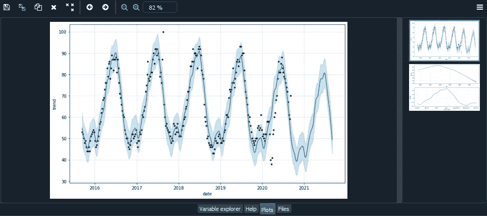

# 通过堆叠库来构建和部署简单的 ML 工具

> 原文：<https://towardsdatascience.com/build-and-deploy-simple-ml-tools-by-stacking-coolest-librairies-f7cb94bad53d?source=collection_archive---------34----------------------->


在 [Unsplash](https://unsplash.com?utm_source=medium&utm_medium=referral) 上由 [Max Duzij](https://unsplash.com/@max_duz?utm_source=medium&utm_medium=referral) 拍照

在线课程非常适合学习**数据科学**和**机器学习**的概念。但最终，人们总是想知道数据分析师或数据科学家的角色是否仅仅是通过编写代码来回答问题🤷‍♂️.

让我们想象下面的讨论:

本:嘿，我们营销团队想知道下个月投资产品 A 广告的最佳时间是什么时候。有可能预测未来的谷歌搜索趋势吗？

嗯，我想我可以在谷歌趋势上看看趋势是如何随着时间演变的。我们应该能够应用一些预测方法来了解下个月的搜索情况。

本:那太好了！

你 : *好的，我要从一些关键词中导出谷歌趋势数据。然后我会编写一个小模型，然后把预测图发给你。*

**本**(第二天):*谢谢你的报告，我们改变了一点想法，你能为 B 产品做同样的事情吗？*

你好，当然可以。

**Ben** (2 小时后):*最后，我们想看看整个季度的预测，看看再等一会儿是否更明智。*

**你** : *Mmmh 是…*

**本** (2 小时后):*还有，有没有可能在接下来的 6 个月里比较 C 和 D？*

**你**:😓

你知道我的意思…

允许其他人使用、交互和修改模型，而无需进入代码，这使得事情对每个人来说都更有趣。

在本教程中，我们将看到**用非常简单的工具构建这个趋势预测应用**的不同步骤。最后，它会看起来像[这个](http://trend-predictor.herokuapp.com):

让我们看看它会是什么样子🙄

*教程中包含了所有的代码和 GitHub repo。*

在更复杂的问题上，当然会更困难，但思维是相同的:**通过数据将信息直接带到需要的地方**。

# 步骤#0:环境设置

在一头扎进去之前要做的第一件事就是准备好你的**工作环境**。

## 虚拟环境

在这里(像在任何项目中一样)，我们将使用几个**包**。为了完全控制你使用的工具，建议你在虚拟环境中工作。

我们将使用 [**Anaconda**](https://www.anaconda.com/) ，这是一个 Python 发行版，提供了一个名为 conda 的包管理工具。它将允许我们轻松地更新和安装我们开发所需的库。

[](https://www.anaconda.com/) [## Anaconda |世界上最受欢迎的数据科学平台

### 数据科学的现代世界是极其动态的。每天都有新的挑战出现，不可思议的挑战也是如此…

www.anaconda.com](https://www.anaconda.com/) 

下载最新版本的 [Anaconda](https://www.anaconda.com/) ，然后运行程序“Anaconda Prompt”。我们也可以使用 GUI，但我们不会在这部分花太多时间。

在 Anaconda 命令提示符下，配置一个新环境，激活它，并安装基本包。

```
conda create -n trends-predictor python
conda activate trends-predictor
conda install pandas numpy matplotlib
```

我们将继续安装其他软件包。

要轻松编辑您的代码，请选择您喜欢的 IDE，并根据您的虚拟环境的需要进行配置。为了简单起见，我将使用与 anaconda 一起安装的 Spyder。要启动它，请在命令提示符下键入`spyder`。

## Git/GitHub

我们开始好看了！最后一件事，我们初始化我们的 **git** 存储库，并将其链接到 **GitHub** 。我把细节传到这里，网上有很多教程。

为什么用在这里？*剧透*:最后，我们会用 **Heroku** 来部署我们的应用，从 GitHub repo 来做非常简单。

从 **git bash** 中，键入:

```
echo "# trends-predictor" >> README.md
git init
git add README.md
git commit -m "first commit"
git remote add origin <https://github.com/elliottrabac/trend-predictor.git>
git push -u origin master
```

好了，现在一切都准备好了，该编码了。我们将分几个步骤来完成这项工作

1.  **自动存取数据**
2.  对未来做出预测
3.  让每个人都能使用你的工具

# 步骤 1:访问数据🧲

有很多方法可以访问数据，我们可以从哪里下载 csv 格式的文件，然后将它们导入到我们的程序中。问题是非常手动…

为了自动化这一切，我们可以使用**报废工具**。或者直接使用查询浏览页面的 HTML 内容，或者甚至使用 **Selenium** 再现用户的动作。

但是我们会让它变得更好/更简单。有一个包叫“ **pytrends** ”，就是用 python 拉 google trends 的。

💡**提示**:在编码之前，一定要检查工作是否已经完成。可能已经有一个库或 GitHub repo 来完成这项工作。

首先，我们需要安装那个包。你可以在这里找到 pytrends API [的完整文档。](https://pypi.org/project/pytrends/)

[](https://pypi.org/project/pytrends/) [## pytrends

### 谷歌趋势的非官方 API 允许从谷歌趋势自动下载报告的简单界面。只有…

pypi.org](https://pypi.org/project/pytrends/) 

使用`pip`安装软件包(在您的虚拟环境中):

```
pip install pytrends
```

## 拉谷歌趋势

让我们创建一个新的 **python 脚本**，并从导入必要的包开始:

```
import pandas as pd
import pytrends
from pytrends.request import TrendReq
```

使用`pytrend`非常简单，并且有很好的文档记录，所以我们将直奔主题。

你所要做的就是和谷歌(和`TrendReq`)建立连接，用你要找的关键词(以列表的形式)构建查询，然后应用想要的方法。这里我们希望搜索的**演变**显示在 Google Trends 的兴趣随时间变化部分，所以我们使用:`interest_over_time()`

我们将通过删除`isPartial` 列并重命名其他列来预测下一步(预测)。

这是一只熊猫。我们需要的数据框架。在函数中，它看起来像这样:

# 第二步:做预测🔮

现在是时候预测未来了！我们这里是以**时间序列预测**为例。

> 时间序列预测是使用模型根据以前观察到的值来预测未来值。—维基百科

为了预测下一个值，我们有一整套可能的工具和概念。我们可以使用统计方法，如 ARMA，AMIRA，甚至 SARIMAX 模型🤯今天，我们也发现针对这类问题的非常强大的**深度学习模型**，比如经典的 MLP、CNN、RNN，以及它们更高级的形式。

我们将保持它的简单和高效，我们将使用 [**脸书的先知**](https://facebook.github.io/prophet/docs/quick_start.html) 。像任何模型一样，它有它的优点和缺点；但是我们在这里不是为了讨论使用哪种算法(在线课程对此很有帮助)。

[](https://facebook.github.io/prophet/docs/quick_start.html) [## 快速启动

### Prophet 遵循 sklearn 模型 API。我们创建一个 Prophet 类的实例，然后调用它的 fit 和 predict…

facebook.github.io](https://facebook.github.io/prophet/docs/quick_start.html) 

我们从在工作环境中安装`fbprophet`开始:

```
conda install -c conda-forge fbprophet
```

## 做预测

我们将创建一个新函数`make_pred()`,它将数据集和预测周期的长度作为参数。

用一种非常简单的方式，我们创建一个新的`Prophet()`对象和`fit`数据集的模型。这个必须总是有两个名为`ds`和`y`的列(就像我们之前做的一样)。

我们用`make_futur_dataframe()`扩展包含日期的列。然后我们用`predict()`预测未来值，它返回一个带有预测的数据帧。
当然，你可以在这里玩一些“超参数”。所有信息一如既往地保存在[文档](https://facebook.github.io/prophet/docs/quick_start.html)中。

## 绘制预测图

但是不要忘了我们的朋友本，我们的目标是给他一个好的、易懂的图表📈。

这里我们用先知的`plot()`方法。而且既然一点点细节无伤大雅，我们也用`plot_components()`给他提供一些额外的信息。

就是这样！现在，我们有了针对所需关键字的预测图。

如果您正在使用 Spyder IDE，您可以在变量浏览器和绘图选项卡中看到您的数据帧和图形。



Spyder IDE 中的图形

# 第三步:在网上发送🚀

现在我们到了最精彩的部分！

您可以自己进行预测，并以报告形式发送。但是在这里，我们将允许任何人选择关键词，预测选项，所有这些都在一个 **UX 友好界面**中！

## 创建 web 应用程序

我们使用一个增长强劲的库， [**Streamlit**](https://www.streamlit.io/) (你可以在最后用趋势预测应用程序来检查它😉)

[](https://www.streamlit.io/) [## Streamlit -创建数据应用程序的最快方式

### Streamlit 是一个面向机器学习和数据科学团队的开源应用框架。在…中创建漂亮的数据应用程序

www.streamlit.io](https://www.streamlit.io/) 

不需要 web 开发技能，不需要用 Flask 或 Django 构建接口，一切都在一个脚本中完成，只需几行代码。

从安装库开始。

```
pip install streamlit
```

并将其导入到脚本中。

```
import streamlit as st
```

不赘述，Streamlit 一行一行的，在界面显示 Streamlit 元素。

我们首先向页面添加一个标题:

```
st.write("""
# Trend Predictor App :crystal_ball:
### This app predicts the **Google Trend** you want!
""")
```

现在我们把一些元素放在边栏中，这将允许用户选择参数。

*   `keyword`将显示为文本字段并将取内容的值，这里的默认值是"太阳镜"。
*   `pediod`将在 7 到 365 天之间显示为滑块，默认值为 100。
*   `details`是显示为复选框的布尔变量。

```
st.sidebar.write("""
## Pick a keyword and a forecasting period :dizzy:
""")keyword = st.sidebar.text_input("Keyword", "Sunglasses")
periods = st.sidebar.slider('Prediction time in days:', 7, 365, 90)
details = st.sidebar.checkbox("Show details")
```

要显示我们使用的图形:

```
st.pyplot(fig1)
if details:  # if detail checkbox set to True
    st.write("### Details :mag_right:")
    st.pyplot(fig2)
```

这个库中有很多很棒的工具，这里的[文档](https://docs.streamlit.io/en/stable/)也很棒！✨:我们只是在我们的`get_data()`函数上面添加了一个**装饰器**:

```
@st.cache(suppress_st_warning=True)
```

`@st.cache` decorator 表示 Streamlit 将执行内部魔术，这样任何缓存的操作都将只运行一次，并被缓存以备将来使用。

我们将在页面中添加一些配置元素，包括:

```
st.beta_set_page_config(page_title="Trend Predictor",
                               page_icon=":crystal_ball",
                               layout='centered',
                               initial_sidebar_state='auto')
```

一点都不差！我们来看看当地是什么样子的？

为此，请在您的脚本所在的文件夹中打开一个终端，然后键入:

```
streamlit run trend-prediction.py
```

🤩🤩🤩

这是应用程序✨的完整代码

## 在网络上部署它

在你把链接发给本之前做最后一次努力💪。

您可以通过在 web 上部署应用程序来完成您的工作。而 **Heroku** 是做到这一点的完美工具！易于使用，免费，快速。

[](https://www.heroku.com/) [## 云应用平台| Heroku

### 无论您是在构建简单的原型还是关键业务产品，Heroku 的全托管平台都能为您提供…

www.heroku.com](https://www.heroku.com/) 

我不打算用所有的部署来延长这个教程，只需在谷歌上键入“Streamlit Heroku”。

🛑唯一要小心的是！当你要创建你的`requirements.txt`文件时，你需要添加一个额外的库。我们安装了预言者和康达，但是 Heroku 也需要`pystan`。考虑一下加进去就行了。

[](https://github.com/elliottrabac/trend-predictor) [## elliottrabac/趋势预测器

### 此时您不能执行该操作。您已使用另一个标签页或窗口登录。您已在另一个选项卡中注销，或者…

github.com](https://github.com/elliottrabac/trend-predictor) 

# 结论

在本教程中，我们已经看到了组合不同的库**来处理构建过程的每一步是可能的。当然，这个项目非常“理论化”:预测是基本的，不允许根据数据集调整参数。**

但这里最重要的是全局**心态**。这至少允许快速测试事物，验证假设，并且将事物发送给你的团队！

**快乐学习**！🥂外星人

***关于我*** 👨‍💻：

我是一名工科学生，最大的热情是学习新事物。从事机械工程 5 年后，我通过网上可以找到的令人难以置信的资源学习了数据科学。我试着通过写几个帖子来回馈和继续学习。

请随时给我反馈或联系我讨论任何话题！ ✌