# 构建并部署您的第一个机器学习 web 应用

> 原文：<https://towardsdatascience.com/build-and-deploy-your-first-machine-learning-web-app-e020db344a99?source=collection_archive---------4----------------------->

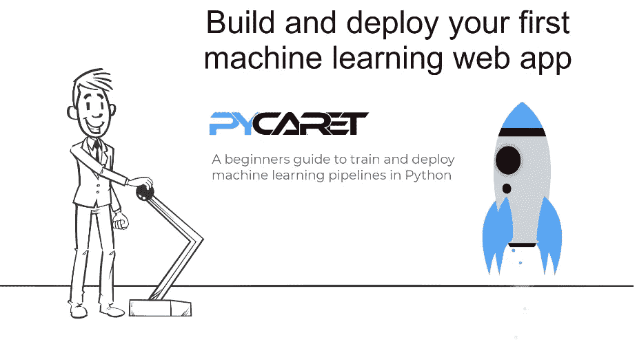

## 使用 PyCaret 在 Python 中训练和部署机器学习管道的初学者指南

在我们的[上一篇文章](/machine-learning-in-power-bi-using-pycaret-34307f09394a)中，我们展示了如何使用 [PyCaret](https://www.pycaret.org/) 在 Power BI 中训练和部署机器学习模型。如果你以前没有听说过 PyCaret，请阅读我们的[公告](/announcing-pycaret-an-open-source-low-code-machine-learning-library-in-python-4a1f1aad8d46)来快速入门。

在本教程中，我们将使用 PyCaret 开发一个**机器学习管道，**它将包括预处理转换和回归模型，以根据人口统计和基本的患者健康风险指标(如年龄、身体质量指数、吸烟状况等)预测患者住院费用。

# 👉您将在本教程中学到什么

*   什么是部署，我们为什么要部署机器学习模型。
*   开发一个机器学习管道，用 PyCaret 训练模型。
*   使用名为“Flask”的 Python 框架构建一个简单的 web 应用程序。
*   在“Heroku”上部署一个 web 应用程序，并查看您的模型的运行情况。

# 💻在本教程中，我们将使用哪些工具？

# PyCaret

[PyCaret](https://www.pycaret.org/) 是 Python 中的开源、低代码机器学习库，用于在生产中训练和部署机器学习管道和模型。PyCaret 可以使用 pip 轻松安装。

```
# for Jupyter notebook on your local computer
pip install **pycaret**# for azure notebooks and google colab
!pip install **pycaret**
```

# 瓶

Flask 是一个允许你构建 web 应用的框架。web 应用程序可以是商业网站、博客、电子商务系统，也可以是使用训练好的模型从实时提供的数据中生成预测的应用程序。如果你没有安装 Flask，你可以使用 pip 来安装。

```
# install flask
pip install **Flask**
```

# 开源代码库

[GitHub](https://www.github.com/) 是一个基于云的服务，用于托管、管理和控制代码。假设你在一个大型团队中工作，团队中有很多人(有时有数百人)在做改变。PyCaret 本身就是一个开源项目的例子，在这个项目中，数百名社区开发人员不断地贡献源代码。如果你以前没有用过 GitHub，你可以[注册](https://github.com/join)免费账号。

# 赫罗库

Heroku 是一个平台即服务(PaaS ),支持基于托管容器系统部署 web 应用，具有集成的数据服务和强大的生态系统。简而言之，这将允许您将应用程序从本地机器带到云中，这样任何人都可以使用 Web URL 访问它。在本教程中，我们选择了 Heroku 进行部署，因为当你[注册新账户](https://signup.heroku.com/)时，它会提供免费资源。

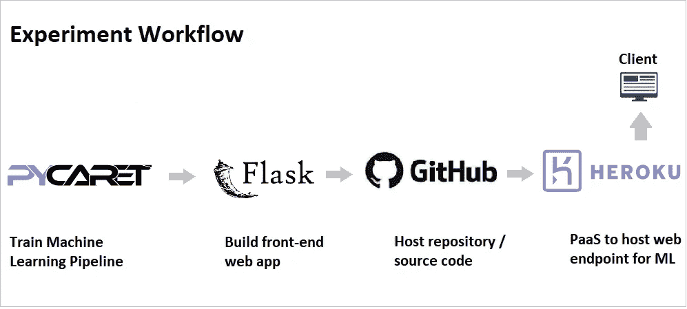

机器学习工作流程(从培训到 PaaS 部署)

# 为什么要部署机器学习模型？

机器学习模型的部署是使模型在生产中可用的过程，其中 web 应用程序、企业软件和 API 可以通过提供新的数据点和生成预测来使用经过训练的模型。

通常建立机器学习模型，以便它们可以用于预测结果(二进制值，即用于[分类](https://www.pycaret.org/classification)的 1 或 0，用于[回归](https://www.pycaret.org/regression)的连续值，用于[聚类](https://www.pycaret.org/clustering)的标签等)。生成预测有两种主要方式(I)批量预测；以及(ii)实时预测。在我们的[上一篇教程](/machine-learning-in-power-bi-using-pycaret-34307f09394a)中，我们演示了如何在 Power BI 中部署机器学习模型并进行批量预测。在本教程中，我们将了解如何部署一个机器学习模型来进行实时预测。

# 商业问题

一家保险公司希望通过使用住院时的人口统计和基本患者健康风险指标来更好地预测患者费用，从而改善其现金流预测。


*(* [*数据源*](https://www.kaggle.com/mirichoi0218/insurance#insurance.csv) *)*

# 目标

构建一个 web 应用程序，在 web 表单中输入患者的人口统计和健康信息以预测费用。

# 任务

*   训练和验证模型，并开发用于部署的机器学习管道。
*   用自变量(年龄、性别、bmi、儿童、吸烟者、地区)的输入表单构建一个基本的 HTML 前端。
*   使用 Flask 框架构建 web 应用程序的后端。
*   在 Heroku 上部署 web 应用程序。一旦部署，它将成为公开可用的，并可以通过网址访问。

# 👉任务 1 —模型训练和验证

培训和模型验证在集成开发环境(IDE)或笔记本电脑中执行，既可以在本地机器上执行，也可以在云上执行。在本教程中，我们将使用 Jupyter Notebook 中的 PyCaret 来开发机器学习管道和训练回归模型。如果你以前没有使用过 PyCaret，[点击这里](/announcing-pycaret-an-open-source-low-code-machine-learning-library-in-python-4a1f1aad8d46)了解更多关于 PyCaret 的信息，或者在我们的[网站](https://www.pycaret.org/)上查看[入门教程](https://www.pycaret.org/tutorial)。

在本教程中，我们进行了两个实验。第一个实验使用 PyCaret 中的默认预处理设置(缺失值插补、分类编码等)进行。第二个实验具有一些额外的预处理任务，例如缩放和归一化、自动特征工程和将宁滨连续数据分成区间。参见第二个实验的设置示例:

```
# Experiment No. 2from **pycaret.regression** import *****r2 = **setup**(data, target = 'charges', session_id = 123,
           normalize = True,
           polynomial_features = True, trigonometry_features = True,
           feature_interaction=True, 
           bin_numeric_features= ['age', 'bmi'])
```

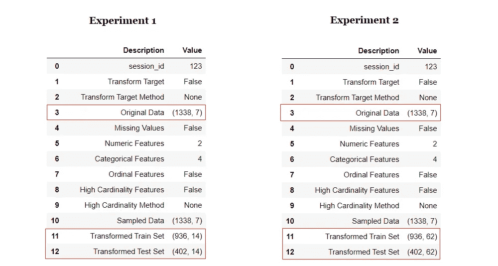

两个实验的信息网格比较

神奇的事情只发生在几行代码中。请注意，在**实验 2** 中，转换后的数据集有 62 个用于训练的特征，这些特征仅来自原始数据集中的 7 个特征。所有的新特性都是 PyCaret 中的转换和自动特性工程的结果。


转换后数据集中的列

PyCaret 中模型定型和验证的示例代码:

```
# Model Training and Validation 
lr = **create_model**('lr')
```

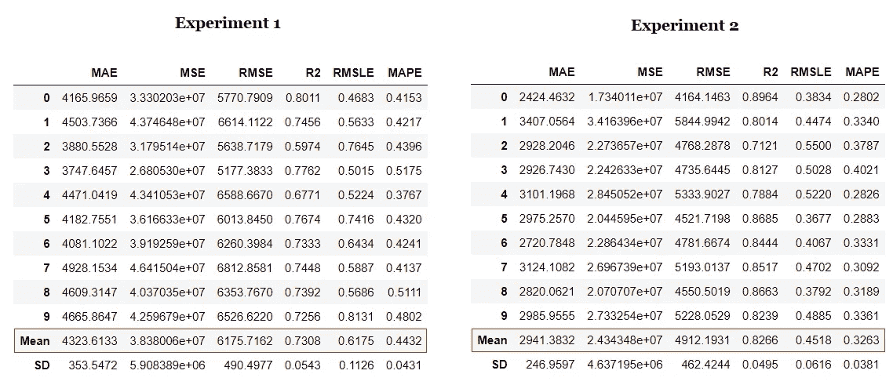

线性回归模型的 10 倍交叉验证

注意转换和自动特征工程的影响。R2 不费吹灰之力就增加了 10%。我们可以比较两个实验的线性回归模型的**残差图**，并观察转换和特征工程对模型的**异方差**的影响。

```
# plot residuals of trained model **plot_model**(lr, plot = 'residuals')
```

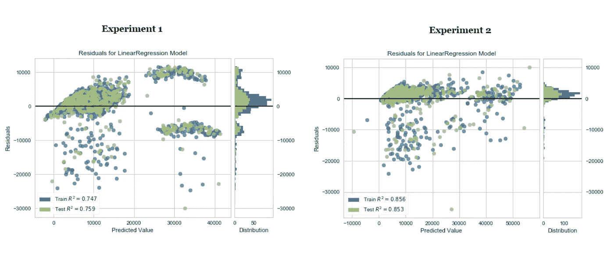

线性回归模型的残差图

机器学习是一个*迭代*的过程。迭代次数和其中使用的技术取决于任务的关键程度以及预测错误时的影响。在医院的 ICU 中实时预测患者结果的机器学习模型的严重性和影响远远超过为预测客户流失而建立的模型。

在本教程中，我们只执行了两次迭代，第二次实验中的线性回归模型将用于部署。然而，在这个阶段，模型仍然只是笔记本中的一个对象。要将其保存为可以传输到其他应用程序并由其他应用程序使用的文件，请运行以下代码:

```
# save transformation pipeline and model 
**save_model**(lr, model_name = 'c:/*username*/ins/deployment_28042020')
```

当您在 PyCaret 中保存一个模型时，基于在 **setup()** 函数中定义的配置的整个转换管道被创建。所有的相互依赖都是自动编排的。查看存储在“deployment_28042020”变量中的管道和模型:


使用 PyCaret 创建的管道

我们已经完成了第一项任务，即培训和选择部署模型。最终的机器学习流水线和线性回归模型现在作为文件保存在本地驱动器中的 **save_model()** 函数中定义的位置下。(本例中:c:/ *用户名*/ins/deployment _ 28042020 . pkl)。

# 👉任务 2 —构建 Web 应用程序

现在我们的机器学习管道和模型已经准备好了，我们将开始构建一个 web 应用程序，可以连接到它们并实时生成对新数据的预测。该应用程序有两个部分:

*   前端(使用 HTML 设计)
*   后端(使用 Python 中的 Flask 开发)

# Web 应用程序的前端

通常，web 应用程序的前端是使用 HTML 构建的，这不是本文的重点。我们使用了一个简单的 HTML 模板和一个 CSS 样式表来设计一个输入表单。下面是我们的 web 应用程序前端页面的 HTML 片段。

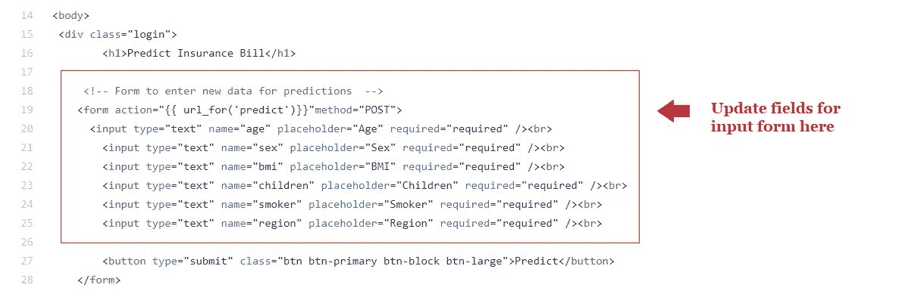

home.html 文件的代码片段

构建简单的应用程序不需要成为 HTML 专家。有许多免费的平台提供 HTML 和 CSS 模板，并能够通过使用拖放界面快速构建漂亮的 HTML 页面。

CSS 样式表描述了 HTML 元素在屏幕上的显示方式。这是控制应用程序布局的有效方法。样式表包含背景颜色、字体大小和颜色、边距等信息。它们在外部保存为. css 文件，并链接到 HTML，但只包含一行代码。

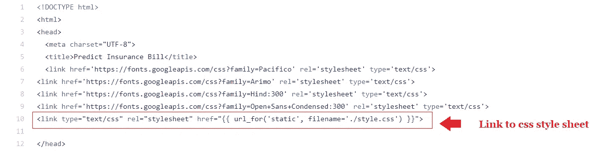

home.html 文件的代码片段

# Web 应用程序的后端

web 应用的后端是使用 Flask 框架开发的。对于初学者来说，可以直观地将 Flask 视为一个库，可以像 Python 中的任何其他库一样导入。请参阅使用 Python 中的 Flask 框架编写的后端示例代码片段。


app.py 文件中的代码片段

如果您还记得上面的步骤 1，我们已经最终确定了线性回归模型，该模型针对 PyCaret 自动设计的 62 个功能进行了训练。然而，我们的 web 应用程序的前端有一个输入表单，只收集六个特征，即年龄、性别、bmi、儿童、吸烟者、地区。

我们如何将新数据点的 6 个特征实时转换为 62 个特征来训练模型？随着在模型训练期间应用一系列转换，编码变得越来越复杂和耗时。

在 PyCaret 中，分类编码、缩放、缺失值插补、特征工程甚至特征选择等所有转换都会在生成预测之前实时自动执行。

> 想象一下，在使用你的模型进行预测之前，你需要编写多少代码来严格地应用所有的转换。在实践中，当你想到机器学习时，你应该考虑整个 ML 管道，而不仅仅是模型。

**测试应用** 在 Heroku 上发布应用之前的最后一步是在本地测试 web 应用。打开 Anaconda 提示符并导航到您计算机上保存**‘app . py’**的文件夹。使用以下代码运行 python 文件:

```
python **app.py**
```

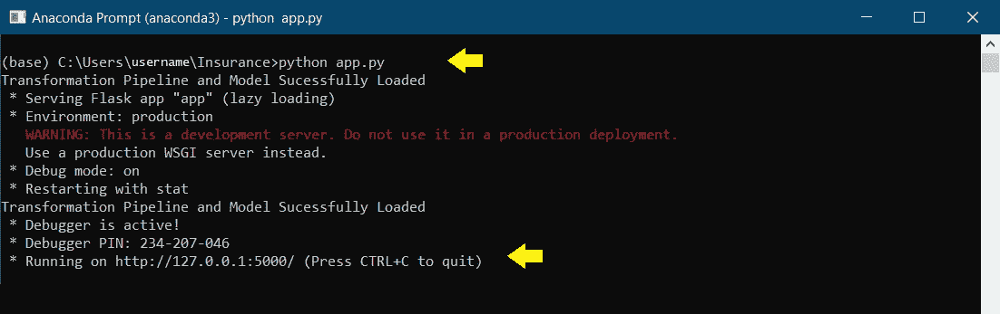

执行 app.py 时 Anaconda 提示符中的输出

执行后，将 URL 复制到浏览器中，它应该会打开本地机器(127.0.0.1)上托管的 web 应用程序。尝试输入测试值，看看预测功能是否有效。在下面的例子中，西南部一个没有孩子的 19 岁女性吸烟者的预期账单是 20，900 美元。

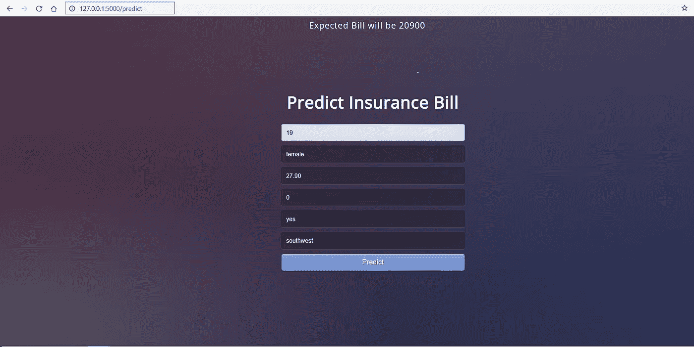

本地计算机上打开的 Web 应用程序

恭喜你！您现在已经构建了您的第一个机器学习应用程序。现在是时候将这个应用程序从您的本地机器带到云中，这样其他人就可以通过 Web URL 使用它了。

# 👉任务 3 —在 Heroku 上部署 Web 应用程序

既然模型已经训练好了，机器学习管道已经准备好了，应用程序也已经在我们的本地机器上测试过了，我们就可以开始在 Heroku 上部署了。有几种方法可以将你的应用源代码上传到 Heroku 上。最简单的方法是将 GitHub 库链接到您的 Heroku 帐户。

如果你想继续下去，你可以从 GitHub 获得这个[库](https://github.com/pycaret/deployment-heroku)。如果你不知道怎么叉一个回购，请[看这个](https://help.github.com/en/github/getting-started-with-github/fork-a-repo)官方 GitHub 教程。

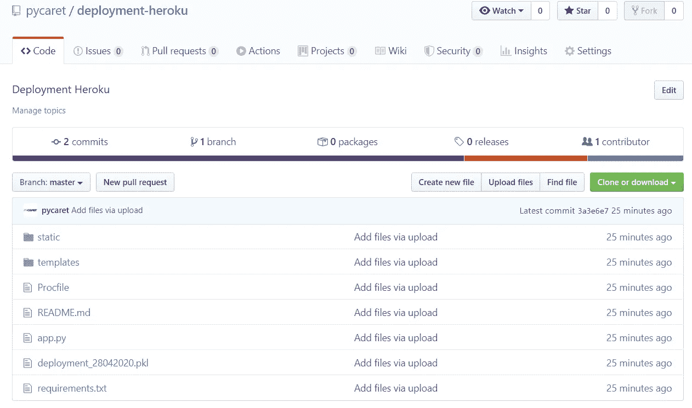

[https://www.github.com/pycaret/deployment-heroku](https://www.github.com/pycaret/deployment-heroku)

到目前为止，除了两个文件，即' **requirements.txt'** 和' **Procfile '，您已经熟悉了上面显示的存储库中的所有文件。**

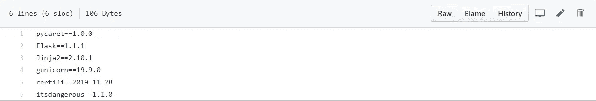

requirements.txt

**requirements.txt** 文件是一个文本文件，包含执行应用程序所需的 python 包的名称。如果这些软件包没有安装在应用程序运行的环境中，它将失败。

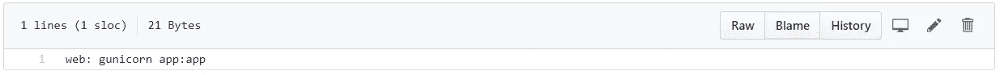

Procfile

Procfile 只是一行代码，它向 web 服务器提供启动指令，指示当有人登录到应用程序时应该首先执行哪个文件。在这个例子中，我们的应用文件的名称是' **app.py'** ，应用程序的名称也是' **app'** 。*(因此 app:app)*

一旦所有文件都上传到 GitHub 存储库，我们现在就可以开始在 Heroku 上部署了。请遵循以下步骤:

**第一步——在 heroku.com 上注册，点击“创建新应用”**


Heroku 仪表板

**步骤 2 —输入应用名称和地区**

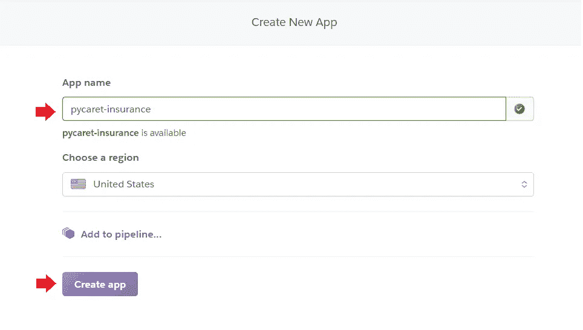

Heroku —创建新应用程序

**步骤 3——连接到托管代码的 GitHub 库**

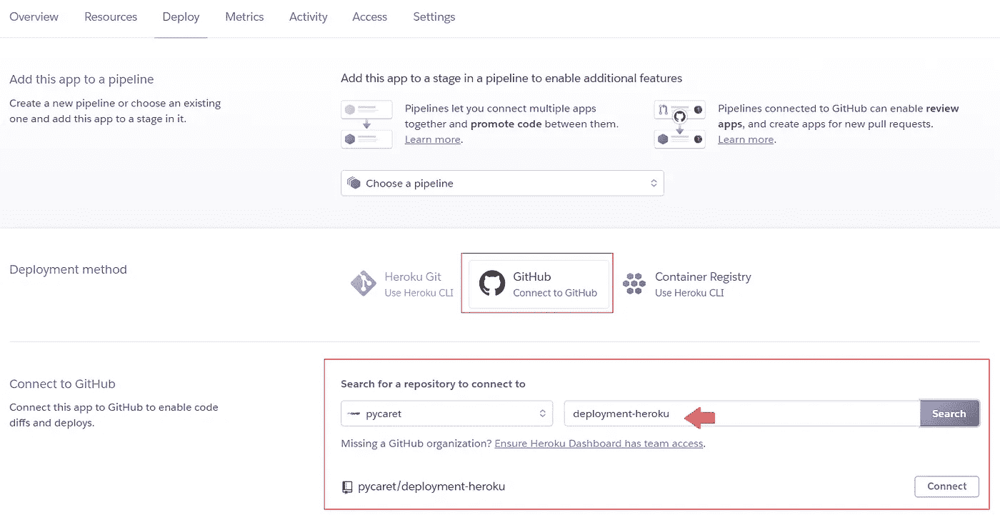

Heroku —连接到 GitHub

**步骤 4 —部署分支**

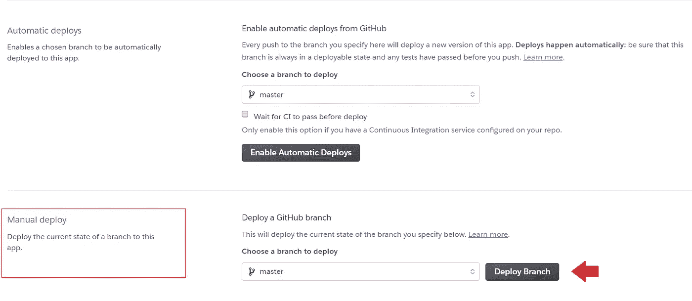

Heroku —部署分支

**步骤 5 —等待 5-10 分钟，然后爆炸**

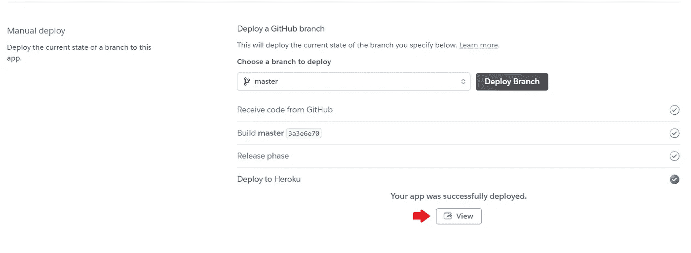

Heroku —成功部署

App 发布到网址:[https://pycaret-insurance.herokuapp.com/](https://pycaret-insurance.herokuapp.com/)

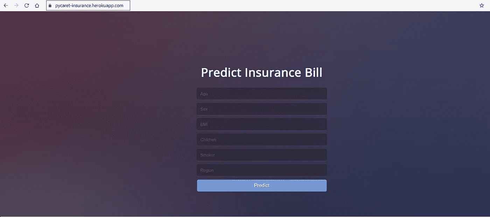

[https://pycaret-insurance.herokuapp.com/](https://pycaret-insurance.herokuapp.com/)

在我们结束教程之前，还有最后一件事要看。

到目前为止，我们已经构建并部署了一个与我们的机器学习管道一起工作的 web 应用程序。现在假设您已经有了一个企业应用程序，您想在其中集成来自您的模型的预测。您需要的是一个 web 服务，其中您可以使用输入数据点进行 API 调用，并获得预测结果。为了实现这一点，我们在我们的**‘app . py’**文件中创建了 ***predict_api*** 函数。查看代码片段:

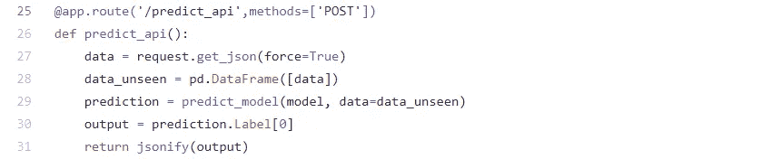

app.py 文件的代码片段(web 应用程序的后端)

下面是如何使用请求库在 Python 中使用这个 web 服务:

```
import **requests**url = 'https://pycaret-insurance.herokuapp.com/predict_api'pred = **requests.post(**url,json={'age':55, 'sex':'male', 'bmi':59, 'children':1, 'smoker':'male', 'region':'northwest'})**print**(pred.json())
```

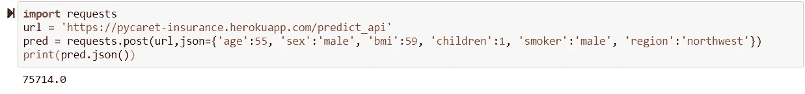

向已发布的 web 服务发出请求，以在笔记本中生成预测

# 下一个教程

在下一个部署机器学习管道的教程中，我们将更深入地使用 docker 容器部署机器学习管道。我们将演示如何在 Linux 上轻松部署和运行容器化的机器学习应用程序。

关注我们的 [LinkedIn](https://www.linkedin.com/company/pycaret/) 并订阅我们的 [Youtube](https://www.youtube.com/channel/UCxA1YTYJ9BEeo50lxyI_B3g) 频道，了解更多关于 PyCaret 的信息。

# 重要链接

[用户指南/文档](https://www.pycaret.org/guide)
[GitHub 资源库](https://www.github.com/pycaret/pycaret) [安装 PyCaret](https://www.pycaret.org/install)
[笔记本教程](https://www.pycaret.org/tutorial)
[贡献于 PyCaret](https://www.pycaret.org/contribute)

# 想了解某个特定模块？

从第一个版本 1.0.0 开始，PyCaret 有以下模块可供使用。点击下面的链接，查看 Python 中的文档和工作示例。

[分类](https://www.pycaret.org/classification)
[回归](https://www.pycaret.org/regression) [聚类](https://www.pycaret.org/clustering)
[异常检测](https://www.pycaret.org/anomaly-detection) [自然语言处理](https://www.pycaret.org/nlp)
关联规则挖掘

# 另请参见:

笔记本中的 PyCaret 入门教程:

[聚类](https://www.pycaret.org/clu101)
[异常检测](https://www.pycaret.org/anom101)
[自然语言处理](https://www.pycaret.org/nlp101)
[关联规则挖掘](https://www.pycaret.org/arul101)
[回归](https://www.pycaret.org/reg101)
分类

# 开发管道中有什么？

我们正在积极改进 PyCaret。我们未来的开发管道包括一个新的**时间序列预测**模块，与 **TensorFlow、**的集成，以及对 PyCaret 可扩展性的重大改进。如果您想分享您的反馈并帮助我们进一步改进，您可以[在网站上填写这张表格](https://www.pycaret.org/feedback)，或者在我们的 [GitHub](https://www.github.com/pycaret/) 或 [LinkedIn](https://www.linkedin.com/company/pycaret/) 页面上发表评论。

# 你愿意投稿吗？

PyCaret 是一个开源项目。欢迎每个人都来投稿。如果您愿意投稿，请随意处理[未决问题](https://github.com/pycaret/pycaret/issues)。dev-1.0.1 分支上的单元测试接受拉请求。

如果你喜欢 PyCaret，请给我们 GitHub 回购的⭐️。

中:[https://medium.com/@moez_62905/](https://medium.com/@moez_62905/machine-learning-in-power-bi-using-pycaret-34307f09394a)

领英:[https://www.linkedin.com/in/profile-moez/](https://www.linkedin.com/in/profile-moez/)

https://twitter.com/moezpycaretorg1