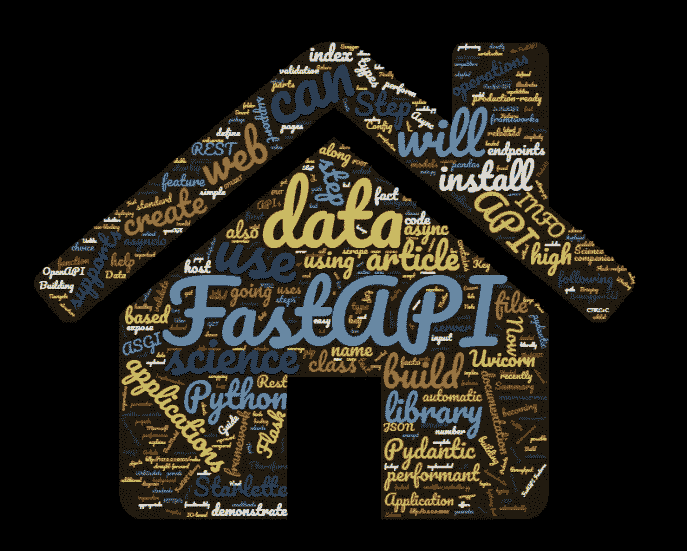
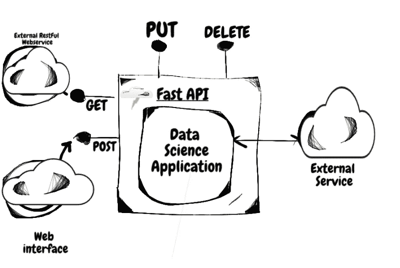
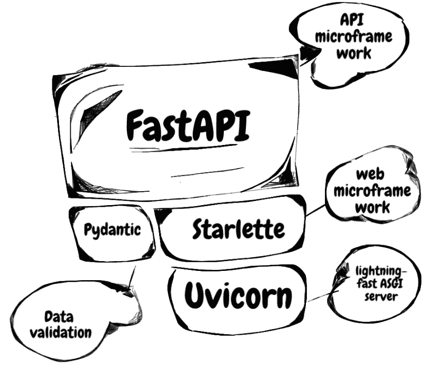
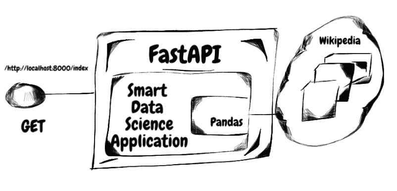
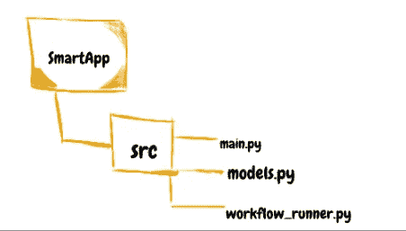
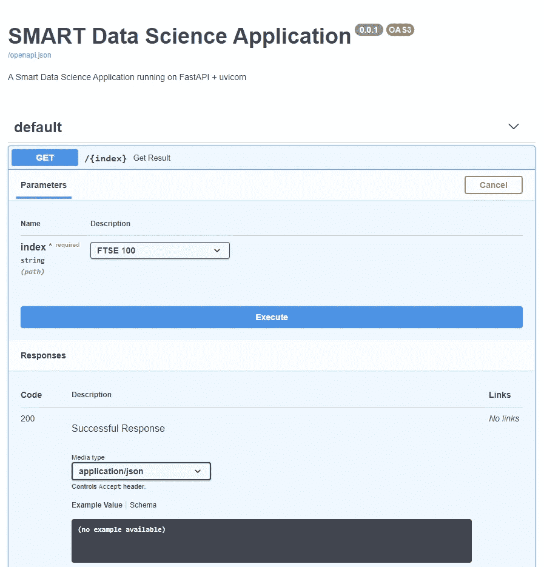
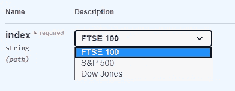
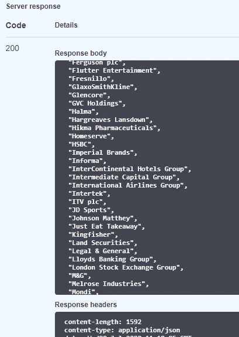
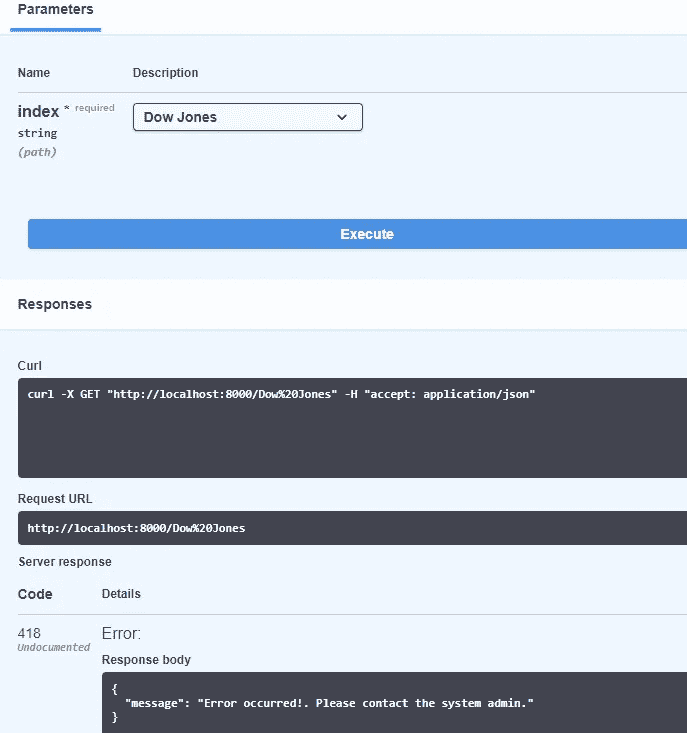
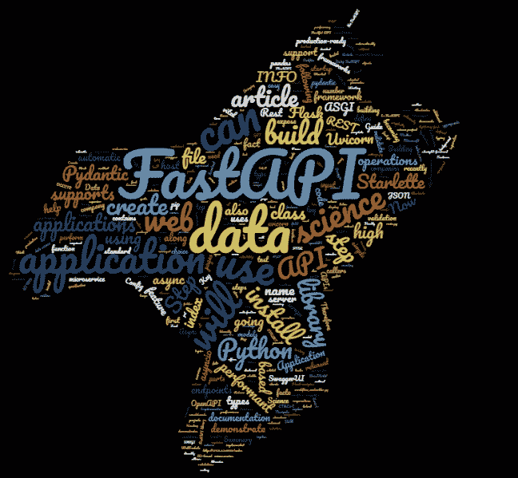

# 使用 FastAPI 构建和托管快速数据科学应用

> 原文：<https://towardsdatascience.com/build-and-host-fast-data-science-applications-using-fastapi-823be8a1d6a0?source=collection_archive---------8----------------------->

## 将智能数据科学应用程序构建为 Restful API 的分步指南

我最近使用 FastAPI web 框架托管了许多生产就绪的数据科学应用程序，作为 Restful web 服务。

我发现 FastAPI 稳定且易于使用，因此，我决定写一篇关于 FastAPI 库的文章，概述托管数据科学应用程序的步骤。



解释 FastAPI 的工作原理

FastAPI 于 2018 年发布，正在成为构建高性能数据科学应用的事实上的选择。

本文将解释什么是 FastAPI，为什么它优于竞争对手，以及如何使用 FastAPI 托管数据科学应用程序的分步指南。

> 可以把 FastAPI 想象成一个数据科学应用程序的包装器，以 RESTFUL 微服务的形式公开其功能



作为包装器的 FastAPI

# 文章摘要

本文将概述以下主题:

1.  什么是 FastAPI？
2.  FastAPI 的主要特性
3.  使用 FastAPI 构建和托管 Python 数据科学应用程序的分步指南。

> 本文将构建一个真实的数据科学应用程序来演示如何在您的数据科学项目中使用 FastAPI

# 1.什么是 FastAPI？

顾名思义，FastAPI 是一个高性能的 web 框架。它的性能可以与 NodeJS 和 Go 相提并论，它被评为目前最快的 Python 框架之一。

> 网飞、优步、微软以及许多其他公司都在使用 FastAPI 库。

FastAPI 可以帮助我们用 Python 3.6+构建 API。

它基于标准的 Python 类型提示。FastAPI 不仅在项目中使用起来直观明了，而且 FastAPI 代码还具有 100%的测试覆盖率，因此它是生产就绪的健壮代码。

使用 Flask 有一段时间了，我注意到 FastAPI 和 Flask 一样简单易用。事实上，FastAPI 已经从 Flask API 改编了它的简单性。随后，总的来说，我建议在未来的项目中探索 FastAPI。

> FastAPI 建立在 Starlette 和 Pydantic 库的基础上。

该图说明了 FastAPI 使用 Starlette 作为 web 部件，使用 Pydantic 作为数据部件。



FastAPI 基于 Pydantic 和 Starlette

ydantic 是一个 Python 库，用于执行数据验证、文档以及序列化。P *ydantic* 使用 PEP 484 中定义的标准库`typing`类型来定义复杂对象。

让我们来探索一下 FastAPI 的特性。

# 2.FastAPI 的主要特性

## 1.要概述的第一个特性是自动交互式 API 文档

FastAPI 是基于开放标准的 [OpenAPI](https://github.com/OAI/OpenAPI-Specification) 和 [JSON 模式](http://json-schema.org/)。因此，只要我们使用适当的 Pydantic 数据类型，它可以自动为我们的 web API 构建一个 SwaggerUI，而无需任何额外的编码。SwaggerUI 本质上是交互式的，允许我们直接从浏览器测试 API。自动化文档受到 APISpec 的启发。

> 我将在本文后面演示如何使用 FastAPI 用 JSON schema 构建自动数据模型文档。

FastAPI 还允许我们验证来自外部调用者的输入数据，并在接收到无效数据时向客户端自动生成错误。文档特性受到了 Django REST 框架的启发。

OpenAPI 自动为应用程序生成一个模式。FastAPI 还支持数据序列化和输入数据解析，这是受 Marshmallow 和 Webargs 的启发。点击阅读更多信息

## 2.第二个关键特性是支持异步 IO 操作

构建一个在执行操作时不会阻塞调用者的 web API 是至关重要的。Python 中的 asyncio 库提供了大量的异步功能。

FastAPI 库支持异步 IO 操作。这是可能的，因为 FastAPI 是基于 Starlette 库的。

Starlette 图书馆本身坐落在 Uvicorn 的顶部。Uvicorn 是一个支持 asyncio 框架的快如闪电的 ASGI 服务器。

Starlette 是一个轻量级的 ASGI 框架，它使我们能够构建高性能的 asyncio 服务。

与 WSGI 服务器不同，ASGI 服务器可以支持 HTTP/2 和 WebSockets。在 Uvicorn 的帮助下，我们可以构建一个 web API，它可以在 IO 绑定的上下文中实现高吞吐量。

> Starlette 使用较新的异步 IO ASGI 服务器，也支持后台任务。因此，我们可以使用 FastAPI 构建低潜在的快速 web APIs

## 3.最重要的特征；我们可以快速为我们的数据科学应用程序创建 REST 端点

Flask 用户必须安装 Flask-restplus 包来为他们的数据科学应用程序创建 REST 端点。

FastAPI 支持 GET、PUT、POST、DELETE、OPTIONS、HEAD、PATCH 和 TRACE Rest 操作，无需任何额外的包。所有路线及其操作都是在文档中自动生成的。

## 4.FastAPI 应用程序易于安装、使用和支持

最近我注意到了这个行业的一个模式。将数据科学解决方案快速推向市场变得至关重要。此外，数据科学应用程序是大型生态系统的一个组成部分，它们需要与许多服务和接口进行交互。这意味着能够将应用程序快速部署为 web 服务，以便最终用户可以使用它，这是非常重要的。

FastAPI 使用起来很简单。将数据科学应用托管为微服务并公开其他应用可以调用的 Rest 端点只需几分钟。验证、错误处理以及其他 API 特性都是现成的，有助于提高客户满意度和应用程序的可靠性。

这将我们带到本文的最后一节，在这里我将演示托管数据科学应用程序的步骤。


分步指南

# 3.逐步实施

让我们从构建智能数据科学应用程序的真实用例开始。

## 用例

1.  我们将使用 Python 3.8 构建一个数据科学应用程序
2.  该应用程序将抓取在线网页，以返回作为指数成份股的公司列表，如富时 100 指数、标准普尔 500 或道琼斯。
3.  该功能将通过 GET Rest 端点公开，我们将在本地主机的端口 8000 上托管该端点。端点将接受一个查询参数:index。该指数只能是下列指数之一:富时 100 指数、标准普尔 500 指数或道琼斯指数。
4.  端点还将确保该值是可接受的索引值之一。所有的错误都将被处理，并优雅地发送回 API 的用户/调用者。
5.  我们将使用 FastAPI 自动生成 Swagger UI 和 OpenAPI 文档。



目标应用程序

## 1.创建虚拟环境

第一步是创建一个虚拟环境并激活它。

```
python3 -m venv fintechexplained
fintechexplained\Scripts\activate
```

## 2.安装依赖项

下一步是安装所需的模块。

首先，安装 fastapi

```
pip install fastapi==0.58.1
```

因此，它还将安装所需的依赖项，如 starlette==0.13.4 和 pydantic==1.5.1。

然后安装 uvicorn

```
pip install uvicorn==0.11.5
```

现在，为了抓取网页，我将使用熊猫图书馆。因此，下一步是安装熊猫:

```
pip install pandas==1.0.3
```

**安装步骤完成了。**

现在让我们创建文件夹结构。

## 3.创建项目结构

为了简单起见，让我们创建以下文件夹结构。



我们创建了两个文件夹:SmartApp 和 SmartApp 文件夹中的 src。此外，让我们创建以下三个空 Python 文件:

1.  这个文件将包含启动 uvicorn 服务器的代码。它还将包含异步服务请求和返回响应的代码。这个文件还将创建一个 FastAPI()实例，它是创建 API 的主要交互点。
2.  models.py:这个文件将包含应用程序的域类，比如 Company 和 Configuration。
3.  workflow_runner:这个文件将包含抓取网页并返回公司名称的代码。这是我们的数据科学应用程序代码，我们将通过 FastAPI 公开它。

如果您想创建一个生产就绪的解决方案，那么我推荐使用千篇一律的 python 项目。有许多模板可用，包括一个针对 FastAPI 的模板。

确保虚拟环境已激活。

## 4.Python 代码实现

下一步涉及实现 Python 代码。

## models.py

打开 models.py 文件并添加以下代码:

```
from enum import Enum
from pydantic import BaseModelclass MyException(Exception):
    passclass Company:
    def __init__(self, symbol):
        self.name = None
        self.symbol = symbol
        self.sector = None
        self.industry = None

class Index(str, Enum):
    FTSE100 = "FTSE 100"
    SNP500 = "S&P 500"
    DOWJONE = "Dow Jones"

class Configuration(BaseModel):
    index: str = None

    index_map = {
        Index.FTSE100: 'https://en.wikipedia.org/wiki/FTSE_100_Index',
        Index.SNP500: 'http://en.wikipedia.org/wiki/List_of_S%26P_500_companies'
    }

    def get_url(self):
        return self.index_map[self.index]
```

*   我们将有一个名为 Company 的类来代表指数的每个成分。
*   我们还创建了一个配置类。此类包含作为枚举的索引名称。枚举成员将作为下拉菜单显示在 API 文档和 Swagger UI 中。请注意，配置类继承自 pydantic BaseModel。这将使我们能够生成自动数据模式文档。配置类包含一个名为 index_map 的字典。每个索引映射项的键作为索引枚举成员，值作为包含公司信息的网页的 URL。

还要注意，我添加了一个函数 get_url()，它将返回所选索引的 url。

*   我们还创建了一个定制的异常类 MyException。我们将在 workflow_runner.py 中为它生成一个异常处理程序。

## workflow_runner.py

现在模型已经实现，让我们将代码添加到 workflow_runner.py 中。这是我们的数据科学应用程序的核心。

该文件将包含执行以下两个步骤的代码:

1.  对于输入索引，通过删除适当的网页来获取其公司
2.  以字符串列表的形式返回公司名称

请注意，workflow_controller 的 *run()* 方法已经声明为 async，以说明我们如何创建非阻塞的 async IO 操作。

```
from models import Company, Index
import pandas as pd

def get_snp_500_companies(url):
    companies = []
    table = pd.read_html(url)[0]
    for index, row in table.iterrows():
        company = Company(row['Symbol'])
        company.name = row['Security']
        company.sector = row['GICS Sector']
        company.industry = row['GICS Sub Industry']
        company.date_added = row['Date first added']
        companies.append(company)
    return companies

def get_ftse_companies(url):
    companies = []
    table = pd.read_html(url)[3]
    for index, row in table.iterrows():
        company = Company(row['EPIC'])
        company.name = row['Company']
        company.sector = row['FTSE Industry Classification Benchmark sector[12]']
        companies.append(company)
    return companies

**async** def run(config):
    companies_map = {
        Index.SNP500: get_snp_500_companies,
        Index.FTSE100: get_ftse_companies

    }
    url = config.get_url()

    func_to_get_data = companies_map.get(config.index, None)
    if func_to_get_data is None:
        raise KeyError(f'{input.index} is not suppported')

    companies = func_to_get_data(url)
    return [c.name for c in companies]
```

我用的是 pandas.read_html(url)函数。它返回网页中的所有表格。因此，我从网页上选择合适的表格。因为每个 web 页面都有不同的结构，所以我已经用公司地图中的 url 注册了索引名。在运行时，工作流运行器将选择适当的 url，并通过执行特定于索引的函数来创建公司类的实例。

如果我们选择道琼斯，它将引发一个异常。这将帮助我演示如何向用户显示用户友好的错误。

我们现在准备集成 FastAPI。

## main.py

最后，我们将把代码添加到 main.py 文件中

首先，添加导入:

```
import uvicorn
from fastapi import FastAPI, Path, Request
from fastapi.responses import JSONResponse

import workflow_runner
from models import MyException, Configuration, Index
```

然后创建一个 FastAPI()实例，并将其声明为 app 变量。

我们给它一个标题、描述和版本。该信息将自动显示在文档中。

```
app = FastAPI(title='SMART Data Science Application',
              description='A Smart Data Science Application running on FastAPI + uvicorn',
              version='0.0.1')
```

公开 GET 端点以处理调用 workflow_runner.run()的请求:

```
@app.get("/{index}")
async def get_result(index: Index = Path(..., title="The name of the Index")
                     ):
    config = Configuration(
        index=index
    )
    try:
    result = await workflow_runner.run(config)
    return JSONResponse(status_code=200, content=result)
except Exception as e:
    raise MyException(e)
```

注意我是如何等待 run 函数的。

本质上，@app.get 是 REST 路径操作。它用路径“/”和 GET 操作处理请求。它调用异步 get_result()函数。参数索引现在是一个查询参数。

我们还可以将查询参数标记为可选的，文档将自动反映出来以适应这种变化。我们已经为路径参数索引声明了一个`title`元数据值。这将出现在自动文档中。

我们还可以在 Path()中添加验证规则，例如对于整数参数，gt=0，le=1000。

*注意，函数 get_result()被声明为 async。它允许我们在不阻塞其他呼叫的情况下服务请求。*

因此，这个特性使应用程序能够并发地处理请求。

最后要注意的一点是，所有的异常都被捕获，然后引发 MyException。

*尽管最佳实践是显式捕获异常并单独处理它们，但出于演示目的，我用宽 try/except 异常捕获所有异常。*

最后，对于错误处理，我们定义了一个可以处理 MyException 类型的异常的端点。

```
@app.exception_handler(MyException)
async def unicorn_exception_handler(request: Request, exc: MyException):
    return JSONResponse(
        status_code=418,
        content={"message": f"Error occurred! Please contact the system admin."},
    )
```

现在，每当我们得到 MyException 类型的异常时，它将显示消息“Error occurred！请联系系统管理员。”。这是因为 app.exception_handler 路径。FastAPI 还允许我们创建自己的异常处理程序。

最后，添加运行 uvicorn 服务器的代码。

注意，我们使用端口 8000，主机 IP 地址是 localhost (0.0.0.0)。

```
if __name__ == "__main__":
    uvicorn.run(app, host="0.0.0.0", port=8000)
```

我们已经完成了实现。

## 5.运行服务器应用程序

让我们运行应用程序。导航到 main.py 所在的文件夹，并在终端中执行以下行:

```
uvicorn main:app — reload
```

*   *main* 是我们想要运行的 python 文件的名称。
*   *app* 是 main.py 中的 FastAPI 对象

*reload* 将使我们能够在代码更改后重启服务器，从而在开发期间实现快速开发。

运行该命令将显示:

```
←[32mINFO←[0m:     Uvicorn running on ←[1mhttp://127.0.0.1:8000←[0m (Press CTRL+C to quit)
←[32mINFO←[0m:     Started reloader process [←[36m←[1m1180←[0m] using ←[36m←[1mstatreload←[0m
←[32mINFO←[0m:     Started server process [←[36m7004←[0m]
←[32mINFO←[0m:     Waiting for application startup.
←[32mINFO←[0m:     Application startup complete.
```

*   Uvicorn 服务器已经暴露了本地主机端口 8000 上的应用程序。
*   另外，它为应用程序创建了一个大摇大摆的 UI
*   最后，它为应用程序生成了 OpenAPI 文档。

## 6.消费服务

首先，让我们回顾一下自动化 API 文档

导航到

```
[http://127.0.0.1:8000/redoc](http://127.0.0.1:8000/redoc)
```

它将显示 Swagger UI。



单击索引会显示索引列表:



运行它会在响应中显示公司名称:



让我们选择道琼斯，看看我们是否得到一个用户友好的错误:



这是由 FastAPI 自动完成的。

## 从另一个应用程序调用智能数据科学应用程序

我们可以从旋度来称呼它:

```
curl -X GET "[http://localhost:8000/FTSE%20100](http://localhost:8000/FTSE%20100)" -H "accept: application/json"
```

我们可以打开浏览器并导航到 url 来查看响应:

```
http://localhost:8000/FTSE%20100
```

您可以通过导航到以下 url 来下载 openAPI 规范:

```
[http://localhost:8000/openapi.json](http://localhost:8000/openapi.json)
```

我们可以看到已经内置了验证以及可接受的索引值，如下所示。OpenAPI 模式支持 Swagger UI。它包括 API 和数据模式，如下所示:

```
{
  "openapi": "3.0.2",
  "info": {
    "title": "SMART Data Science Application",
    "description": "A Smart Data Science Application running on FastAPI + uvicorn",
    "version": "0.0.1"
  },
  "paths": {
    "/{index}": {
      "get": {
        "summary": "Get Result",
        "operationId": "get_result__index__get",
        "parameters": [
          {
            "required": true,
            "schema": {
              "title": "The name of the Index",
              "enum": [
                "FTSE 100",
                "S&P 500",
                "Dow Jones"
              ],
              "type": "string"
            },
            "name": "index",
            "in": "path"
          }
        ],
        "responses": {
          "200": {
            "description": "Successful Response",
            "content": {
              "application/json": {
                "schema": {}
              }
            }
          },
          "422": {
            "description": "Validation Error",
            "content": {
              "application/json": {
                "schema": {
                  "$ref": "#/components/schemas/HTTPValidationError"
                }
              }
            }
          }
        }
      }
    }
  },
  "components": {
    "schemas": {
      "HTTPValidationError": {
        "title": "HTTPValidationError",
        "type": "object",
        "properties": {
          "detail": {
            "title": "Detail",
            "type": "array",
            "items": {
              "$ref": "#/components/schemas/ValidationError"
            }
          }
        }
      },
      "ValidationError": {
        "title": "ValidationError",
        "required": [
          "loc",
          "msg",
          "type"
        ],
        "type": "object",
        "properties": {
          "loc": {
            "title": "Location",
            "type": "array",
            "items": {
              "type": "string"
            }
          },
          "msg": {
            "title": "Message",
            "type": "string"
          },
          "type": {
            "title": "Error Type",
            "type": "string"
          }
        }
      }
    }
  }
}
```

这是 FastAPI 自动构建的 API 的 OpenAPI 文档。我们可以将它发送给 API 的调用者，这样他们就可以轻松地将他们的服务与我们的解决方案集成在一起。

注意，索引枚举成员与参数标题和验证规则一起出现在 OpenAPI 文档中。



感谢您的阅读

仅此而已。如果你想了解更多关于 FastAPI 的信息，请访问他们的[网站](https://fastapi.tiangolo.com/tutorial/)获取更多信息。

# 摘要

FastAPI 是一个高性能的 web 框架。FastAPI 于 2018 年发布，正在成为构建高性能数据科学应用的事实上的选择。

本文解释了什么是 FastAPI，它的主要特性是什么，并一步步地指导如何将数据科学应用打包成 Restful 微服务。