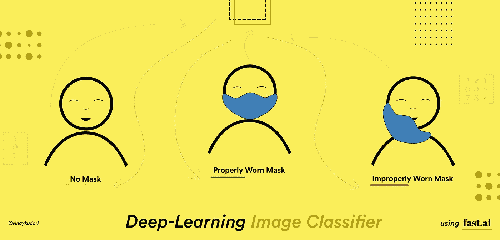
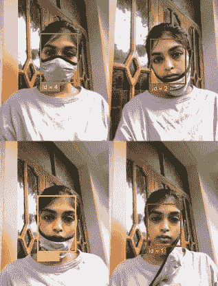
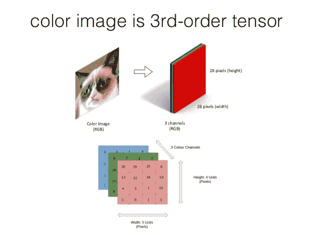
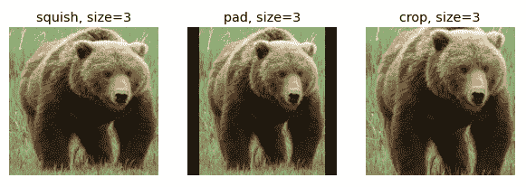
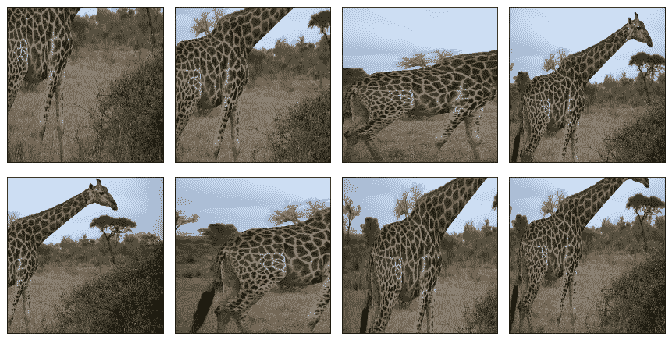
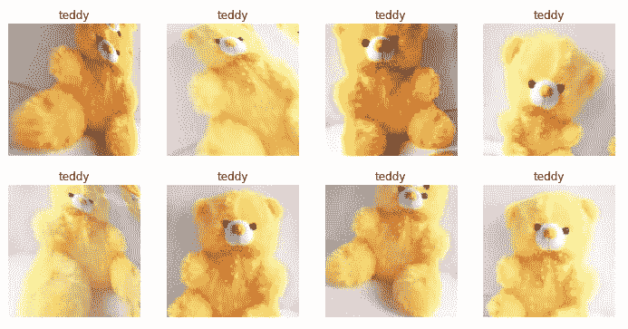
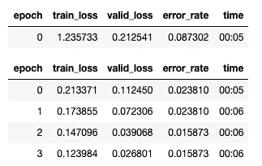
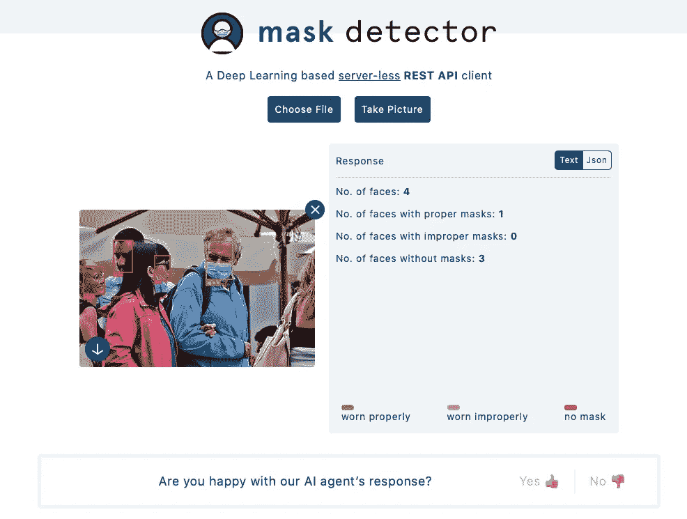

# 使用 fastai v2 在 15 行代码内构建任何深度学习图像分类器

> 原文：<https://towardsdatascience.com/build-any-deep-learning-image-classifier-under-15-lines-of-code-using-fastai-v2-123c81c13b?source=collection_archive---------17----------------------->

Fastai 是一个基于 PyTorch 构建的高级深度学习库。[杰瑞米·霍华德](https://medium.com/u/34ab754f8c5e?source=post_page-----123c81c13b--------------------------------)最近推出了新版本的图书馆，以及非常方便、初学者友好的[书](https://github.com/fastai/fastbook)和[课程](https://course.fast.ai/)。我对它的抽象层次感到非常惊讶，它可以帮助您在几分钟内创建最先进的模型，而不必担心它背后的数学问题。

这篇文章是为完全的初学者而写的，即使你没有什么编码经验，你也能理解它。读完这篇文章后，你将能够从头开始编写一段代码，它可以识别你最喜欢的超级英雄，甚至可以通过它发出的声音来识别它。



演职员表:[外什那维·奇蒂亚拉](https://medium.com/u/f4f82be9e332?source=post_page-----123c81c13b--------------------------------)

这是我在 GCP 集群 [*上使用少量训练数据、几行代码和几分钟训练训练的掩码分类器的结果快照。单击此处为** ***免费***](https://course.fast.ai/start_gcp.html) 设置您自己的 FastAI GPU 虚拟机



尝试用你自己的图像[这里](https://findmask.ml)

为了达到这个效果，我们首先需要在图像中找到人脸，也称为**定位**，然后**对每个人脸进行分类**，并根据其所属的类别(*绿色:带 _ 面具，红色:无 _ 面具，黄色:面具 _ 戴 _ 不合适*)绘制一个彩色的包围盒。今天让我们来理解问题的第二部分**多类**图像分类

项目代码可用 [*此处*](http://bit.ly/mask-classifier-nb)

我会在我们写一些代码的时候解释一些深度学习和计算机视觉的基本概念。我强烈推荐你在 jupyter 笔记本上一行一行地运行代码，因为我们理解了抽象函数背后的思想

# 处理数据

图书馆被分成几个模块，我们主要有表格，文本和视觉。我们今天的问题将涉及视觉，所以让我们从`vision`库中导入`all`我们需要的函数

```
**In [1]:** from fastai.vision.all import *
```

就像我们如何通过观察图像来识别物体一样，我们的计算机需要数据来识别图像。对于遮罩检测，我已经策划了一个从 [kaggle](https://www.kaggle.com/andrewmvd/face-mask-detection) 和其他来源收集的**标记为**的数据集，您可以从[这里这里](http://bit.ly/face-mask-dataset)从*下载*

我们存储数据集所在的路径。`Path`返回一个`pathlib`对象，该对象可以用来非常容易地执行[一些](https://medium.com/swlh/five-most-useful-pathlib-operations-77f9c96790b3)文件操作

```
**In [2]:** DATASET_PATH = Path('/home/kavi/datasets')
```

在我们**训练**我们的模型(教我们的算法识别图像)之前，我们首先需要告诉它一些事情

*   预期的输入和输出是什么？什么是问题域？
*   数据位于何处，如何标记？
*   我们希望保留多少数据来评估模型的性能？
*   我们需要转换数据吗？如果是的话怎么做？

Fastai 有一个叫做`DataBlock`的超级灵活的函数，它接受上述问题的输入并准备一个模板

```
**In [3]:** mask_datablock = DataBlock(
           get_items=get_image_files,
           get_y=parent_label,
           blocks=(ImageBlock, CategoryBlock), 
           item_tfms=RandomResizedCrop(224, min_scale=0.3),
           splitter=RandomSplitter(valid_pct=0.2, seed=100),
           batch_tfms=aug_transforms(mult=2)
        )
```

*   `get_image_files` 函数递归地抓取给定路径中的所有图像文件位置并返回它们，这样我们告诉 fastai 去哪里`get_items`
*   在我们的数据集中，我将图像放在根据类别命名的独立文件夹中，`parent_label`函数根据路径返回文件的父目录

***如* :** `parent_label('/home/kavi/datasets/with_mask/1.jpg')` = > ' `with_mask'`

你可以根据你的数据如何被标记来编写你自己的函数

*   在知道输入图像和目标标签的文件路径后，我们需要根据问题的类型对数据进行预处理。图像的示例预处理步骤包括使用`Pillow`从文件路径创建图像，并将它们转换为张量



图片取自[此处](https://lisaong.github.io/mldds-courseware/01_GettingStarted/numpy-tensor-slicing.slides.html)

## 图像在我们的电脑中是如何表现的？

每幅图像都是像素强度的矩阵。每个值的范围从 0 到 255。0 是最暗的，255 是相应通道的最亮强度

彩色图像是一个三层矩阵/三阶张量。每一层包括 **R** ed、 **G** reen、 **B** lue 亮度，而黑白图片是一维矩阵

我们将类型为`[TransformBlock](https://docs.fast.ai/vision.data#TransformBlocks-for-vision)`的元组`(input_transformation, output_transformation)`传递给`blocks`在我们的问题中，我们需要预测图像的类别，因此我们传递`(ImageBlock, CategoryBlock)`如果你想根据一个人的照片预测他的年龄，你需要传递`(ImageBlock, RegressionBlock)`

*   当所有图像大小相同时，深度学习模型工作得最好，并且当分辨率较低时，它们学习得更快。我们将告诉如何通过向`item_tfms`传递一个合适的 resize 函数来重新缩放图像，这个函数将被应用于每个图像



使用 ResizeMethod 调整大小的图像。Squish，ResizeMethod。Pad 和 ResizeMethod。作物方法

Fastai 提供了各种调整大小的方法:裁剪、填充或挤压。每一个都有些问题。有时，我们甚至可能会丢失一些关键信息，就像中间裁剪后的第三张图片一样

我们可以使用`RandomResizedCrop`来克服这个问题。在这里，我们随机选择图片的一部分，并为覆盖每张图片的大部分区域的几个**时期**(一次完整地通过数据集中的所有图像)训练模型。`min_scale` 决定每次最少选择多少图像。



使用`RandomResizedCrop(224, min_scale=0.3)`调整图像大小

*   对训练数据集的模型准确性评估将导致偏分，并可能导致对不可见数据的较差性能。我们需要告诉我们的`DataBlock` API 留出一些预处理的数据来评估模型的性能。算法看到的数据称为**训练**数据，搁置的数据称为**验证**数据。通常数据集会定义验证集，但是在我们的例子中我们没有，所以我们需要传递一个 split 函数给`splitter`

Fastai 有一对分割函数[和](https://docs.fast.ai/data.transforms#Split)，让我们用`RandomSplitter`来解决今天的问题`valid_pct`将决定训练数据的多少部分需要**留出**，`seed`将确保总是留出相同的随机图像

*   拥有多样化的数据集对任何深度学习模型的性能都至关重要。如果你没有足够的数据，你会怎么做？我们根据现有数据生成新数据，这个过程称为**数据扩充**

> ***数据扩充*** *指的是*创建我们输入数据的随机变化，使它们看起来不同，但实际上并不改变数据的含义。 ***—快速书***



使用 aug_transforms()增强的单个泰迪图像

上面的图像是由一张泰迪的照片生成的。在现实世界中，我们经常不得不根据看不见的数据进行预测，如果模型只是**记忆**训练数据(**过拟合**)，而不是理解数据，那么它的表现将会很差。事实证明，在许多情况下，扩充数据有助于提高模型的性能

在 fastai 中，我们有一个预定义的函数`aug_transforms`，它执行一些默认的图像变换，如翻转、改变亮度、倾斜和一些其他的。我们将这个函数传递给`batch_tfms`，有趣的是这些转换是在 GPU 上执行的(如果有的话)

`DataBlock`保存将在数据集上执行的指令列表。这充当了创建一个`DataLoader`的蓝图，它采用我们的数据集路径，并按照`DataBlock`对象的定义对图像应用预处理变换，然后将它们加载到 GPU 中。加载数据后`batch_tfms`将应用于**批次**。默认的批量大小是 64，您可以通过将`bs=n`传递给 dataloders 函数来根据您的 GPU 内存增加/减少

> **提示:** `**!nvidia-smi**`命令可以在你的笔记本上随时执行，了解你的 GPU 使用详情。您可以重启内核来释放内存

```
**In[10]:** dls = mask_datablock.dataloaders(DATASET_PATH)
```

`dls`是保存训练和验证数据的数据加载器对象。您可以使用`dls.show_batch()`查看我们转换后的数据

# 训练我们的面具分类器模型

模型是一组值，也称为**权重**，可用于识别模式。模式识别无处不在，在生物中，它是一个发生在大脑中的认知过程，我们没有意识到它。就像我们小时候通过盯着它们学习识别颜色、物体和字母一样。训练模型是确定正确的**权重集，该权重集可以解决特定的**问题，在我们的例子中，将图像分为 3 类:*有 _ 遮罩、无 _ 遮罩、遮罩 _ 磨损 _ 不正确*****

## 如何快速训练模特？

作为一个成年人，我们几乎可以立即学会识别物体，这是因为我们从出生开始就一直在学习模式。最初，我们学会了识别颜色，然后是简单的物体，像球，花。几年后，我们能够识别人和其他复杂的物体。类似地，在机器学习中，我们有预先训练的模型，这些模型被训练来解决类似的问题，并且可以被修改来解决我们的问题

> 使用一个预先训练好的模型来完成一个不同于它最初被训练的任务被称为 ***迁移学习****——****快速学习***

`resnet34`是在 **ImageNet** 数据集上训练的一个这样的模型，该数据集包含大约 130 万张图像，可以分类成 1000 个图像类别。在我们的问题中，我们只有 3 个类别，所以我们使用初始层来识别基本图案，如线、角、简单形状，然后在最终层上重新训练

```
**In[11]:** learn = cnn_learner(dls, resnet34, metrics=error_rate)
```

Fastai 提供了一个`cnn_learner`功能，在计算机视觉模型的训练中特别有用。它采用`DataLoader`对象`dls`，预训练模型`resnet34`(这里 34 表示我们有 34 层)，以及一个度量`error_rate`，该度量计算在**验证**数据上被**错误分类的图像的百分比**

> ***指标*** 是一个使用**验证集 *— Fastbook*** 测量模型预测质量的函数

## 迁移学习是如何工作的？

最初，我们用一个或多个具有随机权重的新层替换预训练模型的最后一层，这部分被称为**头部。**我们使用**反向传播**算法更新**头部**的权重，我们将在另一篇文章中学习

Fastai 提供了一个方法`fine_tune`,该方法执行调整预训练模型的任务，以使用我们收集的数据解决我们的特定问题

```
**In[12]:** learn.fine_tune(4)
```



微调功能的输出

我们将一个数字传递给`fine_tune`，它告诉你需要训练多少个**时期**(我们完全遍历数据集的次数)。这是你需要玩的东西，没有硬性规定。这取决于你的问题，数据集，以及你想花在训练上的时间。您可以使用不同的时期多次运行该功能

杰里米的建议和我的收获:

*   大量历元的训练会导致**过拟合**，这可能会导致对看不见的数据表现不佳。如果验证损失在连续的时期中继续增加，这意味着我们的模型正在记忆训练数据，我们需要停止训练
*   我们可以通过使用**不同分辨率**训练模型来提高性能。例如，用 224x224 和后来的 112x112 像素图像进行训练
*   数据**增加**将有助于在一定程度上防止过度拟合

# 使用模型进行推理

现在我们有了经过训练的面具分类器，它可以从一个人的脸部照片来分类这个人是否戴着面具。我们可以导出这个模型，并用它来预测其他地方的类

```
**In[13]:** learn.export()
**In[14]:** learn.predict('path/to/your/image.jpg')
```

我们可以使用`load_learner('path/to/model/export.pkl')`来加载这个模型



web 应用的屏幕截图

我继续做了一个 REST API，把这个模型暴露在互联网上，在我的朋友们的帮助下: [Vaishnavi](https://www.behance.net/chityalava5022) 和 [Jaswanth](https://www.linkedin.com/in/jaswanth-sai-sattenapalli-b74766128/) ，我做了一个 web 应用程序，它接收一个输入图像，并根据人脸所属的类别以及人脸类别的数量来绘制边界框。请随时留下您的反馈，这将有助于改进模型。web app 在[**https://find mask . ml**](https://findmask.ml)上线

关于我如何构建深度学习 REST API 的文章即将发布:)

# 结论

现在，您已经准备好构建您的图像分类器，您还可以使用这种技术通过将声音转换成声谱图或任何合适的图像形式来对声音进行分类。如果你开始学习深度学习，我强烈推荐你参加 fastai v2 [课程](https://course.fast.ai/)并加入由 [Sanyam Bhutani](https://medium.com/u/a08b1e531f9c?source=post_page-----123c81c13b--------------------------------) 和 [MLT](https://medium.com/u/144e88eb73a2?source=post_page-----123c81c13b--------------------------------) 组织的[学习小组](https://www.meetup.com/Machine-Learning-Tokyo/events/273130729/)，在那里我们每周阅读并讨论 [Fastbook](https://github.com/fastai/fastbook) 的每一章。

如果您有任何反馈或者遇到任何问题，请随时联系我，我很乐意为您提供帮助。我活跃在 [Twitter](https://twitter.com/kudarivinay?lang=en) 和 [LinkedIn](https://www.linkedin.com/in/vinaykudari/)

## 相关有趣文章

*   [https://muellerzr.github.io/fastblog/](https://muellerzr.github.io/fastblog/)
*   [https://towards data science . com/10-new-things-I-learn-from-fast-ai-v3-4d 79 C1 f 07 e 33](/10-new-things-i-learnt-from-fast-ai-v3-4d79c1f07e33)

## 我的其他故事

*   [SQLAlchemy — Python 教程](/sqlalchemy-python-tutorial-79a577141a91)
*   [如何保护自己的互联网身份？](https://medium.com/@vinaykudari/protecting-your-internet-identity-4d8ef368caa7)