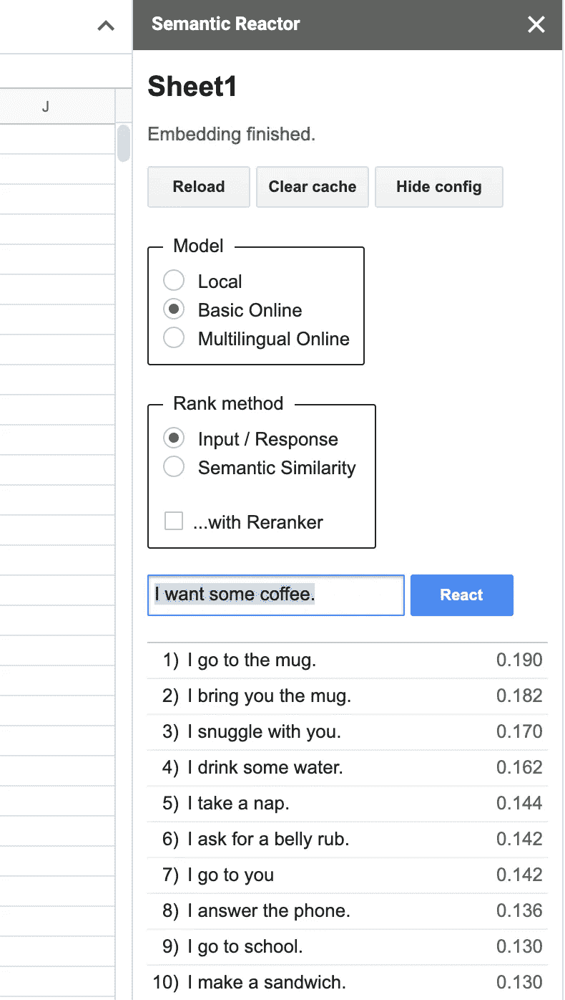

# 使用语义 ML 构建语言驱动的应用程序

> 原文：<https://towardsdatascience.com/build-apps-powered-by-language-with-semantic-ml-c6f01fdf0e94?source=collection_archive---------27----------------------->


图片由戴尔·马科维茨拍摄

在这篇文章中，我将向你展示如何使用初学者友好的 ML 工具——Semantic Reactor 和 tensor flow . js——来构建一个基于自然语言的应用程序。

*更新:语义反应堆上线了！将它添加到 Google Sheets* [*这里*](https://research.google.com/semanticexperiences/semantic-reactor.html) 。

大多数人更擅长用语言描述世界，而不是用代码描述世界(嗯……*大多数*人)。那么，如果机器学习可以帮助弥合这两者之间的差距，那就太好了。

这就是“语义 ML”的用武之地，这是一个概括术语，用于描述捕捉单词或短语语义的机器学习技术。在这篇文章中，我将向您展示如何使用初学者友好的工具(Semantic Reactor 和 Tensorflow.js)快速构建基于语言的应用程序原型。

向下滚动以直接进入代码和工具，或者继续阅读一些背景知识:

# 理解语义 ML

# 什么是嵌入？

语义 ML 帮助我们构建自然语言驱动的软件的一个简单(但强大)的方法是通过一种叫做嵌入的技术。

在机器学习中，嵌入是一种在空间中表示数据(即绘制在 n 维网格上的点)的学习方法，使得点之间的距离是有意义的。单词向量是一个流行的例子:


*单词嵌入的可视化。本图来自* [*本媒文章*](https://medium.com/analytics-vidhya/implementing-word2vec-in-tensorflow-44f93cf2665f) *。*

上图显示了单词(“英格兰”、“他”、“快”)在空间中的排列，这样类似的单词(“狗”和“狗”、“意大利”和“罗马”、“女人”和“女王”)彼此靠近。每个单词都由一组坐标(或向量)表示，因此单词“queen”可能由坐标[0.38，0.48，0.99，0.48，0.28，0.38]表示。

这些数字从何而来？它们是由机器学习模型通过数据学习的。特别是，该模型学习哪些单词倾向于出现在句子的相同位置。考虑这两句话:

我妈妈生了一个儿子。

我妈妈生了一个女儿。

因为“女儿”和“儿子”这两个词经常在类似的上下文中使用，所以机器学习模型将学习到它们在空间中应该被表示为彼此靠近。

单词嵌入在自然语言处理中非常有用。它们可以用于查找同义词(“语义相似性”)，进行聚类，或者作为更复杂的 nlp 模型的预处理步骤。

# 嵌入整个句子

事实证明，使用一种叫做[通用句子编码器](https://tfhub.dev/google/collections/universal-sentence-encoder/1)的模型，整个句子(甚至是短段落)也可以有效地嵌入空间。使用句子嵌入，我们可以判断两个句子是否相似。这很有用，例如，如果你正在构建一个聊天机器人，并且想知道用户是否问了一个问题(例如，“你什么时候叫醒我？”)在语义上类似于一个你——聊天机器人程序员——已经预料到的问题，并写了一个回答(“我的闹钟是几点？”).

# 语义反应器:在 Google 表单中使用语义 ML 的原型

好了，现在开始有趣的部分——建造东西！

首先，一些灵感:当[安娜·基普尼斯](https://twitter.com/doubleanna)(Double Fine 的前游戏设计师，现在 Stadia/Google)向我展示她如何使用语义 ML 来自动化视频游戏交互时，我最初对语义 ML 感到兴奋。使用句子编码器模型，她构建了一个视频游戏世界，该世界使用 ML 来推断环境应该如何对玩家输入做出反应。它让我大吃一惊。点击这里查看我们的聊天记录:

在安娜的游戏中，玩家通过问任何他们想到的问题来与虚拟狐狸互动:

“福克斯，我能喝点咖啡吗？”

然后，使用语义 ML，游戏引擎(或[实用系统](https://en.wikipedia.org/wiki/Utility_system))考虑游戏可能做出反应的所有可能方式:

使用句子编码器模型，游戏决定最佳反应是什么并执行它(在这种情况下，最佳反应是*Fox brings you mug*，因此游戏动画显示 Fox bring you mug)。如果这听起来有点抽象，一定要看我上面链接的视频。

这个项目最巧妙的一个方面是 Anna 使用一个叫做语义反应器的工具在 Google Sheet 中做了大量的原型。

语义反应器是 Google Sheets 的一个插件，允许你在一个工作表中对你自己的数据使用句子编码器模型。在这里访问它[。这是快速构建语义 ML 应用原型的一个非常好的方法，然后你可以使用](https://research.google.com/semanticexperiences/semantic-reactor.html) [TensorFlow.js models](https://www.npmjs.com/package/@tensorflow-models/universal-sentence-encoder) 将它转化为代码(稍后会有更多相关内容)。

下面是这个工具的一个小图片:


Dale Markowitz 的使用语义反应器的 Gif。

要使用语义反应器，创建一个新的谷歌表，并在第一列中写一些句子。在这里，我将松散地重现安娜的 fox 演示(对于所有的细节，查看她的[原始帖子](https://stadia.dev/intl/fr_ca/blog/creating-game-ai-using-mostly-english/))。我把这些句子放在我的谷歌表单的第一列:

在这里，你必须发挥你的想象力，想想潜在角色(例如聊天机器人或视频游戏中的演员)可能会采取的这些“行动”。

一旦你安装了语义反应器，你就可以通过点击“附加组件->语义反应器->启动”来启用它。


从附加组件下拉菜单中启用语义反应器(Dale Markowitz)

单击“开始”将打开一个面板，允许您键入输入内容并点击“反应”:



尝试输入/响应排名(戴尔·马科维茨)

当你点击“React”时，Semantic Reactor 使用一个模型来嵌入你在第一列中写的所有响应，计算一个分数(这句话对查询的响应有多好？)，并对结果进行排序。例如，当我的输入是“我想要一些咖啡”时，我的电子表格中排名最高的响应是“我去拿杯子”和“我给你拿了杯子。”

您还会注意到，使用这个工具有两种不同的方式来排列句子:“输入/响应”和“语义相似度”顾名思义，前者根据句子对给定查询的*响应*的好坏来对句子进行排序，而“语义相似度”只是对句子与查询的相似程度进行评级。

# 使用 TensorFlow.js 从电子表格到代码

在引擎盖下，Semantic Reactor 由开源的 TensorFlow.js 模型提供支持。

让我们看看如何在 JavaScript 中使用这些模型，这样您就可以将电子表格原型转换成一个工作应用程序。

1.  创建一个新的节点项目并安装模块:

```
npm init
npm install @tensorflow/tfjs @tensorflow-models/universal-sentence-encoder
```

2.创建一个新文件(`use_demo.js`)并要求库:

```
require('@tensorflow/tfjs');
**const** encoder = require('@tensorflow-models/universal-sentence-encoder');
```

3.加载模型:

```
**const** model = **await** encoder.loadQnA();
```

4.对您的句子进行编码并查询:

```
**const** input = {
queries: ["I want some coffee"],
responses: [
"I grab a ball",
"I go to you",
"I play with a ball",
"I go to school.",
"I go to the mug.",
"I bring you the mug."]
};**const** embeddings = **await** model.embed(input);
```

5.瞧啊。您已经将您的回答和查询转换为向量。不幸的是，向量只是空间中的点。要对回答进行排序，您需要计算这些点之间的距离(您可以通过计算[点积](https://www.mathsisfun.com/algebra/vectors-dot-product.html)来完成，这将给出点之间的平方[欧几里德距离](https://en.wikipedia.org/wiki/Euclidean_distance#:\~:text=In%20mathematics%2C%20the%20Euclidean%20distance,metric%20as%20the%20Pythagorean%20metric.)):

```
// zipWith :: (a -> b -> c) -> \[a\] -> \[b\] -> \[c\]**const** zipWith =
   (f, xs, ys) => {
   **const** ny = ys.length;
   **return** (xs.length <= ny ? xs : xs.slice(**0**, ny))
   .map((x, i) => f(x, ys\[i\]));
   } // Calculate the dot product of two vector arrays.
   **const** dotProduct = (xs, ys) => {
   **const** sum = xs => xs ? xs.reduce((a, b) => a + b, **0**) : **undefined**; **return** xs.length === ys.length ?
   sum(zipWith((a, b) => a * b, xs, ys))
   : **undefined**;
   }
```

如果运行这段代码，您应该会看到如下输出:

```
[
      { response: 'I grab a ball', score: **10.788130270345432** },
      { response: 'I go to you', score: **11.597091717283469** },
      { response: 'I play with a ball', score: **9.346379028479209** },
      { response: 'I go to school.', score: **10.130473646521292** },
      { response: 'I go to the mug.', score: **12.475453722603106** },
      { response: 'I bring you the mug.', score: **13.229019199245684**}
]
```

点击查看完整代码示例[。](https://github.com/google/making_with_ml/blob/master/semantic_ml/use_sample.js)

就是这样:这就是如何从语义 ML 电子表格快速编码！

很酷，对吧？如果你用这些工具做了些什么，一定要在下面的评论里或者在 Twitter 上让我知道。

发推文 [@dalequark](https://twitter.com/dalequark) 或者在 Instagram 上关注 [@dale_on_ai](https://www.instagram.com/dale_on_ai/) 。

*原载于 2020 年 8 月 5 日 https://daleonai.com**[*。*](https://daleonai.com/semantic-ml)*