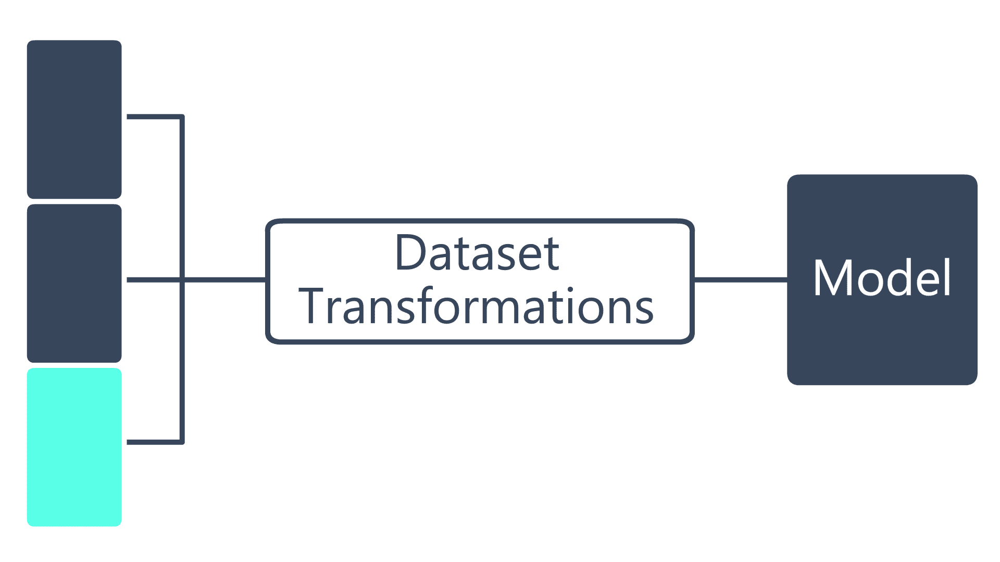
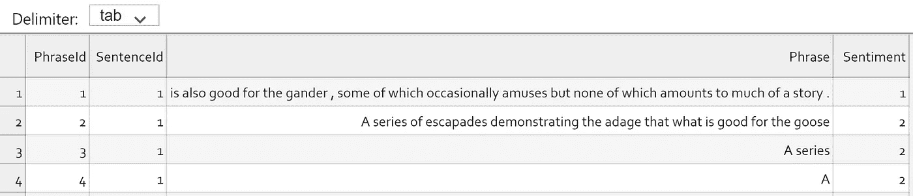
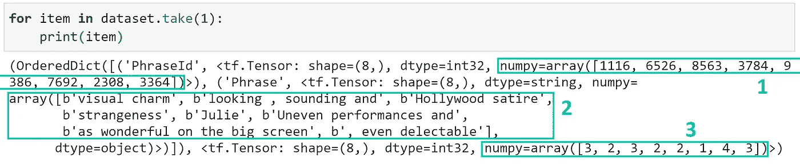
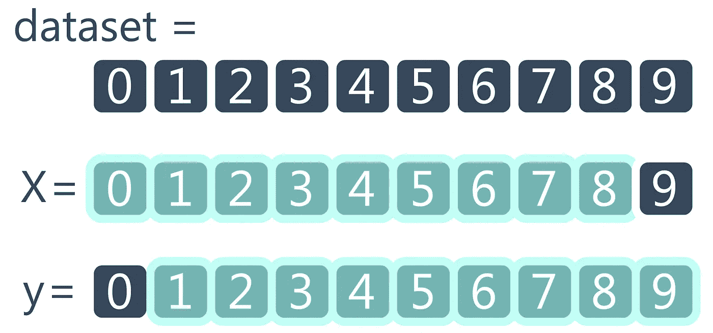
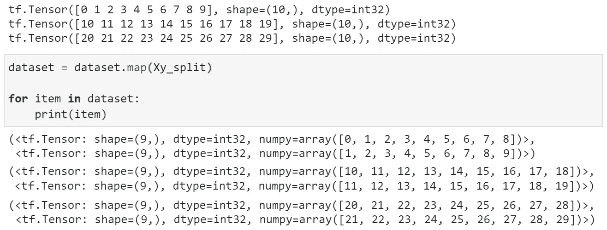

# 使用 TensorFlow 数据集构建更好的管道

> 原文：<https://towardsdatascience.com/build-better-pipelines-with-tensorflow-dataset-328932b16d56?source=collection_archive---------12----------------------->

## [入门](https://towardsdatascience.com/tagged/getting-started)

## 简洁高效的数据处理可视化指南


照片由 [Unsplash](https://unsplash.com?utm_source=medium&utm_medium=referral) 上的 [roman pentin](https://unsplash.com/@romanenko29061983?utm_source=medium&utm_medium=referral) 拍摄

D 在任何可扩展的、生产质量的 ML 解决方案中，ata 管道虽然不那么迷人，但仍然是基本的构建模块。事实上，绝大多数 ML 实际上是数据争论——因此，强大的管道是构建强大解决方案的重要因素是有道理的。

聚焦 TensorFlow 2，我们有一个奇妙的东西叫做`Dataset`对象，内置在库中。使用数据集对象，我们可以用少得多的努力来设计高效的数据管道——结果是一个更干净、更合理和高度优化的管道。

我们将深入研究数据集对象。包括它们是什么，为什么我们应该使用它们，以及我们如何使用它们。

```
**What Are Datasets?**
  - Why Use Them?**Reading Data**
  - In-memory
  - From File**Basic Operations**
  - Batching and Shuffling
  - Data Transformations with Map**Feeding Datasets into a Model**
  - Multiple Inputs/Outputs
  - Train-Validation Split
```

如果您喜欢视频，我也在这里介绍了本文中的所有内容:

# 什么是数据集？

数据集是包含在`tf.data` API 中的一个对象，它表示一系列元素。每个元素都被赋予了特定的结构，这取决于我们的模型所要求的格式。

`tf.data` API 是 TensorFlow 构建输入数据管道的内置方法——提供用更少代码开发更高效管道的方法。

## 为什么使用它们？

数据集抽象使得数据提取、转换和加载非常容易。

例如，我们可以构建一个管道来迭代地从文件中加载(而不是将所有内容都保存在内存中)，执行一些给定的转换(如文本数据的标记化)，批处理，混洗，并将数据加载到我们的模型中进行训练。

所有这些通常只需要几行代码。批处理和混洗我们的数据集只需要`dataset.shuffle(10000).batch(64)`。

# 读取数据

如前所述，关于如何将数据读入数据集，我们有两种选择，(1)从内存中或(2)从磁盘中。

## 在记忆中

最简单的方法是使用 dataframe、数组、列表或其他数据结构将数据直接读入 Python。这种方法绝对可以使用，但是对于较大的数据集来说可能很快变得难以管理。

因此，如果使用较小的数据集，您有以下选择:

```
import tensorflow as tf# read from lists
inputs = [0, 1, 2, 3]
labels = [1, 0, 1, 0]
dataset = tf.data.Dataset.from_tensor_slices((inputs, labels))# the exact same approach for Numpy arrays
inputs = np.asarray([0, 1, 2, 3])
labels = np.asarray([1, 0, 1, 0])
dataset = tf.data.Dataset.from_tensor_slices((inputs, labels))# and from dataframes
df = pd.DataFrame({
    'inputs': [0, 1, 2, 3],
    'labels': [1, 0, 1, 0]
})
dataset = tf.data.Dataset.from_tensor_slices(df)
```


使用上面的 list/NumPy 方法创建的**数据集**对象内的内部记录。

这些方法产生如上所示的`dataset`结构。显然，从内存对象中读取非常简单，但是对于大型数据集来说并不理想。

## 从文件

第二种方法是从内存不足的地方读入数据，比如本地硬盘。

采用这种方法时，我们受益于只在内存中加载我们需要的数据，这意味着对于一个 20M 的样本数据集，我们可以避免一次加载整个数据集，只迭代加载我们需要的数据。



我们的数据集(右)被分成几批。在任何时候，只有一个批次被载入内存。然后，活动批次被转换并输入到模型中进行训练。

在这个例子中，我们将使用 IMDB 电影评论数据集。你可以从 [Kaggle 这里](https://www.kaggle.com/c/sentiment-analysis-on-movie-reviews/data)下载。



来自 **train.tsv** 数据的前四行。

我们的训练数据包含在`train.tsv`中，我们将使用它来训练一个情感分类器。为此，我们需要将包含在`Content`中的文本作为我们的输入特征，将`Sentiment`作为我们的目标标签。我们不需要任何其他列。

```
dataset = tf.data.experimental.make_csv_dataset(
    "train.tsv",
    batch_size=8,
    field_delim='\t',
    select_columns=['Phrase', 'Sentiment'],
    label_name='Sentiment')
```



**2** 和 **3** 显示一批八个**短语**和**情感**样本。编号 **1** 是 **PhraseId** ，它被添加到 **select_columns** 中，以表明数据在默认情况下是混洗的。

通过这种方法，我们可以轻松地将存储在内存中的数据保持在较低水平，并且仍然可以轻松地洗牌和批量处理数据——这是一个非常方便的选择。

# 基本操作

现在我们已经讲述了读写数据集对象的基础知识；我们可以开始转换加载的数据集。

## 批处理和洗牌

当从文件中读取时，不需要这些操作，因为它们是内置的，可以读取像`tf.data.experimental.make_csv_dataset`这样的函数——但是当我们从内存中构建数据集时，这种情况不会发生。

幸运的是，这仍然非常简单。我们给`shuffle`一个大数字(`10000`很常见)作为参数，给`batch`我们的训练批量:

```
dataset = dataset.shuffle(10000).batch(64)
```

只需这一行代码就可以对我们的数据集进行洗牌和批处理！

## 使用地图进行数据转换

我们可以使用`map`函数对 xour 数据集中的每个样本执行操作。例如，为了预测序列中的下一个时间步，我们可能需要训练输入数据，输入数据由时间步 *n* 到 *n+8* 组成，输出数据由时间步 *n+1* 到 *n+9* 组成。



最初，我们的数据由包含代表 10 个时间步长的 10 个元素的记录组成。在基于时间的预测中，我们通常将这些序列分成输入(X)和目标(y)数据，如图所示。我们可以使用 **map** 方法来做到这一点。

最初，我们的数据集可能由许多包含 10 个时间步序列的样本组成。为了训练我们的模型，我们需要将这些 10 长的序列分成两组 9 长的序列，一组是输入数据，另一组是我们的目标数据。

为了执行这个操作，我们使用了`map`方法，就像这样:

```
def Xy_split(x):
    X = x[:-1]  # [0, 1, 2, 3, 4, 5, 6, 7, 8]
    y = x[1:]   # [1, 2, 3, 4, 5, 6, 7, 8, 9]
    return X, ydataset = dataset.map(Xy_split)
```



我们可以根据需要使用 **map** 方法来拆分或重新格式化我们的数据。

# 将数据集输入模型

当把我们的数据集输入到训练模型中时，默认的格式是`(input, output)`。这意味着数据集中包含的每个记录/批次都应该包含输入张量和标签/输出张量。

使用这种格式，我们可以将数据集对象传递给我们的训练方法，如下所示:

```
model.fit(dataset, epochs=2)
```

## 多输入/输出

单一输入/输出格式并不总是我们需要使用的格式。对于任何重组，我们都可以再次依赖`map`方法。

我们可以通过将数据集映射到字典格式来映射多个输入和输出，在字典格式中，我们的输入名称(键)指向我们将使用的一组值(值)。

如果我们将输入/输出层名称匹配到输入/输出数据集字典键，我们可以像往常一样将`dataset`传递给我们的模型！

```
*# current dataset format is (inputs1, inputs2, labels)*def map_func(x):
    return {
        **'inputs1'**: x[0],
        **'inputs2'**: x[1]
    }, x[2]dataset = dataset.map(map_func)input_layer_1 = tf.keras.layers.Input(shape=(100,), name=**'inputs1'**)
input_layer_2 = tf.keras.layers.Input(shape=(100,), name=**'inputs2'**)
```

一个常见的用例是为 transformer 模型创建两个输入层。许多这些模型需要一个输入 ID 张量和相应的注意屏蔽张量，我们可以使用相同的逻辑:

```
def transformer_fmt(x):
    return {
        **'input_ids'**: x[0],
        **'attention_mask'**: x[1],
    }, x[2]  *# x[2] are the output labels*dataset = dataset.map(transformer_fmt)input_ids = tf.keras.layers.Input(shape=(100,), name=**'input_ids'**)
mask = tf.keras.layers.Input(shape=(100,), name=**'attention_mask'**)...model.fit(dataset, epochs=2)
```

## 训练-验证分割

这里的另一个要点是训练集和验证集(测试集)的分离。在数据集中实现拆分的最简单方法是使用`take`和`split`方法。

为了获取给定数量的记录，我们使用`take`——就像这样:

```
first5 = dataset.take(5)
```

然后，我们可以使用`skip`跳过给定数量的记录，返回以下所有记录——如下所示:

```
miss5 = dataset.skip(5)
```

结合这两种方法，我们可以在数据中创建一个分割。例如，对于 70–30%的培训验证分割，我们会:

```
train = dataset.take(round(length*0.7))
val = dataset.skip(round(length*0.7))
```

并创建另一个分割来添加测试集。

当我们将训练集和验证集输入到我们的训练模型中时，我们是这样做的:

```
history = model.fit(
    train,
    validation_data=val,
    epochs=2)
```

我们已经介绍了如何使用数据集对象在 TF2 构建更干净、更高效的数据输入管道！包括:

*   它们是什么以及我们为什么要使用它们
*   将内存中的数据加载到数据集
*   从文件读入数据集
*   批处理和洗牌
*   使用`map`转换数据集
*   将数据集输入模型
*   如何处理多个输入/输出层
*   列车价值测试拆分

这就是我们需要知道的大部分 ML 输入管道。由于清晰高效的`tf.data` API，我们所做的一切都非常容易执行，而且快如闪电。

我希望你喜欢这篇文章！如果你有任何问题或想法，请通过[推特](https://twitter.com/jamescalam)或在下面的评论中告诉我。

感谢阅读！

## [🤖《变形金刚》NLP 课程 70%的折扣](https://bit.ly/nlp-transformers)