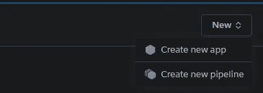
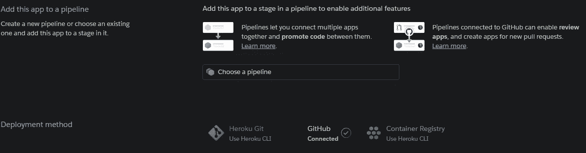
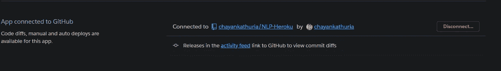
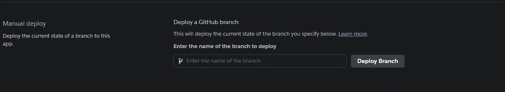
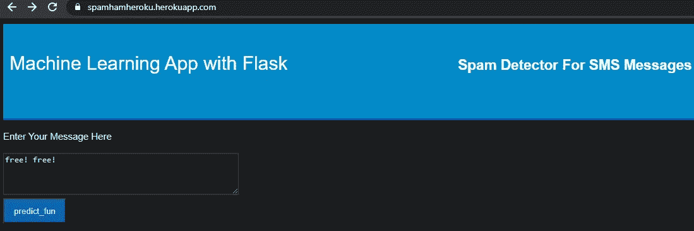
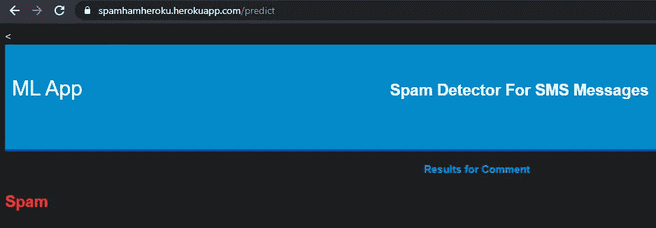

# 10 分钟内在 Heroku Cloud 上构建和部署垃圾邮件分类器应用程序！

> 原文：<https://towardsdatascience.com/build-deploy-a-spam-classifier-app-on-heroku-cloud-in-10-minutes-f9347b27ff72?source=collection_archive---------48----------------------->

## 垃圾邮件分类器的构建及其在 Heroku 上的应用


查尔斯·德鲁维奥在 [Unsplash](https://unsplash.com?utm_source=medium&utm_medium=referral) 上拍摄的照片

今天我们将构建一个简洁的垃圾邮件分类器，一个基于自然语言处理的模型。然后，我们将构建一个 flask 应用程序，它将呈现一个基于 HTML 的主页和一个预测页面。用户将在主页中输入文本，应用程序将在预测页面上预测它是否像垃圾邮件或 Ham(非垃圾邮件)。这个 flask API 将部署在 Heroku 上的公共主机中。Heroku 是这里显而易见的选择，因为它超级快，超级容易。我说过它是免费的吗？是的，它是！先自己检查并使用这个应用程序[这里](https://spamhamheroku.herokuapp.com/)以了解你将构建什么。

现在你已经看到了，让我们开始吧！

# 模型

第一步将是建立我们的 NLP 模型，从用户那里获取自然文本，并预测它是垃圾邮件还是垃圾邮件(不是垃圾邮件)。我们将通过几段 python 代码来实现这一点。我的 [Github](https://github.com/chayankathuria/NLP-Heroku) 上有完整的代码和数据集。首先，让我们导入所有需要的库。

```
import pandas as pd  #Pandas for data pre-processing

import pickle #Pickle for pickling (saving) the model 

from sklearn.feature_extraction.text import CountVectorizer #To Vectorize the textual data 

from sklearn.naive_bayes import MultinomialNB #The algorithm for prediction 

from sklearn.externals import joblib #Alternative Usage of Saved Model 

from sklearn.model_selection import train_test_split #Validation split
```

接下来，我们需要加载数据，并分成文本数据(X)和标签(y)。

```
df = pd.read_csv("spam.csv", encoding="latin-1")

df.drop(['Unnamed: 2', 'Unnamed: 3', 'Unnamed: 4'], axis=1, inplace=True) #Some garbage features that need to be removed

# Text and Labels

df['label'] = df['class'].map({'ham': 0, 'spam': 1}) 

X = df['message']

y = df['label']
```

现在我们需要使用计数矢量器对文本数据进行矢量化(将文本转换为数字形式)。然后只需拆分训练和测试数据。没有考虑进一步的文本预处理，因为我们的目标是快速构建模型并部署它。可以自己试验一下文字清理部分，让性能更好。

```
# Extract Feature With CountVectorizer 

cv = CountVectorizer() 

X = cv.fit_transform(X) # Fit the Data 

X_train, X_test, y_train, y_test = train_test_split(X, y, test_size=0.33, random_state=42)
```

一旦完成，我们只需要拟合模型，并将其保存为 pickle 文件，稍后将加载到 flask 应用程序中。

```
#Naive Bayes Classifier  

clf = MultinomialNB() 
clf.fit(X_train,y_train) 
print(clf.score(X_test,y_test)) 

#Alternative Usage of Saved Model 

joblib.dump(clf, 'NB_spam_model.pkl') 
joblib.dump(cv, 'cv.pkl')
```

请注意，我们已经保存了朴素贝叶斯模型和计数矢量器。这是因为对于您来说，从用户处获取的文本输入必须使用与模型训练时相同的计数矢量器参数进行矢量化。好了，现在我们有了模型和矢量器。

接下来，我们需要构建 flask 应用程序，它将把我们刚刚构建的 NLP 模型连接到我们的浏览器，然后在云上托管它。

# 烧瓶应用程序

只要用户访问应用程序的 URL，flask 应用程序就会将用户路由到主页。稍后，当用户输入文本并点击预测按钮时，它会将其重定向到预测页面并呈现输出。让我们看看它是怎么做的。

我们需要导入 flask 和其他一些功能。如果您还没有安装 flask，那么您需要通过一个简单的 pip install 命令来安装它。

```
from flask import Flask, render_template, request
```

这里， *Flask* 将用于定义我们正在使用的 app。然后 *render_template* 会渲染首页(home.html)和预测页面(result.html)。并且*请求*将被用于检索文本输入，该文本输入将通过 HTML Post 方法从 HTML 页面发送到 flask 应用程序。

现在我们需要定义 flask 应用程序及其到主页的默认路由，即 home.html。我们将定义一个函数，当应用程序 URL 被调用时，该函数除了显示主页之外什么也不做。

```
app = Flask(__name__) 

@app.route('/') #Routes the app to below task when the URL is called 

def home(): 

    return render_template('home.html')
```

现在是应用程序的主要部分，预测。我们需要定义一个函数来打开和加载 NLP 模型，并对矢量器 pickle 文件进行计数。然后，它检索通过 POST 方法发送给它的文本输入。然后，使用相同的矢量器对检索到的文本输入进行矢量化，并转储到我们的模型中以获得预测。就是这样！我们现在只需要在预测页面上呈现这个预测结果，我们就完成了。

```
def predict_fun(): 

    NB_spam_model = open('NB_spam_model.pkl','rb') 
    clf = joblib.load(NB_spam_model)

    cv_model = open('cv.pkl', 'rb')
    cv = joblib.load(cv_model)	

    if request.method == 'POST': 

        message = request.form['message'] 
        data = [message] 
        vect = cv.transform(data).toarray()
        my_prediction = clf.predict(vect) 

    return render_template('result.html',prediction = my_prediction)   

#Calling the main function and running the flask app 

if __name__ == '__main__':
    app.run(debug=True)
```

我们的模型和烧瓶应用程序已经完成。我们现在只需要在 Heroku 上部署这些文件。

# 部署

要在 Heroku 上部署应用程序，您需要将所有链接到 Heroku 的文件推送到 Github 上。您需要将以下文件上传到您的存储库:

1.  NLP 模型泡菜
2.  计数矢量器泡菜
3.  烧瓶应用程序
4.  HTML 和 CSS 文件
5.  需求文件
6.  Procfile

好的，你可能想知道什么是需求和 procfile 文件。需求是一个文本文件，其中包含所有的依赖关系(如熊猫，烧瓶等库。)以及应用程序按预期运行所需的版本。Heroku 将在部署应用程序之前安装所有这些依赖项。Procfile 是一个配置文件，看起来类似于:

```
web: gunicorn app1:app
```

这里的“app1”是我的 flask 文件名，即“app 1 . py”,“app”是我们在上面的代码中定义的 flask 应用程序。这只是告诉 Heroku 查找名为 app1 的 flask 文件，并在其中查找定义为“app”的 flask 应用程序。

一旦你把所有的文件推送到一个新的 github 库，你需要在 Heroku 上创建一个应用程序，并把你的 github 库连接到它。要做到这一点，只需前往 [Heroku](https://dashboard.heroku.com/) [。](https://dashboard.heroku.com/)如果您还没有帐户，请创建一个帐户，然后转到“创建新应用程序”。



创建新应用程序

在新创建的应用程序中，您需要连接到包含代码的 github 存储库。在搜索框中搜索 github 库名称，然后点击“连接”按钮。



将 Github 存储库连接到 Heroku



Github 已连接

一旦连接，你只需要点击“部署”按钮，你就完成了！Heroku 将首先检查需求文件并安装所有依赖项，然后将 flask 应用程序部署到公共主机。将生成一个 URL，它是您的应用程序的 URL。只需复制并在浏览器中打开它，瞧！你完了。



点击部署！

这就是本教程的内容。希望你让应用程序运行，并得到体面的结果！



输入一些“spamish”测试



在那里！

如果你已经走了这么远，并准备好了应用程序，给自己一个鼓励。你应得的！

所以我们在这里使用了 Heroku Cloud，因为它安装起来很快也很容易。然而，我鼓励你也尝试在其他云平台上部署该应用程序——如 AWS EC2、谷歌云平台和 Azure。

请随意从我的 [github](https://github.com/chayankathuria/NLP-Heroku) 获取源代码，如果有任何疑问和建议，请在 [LinkedIn](https://www.linkedin.com/in/chayankathuria/) 上联系我。

下一篇帖子再见，干杯！