# 使用 Flask、ML 和 Heroku 构建和部署糖尿病预测应用程序

> 原文：<https://towardsdatascience.com/build-deploy-diabetes-prediction-app-using-flask-ml-and-heroku-2de07cbd902d?source=collection_archive---------12----------------------->

## 从训练模型到在 Heroku 上部署模型的端到端机器学习项目


照片由 CHUTTERSNAP 在 Unsplash 上拍摄

## 欢迎我的朋友，

根据美国消费者新闻与商业频道的说法，未来十年最时尚的工作是数据科学家和机器学习工程师。现在是我们学习一些机器学习算法，创造一些项目扔出去的最好时机。

你经常看到所有那些教程和博客解释不同类型的机器学习算法，但大多数都没有告诉你如何构建一个项目，然后使用这些算法部署它。

**不要担心，在这个博客中，我们将创建一个端到端的机器学习项目，然后将它部署在 Heroku。**

## 我们将分四步完成它

1.  ***使用机器学习创建模型***
2.  ***使用 flask 创建 web 应用程序，并将其与模型*** 连接
3.  ***将项目提交给 Github***
4.  ***使用 Heroku*** 部署我们的模型

# 在开始之前，让我们先
***设置我们的环境***

1.  ***下载最新版 Python***

[](https://www.python.org/downloads/) [## 下载 Python

### 关于特定端口的信息、开发人员信息来源和二进制可执行文件由发布经理或……

www.python.org](https://www.python.org/downloads/) 

2. ***安装所需软件包***

所有软件包都可以使用 cmd(终端)中的 pip 进行安装。

```
pip install pandas,numpy,matplotlib,scikit-learn,seaborn
```

3. ***安装 Jupyter 笔记本***

```
pip install jupyter-notebookjupyter notebook ### for running
```

完成所有三个步骤后，现在让我们开始我们的项目。

# ***在 jupyter 中打开一个新的笔记本，按照下面的步骤沿着***

# 1.使用机器学习创建模型

## 导入必要的库

```
#importing Librariesimport numpy as np   
np.random.seed(42)   ## so that output would be same
import matplotlib.pyplot as plt
import pandas as pd
import seaborn as sns
%matplotlib inline   ## our plot lies on the same notebook#models
from sklearn.ensemble import RandomForestClassifier
from sklearn.tree import DecisionTreeClassifier
from sklearn.linear_model import LogisticRegression
from sklearn.neighbors import KNeighborsClassifier
from sklearn.svm import SVC#Evaluation
from sklearn.model_selection import train_test_split,cross_val_score
from sklearn.model_selection import RandomizedSearchCV,GridSearchCV
from sklearn.metrics import confusion_matrix, classification_report
from sklearn.metrics import precision_score, recall_score, f1_score
from sklearn.metrics import plot_roc_curve#for warning
from warnings import filterwarnings
filterwarnings("ignore")  ## To remove any kind of warning
```

# 加载数据集

数据集在 Kaggle 上可用，但我们将使用我的 Github 链接来加载数据。

```
data = pd.read_csv("[https://raw.githubusercontent.com/Abhayparashar31/Diabetes-prediction/master/diabetes.csv](https://raw.githubusercontent.com/Abhayparashar31/Diabetes-prediction/master/diabetes.csv)")
```

## ***关于数据集***

数据集由几个医学预测变量(独立变量)和一个目标变量(因变量)组成，*结果。*独立变量包括患者的怀孕次数、身体质量指数、胰岛素水平、年龄、
等。

## **列**

**怀孕** : *怀孕次数*
**血糖** : *口服葡萄糖耐量试验 2 小时血糖浓度*
**血压** : *舒张压(毫米汞柱)*
**皮肤厚度** : *三头肌皮褶厚度(毫米)*
**胰岛素** : *2 小时血清胰岛素(胰岛素*
**年龄:** *年龄(年)*
**结局:** *类变量(0 或 1)768 中的 268 为 1，其余为 0*

## 工作

> ***建立机器学习模型，准确预测数据集中的患者是否患有糖尿病？***

# 数据集上的 EDA

```
print(data.shape)  ### Return the shape of data 
print(data.ndim)   ### Return the n dimensions of data
print(data.size)   ### Return the size of data 
print(data.isna().sum())  ### Returns the sum fo all na values
print(data.info())  ### Give concise summary of a DataFrame
```

## 让我们将一些列可视化并进行比较

```
data["Outcome"].value_counts().plot(kind="bar",color=["salmon","deeppink"])
plt.xticks(np.arange(2), ('No Diabetes', 'Diabetes'),rotation=0);
```

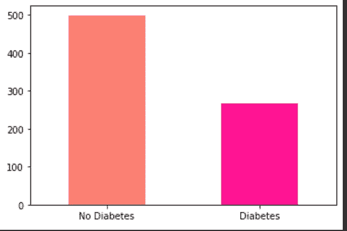

作者图片

```
***# Comparing Glucose with the Outcome***
pd.crosstab(data.Glucose[::15],data.Outcome).plot(kind="bar",figsize=(18,8),color=["yellow","deeppink"])
plt.ylabel("people");
plt.xticks(rotation=0);
plt.legend(['No Diabetes', 'Diabetes']);
```

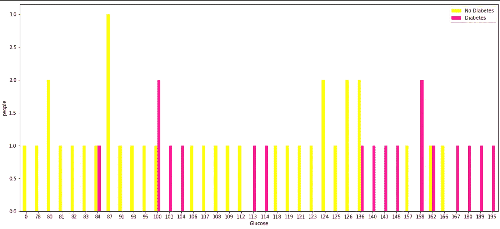

“作者提供的图像”

```
***#find out Blood Pressure and age of entries who have diabetes***
plt.figure(figsize=(10,6))# Scatter with positive example
plt.scatter(data.Age[data.Outcome==1],data.BloodPressure[data.Outcome==1],c="Red");# Scatter with negative example
plt.scatter(data.Age[data.Outcome==0],data.BloodPressure[data.Outcome==0],c="lightblue");# Add some helpful info
plt.title("Diabetes in function of Age and Blood pressure")
plt.xlabel("Age")
plt.ylabel("Blood Pressure")
plt.legend(["Diabetes","No Diabetes"]);
```

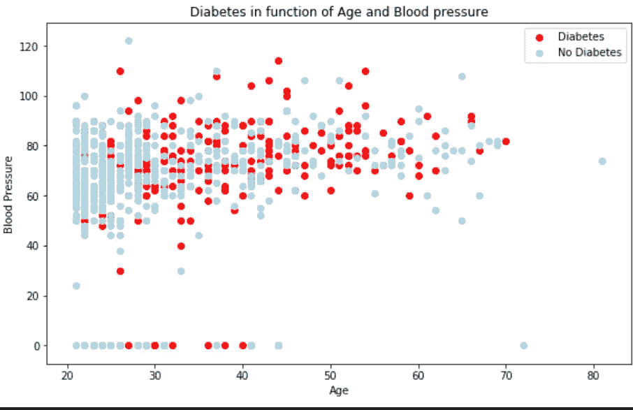

“作者提供的图像”

```
***## Pairplotting of dataframe***
import seaborn as sns
sns.set(style="ticks", color_codes=True)
sns.pairplot(data,hue='Outcome',palette='gnuplot');
```

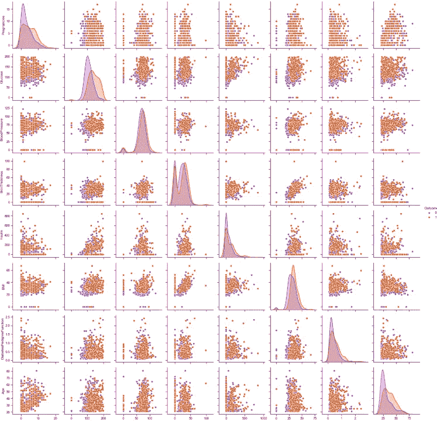

“作者提供的图像”

```
***# Histogram of all coloumns when the Outcome is 1( has Diabetes)***fig, ax = plt.subplots(nrows=4, ncols=2, figsize=(12, 10))
fig.tight_layout(pad=3.0)
ax[0,0].set_title('Glucose')
ax[0,0].hist(data.Glucose[data.Outcome==1]);
ax[0,1].set_title('Pregnancies')
ax[0,1].hist(data.Pregnancies[data.Outcome==1]);
ax[1,0].set_title('Age')
ax[1,0].hist(data.Age[data.Outcome==1]);
ax[1,1].set_title('Blood Pressure')
ax[1,1].hist(data.BloodPressure[data.Outcome==1]);
ax[2,0].set_title('Skin Thickness')
ax[2,0].hist(data.SkinThickness[data.Outcome==1]);
ax[2,1].set_title('Insulin')
ax[2,1].hist(data.Insulin[data.Outcome==1]);
ax[3,0].set_title('BMI')
ax[3,0].hist(data.BMI[data.Outcome==1]);
ax[3,1].set_title('Diabetes Pedigree Function')
ax[3,1].hist(data.DiabetesPedigreeFunction[data.Outcome==1]);
```

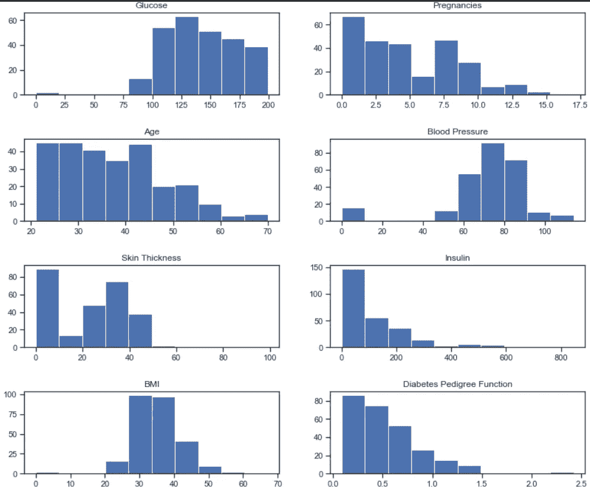

“作者提供的图像”

```
***# correlation matrix between columns***
***## It shows the correlation(positive,neagative) between different columns(only integer value columns)*** corr_matrix = data.corr()
fig,ax = plt.subplots(figsize=(15,10))ax = sns.heatmap(corr_matrix,annot=True,linewidth=0.5,fmt=".2f",cmap="YlGnBu")
```

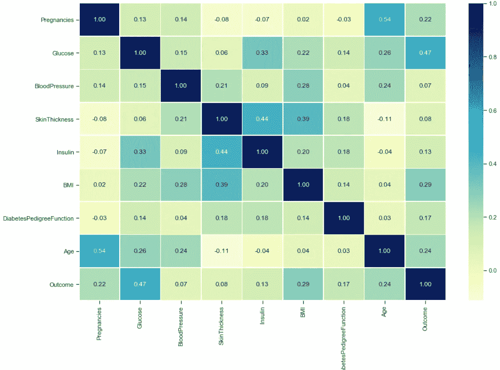

“作者提供的图像”

# 建模和培训

```
#random data shuffelindata.sample(frac=1)#Spliting the data
X = data.drop("Outcome",axis=1)
y = data["Outcome"]
X_train,X_test,y_train,y_test =  train_test_split(X,y,test_size=0.2)
```

我们将在 4 个算法
***1 上**训练**我们的模型。逻辑回归
2。KNN
3。随机森林分类器
4。支持向量机***

```
***## Build an model (Logistic Regression)***
from sklearn.linear_model import LogisticRegression
log_reg = LogisticRegression(random_state=0)
log_reg.fit(X_train,y_train);
## Evaluating the model
log_reg = log_reg.score(X_test,y_test)***## Build an model (KNN)*** knn = KNeighborsClassifier()
knn.fit(X_train,y_train);
## Evaluating the model
knn = knn.score(X_test,y_test)***## Build an model (Random forest classifier)*** clf= RandomForestClassifier()
clf.fit(X_train,y_train);
## Evaluating the model
clf = clf.score(X_test,y_test)***## Build an model (Support Vector Machine)*** svm = SVC()
svm.fit(X_train,y_train)
## Evaluating the model
svm = svm.score(X_test,y_test)
```

让我们想象一下所有模型的训练表现

```
model_compare = pd.DataFrame({"Logistic Regression":log_reg,
"KNN":knn,
"Random Forest Classifier":clf,
"Support Vector Machine":svm,},
index=["accuracy"])model_compare.T.plot.bar(figsize=(15,10));##############OUTPUT###############

         Logistic Regression    KNN     Random ForestClassifier  SVM
accuracy      0.818182        0.772727       0.798701       0.818182
```

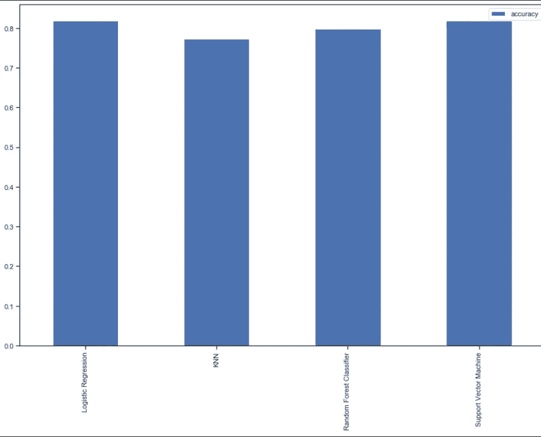

“作者提供的图像”

> 在这里，我们可以看到 SVM 和逻辑回归都表现得非常好，准确率为 81%。我们可以使用超参数调整来进一步提高精度。

# 使用超参数调谐提高精度

我们将使用网格搜索 cv 和随机搜索 cv 进行超参数旋转。

在逻辑回归中，我们很容易超调的参数是`C`和`solver`。

## 使用随机搜索进行超参数调整

```
# Create a hyperparameter grid for LogisticRegression
log_reg_grid = {"C": np.logspace(-4, 4, 20),"solver": ["liblinear"]}# Tune LogisticRegression
np.random.seed(42)
# Setup random hyperparameter search for LogisticRegression
rs_log_reg = RandomizedSearchCV(LogisticRegression(),
                                  param_distributions=log_reg_grid,
                                  cv=5,
                                  n_iter=20,
                                  verbose=True)
# Fit random hyperparameter search model for LogisticRegression
rs_log_reg.fit(X_train, y_train)
score = rs_log_reg.score(X_test,y_test)
print(score*100)##########OUTPUT###########
83.11688311688312
```

> **太好了，**使用随机搜索 cv，我们将准确率提高了 **2%。**

## 使用 GridSearchcv 进行超参数调整

```
log_reg_grid = {'C': np.logspace(-4,4,30),"solver":["liblinear"]}
#setup  the gird cv
gs_log_reg = GridSearchCV(LogisticRegression(),
                          param_grid=log_reg_grid,
                          cv=5,
                           verbose=True)
#fit grid search cv
gs_log_reg.fit(X_train,y_train)
score = gs_log_reg.score(X_test,y_test)
print(score*100)########OUTPUT#########
83.76623376623377
```

> **太好了，**使用网格搜索 CV，我们将准确率提高了 2.5%。

> 最佳模型是逻辑回归，准确率为 83%

# 评估模型

先来预测一下 **X_test**

```
y_preds = gs_log_reg.predict(X_test)
y_preds######OUTPUT#########
array([0, 0, 0, 0, 1, 0, 0, 0, 1, 0, 0, 1, 0, 0, 0, 0, 1, 0, 0, 1, 0,0,0, 0, 1, 0, 1, 1, 0, 0, 0, 1, 0, 0, 0, 0, 0, 0, 0, 1, 0, 0, 0, 0,0, 0, 0, 1, 0, 1, 0, 1, 0, 0, 0, 0, 0, 0, 1, 0, 0, 1, 0, 0, 0, 0,0, 0, 0, 0, 0, 0, 0, 0, 0, 0, 1, 0, 0, 0, 0, 1, 0, 1, 1, 0, 1, 0,0, 1, 0, 0, 0, 0, 0, 0, 0, 0, 0, 0, 1, 0, 1, 0, 0, 0, 0, 0, 0, 0,0, 0, 0, 0, 0, 0, 1, 0, 0, 0, 0, 0, 0, 0, 0, 1, 0, 0, 0, 0, 0, 0,0, 1, 0, 0, 0, 1, 1, 0, 0, 0, 1, 0, 0, 1, 0, 0, 0, 0, 0, 1,0, 0],dtype=int64)
```

***让我们看看混淆矩阵、准确率评分、分类报告、roc 曲线。***

**混淆矩阵**

```
sns.set(font_scale=2)
import seaborn as sns
sns.heatmap(confusion_matrix(y_test,y_preds), annot=True,cbar=False, fmt='g')
plt.xlabel("True label")
plt.ylabel("Predicted label");
```

**准确度分数**

```
print(accuracy_score(y_test,y_pred))#######OUTPUT########
0.8376
```

**分类报告**

```
print(classification_report(y_test, y_preds))
```

**ROC 曲线**

```
plot_roc_curve(gs_log_reg,X_test,y_test)
```

# 保存并加载模型

```
import pickle
# Save trained model to file
pickle.dump(gs_log_reg, open("Diabetes.pkl", "wb"))loaded_model = pickle.load(open("Diabetes.pkl", "rb"))
loaded_model.predict(X_test)
loaded_model.score(X_test,y_test)#######OUTPUT########
0.8376623376623377
```

# 2.使用 flask 创建 web 应用程序并将其与模型连接

因此，要创建一个 web 应用程序，让我们准备一个文件夹结构

```
diabetes(root)
    |____templates
            |___index.html
    |____static
            |____css
            |_____js
    |____app.py
    |_____Diabetes.pkl
```

***从我的 Github 下载模板和静态目录***

[](https://github.com/Abhayparashar31/Diabetes-prediction) [## abhayparashar 31/糖尿病预测

github.com](https://github.com/Abhayparashar31/Diabetes-prediction) 

让我们创建 ***app.py***

现在让我们在本地主机上运行代码

打开 CMD 并转到根(糖尿病)文件夹，然后使用`python app.py`运行 app.py，然后您会看到如下消息👇

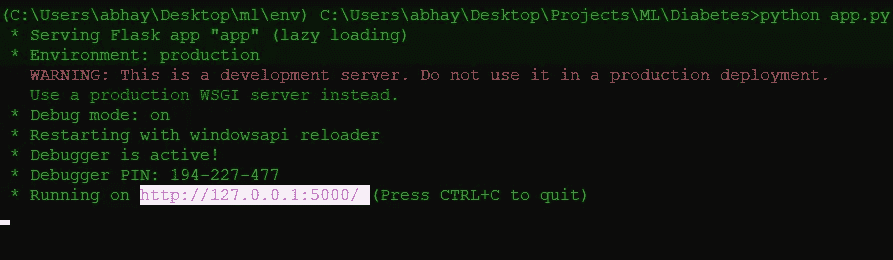

“作者提供的图像”

只需在任何浏览器中打开网址，使用一些随机输入来测试应用程序。

# 3.将项目提交给 Github

在将项目提交给 Github 之前，我们还要创建两个文件。

**1。Profile:** Heroku 应用程序包含一个 Procfile，它指定了应用程序在启动时执行的命令。

```
web: gunicorn app:app
```

**2。requires . txt:**要求。txt 文件用于指定运行项目所需的 python 包。

```
Flask==1.1.1
gunicorn==19.9.0
itsdangerous==1.1.0
Jinja2==2.10.1
MarkupSafe==1.1.1
Werkzeug==0.15.5
numpy>=1.9.2
scipy>=0.15.1
scikit-learn>=0.18
matplotlib>=1.4.3
pandas>=0.19
```

现在之后，去你的 Github 账户上传文件，然后提交给分支机构。

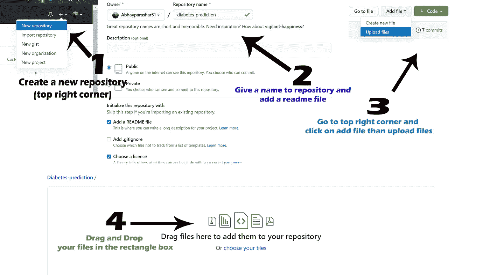

“作者提供的图像”

# 4.使用 Heroku 部署模型

访问 [Heroku](https://signup.heroku.com/) 并创建一个免费帐户，然后登录您的帐户。

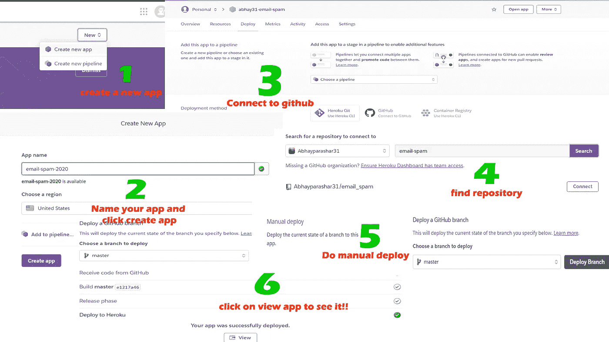

“作者提供的图像”

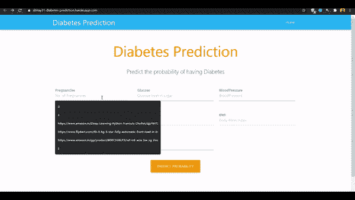

“作者提供的图像”

你可以在我的 Github 简介 [Abhayparashar31](https://github.com/Abhayparashar31/Diabetes-prediction) 中找到所有的源代码

谢谢你的阅读😄

感谢你读到这里，如果你喜欢我的内容并想支持我，最好的方式是—

1.  跟我上 [***中***](http://abhayparashar31.medium.com/) 。
2.  在[***LinkedIn***](https://www.linkedin.com/in/abhay-parashar-328488185/)上联系我。
3.  使用 [***我的推荐链接***](https://abhayparashar31.medium.com/membership) 用一个披萨的费用成为中等会员。你会费的一小部分会归我。
4.  订阅 [***我的邮件列表***](https://abhayparashar31.medium.com/subscribe) 从不会错过我的一篇文章。