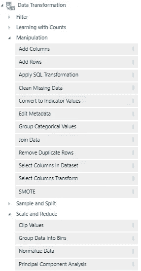

# 使用 Azure ML Studio 构建和部署机器学习模型

> 原文：<https://towardsdatascience.com/build-deploy-machine-learning-models-with-azure-ml-studio-81b818d1abe4?source=collection_archive---------50----------------------->

## 没有代码？没问题！

在 [Unsplash](https://unsplash.com?utm_source=medium&utm_medium=referral) 上由 [Franck V.](https://unsplash.com/@franckinjapan?utm_source=medium&utm_medium=referral) 拍摄的照片

我有时会对数据科学和机器学习中大量的锅炉代码感到困惑。在寻找一个可以加速训练和部署模型过程的解决方案时，我偶然发现了微软的 Azure ML Studio，天哪，我没有失望。

# 您可能想尝试的其他工具

在**无代码机器学习**领域，有几个值得注意的竞争者:

*   [**Knime**](https://www.knime.com/)
*   [**Rapidminer**](https://rapidminer.com/)
*   [**Alteryx**](https://www.alteryx.com/)
*   [**蔚蓝 ML 工作室**](https://studio.azureml.net/)

我将在一系列文章中深入探讨每一个问题，最后进行逐点比较。我将使用[这个](https://www.kaggle.com/c/DontGetKicked/data) Kaggle 数据集，来自一个旧的比赛，目标是预测一辆拍卖的汽车是否是一辆“被踢”(即一辆受损的汽车)。

今天，我们从 Azure ML Studio 开始。

# 构建机器学习管道

Azure ML Studio 中的主要区域是实验画布。左边是按用途分组的模块，您可以将任何模块拖到主画布上。画布的右侧用于显示当前选择的任何模块的属性，或者定制它的一些参数。

每个模块都预定义了一些输入和输出端口。这些端口中的每一个都有一个类型，当您将鼠标悬停在其上时，它会显示为一个工具提示。当您想知道预期的输入类型时，这非常有用。

在 Azure ML Studio 中，我们通过连接模块来构建机器学习管道:一个模块的输出成为管道中下一个模块的输入之一。

我们可以有顺序管道和并行管道，其中一个输出被重定向到多个输入，只要输入和输出的类型兼容。

例如，在下图中，我们看到数据集模块的输出是 GenericCSV 类型。

下一个模块有一个输入，预计是 Dataset 类型，它有许多实现或子类，其中一个是 GenericCSV 所以我们可以把前一个输出连接到这个输入。

此外，当我们从一个输出向下拖动到下一个模块的输入时，如果输入点与我们试图连接的输出兼容，它就会变成绿色。

# ML 管道的基本构件

任何 ML 管道基本上都有 7 个阶段:

1.  预处理您的数据
2.  分成训练/测试
3.  选择和/或创建您的特征
4.  训练模特
5.  做预测
6.  评估模型 7
7.  部署选定的模型

每个阶段都映射到 Azure ML Studio 中的一组模块。

## 步骤 1:预处理您的数据

对于这一步，您将使用`Data Transformation`下的模块。两个最重要的子部分是`Manipulation`和`Scale and Reduce`。这里有足够多的种类来涵盖大多数用例:分类变量的一次热编码、连续变量的宁滨、清除缺失数据等。

让我们以其中的一个模块“清除丢失的数据”为例来探索属性面板。在这里，我们被要求选择哪些列要用作清理的候选列，执行清理的最小和最大缺失值比率是多少，以及最后我们希望如何处理缺失值。有几个选项可用:

如果我们需要模块中没有的功能，我们可以使用“应用 SQL 转换”模块来运行任意 SQL 代码，我们可以直接在嵌入在属性面板中的编辑器中输入这些代码。注意，这个模块有 3 个输入端口，这意味着我们可以用这个模块处理多达 3 个数据集，在 SQL 代码中称为 t1、t2 和 t3。

## 步骤 2:分成训练/测试

这里我们有两个选择:

*   如果我们想要进行典型的训练/测试分割，我们将使用“分割数据”模块，它接受一个输入并产生两个输出(训练和测试)。在这种情况下，我们可以选择训练/测试比率，以及是否需要分层分割。其他拆分模式也是可用的，比如`Regular Expression`如果我们想要使用一个列的值来执行拆分。

*   我们可以使用的另一个模块是“Partition and Sample”，如果我们只想从原始数据集中对一些数据进行采样，或者如果我们想执行交叉验证并指定要使用的折叠数，这将非常有用。

## 步骤 3:选择和/或创建您的特征

要创建新的特性，您将遵循与数据预处理相似的过程，并使用几乎相同的模块。一个区别是最好在分割数据后创建你的特征**，只在训练数据上。对于测试数据，您必须找到一种方法来应用类似的转换，**仅使用来自训练数据的信息**，或者更好的是，您可以使用“应用转换”模块来重用使用训练数据创建的转换。下面是该过程的一个简单示例:**

在上面的示例中，我们对训练数据中的列进行宁滨，仅使用在训练数据中找到的值来选择箱的边缘。然后，我们将这些容器应用于测试数据。

> 这个过程避免了信息泄漏，如果我们在分割数据之前创建了桶*，就会发生信息泄漏，因为在这种情况下，我们会使用来自测试数据的信息来训练我们的模型。*

对于特性选择，Azure ML 提供了三个选项，最常用的两个是“基于过滤器的特性选择”和“排列特性重要性”。前者在训练模型之前**使用，并基于用户选择的指标，如预测值和目标值之间的相关性或互信息，而后者需要训练好的模型，并基于随机交换每个特征中的值后该模式的性能下降多少来选择特征。**

## 步骤 4–5–6:训练、评分和评估您的模型

任何机器学习项目的面包和黄油，在 Azure ML Studio 中，你可以训练许多类型的模型。这些可以在“初始化模型”组下找到:

你会发现所有常见的疑点:逻辑回归、决策树、随机森林、提升树和神经网络。对于分类，支持 2 类和多类模型。

`Scoring`在 Azure ML 术语中的意思是“做出预测”。您可以选择仅输出预测(在分类的情况下，您将拥有预测的概率和预测的类)或向输出追加预测列。

当您可视化“评估模型”模块的输出时，您将看到的指标将取决于所使用的模型类型。对于回归，您将看到平均绝对误差(MAE)、均方根误差(RMSE)等。对于分类，您将看到 AUC 和 logloss，并且您将有一个可以用来查看混淆矩阵、精确度和召回率、准确度等的阈值。

“评估模型”有两个输入，允许您将两个模型相互比较，看哪一个表现最好。下面是一个包含两种分类模型的示例:

如果你想同时比较两个以上的模型，你必须使用几个“评估模型”模块。

## 步骤 7:部署选定的模型

这里蔚蓝真的闪闪发光。在一个模型被训练之后，部署它实际上只需要点击 3 次。

1.  单击您想要部署的模型的“Train Model”模块，然后单击“Deploy Web Service”。
2.  然后您将有机会编辑您的实验，包括 Web 服务输入和输出，然后您可以在部署之前最后一次运行它。
3.  点击“部署”后，您将进入如下屏幕:

现在…信不信由你，你的模型已经部署好了，可以工作了！您有一个 API 键，可以用来以编程方式调用端点(要查看端点的 URI，您必须单击请求/响应链接)。更重要的是，你可以下载一个预先配置好的 Excel 文件，在这里你只需点击一个按钮就可以调用模型，并直接在 Excel 中进行预测。

不幸的是，在我写这篇文章的时候，我的 Azure 机器学习插件没有工作。这是第一次发生在我身上，我有一种感觉，这是因为我用另一个 outlook 电子邮件登录。今天早上我还没能修复这个问题，由于我没有收到任何错误消息(Azure 机器学习插件只是停留在加载模式)，我很难调试它。就像微软的许多事情一样，当它起作用的时候，它就很棒。但是有百分之一的时间不会…你会有一些痛苦！

尽管如此，我坚持认为一个非技术人员可以轻松地部署和服务一个模型是令人震惊的。上述 Excel 文件可以与您希望授予其模型访问权限的任何人共享。

# 附加注释

到目前为止，我们一直在谈论 Azure ML Studio (classic)，虽然上述部署模式只是为了测试/调试，但微软已经推出了[Azure Machine Learning designer(preview)](https://docs.microsoft.com/en-us/azure/machine-learning/concept-designer)，这是 ML Studio 的一个类似但改进很多的版本，具有企业级可扩展性和安全性以及其他好处。

另外值得一提的是，我们上面所做的一切，也可以通过使用专用的 API，通过 python 中的编码来完成。

最后，虽然这篇文章的目的是展示不编码可以做什么，但是如果你想更进一步，你可以很容易地连接一个 R 或 Python 组件，在那里你可以执行任意代码，甚至在需要时使用你的模块。输入和输出都应该是数据帧。

# 裁决

我喜欢这个产品，并会用它来构建一个商业产品。我还没有测试过新的 Azure ML 设计器，但这在我的任务清单上。假设我可以对我部署的解决方案进行细粒度的控制，我相信通过避免通常的锅炉板代码，可以大大减少生产的总时间。

*请随意尝试，并与我分享你的观点。*