# 使用 Kibana 构建动态可视化和仪表板，以便使用 Twitter Feeds 进行数据分析

> 原文：<https://towardsdatascience.com/build-dynamic-visualizations-and-dashboards-with-kibana-for-data-analysis-using-twitter-feeds-6f516bf803a3?source=collection_archive---------31----------------------->

## 使用 Python 和 ELKstack 的 OSINT 第 2a 部分]


作者图片:使用[https://www.wordclouds.com/](https://www.wordclouds.com/)生成

## 获得同步

< [上一个故事](https://medium.com/swlh/open-source-intelligence-with-elasticsearch-analyzing-twitter-feeds-part-1-of-3-21a8b65dde03)|【x】当前

在[第 1 部分](https://medium.com/swlh/open-source-intelligence-with-elasticsearch-analyzing-twitter-feeds-part-1-of-3-21a8b65dde03)我们:

1.  使用 ELKSTACK (Elasticsearch，Logstash，Kibana)的容器化版本构建我们的基础设施
2.  探索并构建了一个使用 API 访问 Twitter 的 python 脚本
3.  将收集的数据转移到 Elasticsearch 进行分析

在第 2 部分中，我们将使用 Kibana 探索我们摄入到 Elasticsearch 中的数据。

在写这部分的时候，我意识到这将是一个巨大的话题。在浏览 EDA 的时候，我发现了许多有用的工具和技术，可以用来加速这个过程。我将把第 2 部分分成多个小节。这一小节将重点介绍初始 EDA 和用 Kibana 构建简单的可视化。接下来的部分将重点关注使用机器学习清理数据，并利用其他 API 来帮助我们回答一些问题。在这个过程中，我们可能会遇到更多的问题。

从第 1 部分[开始，我扩展了搜索标准，包括了每条推文的所有元数据。这样，我就可以回过头来回答围绕我正在探索的数据可能出现的新问题。我需要再清理一下。**注意**我需要围绕 KeyError 代码创建 TRY 异常(有些字段没有数据，但我仍然想收集那个字段)。](https://medium.com/swlh/open-source-intelligence-with-elasticsearch-analyzing-twitter-feeds-part-1-of-3-21a8b65dde03)

因为代码变得比我预期的要大。我取出了一些不必要的东西。我把馈电简化为弹性函数:

```
**while** count **<** len(feed):
        doc **=** {
            '@timestamp': dt.now(),
            'created_at': str(feed[count]['created_at']),
            'twitter_id' : int(feed[count]['id']),
            'id_str' : int(feed[count]['id_str']),
            'full_text' : str(feed[count]['full_text']),
            'truncated' : str(feed[count]['truncated']),
            'display_text_range' : str(feed[count]['display_text_range']),
            'entities' : str(feed[count]['entities']), *# Already split the dictionary, no longer needed* 
            'metadata' : str(feed[count]['metadata']),
            'source' : str(feed[count]['source']),
            'in_reply_to_status_id' : str(feed[count]['in_reply_to_status_id']),
            'in_reply_to_status_id_str' : str(feed[count]['in_reply_to_status_id_str']),
            'in_reply_to_user_id' : str(feed[count]['in_reply_to_user_id']),
            'in_reply_to_user_id_str' : str(feed[count]['in_reply_to_user_id_str']),
            'in_reply_to_screen_name' : str(feed[count]['in_reply_to_screen_name']),
            'user' : str(feed[count]['user']), *# Already split the dictionary, no longer needed*
            'geo' : str(feed[count]['geo']),
            **...** [truncated]
```

这次清理相当有趣。我是手动操作的，但是花了很长时间。[ **非常** tedius]我不得不打开字典，提取关键字，格式化文本，这样它就会创建变量，然后调用这些变量。所以，我转而求助于 python。我必须想办法不断遍历字典和子字典来提取每个键的条目。我想要一本简单的字典，我可以用它来做统计。**注意**清理收集功能:

我移动了一些代码块，并把它包装在一个函数中，我可以用它来调用。我这样做是因为它在执行 try/exceptions 时提供了更好的灵活性。

**这个代码块导入模块，设置服务器和 API 配置，以及对象**

```
# Import tweepy as tw
import tweepy as tw
import sys
from datetime import datetime as dt
from elasticsearch import Elasticsearch# Initializing objects
twitter_cred = dict()
api = ''
es = ''def setConfig(server):
    # Import keys from a saved file instead of inputting it directly into the script.  
    # Strip whitespaces and split on = as I only want the key values
    # Server argument is the elasticsearch node

    key_location = 'twitter.keys'
    apikeys = []global api
    global eswith open(key_location) as keys:
        for i in keys:
            apikeys.append(i.split("=")[1].strip(" ").strip("\n"))
    keys.close()# Initialize dictionary
    #twitter_cred = dict()# Enter API keys
    twitter_cred["CONSUMER_KEY"] = apikeys[0]
    twitter_cred["CONSUMER_SECRET"] = apikeys[1]# Access Tokens
    twitter_cred["ACCESS_KEY"] = apikeys[2]
    twitter_cred["ACCESS_SECRET"] = apikeys[3]# Set authentication object
    auth = tw.OAuthHandler(twitter_cred["CONSUMER_KEY"], twitter_cred["CONSUMER_SECRET"])
    auth.set_access_token(twitter_cred["ACCESS_KEY"], twitter_cred["ACCESS_SECRET"])# Create api object with authentication
    api = tw.API(auth, wait_on_rate_limit=True)# Set Elasticsearch Server
    es = Elasticsearch(server, port=9200)# Execute function with the elasticsearch ip address
setConfig('127.0.0.1')
```

拉一条推特，这样我们就可以玩唱片了

```
feed = {}for tweet in tw.Cursor(api.search, q='palantir OR pltr', tweet_mode='extended').items(1):
    feed.update(tweet._json)
```

迭代字典和子字典，生成我需要的代码行

```
# What keys are used
parentList = []
subList = []# Add dictionaries to sub process list
def subProcess(dictionary):
    subList.append(dictionary)

for item in feed.keys():
    parentList.append(item)for i in parentList:
    if type(feed[i]) is not dict:
        print(f"{i} = feed['{i}']")

    else:
        subProcess(i)----- output -----created_at = feed['created_at']
id = feed['id']
id_str = feed['id_str']
full_text = feed['full_text']
truncated = feed['truncated']
display_text_range = feed['display_text_range']
source = feed['source']
in_reply_to_status_id = feed['in_reply_to_status_id']
in_reply_to_status_id_str = feed['in_reply_to_status_id_str']
in_reply_to_user_id = feed['in_reply_to_user_id']
in_reply_to_user_id_str = feed['in_reply_to_user_id_str']
in_reply_to_screen_name = feed['in_reply_to_screen_name']
geo = feed['geo']
coordinates = feed['coordinates']
place = feed['place']
contributors = feed['contributors']
is_quote_status = feed['is_quote_status']
retweet_count = feed['retweet_count']
favorite_count = feed['favorite_count']
favorited = feed['favorited']
retweeted = feed['retweeted']
possibly_sensitive = feed['possibly_sensitive']
lang = feed['lang']
```

## 使用 Kibana 进行探索性数据分析

## 入门指南

**探索性数据分析(EDA)** 是对数据进行初步调查的过程。目标是发现模式、异常值和发展假设。可以创建可视化来帮助简化这个过程。

> [***" Kibana***](https://www.elastic.co/kibana)*是一个免费的开源用户界面，让你可视化你的 Elasticsearch 数据并导航 Elastic Stack。做任何事情，从跟踪查询负载到了解请求通过应用程序的方式。”*


图片来源于 elastic.co

我使用 Kibana 专门用于 EDA 和创建可视化，以便尝试和理解数据。随着我的进步，我想我会更多地使用 python pandas 和 matplotlib 来快速筛选数据。现在，我会坚持使用基巴纳。

[访问笔记本](https://github.com/andreweng/elkstack/tree/master/projects/twitter_osint)

```
# Code snippet will not be included in the blog to reduce the read time.  This will be a supplement in my github repositoryimport tweepy as tw
import sys
from datetime import datetime as dt
from elasticsearch import Elasticsearch# Initializing objects
twitter_cred = dict()
api = ''
es = ''def acqData(search, acq):index_name = idx + dt.today().strftime('%Y-%m-%d')
    feed = []

...[Truncated]
Get the source code at: [github](https://github.com/andreweng/elkstack/blob/master/projects/twitter_osint/grabTweets.py)
```

对于这个笔记本来说，下面的单元格是一个修改过的版本，允许我只执行函数。

```
try:
 idx = ‘default-’
 tweet_count = 100
 search = ‘palantir OR PLTR’setConfig(‘127.0.0.1’)
 acqData(str(search), int(tweet_count))

except:
 pass---- output ----: :Acquiring Data::
: :Transferring to Elasticsearch Search::
```

## 设置基巴纳索引

太好了！我们把数据输入弹性搜索。现在，让我们为它创建一个基巴纳索引:


作者图片

1.浏览至[http://127 . 0 . 0 . 1:5601](http://127.0.0.1:5601/)>点击“自行探索”


作者图片

2.点击“堆栈管理”

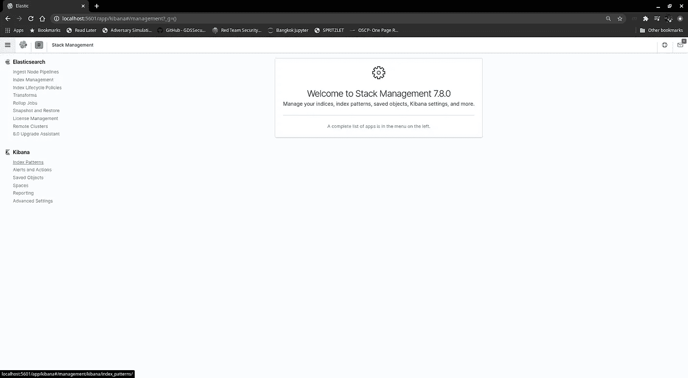

作者图片

3.创建索引

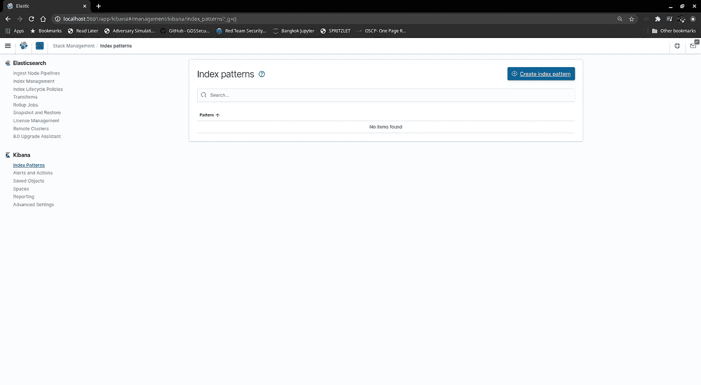

作者图片

4.匹配索引模式

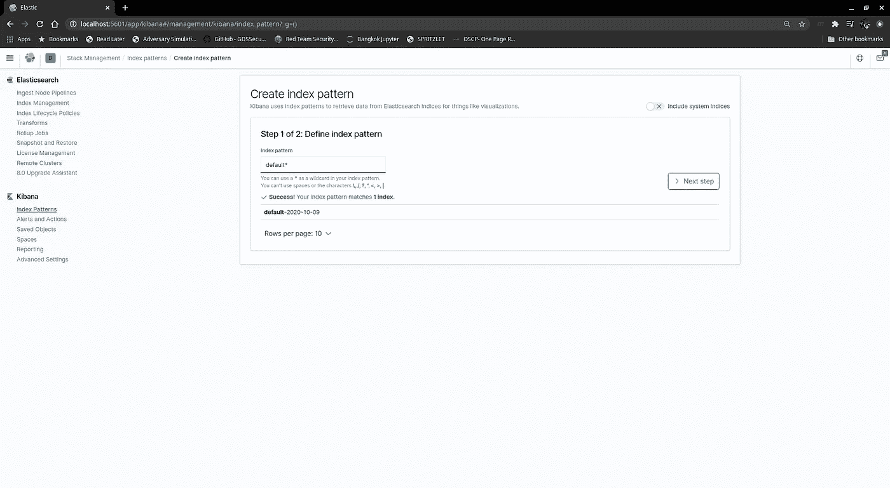

作者图片

5.键入“默认*”

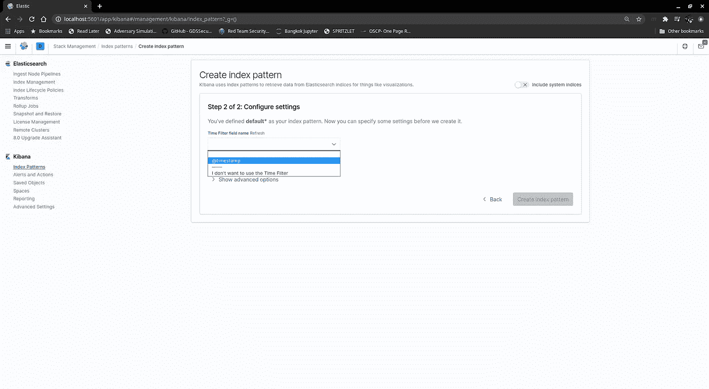

作者图片

6.按“@时间戳”排序

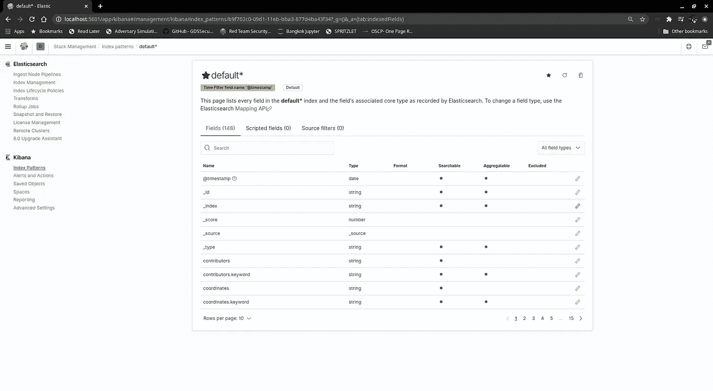

作者图片

鳍状物

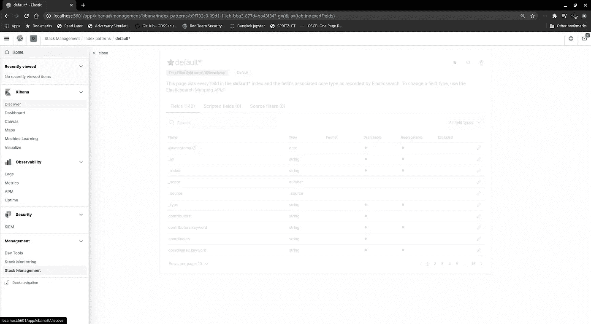

作者图片

单击发现

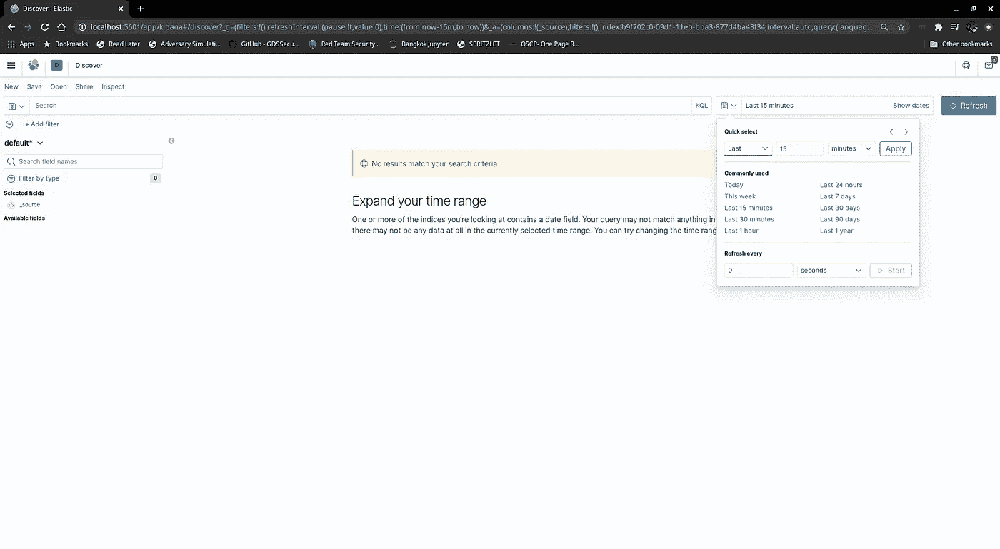

作者图片

选择“本周”

我们试图回答的最初问题是:

*   特定搜索词被转发最多的是哪些？(追踪话题热度)
*   有多少独立用户在推特上谈论一个给定的搜索词？(是趋势吗？)
*   他们还发布了哪些关于搜索词的推文？(他们是巨魔/机器人吗？)
*   这个人在搜索词上有多少个赞？(趋势/感悟)？

浏览“可用字段”时，以下字段似乎很有趣:

*   全文 _ 文本
*   语言
*   转发次数
*   用户创建于
*   用户屏幕名称
*   用户 _ 关注者 _ 计数
*   用户 _ 朋友 _ 计数
*   用户 _ 状态 _ 计数
*   用户创建于

我添加了 lang 字段，这样我可以在以后计算出每种“语言”的情感比率。目前，我正在过滤非英语。

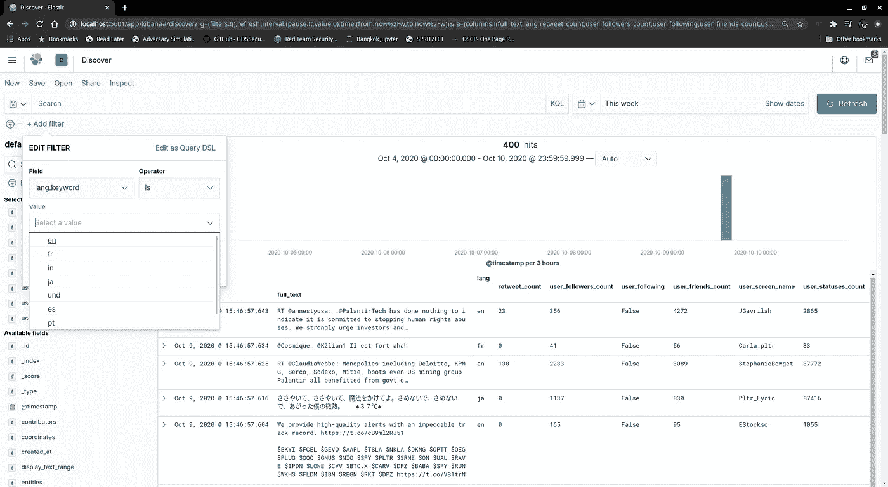

作者图片:仅过滤英语

仅过滤英语将我的样本从 400 个减少到 262 个。

浏览全文，我看到有一堆转发，我想把它们聚合成 1 条。统计数据显示，前 5 个值是转发量，占 262 条推文的 X%。我们看到转发量最高的占 19.1%。让我们来探索一下。

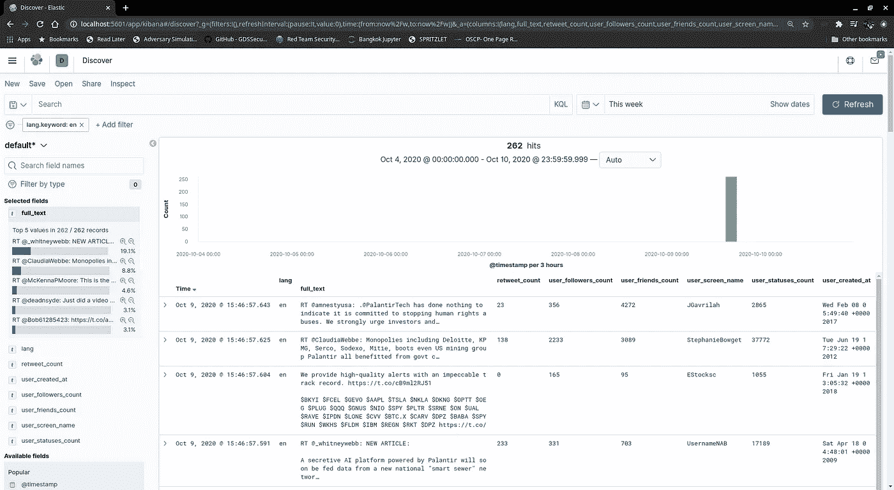

作者图片

我变得超级兴奋，因为我认为这是那么容易，并找到了所有的机器人。然而，仔细一看。retweet_count 不是 user_screen_name 转发的次数。而是全文被转发的次数。

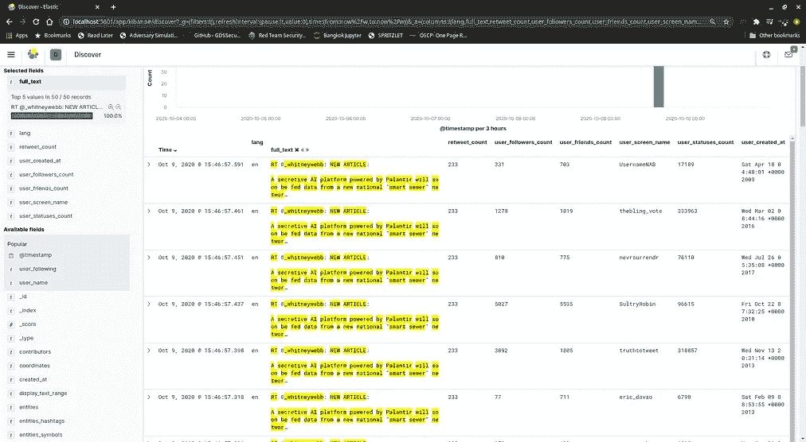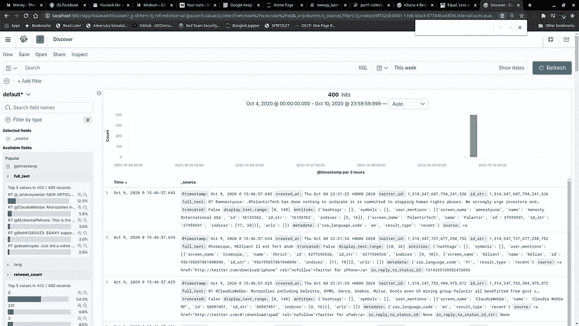

作者提供的图片

## 特定搜索词被转发最多的是哪些？(追踪话题热度)

浏览默认字段列表，我们看到:


作者图片

现在，让我们创建一个可视化:

点击:

**>【创建可视化】>选择“数据表”>选择要在“默认*”中查找的索引>单击“添加桶”>【拆分行】>选择聚合>术语:
-字段:full_text.keyword
-将大小从 5 更改为 25**

**点击">更新"**

****

**作者图片**

****问题的答案是:“RT**[**@ _ Whitney Webb**](http://twitter.com/_whitneywebb)**:新文章:一个由 Palantir 驱动的秘密人工智能平台将很快从一个新的国家“智能下水道”网络获得数据，在收集期间有 50 次转发。****

## **有多少独立用户在推特上谈论一个给定的搜索词？(是趋势吗？)**

**我们将通过一个饼图和一个计数器来深入研究这个问题:**

****可视化** >创建新的可视化>指标>默认* >指标>聚合:唯一计数>字段:用户屏幕名称.关键字>保存可视化**

****可视化** >创建新的可视化>饼图>桶:拆分切片>聚合:术语>字段:user_screen_name.keyword >大小 10**

****可视化** >创建新的可视化>行>指标(Y 轴):计数
桶(X 轴):聚合:术语>字段:user_screen_name.keyword >大小 10**

**现在我们有了可视化效果，我们可以创建一个仪表板:**

**创建新仪表板:
-添加所有可视化效果**

**搜索“一个由 Palantir 驱动的秘密人工智能平台将很快从一个新的国家获得数据”**

**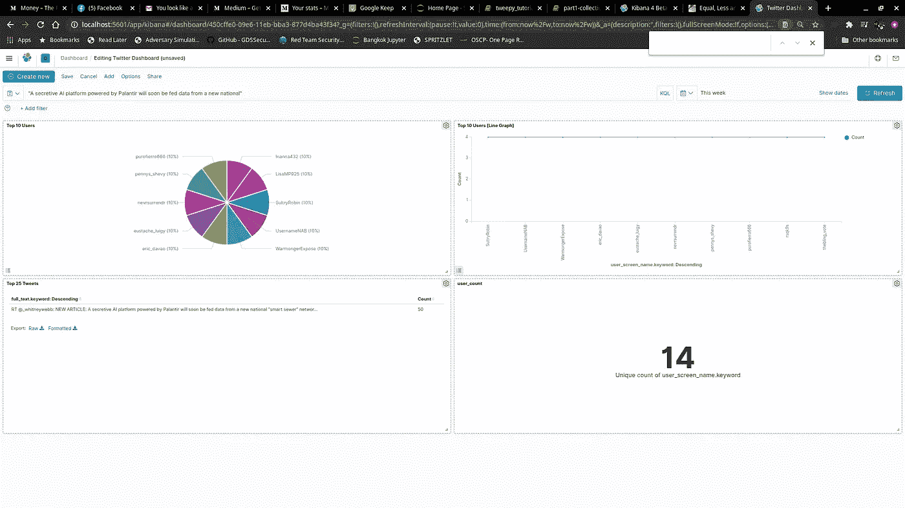**

**作者图片**

**答案是在这段时间内，有 14 个不同的用户转发了同一条消息。他们发微博的次数一样多(4)，也许他们是机器人？**

# **他们还发布了哪些关于搜索词的推文？(他们是巨魔/机器人吗？)**

**因为我们已经有了可视化和仪表板设置，所以我们只需将搜索标准修改为:**

```
"purofierro666" OR "pennys_shevy" OR "nevrsurrendr" OR "eustache_luigy" OR "eric_davao" OR "Inanna432" OR "LisaMP925" OR "SultryRobin" OR "UsernameNAB" OR "WarmongerExpose"
```

**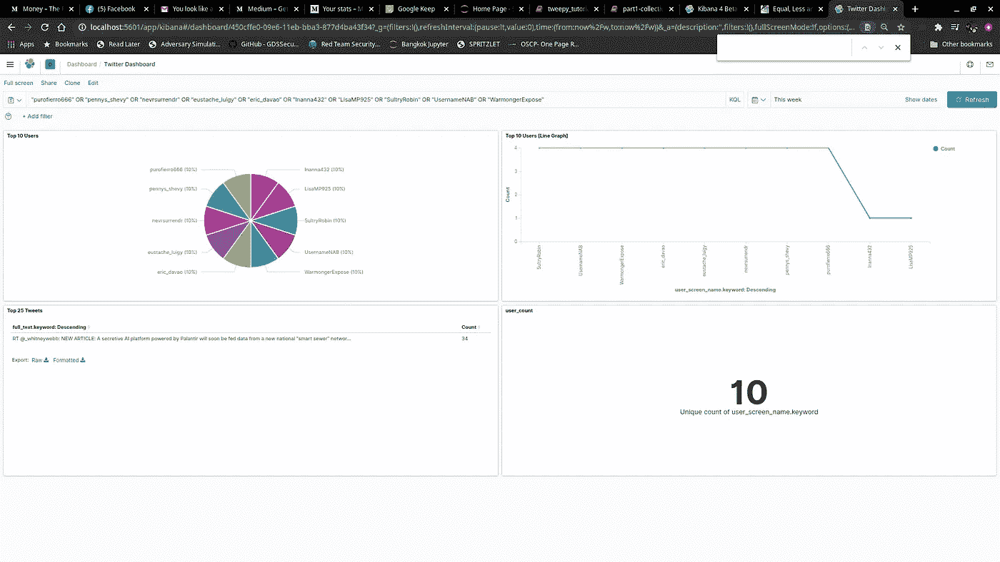**

**作者图片**

**都是一样的转发。但是有几件事我们必须记住:**

1.  **我们的收集脚本只获取搜索关键字，没有其他的，如果用户没有关于搜索关键字的 tweet，我们不会拿起它。**
2.  **我的搜索时间范围很窄，我只收集了相隔几分钟的 100 条推文。**
3.  **我不得不摆弄#tweet 计数。据报道，用户发了 4 条微博，但我似乎找不到它。**

****我仍然会将此列为未回答，因为我们收集脚本的限制以及我们处理的方式****

# **这个人在搜索词上有多少个赞？(趋势/感悟)？**

**查看这些数据，看起来我必须调整脚本来接受额外的元数据。这个问题仍然没有答案。这甚至可能不相关。我添加这个问题是为了检测潜在的僵尸工具，并对僵尸网络进行链分析。但我不知道这是否会如我所愿。**

# **离别的思绪**

**在我最初的问题中，我能够明确地回答我所在时间段的 4 个问题中的 2 个。我发现我遗漏了一些我可能需要的字段，并且一些问题可能不相关。一旦我建立了可视化和仪表板，我可以修改搜索参数，所有的可视化将更新。Kibana 可以快速有效地可视化数据。**

**第 2b 部分将回到脚本，看看我们可以修改和调整哪些内容，以获取更多信息并进一步丰富记录。**