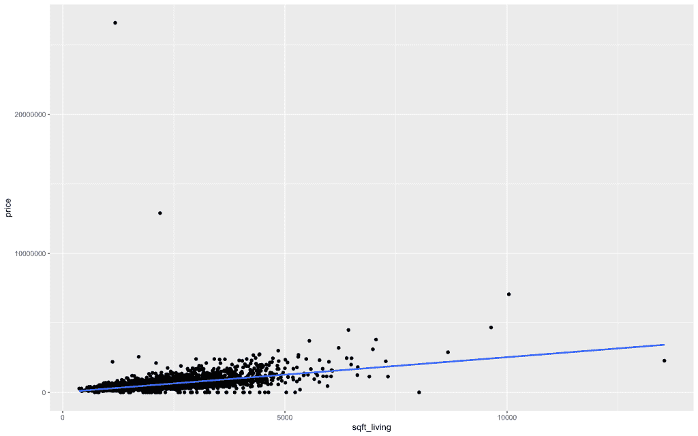
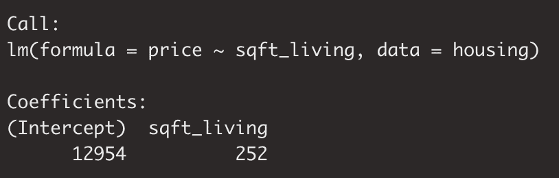
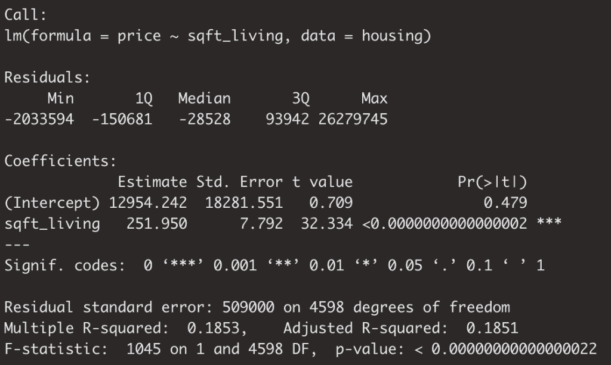
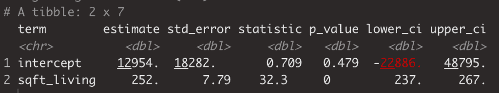

# 在几分钟内构建、评估和解释您自己的线性回归模型

> 原文：<https://towardsdatascience.com/build-evaluate-and-interpret-your-own-linear-regression-model-in-minutes-e6a3e8253501?source=collection_archive---------42----------------------->


图片来自[皮克斯拜](https://pixabay.com/?utm_source=link-attribution&utm_medium=referral&utm_campaign=image&utm_content=1555348)的[马丁·温克勒](https://pixabay.com/users/Fotoworkshop4You-2995268/?utm_source=link-attribution&utm_medium=referral&utm_campaign=image&utm_content=1555348)

# 线性回归简介

回归是我们作为数据科学家利用的这么多统计分析和机器学习工具的核心。

简而言之，我们利用回归技术通过 X 的某些函数来模拟 Y。导出 X 的函数通常严重依赖于线性回归，并且是用户解释或预测的基础。

让我们深入研究一下，用一些数值解释变量，x，来模拟一些数值变量 Y。

# 带有数字解释变量的回归

我从 kaggle 下载了一份房价数据。你可以在这里找到:【https://www.kaggle.com/shree1992/housedata/data】T4

下面你会看到一个房子的居住面积和价格之间的散点图。

除了散点图之外，我还画了一条回归线。稍后会有更多的介绍。

```
housing %>%
    ggplot(aes(x = sqft_living, y = price)) +
    geom_point() +
    geom_smooth(method = "lm", se = FALSE)
```



上面你可以看到这两个数据点确实是相关的，但是你也会注意到趋势线正好穿过这些数据点的中间。

让我们谈谈回归是如何工作的，在这种情况下，普通最小二乘回归(OLS)是如何工作的。

我们现在看到的是一条线，一条有 y 轴截距和斜率的线。说到斜坡，你也可以想到上升超过运行！

现在我想强调的是，有一个目标函数决定了这条线的位置。

线将被放置在离线和周围数据点的绝对距离最小的地方。换句话说，如果你把 y 轴截距提高一点，或者增加直线的斜率，那么实际值和预测值之间的绝对距离就会增加。因此，有理由将线放在组的正中间，那里误差最小。

# 相关性与因果性

现在，我们已经观察到了两个正相关的变量之间的关系。

说了这么多，我们能得出 x 导致 y 的结论吗？肯定不是！如果你从大学的统计数据中记住了这一点，给自己一个鼓励。显然，可能有许多其他因素在起作用。

为了调用通用建模框架的概念，当我们构建一个线性模型时，我们正在创建一个线性函数或一条*线*。

这条线的目的是让我们解释或预测。

无论是哪种情况，建模一条线都需要一个 y 截距和一个斜率。

在另一篇文章中，我谈到一般的建模框架是 Y 作为 X+ε或误差的函数。(这里可以找到通用建模框架[更详细的解释)。在直线方程的情况下，你可能会问自己ε在哪里……情况是，我们不在直线方程或线性函数中表示ε，因为模型的唯一目的是捕捉*信号*，而不是噪声。](/do-you-know-the-general-modeling-framework-c422f866a2dc)

# 解释您的回归模型输出

我们将首先运行 r 中的`lm`函数。该函数构建一个简单的线性模型，由您传递给它的公式决定。

y ~ x，或者在这种情况下，价格是生活平方英尺的函数。

```
fit <- lm(price ~ sqft_living, data = housing)
```



你可以在上面的输出中看到我们的调用，还有这个系数部分。

这一节突出了我们直线方程。y 截距是 12954，我们的解释变量的系数是 252。解释该系数的方式是，`sqft_living`每增加 1 个单位，我们应该看到`price`增加 252 个单位。

我的房子大约 3000 平方英尺，所以根据这条线的等式，如果你把我在西雅图的房子拆了，我们预测它的价值是 12，954 美元+252 美元*3000 美元= 768，000 美元…不用说，所有这些数据都是基于房地产市场的…我的房子远没有那么值钱。

有了这个例子，我们需要记住的一点是，我们可以依靠斜率或系数来量化 x 和 y 之间的关系。

# 深入你的回归输出

我们将更深入地探究你的线性模型的本质。我们将通过几种不同的方式来实现，但第一种方式是使用 r 中的经典`summary`函数

```
summary(fit)
```

通过如此简单的调用，我们得到了下面的回归输出。



我们从头开始吧！

首先，这个电话是有意义的。我们在残差中得到了一些统计数据，换句话说就是误差，但我们现在想深入研究一下。

接下来，我们看到的系数与之前看到的略有不同。

我想向你们指出的几件事是 R 平方和 p 值的概念……这是最常被误用的两个统计学术语。

r 平方定义为可以用 x 的变化来解释的 Y 的变化量。

p 值是统计显著性的传统度量。这里的关键要点是，p 值告诉我们给定输出可能只是随机噪声的可能性。换句话说，给定事件随机发生的可能性为 5%或更小，因此具有统计学意义。

另一个类似的输出是将我们的模型传递给`moderndive`包中的`get_regression_table`。

```
get_regression_table(fit)
```



`get_regression_table`作为模型的快速包装器，能够方便地显示关于我们模型的一些更重要的统计数据。

# 结论

希望这被证明是对线性回归的有用介绍。如何构建以及如何解读它们。

# 概述

今天我们有一个速成班，内容如下:

*   可视化 Y 和 X 之间的关系
*   向我们的 Y & X 可视化添加回归线
*   构建线性回归模型
*   通过 p 值或 Y 中的变化量来理解其统计显著性，从而评估所述模型，我们可以通过 x 中的变化来解释。

如果这是有用的来看看我在 datasciencelessons.com 的其余职位！一如既往，祝数据科学快乐！