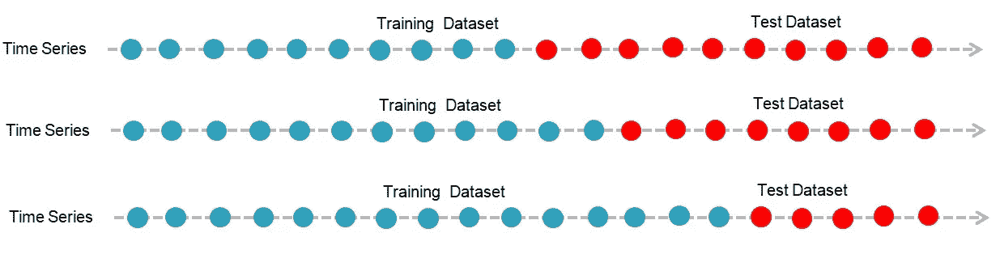
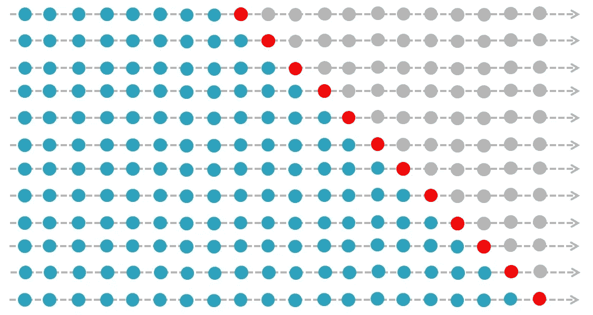
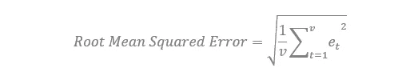

# 构建预测模型的评估框架

> 原文：<https://towardsdatascience.com/build-evaluation-framework-for-forecast-models-fbc1bd775edd?source=collection_archive---------17----------------------->

## 时间数列预测法

## 关于使用 Python 预测性能指标的教程

# 背景

任何时间序列预测模型的目标都是做出准确的预测。流行的机器学习评估技术，如训练测试分割和 k-fold 交叉验证，在当前形式的时间序列数据上不起作用。正如我们在之前的[文章](/time-series-forecasting-968192b3781a)中所讨论的，时间序列数据期望观察值之间的顺序依赖，而在其他机器学习数据集中，所有观察值都被平等对待。

在本教程中，我们将探讨应用于时间序列数据的各种评估技术。

# 目录

1.  数据划分
2.  常见的预测准确性衡量标准
3.  天真的预测或持续模型
4.  可视化残差

首先，让我们下载下面的数据集，打开一个 Jupyter 笔记本，并导入这些 python 库。

数据集— [航空公司—乘客. csv](https://jovian.ml/ajaytiwari-isb/time-series-model-evaluation-46ffd/v/1/files/airline-passengers.csv)

# 1.数据划分

乍一看，我们可能认为最好是选择一个模型，该模型根据我们用来训练模型的现有数据生成最佳预测。当我们将该模型部署用于业务时，我们观察到预测准确性显著降低。这种情况也被称为过度拟合，这意味着模型不仅拟合数据的[系统](/time-series-forecasting-968192b3781a)成分，还拟合噪声。

因此，预测的准确性只能通过测量拟合模型时未使用的新数据的性能来确定。

我们可以通过数据划分来解决这个过度拟合问题，这是应用任何预测方法之前的一个重要的初步步骤。

在机器学习问题中，我们通常将数据分为训练集和测试集，其中训练数据集用于构建模型，测试数据集用于评估模型性能。我们还使用这种分割的高级版本，称为 k-fold 交叉验证，其中我们系统地将数据分成 k 个组，每个组都有机会评估模型，该模型是使用剩余的 k-1 个组开发的。

这些方法不能像其他机器学习问题一样直接用于时间序列数据，这意味着我们不能随机地将数据集分成训练组和测试组。相反，我们必须将序列分成两个时间段，以保持序列的时间顺序。

使用历史数据评估时间序列预测也称为回溯测试。让我们用我们的“航空公司-乘客”数据集来讨论这些方法。

## 单列车-测试分离

我们可以将数据集分为训练子集和测试子集，模型可以在训练数据集上开发，其性能可以在测试数据集上评估。这可以通过基于可用时间序列的长度选择连续观察的分割点(例如 60:40、70:30 或 80:20)来完成。

例如，如果我们有一年的月度数据，并且我们想要 66.66:33.33 的分割，则前 8 个月可以用作训练，后 4 个月可以用作测试数据集。

让我们通过以下示例来理解这一点，总共有 20 个时间段，前 15 个(蓝点)可用于训练模型，后 5 个(红点)可用于验证预测准确性。

单一列车-测试分割示例

这种训练测试比例根据您的数据和业务需求而变化，围绕这种划分没有固定的规则。只是我们必须确保手头有足够的数据来训练模型。

Python 可以帮助我们快速地将这个数据集分成训练和测试子集。我们可以将拆分点指定为数组中的百分比，将拆分点之前的所有观察值作为训练数据集，并将从该点到系列末尾的所有观察值作为测试数据集。

让我们使用不同的颜色在线图上可视化这种分割，训练数据集和测试数据集分别用蓝色和橙色显示。

## 多重训练-测试分离

我们可以将时间序列分成多个训练和测试数据集，以训练一个集合模型来进行更稳健的估计。这种方法需要使用各自的拆分来开发多个模型。这可以通过重复上述过程来手动完成。

例如，我们有一个在 20 个时间段有 20 个观察值的数据集，我们可以创建如下 3 个不同的训练测试分割。

> 50:50(各 10 次观察)
> 
> 60:40 (12 次和 8 次观察)
> 
> 75:25 (15 次和 5 次观察)

多重训练-测试多重分割示例

这些分割可用于构建 3 个不同的模型，输出可被平均以获得稳健的预测。

在 Python 中，sci-kit-learn 库可以帮助我们使用它的 TimeSeriesSplit 函数来创建多个拆分，只需要我们指定拆分的数目。

根据 [sci-kit-learn](https://scikit-learn.org/stable/modules/generated/sklearn.model_selection.TimeSeriesSplit.html) 官方页面，在每个分裂迭代(I)中，训练和测试观察的总数计算如下:

Train_size= `i * n_samples // (n_splits + 1) + n_samples % (n_splits + 1)`

Test_size= `n_samples//(n_splits + 1)`

其中“n_samples”是观察的总数，“n_splits”是分裂的总数。假设我们有 100 个观察值，想要创建 3 个分割。

让我们应用上述算法来计算训练和测试数据集的大小。

train _ size _ 1 = 1 * 100/(3+1)+100 mod(3+1)= 25

测试大小 1 = 100/(3+1) = 25

train _ size _ 2 = 2 * 100/(3+1)+100 mod(3+1)= 50

测试大小 2 = 100/(3+1) = 25

train _ size _ 3 = 3 * 100/(3+1)+100 mod(3+1)= 75

测试大小 3 = 100/(3+1) = 25

现在，我们可以在“航空公司-乘客”数据集上实现 TimeSeriesSplit 函数，并对数据集进行分区。数据集有 144 个观察值，我们想要 3 个不同的分割。根据上述计算，我们预计在各自的分割中会有以下数量的观察值。

分流 1: 36 列车，36 测试

分裂 2: 72 火车，36 测试

拆分 3: 108 次列车，36 次测试

我们可以看到，在每次拆分中，观察结果的数量都符合我们的预期。

## 时间序列交叉验证

训练和测试分割的一个更复杂的版本是时间序列交叉验证，这也称为前推验证，因为它涉及一次一个时间步长地沿着时间序列移动。这种方法提供了在每个时间步进行预测的最佳机会。

让我们在下面的例子中看看数据集的不同分割是如何随着时间序列向前移动的。

向前走验证示例

预测准确性是通过对测试集进行平均来估计的。在创建这个验证框架之前，我们必须决定我们对哪些历史观察感兴趣。

> 首先，我们必须决定训练我们的模型所需的最少观察次数，即窗口宽度。
> 
> 接下来，我们必须决定我们是想要一个[滑动](/time-series-forecasting-968192b3781a)窗口(最近的观察)还是一个[扩展](/time-series-forecasting-968192b3781a)窗口(所有的历史观察)。

在决定了这些需求之后，现在让我们在“航空公司-乘客”数据集上实现这个分割方法。

我们可以看到更多的分裂被创造出来，我们可以训练同样多的模型。同样，这将有助于我们提供更可靠的评估。向前走方法被认为是最好的模型评估方法，这也被称为时间序列世界的 k-fold 交叉验证。

# 2.常见的预测准确性衡量标准

任何时间序列预测模型的目标都是做出准确的预测，但问题是我们如何衡量和比较预测的准确性。因此，作为初步要求，我们必须定义一个合适的性能指标来衡量预测的准确性。

有许多不同的绩效衡量标准可供选择，在这一部分，我们将讨论一些流行的衡量标准。

## 预测误差

考虑一个具有“v”个时间段的验证数据集，t=1，…v。预测误差(eₜ)定义为某个时间段(t)的观测值(xₜ)and)与预测值(yₜ)之间的差值。

可以计算每个预测的预测误差，让我们看看如何在 Python 中计算这个误差。

这是否解决了我们的评价问题？还没有，我们必须将这些误差总结为一个可比较的数字。

让我们讨论几种流行的预测准确性的方法。

## 平均预测误差

平均预测误差计算为预测误差值的平均值。

正如我们所知，预测误差可以是正的，也可以是负的，这种性能度量是以这些预测误差的平均值来计算的，因此一个系列的理想平均预测误差应该是零。误差值远离零被认为是偏差。

让我们看看如何使用虚拟的实际值和预测值在 Python 中手动计算平均预测误差。

## 绝对平均误差

平均绝对误差(MAE)计算为预测误差值的平均值，其中所有预测值都强制为正值。

我们可以在 Pythion 中使用 mean_absolute_error 函数手动计算。

## 平均绝对百分比误差

平均绝对百分比误差或 MAPE 给出了预测值偏离实际值的百分比分数。这对于比较具有不同规模的多个系列的性能非常有用。

sci-kit learn 中没有内置函数，我们可以使用自定义函数来计算这个度量。

## 均方误差

均方差(MSE)是预测误差平方值的平均值。对预测误差值求平方会强制误差为正。因此，这种方法更重视大的误差。

我们可以使用 Python 中 sci-kit learn 的 mean_squared_error 函数来计算这个度量。

## 均方根误差

均方根误差或 RMSE 是均方误差的变换版本。它可以通过计算均方误差值的平方根来计算。

在 Python 中，这可以通过对上面计算的均方误差使用数学库的 sqrt()函数来计算。

# 3.天真的预测

我们已经将数据集划分为训练和测试子集，还定义了评估模型的理想性能指标。现在，我们已经准备好开始建模练习，我们可以选择任何可用的高级算法来建模时间序列。

但是，我们怎么能相信这个模型的预测准确性呢？我们心目中有什么基准精度吗？

让我们建立一个基准预测性能，在评估不同技术的性能时，我们可以将它作为一个参考点。如果模型的准确性等于或低于基线，我们可以改进模型，如果我们不能达到预期的准确性，我们可以探索其他技术。

时间序列预测最常用的基线方法是简单预测，这只是预测时可用的序列的最新值。naive 算法使用当前时间步长(t)的值来预测下一个时间步长(t+1)的预期结果。

让我们用 Python 实现一个简单的预测。

## 将时间序列数据重构为监督学习数据集

让我们将我们的“航班-乘客”数据集转化为一个监督学习问题，我们可以通过创建一个滞后特征来实现这一点。在这个变换的数据集中，(t)处的值是预测值(X)，而(t+1)处的值是目标变量(Y)。

我们必须丢弃第一行，因为它没有任何输入值。

## 创建培训测试分解

接下来，我们可以将数据集分为训练和测试子集，如下所示。70%的系列创建为培训，30%创建为测试子集。

## 做出天真的预测

建立一个基线模型是相当简单的。我们知道 naive 算法使用当前时间步(t)的值来预测下一个时间步(t+1)的预期结果。因此，在数据集的转换监督版本中，第一列是对第二列的预测。我们必须丢弃数据集的第一行，因为它没有任何输入值。

## 预测和评估预测

最后一步，我们可以在测试数据集上评估我们的基线模型。在这种情况下，不需要模型训练或再训练，我们知道第一列是预测，第二列是实际数字。我们一步一步地遍历测试数据集并得到预测。

我们可以观察这个预测的折线图，它用蓝色显示训练集，用绿色显示测试集，用红色显示预测。

观察线图，我们可以看到测试数据集上的一个不错的预测。当我们探索其他先进的技术时，我们必须保持或提高这种准确性。

# 4.可视化和分析残差

我们已经准备好基线模型，现在是时候使用预测误差来调查拟合优度了。时间序列问题上的这些误差称为残差或剩余误差。分析我们模型的残差可以解释很多关于我们预测的事情，甚至提出改进建议。

让我们在同一数据集上重新计算我们的天真预测的残差，以便在本节中进一步探讨。

我们可以看到前五个预测错误的示例输出。让我们把这些数字形象化，以获得有意义的解释。

## 剩余线图

第一个图是以线形图的形式观察残差随时间的变化。如果模型拟合得很好，我们不会期望任何趋势和循环行为，图应该在值 0 附近是随机的。

我们仍然可以在线图中观察到循环行为，这表明模型中存在改进的空间，可以通过更好的功能工程和探索其他高级模型来实现。

## 剩余汇总统计

接下来，我们可以分析残差的汇总统计数据。首先，我们感兴趣的是残差的平均值。接近零的值表示预测中没有偏差，而正值和负值表示预测中有正偏差或负偏差。

汇总统计数据也表明模型中存在正偏差。

## 残差直方图和密度图

这些图可用于更好地理解汇总统计之外的误差分布。我们希望预测误差正态分布在一个零均值附近。绘图有助于发现这种分布的偏斜。我们可以使用直方图和密度图来更好地理解残差的分布。

可以清楚地观察到残差不是正态分布的，而是负偏态的。这再次证实了我们的模型需要改进。

## 剩余 Q-Q 图

这也称为分位数图，可用于检查残差分布的正态性。对这些值进行排序，并与散点图上的理想化高斯分布进行比较。我们希望所有的点都与对角线重叠，以确认两个分布之间的完全匹配。

我们可以在 Q-Q 图上看到一些凸起和异常值，需要对它们进行校正，以实现更好的预测。

## 剩余自相关图

自相关解释了观测值和先前时间步的观测值之间的关系强度。我们不期望残差之间还有任何相关性。让我们计算并绘制残差的自相关。

我们可以看到残差中仍然存在自相关，这验证了我们的发现，即模型需要在特征工程和算法选择方面进行改进。

# 摘要

在本文中，我们讨论了构建一个健壮的评估框架的所有重要技术。我们从数据划分开始，然后讨论了各种可供选择的性能指标，建立了一个持久性预测模型作为提高准确性的基准，最后了解了使用残差进行模型调查。

经过数据准备(在我的[上一篇](/time-series-forecasting-968192b3781a)文章中有所涉及)并有了一个健壮的评估框架，现在我们完全准备好探索各种预测技术。在接下来的几篇文章中，我将讨论不同的预测技术，我将从经典技术开始。

感谢阅读，希望你发现这篇文章内容丰富。

# 参考

[1] Galit Shmueli 和 Kenneth Lichtendahl，实用时间序列预测与 R:实践指南，2016 年。

[2]杰森·布朗利，【https://machinelearningmastery.com/ 

[3][https://sci kit-learn . org/stable/modules/generated/sk learn . model _ selection。TimeSeriesSplit.html](https://scikit-learn.org/stable/modules/generated/sklearn.model_selection.TimeSeriesSplit.html)