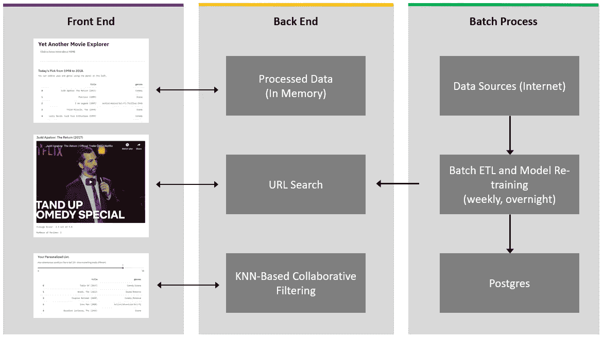
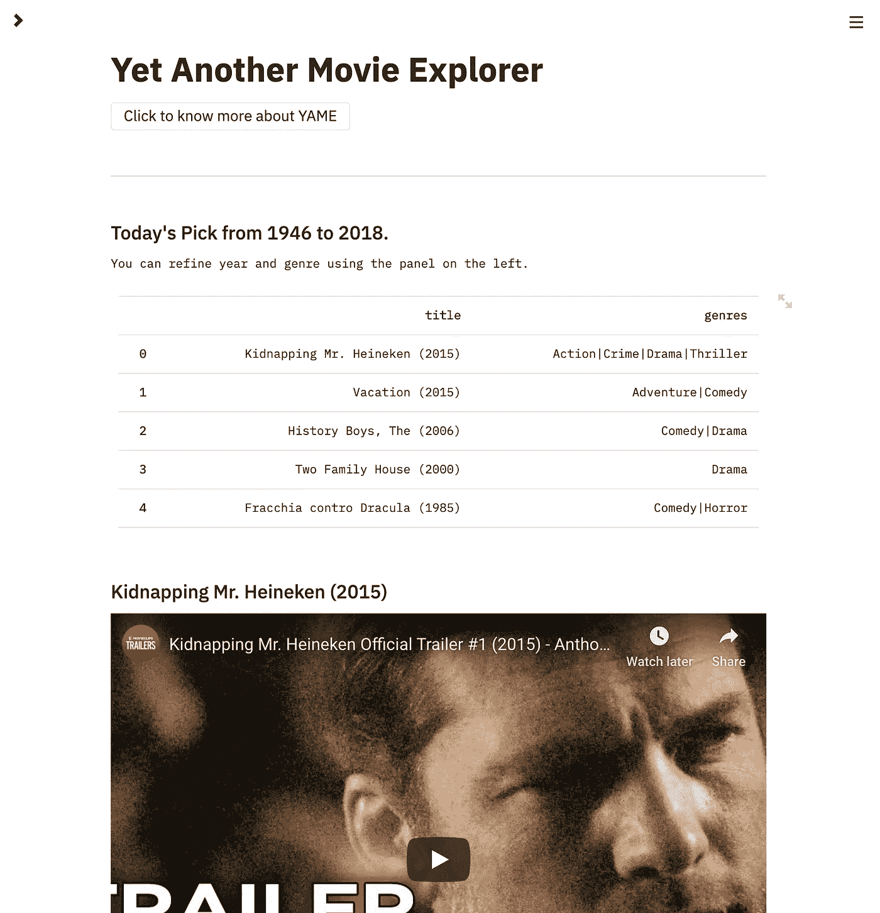
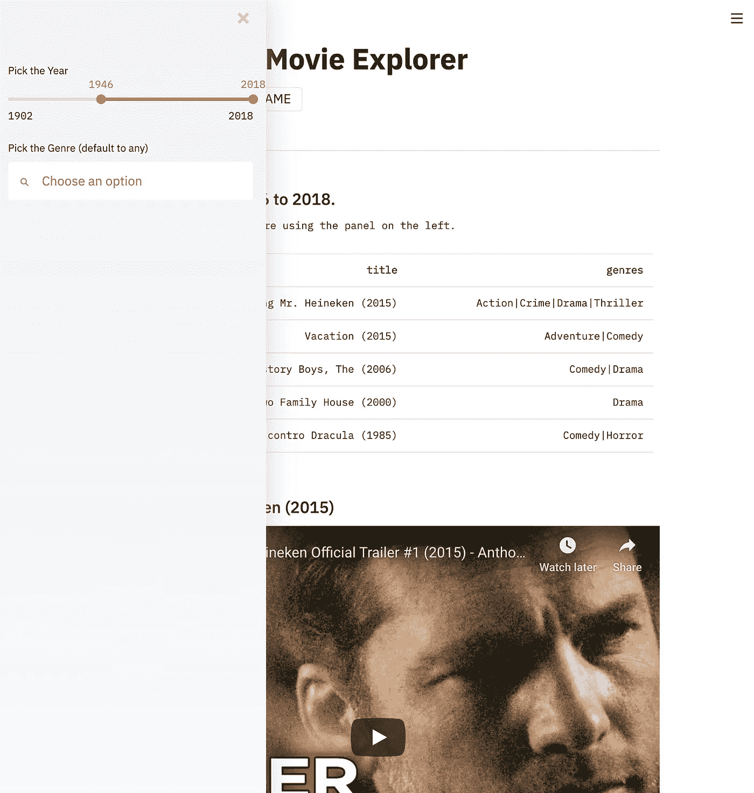
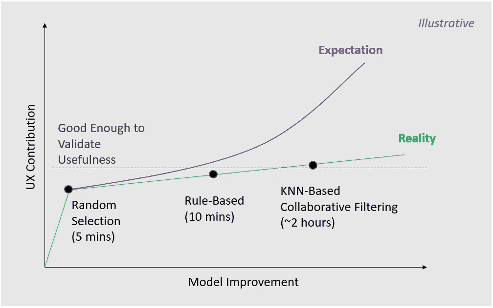
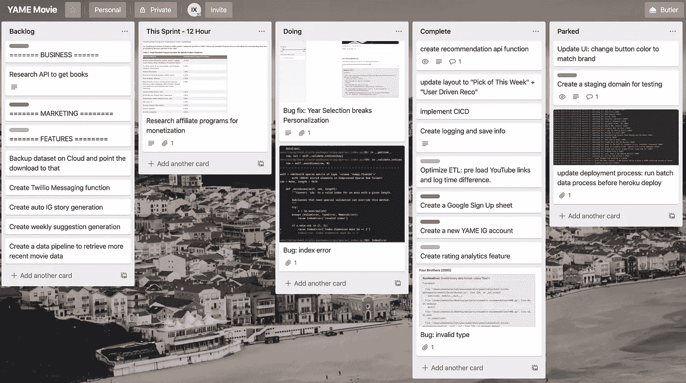

# 12 小时 ML 挑战

> 原文：<https://towardsdatascience.com/build-full-stack-ml-12-hours-50c310fedd51?source=collection_archive---------2----------------------->

## 如何使用 Streamlit 和 DevOps 工具构建和部署 ML 应用程序

克拉克·蒂布斯在 [Unsplash](https://unsplash.com/s/photos/neon?utm_source=unsplash&utm_medium=referral&utm_content=creditCopyText) 上拍摄的照片

**TL；在这篇文章中，我想分享我完成 12 小时 ML 挑战的学习、过程、工具和框架。希望对你的个人或专业项目有所帮助。**

以下是帮助您导航的目录:

*   **第 1 部分**:找一个好问题
*   **第 2 部分**:定义约束条件
*   **第三部分**:思考，简化，&分清主次
*   **第四部分**:冲刺规划
*   **第五部分**:App
*   **第 6 部分**:经验教训
*   **奖励**:懒惰程序员的过程&工具

***免责声明:*** *这不是由 Streamlit、我提到的任何工具或我工作的任何公司赞助的。*

***喜欢读什么？*** *跟我上* [*中*](https://medium.com/@ianxiao)*[*LinkedIn*](https://www.linkedin.com/in/ianxiao/)*[*Twitter*](https://twitter.com/ian_xxiao)*。查看我的《* [*对机器学习的影响*](https://www.bizanalyticsbootcamp.com/influence-with-ml-digital) *》指南。它有助于数据科学家更好地交流。***

# **第一步:找一个好问题(圣诞节问题)**

**[吉菲](https://media.giphy.com/media/3ohhwwY2tXZvAmVq5a/giphy.gif)**

**嗯，圣诞节。过去，每年的这个时候，我都会和妻子、小狗一起坐在沙发上，疯狂地看电影和电视剧。**

**然后，这个圣诞节。有些事情改变了。出于某种原因，我在网飞或 YouTube 上找到的大多数东西似乎都很无聊。也许我通过观看推荐算法推送的类似内容，已经达到了零[效用收益](https://www.investopedia.com/terms/u/utility.asp)的临界点。太了解我的算法了(可能太了解了)。**

**[吉菲](https://media.giphy.com/media/JQtjrjz75ttYY/giphy.gif)**

**我意识到了一个**问题**:我被太了解我的推荐算法困住了——[我被数字化囚禁了](/how-to-design-search-engines-24e9e2e7b7d0)(本帖采取的是更具设计感的镜头)。**

**我似乎找不到*内容气泡*之外的东西。算法认为我感兴趣的一切都逐渐变得无趣；真是讽刺。我想出去！**

****重点是这个**:找一个够烦的问题。它不一定是治愈癌症或消除饥饿(如果你可以，太棒了！)，只要是足够有意义的事情，让你愿意去承诺，去开始。**

# **步骤 2:定义约束(12 小时挑战)**

**在我的朋友 Matt Pua 的 web 应用程序开发的 48 小时挑战的启发下，我决定做一些类似的事情，但是是针对有 ML 组件的应用程序。简而言之，限制因素如下:**

*   **约 12 小时的总工作时间；它们不必是连续的小时**
*   **必须为除我之外的用户提供一个可用且稳定的应用程序**
*   **必须有一个 ML 组件，但没有不必要的复杂性**
*   **必须与他人分享工作和学习成果(也就是写这篇文章)**
*   **(这种体验一定很有趣)**

**为什么要有截止日期？据马特:**

> **…设定最后期限让个人专注于**优先考虑**他们需要**关注**的事情，以便让他们的项目进入可行状态。个人必须考虑到设计一个项目、提出解决方案、处理任何不可预见的技术问题以及这两者之间的一切，以便在截止日期前完成项目。**

***(那么，为什么只有 12 小时，而不是 48 小时呢？我不像马特那么紧张。如果你决定这样做，选择一个最适合你的时间框架，并坚持下去。重点是执行和出货。)***

**以下是我对所有相关工作的大致时间预算:**

*   ****2 小时:**对 app 有一个大致的设计(如研究、UX、架构)。**
*   ****8 小时:**重新设计，构建，迭代测试 app。**
*   ****2 小时:**撰写、编辑、发表这篇文章(还有[这个](/how-to-design-search-engines-24e9e2e7b7d0))。**

# **第三步:思考，简化，区分优先次序，然后重复**

**在编码之前，我需要解决几个重要的问题，1)明确我到底需要构建什么，2)在 12 小时内优先构建什么。尽管不是详尽无遗的，以下是一些指导性问题:**

**戴上**的产品帽子**，谁是用户？用户想要什么，需要什么？不同细分市场的需求有何不同？应该先针对哪个用户群？满足需求的功能有哪些？…**

**戴上**数据科学的帽子**，我需要什么数据并且这些数据是可用的？我需要商业智能分析还是预测模型？我应该使用什么业务和模型指标？我如何衡量绩效？…**

**[吉菲](https://media.giphy.com/media/l1J9NRpOeS7i54xnW/giphy.gif)**

**戴上**设计师帽子**，app 需要触发什么情绪？我应该使用什么配色方案？用户旅程是什么样子的？考虑到这些特性，什么是最好的用户交互？…**

**戴上**工程师帽**，app 一次需要支持多少用户？从开发到部署的过程是什么样的？使用什么技术堆栈可以平衡原型开发速度和可伸缩性？…**

**戴上**商业**的帽子，我如何将应用程序货币化？如何发展和维持应用程序的受众？如何把跑技术和运营的成本降到最低？…**

**[吉菲](https://media.giphy.com/media/LRVnPYqM8DLag/giphy.gif)**

**正如你所想象的，这个练习会很快变得让人不知所措。一定要从试图解决一切的冲动中抽身。**

**最终，这里是我在 8 小时的开发中可以解决的**前三个“用户想要/需要”**和相应的特性:**

*   ****我想要惊喜:**应用程序应该能够建议我以前没有看过的电影或与我正常观看历史不同的电影。>*今日精选&过滤***
*   ****我需要选择:**应用程序应该能够显示一个预告片，并提供一些关于电影质量的信息。>*预告片和评级***
*   **我想控制:应用程序应该提供一个简单的方法，让用户控制如何不同的建议看起来像。 *>“滤镜面板&智能探索”***

**这里有一些我想做的东西，但是**降低了**的优先级:**

*   **用户认证/消息传递**
*   **自动发送电子邮件**
*   **云备份**
*   **多模型推荐**
*   **客户服务机器人**

**考虑到这些特性，下面是解决方案的粗略**架构设计**，关键组件及其交互。**

****

**概念架构图，作者的作品**

***注意:这是一个迭代过程的结果。你开始思考可能看起来很不一样。参见经验教训，了解如何决定构建什么和不构建什么的技巧。***

# **步骤 4:冲刺计划和执行**

**我决定在四次 2 小时[冲刺](https://yodiz.com/help/what-is-sprint/)中建造这个。以下是每次冲刺的大致结果:**

**Sprint 1 :自动化的开发到部署管道；一个简单的可点击的“今日精选”和过滤功能在 Heroku 上提供。**

****冲刺 2** :构建 ETL 一组用于 ETL 的自动化测试用例；改进了 YouTube 预告片的前端&带有虚拟数据的个性化部分。运行时优化。**

****Sprint 3** :为智能探索构建 API。使用虚拟模型与前端集成。建模选项的研究。更多运行时优化。**

****冲刺 4** :重构并优化一个基于 KNN 的协同过滤模型。添加建模测试案例。代码清理和更多优化。**

# **第五步:哒哒。**

**[吉菲](https://media.giphy.com/media/NLW1HZmw04BPO/giphy.gif)**

**AME 出生了。现在你可以在这里使用 YAME****为你的工作日、周末、约会之夜、家庭聚会寻找一些有趣的东西。该应用旨在提供搜索引擎的便利，同时提供控制，而不会让用户负担过重。******

********便利:**登陆页面有五部系统推荐的电影。它每天更新。该算法跨年份、跨流派挑选电影；它试图做到不偏不倚。******

************

******今日精选带拖车******

******一些控制:如果你不喜欢你看到的或者只是想知道那里有什么，你可以使用左边的面板选择年份和流派。******

************

******过滤******

********更多控制而不牺牲便利:**如果你真的想要别的东西，你可以基于*探索你今天用简单的界面感受* 有多“冒险”。这个 UI 允许用户有一个 ***选项来选择*** *。用户可以决定他们想看什么，而不会认知超载。*******

************

******基于 KNN 的协同过滤的智能探索******

# ******第六步:吸取教训******

******安全，快速，懒惰。在其他事情之前自动化测试**。**如果你发现自己定期手动测试某样东西，投资一点时间并自动化它。用 PyTest 和 CircleCI 进行[自动测试省去了很多麻烦。对于一个 ML 应用程序，你应该有两组测试。一个用于](https://www.guru99.com/test-case.html)[软件测试](https://www.guru99.com/test-case.html)(例如单元和集成测试)，另一个用于模型测试(例如最低性能和边缘情况)。拥有动态测试用例(由随机数驱动的输入)也有助于捕捉难以预测的边缘用例中的 bug。******

************

******从开发到部署的工作流程，作者的工作******

******避免卡格尔陷阱。由于我只预算了大约 4 个小时来开发 ML 组件，所以关键是要构建一个足够好的模型来验证 ML 特性的功能和有用性。很容易陷入“Kaggle 模式”的陷阱(例如，花费大量时间构建复杂的模型以获得较小的性能增益)。我用一个**模型——UX 分析**来帮助设定界限。这种分析并不意味着是一种科学练习，而是一种让你远离作弊的工具。******

************

******模型-UX 分析(开发时间)，作者的分析******

*********注*** *:最小模型性能的阈值因用例而异。例如，一个显示使用 GAN* *或欺诈检测的* [*合成人脸的应用程序将很可能需要非常好的模型性能来说服用户其有用性。*](/face-generator-generating-artificial-faces-with-machine-learning-9e8c3d6c1ead)******

******所以，我的策略是从最简单的模型开始:一个由随机数生成器驱动的“模型”。虽然从建模的角度来看这听起来很幼稚，**但是它用最少的开发时间(~5 分钟)**为 UX 增加了最大的价值。用户可以玩个性化功能，这是不存在的。它是否提供“最佳”推荐并不重要，关键是要验证该特性。然后，我将该模型发展为基于规则和基于 KNN 的协同过滤算法。******

******建造是有趣的，优先化却不是。这里有一些让它变得更简单的建议:******

1.  ******从最讨厌的利润问题开始(这个练习不要太在意利润)。******
2.  ******想一个理想的解决方案&预算你需要多少时间来构建它；请记住，你可能会低估，但没关系。******
3.  ******将时间减少到 1/3，重新思考解决方案，看看在没有大量研究的情况下，你是否能放心实施(一些研究仍然有助于学习)******
4.  ******重复，直到范围适合 2 到 4 小时的时间框架******

******如果你喜欢并想支持 YAME，请查看我的 [**Patreon**](https://www.patreon.com/indieml) 页面。支持将用于支付运行和改进 YAME 的费用(如服务器、网站等)。).******

******我希望你喜欢这篇文章。如果你决定接受 12 小时的挑战，我很想看看你的作品。在[**上跟我连线**](https://medium.com/@ianxiao) **，**[**LinkedIn**](https://www.linkedin.com/in/ianxiao/)**，**或者**[**Twitter**](https://twitter.com/ian_xxiao)*。*********

******直到下一次，******

******伊恩******

******[吉菲](https://media.giphy.com/media/l4FGsEzqS8Zz8aOWs/giphy.gif)******

# ******额外收获:懒惰程序员的过程和工具******

******对于任何感兴趣的人(并且到目前为止)，我想要一个尽可能自动化的工作流，这样我就可以把时间花在设计和编码上，而不是做手工测试或移动代码。每个人都有自己的喜好。对我来说，关键是能够快速迭代并准备好扩展。******

******从技术堆栈的角度来看，以下是我选择的工具(也有一些备选方案):******

*   ********Python** 作为通用工作流、ETL 和建模的编程语言。*(可选:SQL 用于 ETL，R 用于建模，Java 用于工作流)*******
*   ******[**Streamlit**](/coding-ml-tools-like-you-code-ml-models-ddba3357eace) 作为前端工具。它基于 python。开箱即用，它附带了用户体验所需的大部分小部件；它是网络和移动友好的。它鼓励我像建模一样关注用户体验。Jupyter 很棒，但我觉得它倾向于让人们陷入 Kaggle 陷阱。*(备选:Flask、Django 或 React 为前端；用于分析和模型实验的朱庇特笔记本)*******
*   ******[**Postgres**](https://www.postgresql.org/) 作为后端数据库工具。*(备选:GCP、AWS、Azure 注意，如果你想遵循相同的设置，SQLite 不能与下面的 Heroku 一起工作)*******

******从 [DevOps](https://en.wikipedia.org/wiki/DevOps) 的角度来看，这里有一些工具:******

*   ******[**PyCharm**](https://www.jetbrains.com/pycharm/) 为 IDE *(可选:* [*崇高*](https://www.sublimetext.com/) *，* [*原子*](https://atom.io/) *)*******
*   ******[**Github**](https://github.com/) 进行代码版本控制*(备选:*[*DVC*](https://dvc.org/)*)*******
*   ******[**PyTest**](https://docs.pytest.org/en/latest/) 用于管理测试用例并运行自动测试******
*   ******[**圆 CI**](https://circleci.com/) 作连续整合部署*(备选:* [*詹金斯*](https://jenkins.io/) *)*******
*   ******[**Heroku**](http://heroku.com) 用于网络托管(备选方案:云解决方案，如 GCP、AWS、Azure 或 Paperspace)******

******如果你像我一样是一个懒惰的程序员，我强烈建议你提前投入时间来建立这个 DevOps 工作流。它节省了手动测试和部署的大量时间。更重要的是，它真的保护你的代码库免受愚蠢的错误。******

******最后，我使用 [**Trello**](https://trello.com/en) ，作为一个简单的[看板](https://www.atlassian.com/agile/kanban)，来跟踪我需要做的事情:******

************

******看板——作者的工作******

*******注:我没有选择替代方案的原因是为了避免过度工程化和不够熟悉，以获得效率增益。*******

********如果你喜欢这篇文章，你可能也会喜欢这些……********

****** [## 最有用的 ML 工具 2020

### 每个懒惰的全栈数据科学家都应该使用的 5 套工具

towardsdatascience.com](/the-most-useful-ml-tools-2020-e41b54061c58)  [## 被遗忘的算法

### 用 Streamlit 探索蒙特卡罗模拟

towardsdatascience.com](/how-to-design-monte-carlo-simulation-138e9214910a)  [## 数据科学很无聊

### 我如何应对部署机器学习的无聊日子

towardsdatascience.com](/data-science-is-boring-1d43473e353e)  [## 我们创造了一个懒惰的人工智能

### 如何为现实世界设计和实现强化学习

towardsdatascience.com](/we-created-a-lazy-ai-5cea59a2a749)  [## ML 和敏捷注定的联姻

### 如何在 ML 项目中不应用敏捷

towardsdatascience.com](/a-doomed-marriage-of-ml-and-agile-b91b95b37e35)  [## 你被解雇了

### 如何发展和管理一个快乐的数据科学团队

towardsdatascience.com](/i-fired-a-data-scientist-a137fca5b80e)  [## 抵御另一个人工智能冬天的最后一道防线

### 数字，五个战术解决方案，和一个快速调查

towardsdatascience.com](/the-last-defense-against-another-ai-winter-c589b48c561)  [## 人工智能的最后一英里问题

### 许多数据科学家没有充分考虑的一件事是

towardsdatascience.com](/fixing-the-last-mile-problems-of-deploying-ai-systems-in-the-real-world-4f1aab0ea10)******