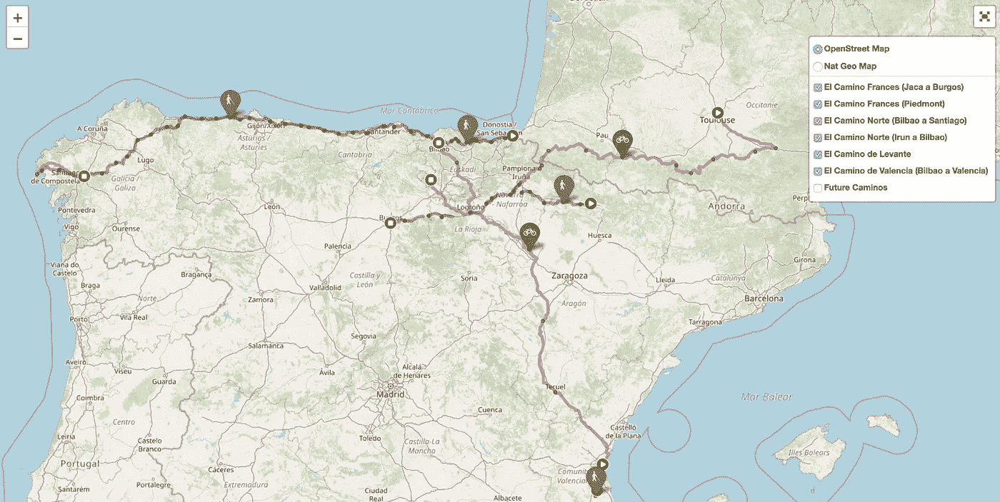
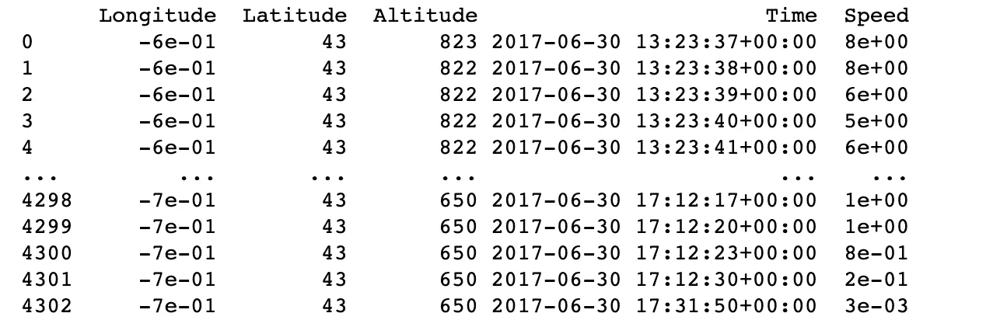
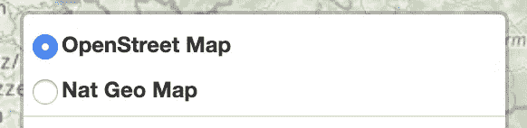
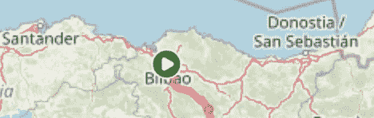
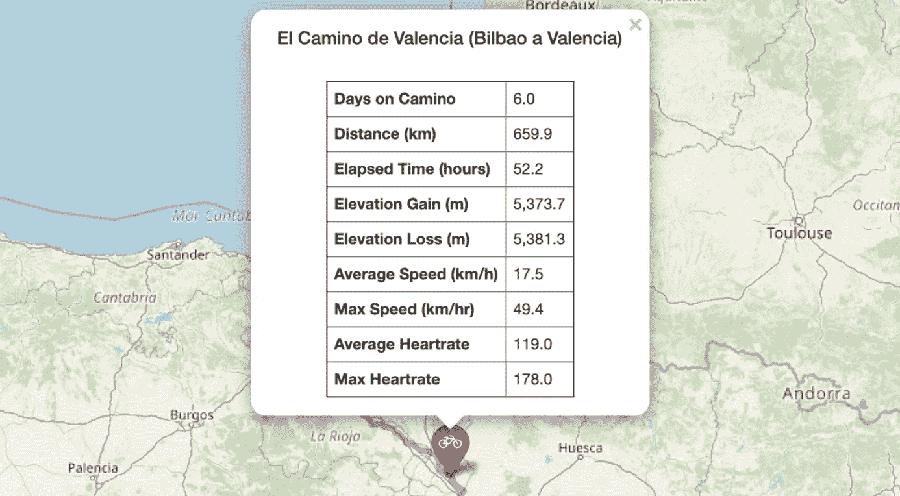
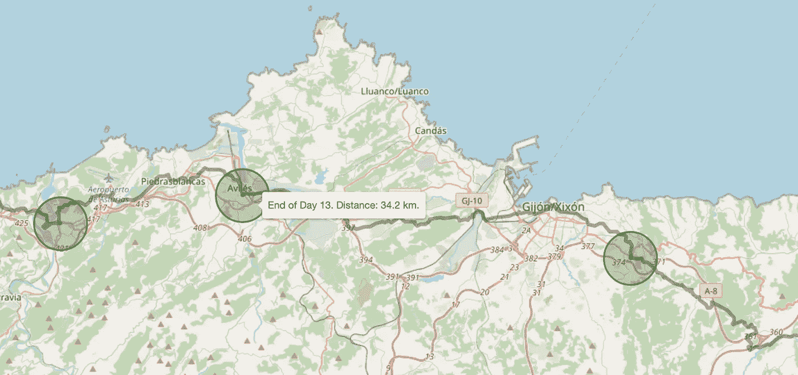
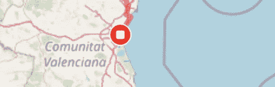
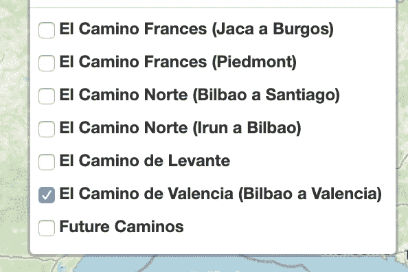
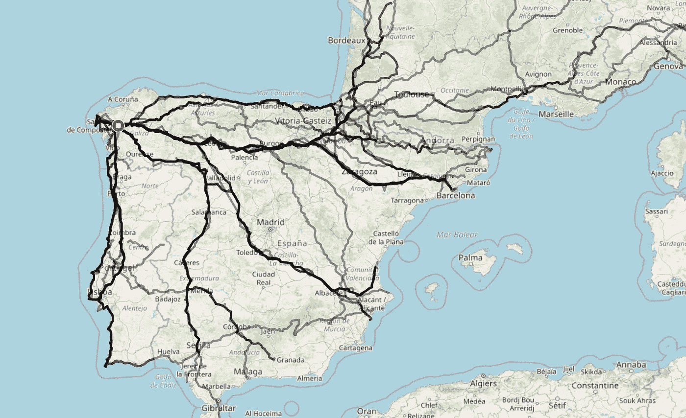

# 使用 leav 从 GPX 文件构建交互式 GPS 活动地图

> 原文：<https://towardsdatascience.com/build-interactive-gps-activity-maps-from-gpx-files-using-folium-cf9eebba1fe7?source=collection_archive---------9----------------------->

## 使用 Strava 和 Garmin 等流行服务创建自行车和徒步旅行 GPS 轨迹的个性化地图

# 介绍

这篇文章概述了如何使用[folio](https://python-visualization.github.io/folium/)将 GPS 记录的活动转换为个性化的交互式地图，这是一个基于强大的地图框架 [Leaflet.js](https://leafletjs.com/) 构建的 Python 库。

首先，我想介绍一下这个项目是如何开始的(如果您来这里是为了快速访问一段特定的代码，请随意跳到‘数据争论’部分)。

我喜欢地图——无论是数字地图还是实物地图。它们为我们周围的世界增添了意义，让我们能够直观地理解我们生活的空间关系。物理地图代表着冒险、怀旧和发现——在我们探索世界的过程中引导我们踏上神奇的旅程。

我使用 Strava(一个 GPS 活动跟踪应用程序)已经超过 10 年了，最近，我买了一块 Garmin 手表，用来跟踪我的所有活动:主要是骑自行车和徒步旅行。我被数据迷住了:我喜欢检查我刚刚完成的路线，挖掘我的统计数据，并在屏幕上检查我的冒险的视觉表现。

# 卡米诺

自从 2016 年搬到西班牙，我就迷上了'[埃尔卡米诺圣地亚哥](https://en.wikipedia.org/wiki/Camino_de_Santiago)'(在英语中称为圣詹姆斯路，但在本文中，它将被亲切地称为卡米诺)。卡米诺朝圣之旅始于 2000 多年前，是前往西班牙西北部圣地亚哥德孔波斯特拉大教堂的宗教朝圣活动。在现代，它已经成为一条多日徒步旅行和骑自行车的冒险路线，吸引了各个年龄和国籍的参与者。我的个人[博客](https://thevanbun.com/2019/09/el-camino-de-la-vida/)对 Camino 进行了更详细的解释:

> 它有宗教根源(朝圣者已经行走了 1000 年)，但现在，大多数人把它作为一种探险和徒步旅游的形式。还有一个自我反省和精神成长的元素吸引了许多人来到卡米诺。这是一个独处(和人在一起)的机会，可以反思生活，理清思绪，冥想散步等等。我做这件事的动机是以上所有的；我不断地自我反省，喜欢思考问题，我也喜欢认识新的人，游览新的地方，冒险，当然还有徒步旅行。

多年来，我收集了相当多的卡米诺经历；总共至少 10 次旅行(包括骑自行车和徒步旅行)，每次旅行持续时间从周末探险到 25 天的奥德赛不等。作为地图和数据的爱好者，这个项目的想法对我来说一直很清晰；在视觉上创造一个我曾经完成的所有卡米诺作品的代表。

经过大量的实验，测试了叶子的极限，[这是结果](https://thevanbun.com/march_24_valencia_map.html):



绿色圆圈代表起点。红色表示骑自行车的卡米诺，绿色表示徒步旅行的卡米诺。

为了获得最佳观看体验，请查看[互动版](https://thevanbun.com/march_24_valencia_map.html)(媒体不允许嵌入 HTML)。您可以通过选择右上角的单选按钮在每个 Camino 之间切换。点击卡米诺中点的徒步旅行或骑自行车图标可以查看统计数据摘要。“未来卡米诺”选项代表我希望有一天能完成的其他卡米诺。

# 数据争论和地图创建

这个工作流程存在于一个 [Jupyter](https://jupyter.org/) 笔记本中；我推荐安装 [Anaconda](https://www.anaconda.com/products/individual) 来快速启动并运行笔记本环境。

构建交互式地图的第一步是以 [GPX](https://fileinfo.com/extension/gpx) 的形式下载您的 GPS 轨迹，这是 GPS 交换格式的缩写。大多数活动跟踪服务都有这种格式的 GPS 轨迹可供下载。我首选的工具是 Strava 和 Garmin:

*   **斯特拉瓦。** [指令](https://support.strava.com/hc/en-us/articles/216918437-Exporting-your-Data-and-Bulk-Export#Bulk)用于一次性批量下载所有数据(包括 GPX 文件)。
*   **佳明。**他们有一个类似的选项来进行批量导出，但我会推荐一个非常有用的 [python 脚本](https://github.com/pe-st/garmin-connect-export)，它会自动下载所有 GPX 文件，并在您完成它们时智能地下载新文件。

**使用** [**gpxpy**](https://pypi.org/project/gpxpy/) **将 GPX 文件转换成 GPS 坐标的数据帧。这个****非常有用的包解析 GPX XML 并将其转换成整洁的数据帧，准备好使用 Pandas 进行分析。另一种选择是使用 python 模块 ElementTree 或 lmxl 自己解析它。**

```
def process_gpx_to_df(file_name):gpx = gpxpy.parse(open(file_name)) 

 #(1)make DataFrame
 track = gpx.tracks[0]
 segment = track.segments[0]
 # Load the data into a Pandas dataframe (by way of a list)
 data = []
 segment_length = segment.length_3d()
 for point_idx, point in enumerate(segment.points):
 data.append([point.longitude, point.latitude,point.elevation,
 point.time, segment.get_speed(point_idx)])
 columns = [‘Longitude’, ‘Latitude’, ‘Altitude’, ‘Time’, ‘Speed’]
 gpx_df = pd.DataFrame(data, columns=columns)

 #2(make points tuple for line)
 points = []
 for track in gpx.tracks:
 for segment in track.segments: 
 for point in segment.points:
 points.append(tuple([point.latitude, point.longitude]))

 return gpx_df, points
```

**产生的数据帧结构如下:**

****

****启动叶子地图并选择图块。**[leave](https://python-visualization.github.io/folium/)是一个 python 库，构建在强大的映射框架[leafle . js](https://leafletjs.com/)之上。创建地图的第一步是选择地图分块(实际上是一个地图皮肤)。在这里可以找到极好的瓷砖收藏。以下语法允许在同一地图上创建多个切片，并为每个切片指定个性化的名称。**

```
import foliummymap = folium.Map( location=[ df.Latitude.mean(), df.Longitude.mean() ], zoom_start=6, tiles=None)
 folium.TileLayer(‘openstreetmap’, name=’OpenStreet Map’).add_to(mymap)
 folium.TileLayer(‘[https://server.arcgisonline.com/ArcGIS/rest/services/NatGeo_World_Map/MapServer/tile/{z}/{y}/{x}'](https://server.arcgisonline.com/ArcGIS/rest/services/NatGeo_World_Map/MapServer/tile/{z}/{y}/{x}'), attr=”Tiles &copy; Esri &mdash; National Geographic, Esri, DeLorme, NAVTEQ, UNEP-WCMC, USGS, NASA, ESA, METI, NRCAN, GEBCO, NOAA, iPC”, name=’Nat Geo Map’).add_to(mymap)
 folium.TileLayer(‘[http://tile.stamen.com/terrain/{z}/{x}/{y}.jpg'](http://tile.stamen.com/terrain/{z}/{x}/{y}.jpg'), attr=”terrain-bcg”, name=’Terrain Map’).add_to(mymap)
```

**最终结果是一个单选按钮，允许用户选择他们想要的图块:**

****

****使用点绘制路线。**我们使用 GPS 坐标元组(从我们的 gpxpy 函数中命名为“点”)来绘制 GPS 路线。foylus 允许对折线进行大量的定制，可以调整颜色、厚度和不透明度。对我来说，红线代表骑自行车的路线，绿色代表徒步旅行。**

```
folium.PolyLine(points, color='red', weight=4.5, opacity=.5).add_to(mymap)
```

****建立一个起始标记(圆形和三角形)。**我用 Folium 的各种标记类，用一个三角形叠加在一个圆上，为这条路线拼凑了一个“开始”图标。**

****

```
html_camino_start = “””
 Start of day {camino_day}
 “””.format(camino_day=camino_day)
 popup = folium.Popup(html_camino_start, max_width=400)
 #nice green circle
 folium.vector_layers.CircleMarker(location=[lat_start, long_start], radius=9, color=’white’, weight=1, fill_color=’green’, fill_opacity=1, popup=html_camino_start).add_to(mymap) 
 #OVERLAY triangle
 folium.RegularPolygonMarker(location=[lat_start, long_start], 
 fill_color=’white’, fill_opacity=1, color=’white’, number_of_sides=3, 
 radius=3, rotation=0, popup=html_camino_start).add_to(mymap)
```

****添加带有 GPS 路线统计信息的可点击图标。**对于每辆 Camino，一个自行车或徒步旅行者的图标(使用[字体 awesome](https://fontawesome.com/v4.7.0/icons/) )被添加到轨道的中点。速度、距离和高度增益等统计数据汇总到数据帧中，并转换成 HTML 表格。“弹出”功能用于创建一个漂亮的信息框，当图标被点击时显示 GPS 跟踪的统计数据。**

****

```
 camino_summary_for_icon = camino_summary_for_icon.iloc[1:,: ] html_camino_name = “””
 <div align=”center”>
 <h5>Daily Stats</h5><br>
 </div>. “”” html = html_camino_name + “””<div align=”center”>””” + camino_summary_for_icon.to_html(justify=’center’, header=False, index=True, index_names=False, col_space=300, classes=’table-condensed table-responsive table-success’) + “””</div>””” #popup = folium.Popup(html, max_width=300)

folium.Marker([lat, long], popup=popup, icon=folium.Icon(color=activity_color, icon_color=’white’, icon='bicycle', prefix=’fa’)).add_to(mymap)
```

****使用矢量图层创建一个“一天结束标记”。每个卡米诺由多天组成，平均约 10 天。如果放大交互式地图，可以很容易地看到这些日期标记，目的是在更精细的层次上显示 Camino，单个轨道上的各个日期可以可视化。点击阴影圆圈，会显示关于卡米诺该部分的长度和天数的信息。****

****

**' vector_layers '的大小。“圆”实体基于米，而“叶”实体基于米。“图标”为像素。本质上，这意味着无论缩放级别如何，图标都将保持相同的大小，而 vector_layers。“圆圈”会随着用户缩放而变大。出于这个原因，我选择使用矢量层。“圆圈”表示特定 Camino 上一天的结束——这是一个有趣的信息，只有当用户放大时才能看到。它变得太忙而不能包含在缩小的视图中。我使用' tooltip= '参数在弹出窗口中添加额外的文本信息。**

```
 day_terminal_message = ‘End of Day ‘ +str(camino_day)[:-2]+ ‘. Distance: ‘ + str(camino_distance) + ‘ km.’
mymap.add_child(fg)
folium.vector_layers.Circle(location=[lat_end, long_end], radius=track_terminal_radius_size, color=activity_color, fill_color=activity_color, weight=2, fill_opacity=0.3, tooltip=day_terminal_message).add_to(mymap).add_to(fg)
```

****结束标记。**结束标记(圆形和方形)的构建与开始标记相同。**

****

```
 html_camino_end = “””
 End of day {camino_day}
 “””.format(camino_day=camino_day)
 popup = html_camino_end
 folium.vector_layers.CircleMarker(location=[lat_end, long_end], radius=9, color=’white’, weight=1, fill_color=’red’, fill_opacity=1, popup=popup).add_to(mymap) 
 #OVERLAY square
 folium.RegularPolygonMarker(location=[lat_end, long_end], 
 fill_color=’white’, fill_opacity=1, color=’white’, number_of_sides=4, 
 radius=3, rotation=45, popup=popup).add_to(mymap)

 folium.LayerControl(collapsed=True).add_to(mymap)
```

****全屏选项。**这是一个非常有用的选项，可以扩展到全屏显示。**

```
 if fullscreen==True:
 plugins.Fullscreen(
 position=’topright’,
 title=’Expand me’,
 title_cancel=’Exit me’,
 force_separate_button=True
 ).add_to(mymap)
```

****特色组。**这个功能非常有用；它允许对地图中的元素进行分组(例如特定的路线)，用户可以将每个组设置为可见或不可见。在我的例子中，我用它来允许用户打开或关闭每个 Camino 的显示。**

****

```
fg = folium.FeatureGroup(name='El Camino de Valencia (Bilbao a Valencia)', show=True)
mymap.add_child(fg)
folium.PolyLine(points, color=activity_color, weight=4.5, opacity=.5).add_to(mymap).add_to(fg)
```

**嗯，就这样吧！leav 包含了大量的附加特性——我可以花几个小时摆弄各种功能。定制的选择是丰富的。**

# **维基洛克和卡米诺自行车旅游项目**

**Wikiloc 是一个有用的活动追踪器，允许用户探索和分享徒步和骑行路线。它位于西班牙，在这里非常受欢迎。这是一项非常棒的服务，主要用于发现新路线——它允许用户在活动中找到有用的路线，并在 GPS 的引导下沿着它们走。**

**作为一个自行车旅行的狂热爱好者，我决定做一个项目，在 Wikiloc 上收集所有的自行车旅行路线。(关于网络抓取的更多细节，请查看我关于[抓取英语教师网站的文章，tusclasesspeciales](/use-web-scraping-and-pandas-for-a-market-analysis-esl-teaching-in-spain-75029dd0a1e5))。**

**这个项目本身可以是一篇文章，但是为了不离题并保持这篇文章简洁，让我们深入到我根据搜集结果创建的地图中。**

**我解析了数据，只包含与 Camino 相关的路线，并创建了下面的[可视化](https://thevanbun.com/all_the_caminos_bike_touring.html)，它显示了到达圣地亚哥有多少种不同的可能的 Camino。**

****

**为获得最佳体验，请查看互动版[。](https://thevanbun.com/all_the_caminos_bike_touring.html)点击每个 Camino，会显示一个汇总框；完成统计数据和维基百科的链接。**

# **结论**

**本文总结了将原始 GPS 轨迹数据转换为交互式地图所需的基本步骤。我将以一些最有用的链接作为结束，这些链接是我在制作地图的过程中收集到的。**

*   **《叶的圣经》中有大量的例子:[https://nb viewer . jupyter . org/github/python-visualization/Folium/tree/master/examples/](https://nbviewer.jupyter.org/github/python-visualization/folium/tree/master/examples/)**
*   **使用 GPX 数据计算速度、距离和高度变化:[https://towards data science . com/how-tracking-apps-analyze-your-GPS-data-a-hands-on-tutorial-in-python-756 D4 db 6715d](/how-tracking-apps-analyse-your-gps-data-a-hands-on-tutorial-in-python-756d4db6715d)**
*   **有趣的使用聚类标记构建啤酒花园互动地图的 foylus 项目:[https://towards data science . com/how-I-used-python-and-open-data-to-build-an-interactive-map-of-edinburghs-beer-gardens-cad2f 607 e 57 e](/how-i-used-python-and-open-data-to-build-an-interactive-map-of-edinburghs-beer-gardens-cad2f607e57e)**
*   **聚类标记:[https://medium . com/@ bobhaffner/folium-marker clusters-and-fastmarkerclusters-1e 03 b 01 CB 7 b 1](https://medium.com/@bobhaffner/folium-markerclusters-and-fastmarkerclusters-1e03b01cb7b1)**
*   **制作树叶地图:[https://medium . com/@ saidakbarp/interactive-map-visualization-with-leaf-in-python-2e 95544 D8 d9b](https://medium.com/@saidakbarp/interactive-map-visualization-with-folium-in-python-2e95544d8d9b)**

# **笔记本电脑**

**本文引用的代码可以在我的 [Git 仓库](https://github.com/datachico/gpx_to_folium_maps/blob/master/folium_maps_From_GPX.ipynb)中找到。**