# 为傅立叶变换建立直觉

> 原文：<https://towardsdatascience.com/build-intuition-for-the-fourier-transform-b0bd338c6d4f?source=collection_archive---------20----------------------->

迈克尔·泽兹奇在 [Unsplash](/s/photos/electronic?utm_source=unsplash&utm_medium=referral&utm_content=creditCopyText) 上的照片

## 卷积和信号处理的神奇算法

傅立叶变换及其同类(傅立叶级数、离散傅立叶变换和[球谐函数](https://en.wikipedia.org/wiki/Spherical_harmonics))是我们用来计算和理解周围世界的强大工具。离散傅立叶变换(DFT)用于计算机视觉的卷积运算，并(经过修改)用于音频信号处理，而球谐函数给出了[元素周期表](https://en.wikipedia.org/wiki/Periodic_table)的结构。

虽然写下一个公式很容易，但有一个更广泛的观点表明，每个公式都源于对对称性的简单考虑。我们将在这里继续这一观点。

一如既往，我将努力避免不必要的技术术语的复杂性。如果你对它们感兴趣，试试脚注。然而，会有一些复杂的数字:你已经被警告过了。

# 傅立叶级数

傅立叶级数是其中最古老的，最初由法国人约瑟夫·傅立叶研究。拿破仑的朋友傅立叶在 19 世纪 20 年代研究热流时写下了这一点，不久后他发现了我们今天花费大量时间担心的温室效应。

傅立叶级数的自然设置是**圆上的复值函数**。正如您所记得的，函数是接受输入并给出输出的东西。

*   在这种情况下，输出将是一个复数(我们将复数表示为ℂ)
*   输入将是圆上的一个点。请注意，我们没有包括圆的内部，只是它的边界。我们用 S 表示这个圆，如果这个圆出现，我们会认为它的半径为 1。
*   我们也将要求我们的功能是“好的”他们不会试图做一些卑鄙的事情，比如蹦蹦跳跳(不连续)，跳到无限远，不明确，或者叫你粗鲁的名字。

## 对称

对称是人们喜欢谈论的神秘事物之一。例如，研究一直表明，如果你的脸对称，人们会觉得你更有吸引力。这也体现在物理学中:我们目前拥有的世界上最好的理论可以被神秘地描述为对称 SU(3)×SU(2)×U(1)，不管这意味着什么。但是当我们谈论对称时，我们指的是一些可笑的简单的东西:**如果你在一个圆上旋转一个函数，你会得到一个圆上的函数** *。*

现在，在圆上画一个函数有点棘手。所以请回忆一下，如果你拿一根细绳，把两端连起来，就可以做出一个圆。考虑到这一点，我们可以把一个函数画在一条线段上，从而把它画在圆上；事实上，左右两端必须连接，你必须在你的脑海中想象。

下图显示了一个圆上的简单函数(左)。要旋转它，我们只要“移动”就行了，前提是从右端出去的东西回到左端。在这种情况下，旋转以ᴨ/2 弧度(90°)为单位。该函数的输入只是围绕圆的角度(比如说，从最右边的点开始顺时针方向)。

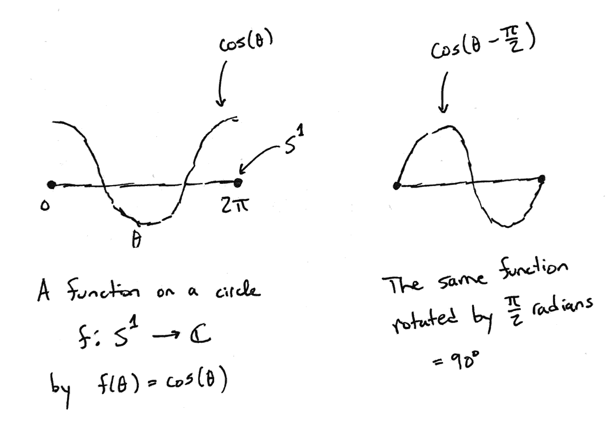

圆上的函数(左)及其旋转 90 度(右)

另一种思考方式是，如果你在一个圆上有一个函数，你可以只*旋转圆*(因为圆是循环对称的，同义反复)。

希望到目前为止你已经确信没有特别的魔法在进行。我们所说的是，如果你旋转函数(或圆)，你会得到另一个非常好的函数。

## 表象理论

数学家们把研究在圆周上旋转一个函数来得到另一个函数的方法称为表示理论，它包含了一个额外的步骤，打开了整个理解的世界。

额外的步骤本身并不复杂。在之前的设置中，当你想要旋转圆时，你只需要旋转它。现在我们将添加一个中介。我想让你想象你将给出旋转圆圈的指令，我将解释它们并进行旋转。例如，你可能说“旋转圆 73”，我将旋转圆 73。

我从没说过我必须照你说的做。有一些规则适用于我所做的事情，我们将通过例子来探索它们。

1.  如果你说“旋转 360 度”，我什么也不会做。同样，如果你说“把圆旋转 370”，我只会旋转 10。为什么？希望你能看到，如果我旋转 360 度，我们会回到起点。你可以反对并说“不，不，我真的想看它旋转，这很有趣”，但实际上你应该想象所有这些旋转都是瞬间发生的。我们对旋转的*过程*不感兴趣；我们对*的结果*感兴趣。
2.  现在想象一下，当你说“把圆旋转 10 度”时，我把它旋转了 15 度。同样，如果你说 20，我会旋转它 30！总的来说，我的旋转是你要求的 1.5 倍。这看起来很好(我从来没有做过任何承诺)，但有一个问题。如果你说“将圆圈旋转 360 度”,实际上，你有权假设一切都不会改变。因此，如果我采用“150%努力超额完成”的策略，我就违反了规则，因为我会旋转 180 度(与 360×1.5 = 540 = 360 + 180 度相同)。
3.  这是一个规则，无论你说多少度，我都必须做一些倍数。那么允许什么倍数呢？1 显然没问题。2 也是！如果你要求 360 度，你将得不到旋转(720 度)，这正是你所期望的。3、4、5 等也是如此。还有 0，-1，-2 等等。事实上，这是唯一的选择。

深入探究这些规则从何而来的细节将是一种相当大的转移。但是简单来说,“圆周旋转”伴随着某种数学结构(称为[群](https://en.wikipedia.org/wiki/Group_(mathematics)))。大致来说，这个结构是一个显而易见的事实，旋转 1 然后再旋转 1 和旋转 2 是一样的。再加上 360 和 0 一样，什么都不做。规则是:

*   我必须旋转你所说的常数倍数
*   如果你说 360，我最后只能什么都不做

根据我们保持这个结构的要求，这意味着我只能乘以一个整数。这个结果被称为*量子化*，这正是量子力学中“量子”的含义。事实上，电荷以离散的(量子化的)数量出现的原因，可以直接从我们刚才的论证中得出。因为这个原因，我用的整数倍有时候也叫收费！

简单回顾一下，我们有:

*   你，要求旋转一定的度数。让我们把可能的旋转集合称为 G(代表“组”)。
*   我，解释那些指令。从某种意义上说，我是一个函数，它接受一个输入(你告诉我什么)，给出一个输出(做什么)。我们称之为ρ。
*   正在执行的功能。我们将所有足够好的函数的集合称为 V(对于“ [Vector](https://en.wikipedia.org/wiki/Vector_space) ”因为函数是向量:它们可以相加，乘以一个常数，还有一个 0 函数)。

综合起来，这三个数学对象形成了一个*表示*。我想象它被如此称呼是因为我在用一个具体的行动“代表”你的抽象指令。

## 不可约表示

这就是奇迹发生的地方。在许多情况下(比如这里)，被作用的事物(功能)可以被分解成组成部分。⁴大致会发生的情况是:

1.  一个函数可能非常复杂
2.  想象我们有一堆标有…-3，-2，-1，0，1，2，3，4 等的桶。每个桶里面都有一个非常简单的函数，比如 cos(2θ)。
3.  每个函数都可以通过添加组件来实现，每个桶一个组件。

如果我们做到了这一点，我们就把一件复杂的事情分解成了许多简单部分的总和。⁵，这很好。如果我们这样做，我们就赢了。

现在，证明所有这些都可以工作超出了本文的范围。如果你感兴趣的话，这通常是任何关于表示理论的教科书中的第一件事，而且也不是很难。相反，我们只是要介绍一个花招，然后描述桶。

## 旋转就是乘法

考虑下面的函数 f，看看当我们把它旋转一个角度 *a* 时会发生什么。如上图所示，旋转等同于通过 *a* 将参数转移到函数。 *i* 是虚数单位，-1 的平方根(暂时不用管这个)。其他一切都遵循你在数学课上学到的[指数法则](https://brilliant.org/wiki/simplify-exponents/)。

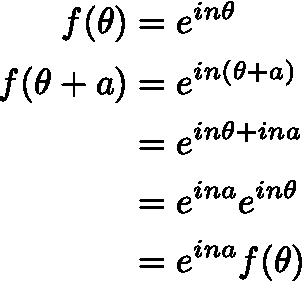

旋转就是乘法

事实证明(根据舒尔引理),我们桶中的函数必须满足这样的性质:旋转它们与相乘它们是一样的。而上面的函数，其中 n 是任意整数，正是满足这个性质的函数。因此，我们可以把圆上的任何函数写成这样一些函数的和:

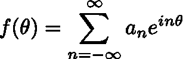

圆上函数的分解

其中系数 *a* 只是告诉我们每个函数取多少。这种分解被称为*傅立叶级数*。如果你不太喜欢复数，你可能会更习惯使用这样的事实

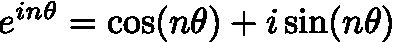

这意味着我们可以将圆上的每个函数 *f* 写成如下形式

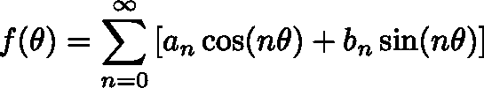

傅立叶级数的三角形式

如果需要的话，复数隐藏在系数 *a* 和 *b* 中。(注意:我们合并了 n=2 和 n=-2 这样的项，所以我们只对非负 n 求和，对于 n=0，我们只需要其中一项。)

最后，请注意，我们可能需要无穷多个术语，而实际上我们只得到有限多个。下面的动画展示了当我们采用越来越多的术语时会发生什么。蓝线是一个“锯齿波”，你可以把它想象成圆上的一个不连续函数(它每 360°跳一次)。红色曲线是 1、2、3 等的傅立叶级数近似值。条款。

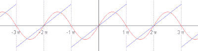

动画:[维基百科](https://en.wikipedia.org/wiki/Fourier_series#/media/File:Periodic_identity_function.gif)

# 堂兄弟

让我们回顾一下我们所做的。我们意识到，如果你旋转一个圆，你会得到一个圆(对称性)。我们对此进行了扩展，这样我们可以在圆上使用函数，并允许修改我们的旋转指令(表示)。我们了解到，函数可以分解成更简单的部分(不可约表示)，更简单的部分必须满足一个简单的性质，即旋转是乘法(舒尔引理)。有了这个我们可以写下那些简单的部分。

为了恢复所有其他的东西，我们需要做的就是考虑 X 上的函数，其中 X 不是圆。

## 傅立叶变换

好，让我们把 x 变成ℝ，实数。它们的对称性在于你可以翻译实数(比如说加 5)并以你开始时的结果结束。或者用函数来表述，一个以实数作为输入，以实数作为输出的常规函数可以被翻译，你会得到另一个非常好的函数。⁶

形式上，这类似于我们在一个圆上所做的，旋转看起来也像是一种转移。然而，与之前不同的是，结果不会被量化。我们将为每个实数设置一个桶，而不是离散的桶。把一组连续的东西加起来，我们需要用积分代替求和；但是从概念上来说，这和圆圈是一样的。

*   将变量从θ改为 x
*   把总和变成一个积分
*   将桶索引从 *n* 更改为 *p* (p 代表“动量”)
*   改变系数 *a* 以便每个桶索引 *p* 都有一个

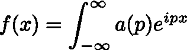

傅立叶变换分解一个函数

注意，这不是你在维基百科上看到的公式，有几个原因。首先，傅立叶变换通常用稍微不同的归一化写下来(我们需要一个 2ᴨ项来使后面的公式更好)。其次，是逆变换:变换计算系数 a(p)，逆变换就是我们如何写下函数 *f* 的分解。

## 离散傅立叶变换

现在，让我们将底层空间更改为圆形的“离散”版本。假设有 N 个点等距分布在一个圆上。对称就是你可以旋转 360/N 度或者它的任意整数倍。“离散圆”上的一个“函数”只是 N 个数的列表，每个点一个。旋转函数只是移动 N 个数字的列表(并将任何离开边缘的东西移回另一边)。

现在只会有 N 个桶。最小的旋转角度是 2ᴨ/N 弧度。变量从 *x* 变为 *k* ，k 是整数，0，1，2，…，N-1 中的一个。

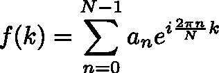

离散傅立叶分解

同样，由于同样的原因，与你在维基百科上看到的略有不同。

## 离散时间傅立叶变换

现在让我们把底层空间变成这条线的离散形式(实数)。所以我们得到了整数。对称以任意整数移动。“函数”是一个无限的数字列表，每个整数一个。

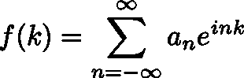

离散时间傅立叶分解

再说一次，我们没有小心我们的 2ᴨ归一化。

## 球谐函数

如果底层空间是球体呢？我说的球体是指边界，不包括内部。这个空间记为 S。对称性是三维空间的任意旋转。因为这个对称组稍微复杂一点，所以每个“桶”中的函数数量并不总是一个。

结果被称为[球谐函数](https://en.wikipedia.org/wiki/Spherical_harmonics)，你在化学课上已经学过了。这些桶的大小也给出了周期表的结构。这是相当惊人的:仅仅通过尝试在一个球体上做傅立叶变换，你就可以基本上弄清楚化学。(还有更多的细节:一切都变得加倍，因为电子可以自旋向上或自旋向下)。

我将简要地描述这些桶，以及它们与周期表的关系。

1.  第一个名为“s”的桶只有一个功能。翻倍，你得到 2，元素周期表第一行的元素数(1s 轨道)。
2.  第二个桶叫做“p ”,里面有三个函数。加倍，你得到 6 个电子，可以进入 2p 轨道(和 2s 轨道上的 2 个在一起)。
3.  第三个桶称为“d ”,其中有 5 个函数。再翻一倍，你会得到 10 个，这是 4d 轨道可以容纳的电子数(Sc–Zn，下面中间的蓝色元素)。
4.  第四个桶称为“f ”,其中有 7 个函数。两倍，你得到 14，6f 轨道上可以进入的电子数。(下面是粉红色的 La–Yb，不包括最后一个 Lu，它应该正确地着色为蓝色)。
5.  第五个桶称为“g ”,其中有 9 个函数。如果原子足够稳定存在的话，这个数字是 g 轨道上的电子数。

以此类推(1，3，5，7，9，11 等。).

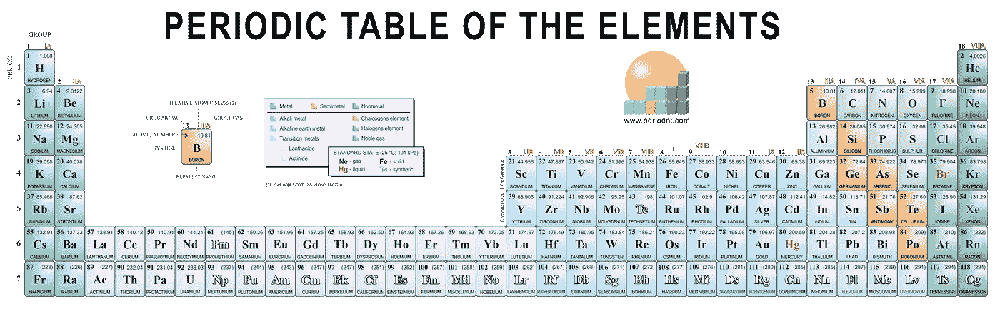

元素周期表

说白了，原子的量子态就像一个球体上的函数(径向部分被排除并解释了结构的 1s，2s 2p，3s 3p，4s 4p 4d 部分)。如果你旋转这个状态，你会得到另一个非常好的状态(最好是这样！).因此，表象理论适用，我们可以做我们的“傅立叶”分析。

# 结论

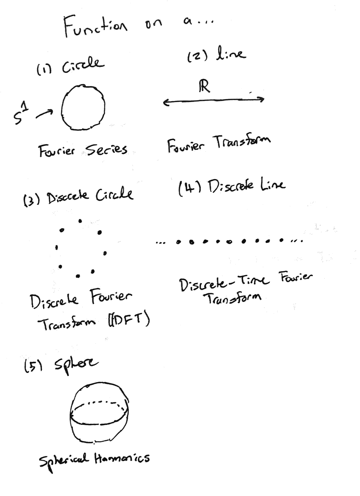

我们已经看到，傅立叶变换及其类似变换可以被视为对一个函数执行相同的过程，根据组成该函数的数据，结果会略有不同。左边的表格列出了我们描述的 5 个版本。当然，你可以在任何对称的形状上这样做。例如，您可以对定义在平面上的函数(二维实数)或图像(有限的二维数字数组，我们可以将其循环回自身，形成一个离散的圆环)进行傅立叶分析。

我们也看到了这个工具有多么强大。它给了我们元素周期表(本质上是我们的整个世界)。在计算机视觉中，事实证明做一个(离散的)傅立叶变换，把结果相乘，然后进行逆变换，比单纯地把数字相乘要快。在音频信号处理中，傅立叶变换及其变体(如[小波变换](https://en.wikipedia.org/wiki/Wavelet_transform#Other_practical_applications))是提取特征的强大工具。下次请继续关注应用程序。

# 参考

我发现彼得·沃特的关于量子力学的[书](http://www.math.columbia.edu/~woit/QMbook/)对表示理论和傅立叶变换提供了非常清晰的解释，尽管它没有涉及任何离散变量或两者之间的关系。

# 笔记

[1]对于那些对技术细节感兴趣的人，我们将使用 L (S)，圆上的勒贝格平方可积函数的空间。

[2]我省略了圆的对称性与圆上函数之间关系的一些细节。这些细节大多相当于处理一些讨厌的负号。粗略地说，如果你旋转这个圆，你必须向后旋转函数*，这样一切都以你期望的方式结束(这样从对称群到动作集的映射是同态的，而不是向后的)。*

*[3]一个表示的官方定义是:你有一个群 G，一个底层向量空间 V，一个从 G 到 GL(V)的映射ρ，V 上所有可逆线性变换的群。*

*[4]主要要求是表示是酉的(它在这里)。我们还将利用圆的旋转对称群 U(1)是[阿贝尔](https://en.wikipedia.org/wiki/Abelian_group)(交换的:x + y = y + x)这一事实来确保不可约表示是一维的。我们将完全忽略所涉及的分析问题，这些问题在很大程度上相当于这样一个事实，即一个给定的函数可能有无限多的分解成的“部分”,在讨论如何将无限多的东西相加时，我们必须小心。*

*[5]我们已经把向量空间写成一组更小的向量空间的直和。在这个例子中，较小的向量空间是一维的，集合由整数索引。*

*[6]让我们把事情简单化，假设我们正在研究 L (R)。但是如果你想花哨一点，我们可以用一个[史华兹空间](https://en.wikipedia.org/wiki/Schwartz_space)。*