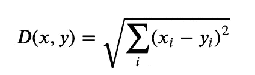
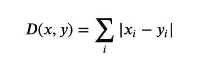
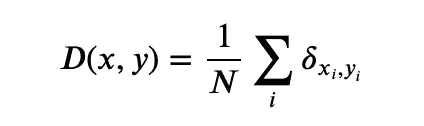
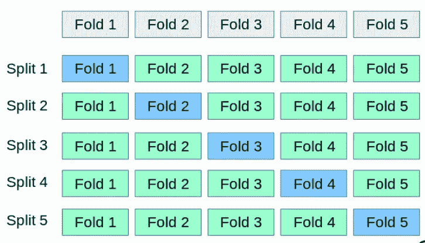

# 用 Python 从头开始构建 kNN

> 原文：<https://towardsdatascience.com/build-knn-from-scratch-python-7b714c47631a?source=collection_archive---------11----------------------->

## 用*k*-折叠交叉验证(从头开始)


邻居(图片来源: [Freepik](https://www.freepik.com/free-vector/apartment-building-with-people-open-window-spaces_7416533.htm#page=1&query=neighbors&position=2)

在本文中，我们将了解 k-最近邻(kNN)算法是如何工作的，并从头开始构建 kNN 算法。我们还将使用 k-Fold 交叉验证来评估我们的算法，这也是从头开始开发的。

完成本教程后，您将了解:

*   如何分步编码*k*-最近邻算法
*   如何使用 k-最近邻对新数据进行预测
*   如何对*k*-折叠交叉验证进行分步编码
*   如何使用 *k* 折叠交叉验证评估真实数据集上的 *k* 最近邻

先决条件:对 Python 和面向对象编程(OOP)中的类和对象的概念有基本的了解

# k-最近邻

最近邻居，简称 kNN，是一种非常简单但功能强大的预测技术。kNN 背后的原则是使用“与新数据最相似的历史实例”

*k* 是用于识别新数据点的相似邻居的数字。

最初存储整个训练数据集。当需要对新数据进行预测时， *k* NN 考虑*k*-最相似的邻居(记录)来决定新数据点将属于基于特征相似性的位置。

一旦我们找到了距离或相似性，我们就选择前 *k* 最接近的记录。在发现 k 个最接近的记录后，我们通过返回最常见的结果或取平均值来进行预测。因此， *k* NN 可用于分类或回归问题。

*k* NN 算法没有训练阶段。该模型仅保存数据，直到需要进行预测，并且不做任何工作。正因如此， *k* NN 常被称为“**懒学法**”。

## 4 个简单步骤中的 k 个最近邻居

1.  **为*k*选择一个值**
2.  **找到新点到每条训练数据记录的距离**
3.  **得到*k*-最近邻**
4.  对于**分类问题**，新的数据点属于大多数邻居所属的类。对于**回归问题**，预测可以是 *k* 最近邻标签的平均值或加权平均值

# 使用 Python 从头构建 kNN

您可以使用我的 [GitHub](https://github.com/chaitanyakasaraneni/knnFromScratch) 中可用的代码来跟进。

您也可以通过以下方式安装它:

```
pip install simple-kNN
```

PyPI 包版本的 GitHub repo:【https://github.com/chaitanyakasaraneni/simple-kNN 

## 第一步:**选择一个 *k 值***

K 的选择对我们从 *k* NN 中获得的结果有很大的影响。*最好选奇数。*

## 第二步:计算距离

下一步是计算数据集中两行之间的距离。

特定于问题或数据的方法用于计算两个记录之间的距离或相似性。一般来说，对于表格或矢量数据，欧几里得距离被认为是起点。还有其他几种相似性或距离度量，如曼哈顿距离、汉明距离等。

**欧几里德距离**定义为两点间距离(差)的平方和的平方根。它也被称为 L2 规范。



两个向量' *x* 和' *y* 之间的欧氏距离

**曼哈顿距离**是两点之间差异的绝对值之和



两个矢量' *x* 和' *y* 之间的曼哈顿距离

**汉明距离**用于分类变量。简单来说，它告诉我们两个分类变量是否相同。



两个向量“x”和“y”之间的汉明距离

其中“δ”用于检查两个元素是否相等。

在 python 中，我们创建了一个单独的类来保存计算两个向量之间距离的方法。

包含计算距离度量方法的类

下一步我们将利用这个类来寻找最近的邻居。

## 第三步:找最近的邻居

数据集中一条新数据的邻居是我们使用上面定义的距离度量获得的前 k 个最近的实例。

为了定位数据集中新数据的邻居，我们必须首先计算数据集中每个记录到新数据的距离。我们可以通过为上面定义的 distanceMetric 类创建一个对象来做到这一点。

计算出距离后，我们必须根据记录到新数据的距离对训练数据集中的所有记录进行排序。然后我们可以选择顶部的 k 个作为最相似的邻居返回。

我们可以通过将数据集中每条记录的距离记录为一个列表来实现这一点，根据距离对列表进行排序，然后检索邻居。

既然我们知道了如何从数据集中获取 top*k*-邻点，我们将使用它们来进行预测。

## 第四步:预测

在这一步中，我们将使用从训练数据集中收集的前 k 个相似邻居来进行预测。

在分类的情况下，我们可以返回邻居中最具代表性的类。

我们可以通过对来自邻居的输出值列表执行 *max()* 函数来实现这一点。给定在邻域中观察到的类值列表， *max()* 函数获取一组唯一的类值，并对该组中每个类值的类值列表进行计数。

下面是完整的 *k* NN 类:

现在我们有了我们的预测，我们需要评估我们的模型的性能。为此，我们将使用下一部分定义的*k*-折叠交叉验证。

# k 折叠交叉验证

这项技术包括**将数据集随机划分为 *k-* 组或大小大致相等的折叠**。第一个**折叠被保留用于测试**并且**模型在剩余的 k-1 个折叠**上被训练。



5 折交叉验证。蓝色块是用于测试的折叠。来源: [sklearn 文档](https://scikit-learn.org/stable/modules/cross_validation.html)

*k* 有很多变种——折叠交叉验证。你可以在这里读到更多关于他们的信息。

在我们的方法中，在每次折叠后，我们计算精确度，因此通过对 *k-* 折叠的精确度取平均值来计算 *k-* 折叠 CV 的精确度。

# 使用 Python 从头构建 kFCV

第一步，我们将数据集分成 k 个褶皱。

然后，对于第 *k* 个折叠中的每个折叠，我们执行 kNN 算法，获得预测，并使用准确度作为评估度量来评估性能。

将数据分成 k 倍的方法:

评估方法:

这两种方法合并成一个类:

我们可以通过为 *k* 创建一个对象来执行这个操作——折叠交叉验证方法并调用 evaluate 方法，如下所示。

```
kfcv = kFoldCV()kfcv.kFCVEvaluate(data, foldCount, neighborCount, distanceMetric)
```

然后， *kfcv.kFCVEvaluate()* 将数据分割成指定的折叠数，并通过使用指定的距离度量考虑 top- *k* 邻居来评估 *k* NN 算法。

例子和实现可以在我的 [GitHub 库](https://github.com/chaitanyakasaraneni/knnFromScratch)中看到。

# 结论

在这篇博客中，我们看到了:

*   kNN 算法
*   kNN 算法中使用的一些距离度量
*   使用 kNN 算法的预测
*   使用 kFold 交叉验证评估 kNN 算法

希望你通过阅读这篇文章获得了一些知识。请记住，这篇文章只是一个概述，是我从各种在线资料中读到的对 kNN 算法和 kFold 交叉验证技术的理解。