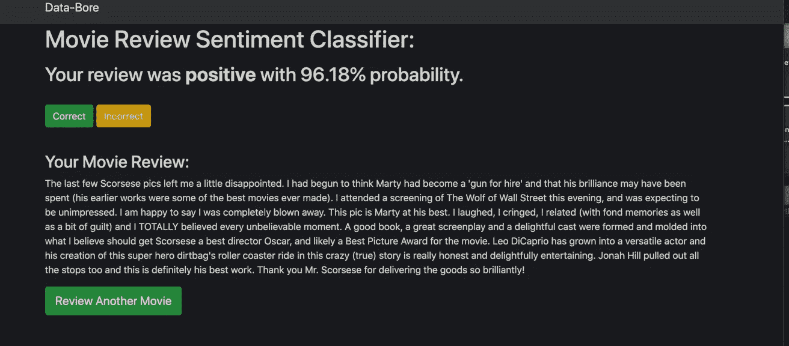
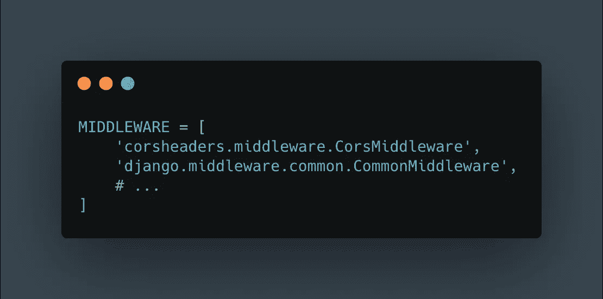

# 利用 Dash 和 Power BI 构建实时更新的仪表盘

> 原文：<https://towardsdatascience.com/build-live-updating-dashboards-with-dash-and-power-bi-b82edcc0566d?source=collection_archive---------9----------------------->

## [实践教程](https://towardsdatascience.com/tagged/hands-on-tutorials)


照片由 [**迭戈·庞特斯**](https://www.pexels.com/@diego-pontes-901015?utm_content=attributionCopyText&utm_medium=referral&utm_source=pexels) 发自 [**Pexels**](https://www.pexels.com/photo/assorted-japanesse-food-2323398/?utm_content=attributionCopyText&utm_medium=referral&utm_source=pexels) **(今天的课程会包括一点点所有的东西)**

# 我们将构建的预览

今天，我们将使用包括基于 Python 的工具和微软的 Power BI 在内的所有工具来构建仪表板。

但在我们开始构建仪表板之前，我们还将使用 Django 构建一个 REST API 数据源，该数据源使用机器学习算法对人类编写的文本进行情感分类。

我们的行动计划如下:

1.  构建一个名为 Data-Bore 的 Django 应用程序作为我们的数据源
2.  在 Data-Bore 之上构建 REST API
3.  使用 Plotly 的 Dash 构建一个名为 Data-Bore-Dashboard 的独立仪表板，它使用 REST API 作为其实时更新数据源
4.  通过将它连接到 1 号 Heroku PostgreSQL 数据库，构建一个 Power BI 仪表板。将仪表板嵌入到一个简单的网站中，该网站可以向世界上的任何人显示。
5.  试着在学习的时候享受乐趣

你可以在我的 GitHub 中找到[数据孔](https://data-bore.herokuapp.com/)和[数据孔仪表板](https://data-bore-dashboard.herokuapp.com/)以及[嵌入式 Power BI 仪表板](https://data-bore-dashboard-powerbi.herokuapp.com/)的所有代码；

1.  [https://github.com/Captmoonshot/data-bore](https://github.com/Captmoonshot/data-bore)
2.  [https://github.com/Captmoonshot/data_bore_dashboard](https://github.com/Captmoonshot/data_bore_dashboard)

3.[https://github.com/Captmoonshot/data-bore-dashboard-bi](https://github.com/Captmoonshot/data-bore-dashboard-bi)

我在这个项目中使用的 Python 版本是 Python == 3.8.5。我们将使用 Pipenv 来处理我们的虚拟环境和打包需求，所以如果您有一个旧版本的 Python，您可能想要研究一下 [Pyenv](https://github.com/pyenv/pyenv) 。

# 1.DJANGO 简介

接下来是一个相对简单但完整的 Django 项目版本。如果你没有使用 Django 的经验，请查看 YouTube 上无数的资源或博客，如 [Real Python](https://realpython.com/) 。然后回来试试这个教程。

我们将把我们的 REST API 应用程序称为“Data-Bore ”,意思是对数据感到厌烦，而不是对数据感到厌烦。我还将假设您正在 macOS 或 WSL 或其他 Linux 发行版上工作。

$ mkdir 数据钻孔&& cd 数据钻孔

虚拟环境的使用是意料之中的事情，这里我推荐 [Pipenv](https://realpython.com/pipenv-guide/) 。现在我们需要 Django 和 python-dotenv。然后是熊猫和 sci kit——学习机器学习方面的东西。

`$ pipenv install django=2.2.0 python-dotenv pandas scikit-learn`

如果 pipenv 需要一些时间来创建。你可以试着一个一个安装软件包。

激活您的虚拟环境:

`$ pipenv shell`

创建您的 django 项目:

`$ django-admin startproject data_bore_project .`

您的目录结构应该如下所示:

。
├──pipfile
├──pipfile . lock
├──data _ bore _ project
│├──_ _ init _ _。py
│ ├──设置. py
│ ├──网址. py
│└──wsgi . py
└──manage . py

我们将使用 python-dotenv 处理环境变量。环境变量是我们不希望 git 跟踪的敏感数据，但是脚本或 Django 应用程序需要使用它们。在项目目录的顶层创建一个. env 文件:

`$ touch .env`

继续从 settings.py 复制您的 SECRET_KEY 并粘贴到您的。=符号之间没有任何空格的 env:

# .包封/包围（动词 envelop 的简写）

```
SECRET_KEY=’<your_actual_secret_key>’
```

我们还将创建一个. gitignore 文件。这个文件将阻止 git 跟踪您希望保持私有或者对项目不重要的文件和目录——比如。我们刚刚创建的 env 文件。现在这并不相关，但当我们将应用程序部署到生产环境时，它将会相关，因此继续创建文件(目录的顶层)并复制和粘贴以下内容:

# .gitignore


图片由 carbon.now.sh 提供

将此代码段添加到您的设置中，py:

```
import osfrom dotenv import load_dotenvload_dotenv()SECRET_KEY = os.getenv('SECRET_KEY', 'you-will-never-know')
```

现在我们可以运行初始迁移了:

`$ python manage.py migrate`

然后创建一个超级用户并提供凭证:

`$ python manage.py createsuperuser`

我们 Django 应用程序的主要目的是对 IMDB 电影评论的情感进行分类。这部分教程完全来自 Sebastian Raschka 和 Vahid Mirjalili 的 [Python 机器学习](https://www.amazon.com/Python-Machine-Learning-scikit-learn-TensorFlow/dp/1789955750/ref=sr_1_1_sspa?dchild=1&keywords=python+machine+learning&qid=1604534187&sr=8-1-spons&psc=1&spLa=ZW5jcnlwdGVkUXVhbGlmaWVyPUEyUU9KODlMQUlZVUtCJmVuY3J5cHRlZElkPUEwNzQ0MTM1MTlVVUxXUE8wVEY3TyZlbmNyeXB0ZWRBZElkPUEwOTgxMjM5QVVUQU44ODhWMzJSJndpZGdldE5hbWU9c3BfYXRmJmFjdGlvbj1jbGlja1JlZGlyZWN0JmRvTm90TG9nQ2xpY2s9dHJ1ZQ==)第八章。我所做的不同是将他的 Flask 应用程序改编成 Django 应用程序。

用于训练机器学习算法的数据集被斯坦福大学称为[大型电影评论数据集](http://ai.stanford.edu/~amaas/data/sentiment/) t，包含 5 万篇电影评论，其中一半的评论被标记为 1 或“正面”，另一半为 0 或“负面”。基本上，如果一部电影超过 6 颗星，它就被评为“正面”，如果少于 5 颗星，则被评为“负面”。

因此，给定一段文字，比如:“挑战者:最后一次飞行是我今年在网飞看到的最好的事情”，算法应该能够给它赋值 1 或“正”。

鉴于这些目标，我们将首先在 Django 项目中创建一个应用程序，负责对电影评论进行分类:

`$ python manage.py startapp classifiers`

我们的目录结构应该如下所示:

。
├──pipfile
├──pipfile . lock
├──量词
│ ├── __init__。py
│├──admin . py
│├──apps . py
│├──迁移
│└──_ _ init _ _。py
│├──models . py
│├──tests . py
│└──views . py
├──data _ bore _ project
│├──_ _ init _ _。py
│ ├──设置. py
│├──URLs . py
│└──wsgi . py
└──manage . py

在 Sublime Text 或 VSCode 中打开您的项目。

将新应用程序添加到 settings.py 中的 INSTALLED_APPS 列表:

# settings.py

```
INSTALLED_APPS = [
    'django.contrib.admin',
    'django.contrib.auth',
    'django.contrib.contenttypes',
    'django.contrib.sessions',
    'django.contrib.messages',
    'django.contrib.staticfiles', # local apps
    'classifiers',
]
```

让我们编写 models.py，它建立了支持 Django 项目的数据库模式。

#分类器/模型. py


图片由 carbon.now.sh 提供

这是一个超级简单的设置，其中情感模型将保存关于电影的数据，包括一个单独的电影模型的外键，该电影模型与情感模型有一对多的关系。你还应该注意的是，情感模型保存了评论这部电影的人的人口统计数据。这个人口统计数据不是原始大型电影评论数据集的一部分，而是用熊猫的随机抽样方法生成的。

```
>>> import pandas as pd
```

你可以通过我的 [GitHub repo](https://raw.githubusercontent.com/Captmoonshot/sentiment_analysis/master/movie_data.csv) 获取数据集:


要创建男性和女性的随机样本，您可以这样做:


添加这些关于性别、国家等的随机化数据的目的是为我们稍后将要构建的仪表板提供一些分类数据。

下一步不是必须的，但这是 Django 内置电池方法的好处之一，它为用户提供了一个全功能的 GUI 管理。

#分类器/admin.py


图片由 carbon.now.sh 提供

现在我们已经设置好了 models.py，我们可以迁移我们的数据库来考虑这些更改:

`$ python manage.py makemigrations`

`$ python manage.py migrate`

每当我们对模型进行修改时，我们都需要通过运行这两个命令让 Django 数据库知道。

完成后，您可以通过在开发服务器上本地运行应用程序来测试它:

`$ python manage.py runserver`

在网页浏览器上访问[http://127 . 0 . 0 . 1:8000/admin/](http://127.0.0.1:8000/admin/)并使用您之前创建的凭证登录。您应该看到两个模型或数据库表出现在 Admin:


因为我们在这里的管理，我们也可以使用它来输入关于电影的数据。我们的用户将评论 5 部电影:

1.  超级糟糕
2.  菠萝快车
3.  逝者
4.  华尔街之狼
5.  黑暗骑士


现在我们可以进入我们应用程序的真正“肉”了，它与将电影评论分为正面或负面标签有关。对于像 Data-Bore 这样的小规模应用程序来说，机器学习的一个缺点是计算量很大。这意味着我们需要以某种方式在我们的应用程序中保持我们训练过的 ML 模型。为此，我们将使用 Python 的内置 pickle 模块。

但在这之前，我们首先要走一个简短的机器学习弯路来训练我们的模型。

# 2.简短的情感分析

假设我的大多数读者都熟悉回归分析，或者至少听说过回归分析，我们可以将机器学习归结为基于某些相关输入进行预测。例如，房价可以根据地段大小、房间数量、游泳池、犯罪率、学校系统的评级甚至过去的价格历史来建模。

我们在这里处理的这类问题被称为分类问题——根据评论，这部电影好不好？

因为 ML 算法不能直接处理文本数据，我们需要将数据转换成相关的数字数据。我们可以使用所谓的*单词袋*模型来实现这一点，在该模型中，在文本被转换为标记后，根据文档中每个单词的计数来创建特征向量。


我已经创建了三个“文档”或句子。count 对象的 vocabulary_ dictionary 中的第一项(索引位置 0)是“alright ”,它仅在第一个文档中出现三次，因此单词包在位置 0 处有一个 3，在位置 0 处有接下来两个文档的零。

当我们谈论*标记化*文本时，我们指的是分割成单独的单词。一个例子是词干，我们把单词变成它们的词根形式:

`$ pipenv install nltk`


拉尔夫·瓦尔多·爱默生的文章

除了单词袋和标记化，另一个需要注意的主题是从文本中移除*停用词*。停用词是出现频率很高的词，像下面这些词一样没有什么信息价值:[and，is，like]。


虽然训练一个 n=50，000 的文本数据集在机器学习领域不是一件大事，但在我过时的笔记本电脑上却是一件大事。因此，我们采用了一种叫做*核外学习*的技术，以渐进的方式训练我们的模型。

我们将使用一种叫做*随机梯度下降*的算法，它有一种`partial_fit`方法，允许我们一次训练一个模型。

因此，我们的策略不是一次性训练所有 50，000 条电影评论，而是使用 1，000 条电影评论的批次，循环 45 次，在 45，000 条电影评论上训练我们的模型，并在剩余的 5，000 条电影评论上测试它。

在我们开始培训之前，请确保访问我的 [GitHub](https://raw.githubusercontent.com/Captmoonshot/sentiment_analysis/master/movie_data.csv) ，获取 movie_data.csv 的副本，并将其放在 data-bore 的顶级目录中。

继续安装一个名为 pyprind 的软件包，它会在训练时给我们一个进度条:

`$ pipenv install pyprind`

然后用下面的代码在目录的顶层创建一个名为`out_of_core_training.py`的文件:


图片由 carbon.now.sh 提供

您的目录结构应该如下所示:

.

├── Pipfile

├── Pipfile.lock

├──分类器

│ ├── __init__。巴拉圭

│ ├──管理. py

│ ├── apps.py

│ ├──移民

│ │ ├── 0001_initial.py

│ │ └── __init__。巴拉圭

│ ├──模特. py

│ ├──测试. py

│ └──观点. py

├──数据 _ 钻孔 _ 工程

│ ├── __init__。巴拉圭

│ ├──设置. py

│ ├── urls.py

│ └── wsgi.py

├──管理. py

├──电影 _ 数据. csv

└──出 _ 核心 _ 训练. py

继续从终端运行 out_of_core_training.py 脚本:

`$ python out_of_core_training.py`

您应该得到以下输出:

```
0% [##############################] 100% | ETA: 00:00:00Total time elapsed: 00:00:25Accuracy: 0.866--------------------Using the last 5000 documents to finish training our model...Done! Pickling stopwords and classifierCreating new directory for picklingDone!
```

如果你检查的话，你还应该有一个名为 pkl_objects 的目录，里面有经过酸洗的停用词和分类器。

我们的 Django web 应用程序需要这些对象。

该模型的准确性约为 87%,这还不算太差，但要知道，这个 Django 应用程序允许用户输入预测是否正确，然后运行分类器的`partial_fit`方法，这应该会随着时间的推移增加模型的准确性。

太好了！

# 3.回到数据钻孔

现在我们有了一个经过训练的 ML 模型，可以简单地将它加载到 web 应用程序中，我们终于可以进入数据钻孔应用程序的核心部分了，即 views.py。因此，在 classifiers 应用程序中创建一个名为`vectorizer.py`的文件:

`$ touch classifiers/vectorizer.py`

#分类器/矢量器. py


图片由 carbon.now.sh 提供

在这里，我们简单地把停用词拆开，用它来创建一个记号化器，然后用这个记号化器初始化一个哈希矢量器来转换 classifiers/views.py 中的电影评论。

但在此之前，我们将在 classifiers 应用程序中创建另一个名为 forms.py 的文件:

`$ touch classifiers/forms.py`

# classifiers/forms.py


图片由 carbon.now.sh 提供

这很重要，因为我们的数据钻孔应用程序，除了作为一个 API，只是一个简单的形式，接受用户输入并返回一个预测作为输出。

以下是 classifiers/views.py 的代码，它是我们的数据钻孔应用程序的核心:

# classifiers/views.py


图片由 carbon.now.sh 提供

在这里，我们导入了之前作为`vect`使用的矢量器。我们还将对之前在 50，000 条电影评论上训练的分类器对象进行拆分。我们有一个`classifiy`函数，它接收一个电影评论，使用`vect`将其转换为一个特征向量，使用`classifier`的`predict`方法对其进行预测(1 或 0)，使用`classifier`的`predict_proba`方法得出预测的概率，并使用将 1 映射到“正”并将 0 映射到“负”的标签字典返回概率和预测。

您可以通过进入 Django shell 来验证`classify`是否如宣传的那样工作:

`$ python manage.py shell`


在这里，预测实际上是错误的，但概率给了我们一个指示，即算法对其预测几乎没有信心。

`train`函数运行`partial_fit`函数，并且将用于在预测不正确的情况下用正确的预测或标签更新我们的 ML 算法。

`classify_review`视图函数从表单(movie_classify.html)中获取所有数据，包括预测和概率，并将其作为上下文字典发送给`prediction.html`。

在`prediction.html`中，用户在填写表单后会被重定向到这里，显示预测和概率，并询问用户预测是正确还是错误。如果用户选择正确，他或她将被重定向到一个`thanks.html`页面，让他们选择输入另一个电影评论。然后，使用`feedback`查看功能将审查和正确预测保存在数据库的情绪表中。如果用户说预测不正确，`feedback`功能仍会保存回顾和预测，但只是在否定了不正确的预测之后:

```
inv_label = {'negative': 0, 'positive': 1}
y = inv_label[prediction] # convert prediction back to 1s and 0s
if feedback == 'Incorrect':
  y = int(not(y)) # Correct the incorrect prediction
```

结果，数据库将总是保存具有正确标签的评论和预测，并且 ML 算法在其训练方面将是最新的。

现在，我们为应用程序设置模板。

继续安装一个软件包，让我们的 Django 表单看起来干净清爽:

`$ pipenv install django-crispy-forms`

将应用程序添加到`settings.py`中的 INSTALLED_APPS，并将其设置为正下方的`bootstrap4`:

```
INSTALLED_APPS = [
    'django.contrib.admin',
    'django.contrib.auth',
    'django.contrib.contenttypes',
    'django.contrib.sessions',
    'django.contrib.messages',
    'django.contrib.staticfiles',# 3rd partry
    'crispy_forms',# local apps
    'classifiers',
]CRISPY_TEMPLATE_PACK = 'bootstrap4'
```

我们将创建两个模板目录:一个用于整个项目，另一个用于分类器应用程序。这是 Django 的一个惯例，在组织 Django 项目的实践中非常有效。

继续创建以下目录和文件:


base.html 设置了整个项目的外观，应用程序模板将从这个 base.html 继承。base.html、css.html 和 navbar.html 的 HTML 直接来自 getbootstrap.com。

您的模板应该如下所示:

# templates/base.html


图片由 carbon.now.sh 提供

# templates/base/css.html


图片来自 carbon.now.sh

# templates/base/navbar.html


图片来自 carbon.now.sh

# classifiers/movie _ classify . html


图片来自 carbon.now.sh

# classifiers/prediction.html


图片由 carbon.now.sh 提供

# classifiers/thanks.html


图片由 carbon.now.sh 提供

咻！

好了，现在我们工作在我们的 URL 路由上来完成我们的应用程序的视图-URL-模板部分。我们几乎就要完成我们的数据钻孔应用了。

就像之前使用模板一样，我们将为分类器应用程序和整个项目配置我们的 URL。

# data_bore_project/urls.py


图片由 carbon.now.sh 提供

继续为分类器应用程序创建一个 urls.py 文件:

`$ touch classifiers/urls.py`

# classifiers/URL . py


图片由 carbon.now.sh 提供

最后但同样重要的是，我们将使用 Django WhiteNoise 来配置我们的 staticfiles，这适用于生产中的测试目的，但不适用于大型应用程序。对于生产中的大规模应用程序，你肯定想用亚马逊 AWS 或类似工具来设置 S3。

从项目的顶层创建一个`static`目录以及 css 和 js 目录:

```
$ mkdir static
$ mkdir static/css
$ mkdir static/js
```

回到 getbootstrap.com，下载编译好的 CSS 和 JS。转到您的下载，然后复制 CSS 文件并粘贴到静态 CSS 中，并对 JS 文件做同样的事情。

您的 static/css 和 static/js 中应该有一堆与引导相关的文件。

安装 whitenoise:

`$ pipenv install whitenoise`

在`settings.py`的中间件配置中放置 whitenoise 配置:

```
MIDDLEWARE = [
    'django.middleware.security.SecurityMiddleware',
    'whitenoise.middleware.WhiteNoiseMiddleware', # <= Here
    'django.contrib.sessions.middleware.SessionMiddleware',
    'django.middleware.common.CommonMiddleware',
    'django.middleware.csrf.CsrfViewMiddleware',
    'django.contrib.auth.middleware.AuthenticationMiddleware',
    'django.contrib.messages.middleware.MessageMiddleware',
    'django.middleware.clickjacking.XFrameOptionsMiddleware',
]
```

同样在`settings.py`中设置模板配置的 DIRS 键:

```
TEMPLATES = [
    {
        'BACKEND': 'django.template.backends.django.DjangoTemplates',
        'DIRS': [os.path.join(BASE_DIR, "templates")], # Here
        'APP_DIRS': True,
        'OPTIONS': {
            'context_processors': [
                'django.template.context_processors.debug',
                'django.template.context_processors.request',
                'django.contrib.auth.context_processors.auth',
                'django.contrib.messages.context_processors.messages',
            ],
        },
    },
]
```

这告诉 Django 在哪里可以找到你的模板目录。

并且在同一个 settings.py 文件的底部设置你的 STATICFILES_DIRS 和 STATIC_ROOT:

```
STATIC_URL = '/static/'
STATICFILES_DIRS = [
    os.path.join(BASE_DIR, "static"),
]
STATIC_ROOT = "staticfiles"MEDIA_URL = "/media/"
MEDIA_ROOT = "mediafiles"
```

然后返回到您的主 data_bore_project/urls.py 文件，确保包含以下代码:

# data_bore_project/urls.py


图片由 carbon.now.sh 提供

最后从终端:

`$ python manage.py collectstatic`

如果您检查您的 data-bore 目录，您现在应该有一个包含一些与您的`static`目录中相同的文件的`staticfiles`目录。在这里，我们只是模拟如果我们使用像 S3 这样的服务，我们会如何做事情。在我们的项目中，不是在本地创建静态文件，而是从一个 S3 桶中创建和提供文件。

此时，您可能需要对数据库进行迁移，因此:

```
$ python manage.py makemigrations
$ python manage.py migrate
```

如果一切正常，那么继续启动您的本地开发服务器:

`$ python manage.py runserver`

继续用真实数据测试它。

您应该能够从浏览器访问以下页面:



如果你已经做到了这一点，那么恭喜你，我们现在有了一个应用程序，它可以接受电影评论，并自动生成关于评论情绪(好或坏)的预测。

我们现在将使用 Heroku 部署应用程序。

# 4.部署数据钻孔

虽然没有必要部署这个应用程序，但我觉得如果你要谈论实时更新仪表板和 REST APIs，部署应该是必要的。

我将假设您的机器上已经安装了 git，并且您熟悉 git。您还将访问 Heroku，创建一个帐户，安装 Heroku CLI，并熟悉 Django 应用程序的部署。

首先，我们将代码推送到 GitHub。

在 GitHub 上创建远程 repo 后，您只需按照提供给您的说明进行操作:

```
git init
git add .
git commit -m "first commit"
git remote add origin git@github.com:Captmoonshot/cuddly-carnival.git
git push -u origin master
```

然后推给 Heroku:

`$ heroku create -a cuddly-carnival`

如果你跑步:

`$ git remote -v`

您应该会看到类似这样的内容:

```
heroku https://git.heroku.com/cuddly-carnival.git (fetch)heroku https://git.heroku.com/cuddly-carnival.git (push)origin git@github.com:Captmoonshot/cuddly-carnival.git (fetch)origin git@github.com:Captmoonshot/cuddly-carnival.git (push)
```

太好了。但是在我们实际部署之前，我们需要再做几个步骤。

1.  安装一些新的软件包(dj-database-url，gunicorn，psycopg2-binary)

`$ pipenv install dj-database-url gunicorn psycopg2-binary`

2.在你原来的`settings.py`旁边创造一个`settings_production.py`

# data _ bore _ project/settings _ production . py


图片由 carbon.now.sh 提供

3.用下面一行创建一个`Procfile (top-level of directory)`:

# Procfile

```
web: gunicorn data_bore_project.wsgi --log-file -
```

4.用下面一行创建一个`runtime.txt (top-level of directory)`文件:

```
python-3.8.6
```

5.从终端设置 Heroku 配置变量:

```
$ heroku config:set SECRET_KEY='Your-Real-Secret-Key'
$ heroku config:set DISABLE_COLLECTSTATIC=1
$ heroku config:set DJANGO_SETTINGS_MODULE='data_bore_project.settings_production
```

6.推送至 GitHub 和 Heroku:

```
$ git status
$ git add .
$ git commit -m "Deploy Data-Bore"
$ git push origin master
$ git push heroku master
```

一大堆与 Heroku 相关的进程应该飞过终端。如果一切顺利，您应该可以运行:

```
$ heroku run python manage.py migrate
$ heroku run python manage.py createsuperuser
```

没有任何问题。如果您确实遇到了问题，您可以尝试使用以下方法进行调试:

```
$ heroku logs --tail
```

或者尝试将您的代码与官方的 GitHub Repo for Data-Bore 进行比较:

[](https://github.com/Captmoonshot/data-bore) [## 卫星快照/数据钻孔

### 此时您不能执行该操作。您已使用另一个标签页或窗口登录。您已在另一个选项卡中注销，或者…

github.com](https://github.com/Captmoonshot/data-bore) 

通过以下方式测试应用程序:

`$ heroku open`

在用真实的电影评论进行测试之前，请确保进入 Django admin，用我们的 5 部电影填充电影表:

1.  超级糟糕
2.  菠萝快车
3.  逝者
4.  华尔街之狼
5.  黑暗骑士

在进入 REST API 部分之前，我们需要注意的最后一件事是，我们需要填充我们的另一个表情绪，这个表包含我们所有的电影评论和预测标签。请记住，我们添加了额外的字段来包含人口统计数据，如性别和国家。这样做的目的是为我们的仪表板显示一些随机数据。

因此，为了用随机数据填充情感表，我创建了一个 Django 管理脚本，我们可以运行它，并立即用 1000 个数据点的数据填充该表。如果您还记得前面的内容，这个数据是使用 pandas 的随机抽样方法创建的。

因此，继续在项目的顶层创建一个`datasets`目录:

`$ mkdir datasets`

从我的 GitHub 获取 movie_and_demographic_data.csv:

[https://raw . githubusercontent . com/Captmoonshot/data-bore/master/datasets/movie _ and _ demographic _ data . CSV](https://raw.githubusercontent.com/Captmoonshot/data-bore/master/datasets/movie_and_demographic_data.csv)

并将它放在刚刚创建的`datasets`目录中。

要创建一个 [Django 管理命令](https://docs.djangoproject.com/en/2.2/howto/custom-management-commands/)，请转到`classifiers` app 目录并创建以下文件夹和文件:

```
$ cd classifiers
$ mkdir management && cd management
$ touch __init__.py
$ mkdir commands && cd commands
$ touch __init__.py
$ touch load_initial_data.py
```

# load_initial_data.py


图片由 carbon.now.sh 提供

管理命令是 Python 脚本，我们可以从终端运行，例如:

`$ python manage.py some-management-command`

这个脚本基本上是用 movie_and_demographic_data.csv 加载我们的情感表。

首先在终端上本地运行脚本:

`$ python manage.py load_initial_data`

您应该在终端上看到类似这样的内容:

```
Seeding /Users/sammylee/django_dev/data-bore-2/db.sqlite3 database...Done!
```

继续将代码更改推送到 GitHub 和 Heroku，并在生产中运行应用程序的命令:

`$ heroku run python manage.py load_initial_data`

如果你进入 Django admin，你现在应该有超过 1000 个数据点，包括电影评论、标签和人口统计数据。请注意，人口统计数据与电影评论毫无关系，因为这是人工生成的随机数据。

我们现在有了一个完整的功能性 Django 应用程序，在本地和生产中都嵌入了机器学习算法。

另一个值得注意的地方是，如果你在`settings.py`查看 [GitHub repo](https://github.com/Captmoonshot/data-bore/blob/master/data_bore_project/settings.py) 中的数据钻孔，数据库配置如下:


图片由 carbon.now.sh 提供

我建议您不要使用这种配置，因为它只是给项目增加了一层复杂性。上面发生的事情是，我使用 PostgreSQL 数据库，而不是 Django 自带的 sqlite 数据库。

相反，您可以简单地使用默认的 sqlite 数据库设置，如下所示:

# settings.py


图片由 carbon.now.sh 提供

# 5.数据钻孔 REST API

我假设读者熟悉 RESTful APIs 的概念。如果您不知道，请记住这是一种与另一个 web 应用程序的数据库进行接口的方式，通常使用 JSON。API 公开的数据的数量和种类也是由 API 的许可级别决定的。

令人惊奇的是为任何 web 应用程序实现 REST API 是多么容易，尤其是那些用 Django 构建的应用程序。

我们所实现的将最终成为一个可浏览的 API，这是由 [Django Rest 框架](https://www.django-rest-framework.org/)实现的:


我们还将实现将 API 限制为 VIP 的权限:


让我们安装 Django Rest 框架:

`$ pipenv install djagnorestframework==3.8.2`

并将其添加到我们的 INSTALLED_APPS:

# settings.py

```
INSTALLED_APPS = [
    # 3rd party apps
   'rest_framework',
]
```

惯例是将所有与 API 相关的东西放在一个单独的应用程序中，这就是我们在这里要做的:

```
$ python manage.py startapp api
```

api 应用程序的目录结构应该如下所示:

.

├── __init__。巴拉圭

├──管理中心

├── apps.py

├──移民

│ └── __init__。巴拉圭

├──模型. py

├──测试. py

└──观点. py

Django 为每个用`startapp`命令创建的应用程序创建完全相同的目录结构。

继续在 api 应用程序中创建两个文件:

```
$ touch api/urls.py
$ touch api/serializers.py
```

将 api urls 添加到项目主 URL 配置的 URL 模式中:

# data_bore_project/urls.py


图片由 carbon.now.sh 提供

# api/urls.py


图片由 carbon.now.sh 提供

这些将是我们的 API 端点。所以有权限的用户可以在[https://data-bore.herokuapp.com/api/movies/](https://data-bore.herokuapp.com/api/movies/)和[https://data-bore.herokuapp.com/api/sentiment/](https://data-bore.herokuapp.com/api/sentiment/)获取数据

# API/serializer . py


图片由 carbon.now.sh 提供

在这里，我们基本上是在配置我们希望在端点上公开的数据。请注意，它看起来几乎与 Django ModelForms API 一模一样。

# api/views.py


图片由 carbon.now.sh 提供

这里我们实现了一些看起来像 Django 的基于类的视图(但不是)来创建两个 API 视图:一个用于电影模型，另一个用于情感模型，并指定我们在此之前刚刚创建的序列化器。

我们还将设置 API 的权限级别。基本上，我们打算这样做，只有那些被授权的人(用户名和密码)才能访问 API。这将使数据钻孔仪表板的实现稍微复杂一点，但更接近于现实生活中的工作方式。

继续操作，在 settings.py 中的 INSTALLED_APPS 下放置以下行:

# settings.py


图片由 carbon.now.sh 提供

为了处理 [CORS 相关问题](https://github.com/adamchainz/django-cors-headers)我们需要安装:

`$ pipenv install django-cors-headers==2.2.0`

CORS 头文件允许跨域共享资源，并且是构建 REST APIs 的重要组件。

不要忘记将软件包添加到 settings.py 中已安装的应用程序:

# settings.py


图片由 carbon.now.sh 提供

此外，在 settings.py 的中间件列表中，确保将这两件事放在最上面:

# settings.py



图片由 carbon.now.sh 提供

在同一个设置文件中，添加一个 CORS 来源白名单配置:

# settings.py


图片由 carbon.now.sh 提供

我已经对我们的“data-bore-dashboard . heroku app . com”进行了评论，因为我们还没有建立它。我们将在下一节用 [Plotly 的破折号](https://plotly.com/dash/)来建造它。

确保您在 Django admin 中登录，然后:

`$ python manage.py runserver`

前往[http://127 . 0 . 0 . 1:8000/API/movies/](http://127.0.0.1:8000/api/movies/)和[http://127 . 0 . 0 . 1:8000/API/](http://127.0.0.1:8000/api/movies/)sensation/以确保一切都按预期运行。

如果您注销了，这两个端点根本不应该公开数据。

记得推送到 GitHub 和 Heroku，验证 API 在生产中也能工作。

另外，Django Rest 框架自带 staticfiles，我建议在终端上运行:

`$ python manage.py collectstatic`

现在，我们的仪表板和 Power BI 仪表板有了数据源。

我们的数据钻孔 REST API 部分到此结束。

# 6.带有 PLOTLY 仪表板的数据钻孔仪表板

我们将构建如下内容:


正如我们对数据钻孔 Django 应用程序所做的那样，我们将从创建一个完全独立于其他任何东西的目录开始。

`$ mkdir data-bore-dashboard && cd data-bore-dashboard`

我们要用 [Plotly 的 Dash](https://dash.plotly.com/introduction) 包做一个叫“数据钻孔仪表板”的仪表板 app。

Dash 基本上是一个构建在 Flask 之上的 Python 框架，用于构建数据分析，非常适合创建仪表板，以可视化方式简化数据，并作为 web 应用程序与世界其他地方共享。它是完全免费的，并附有代码示例和图库。但真正的美妙之处在于能够创建一个仪表板，并将机器学习嵌入到项目中。

对我来说，Dash 是所有代码仪表板的未来。

确保你在我们刚刚创建的`data-bore-dashboard`目录中。顺便说一下，我们仍然在使用 Pipenv 来满足我们的虚拟环境和打包需求。

让我们从安装 dash 开始:

`$ pipenv install dash==1.17.0`

通过以下方式激活您的虚拟环境:

`$ pipenv shell`

我们将使用一些其他的 Python 包，所以让我们从一开始就安装我们需要的所有东西:

```
$ pipenv install gunicorn pandas psycopg2-binary ipython requests python-dotenv
```

Dash 应用程序可以分为两个主要部分:

1.  布局——应用程序的外观
2.  交互性——对用户输入的类似 Javascript 的响应

我们将主要使用两个 dash 模块中的类:

1.  仪表板 _ 核心部件 _ 组件
2.  破折号 _ html _ 组件

在`data-bore-dashboard`中创建一个名为`app.py.`的文件

`$ touch app.py`

# app.py


图片由 carbon.now.sh 提供

这里发生了很多事情，所以让我们试着分解一下。

前十行左右处理导入我们使用的所有包，包括来自 python-dotenv 的`load_dotenv`函数，我们用它从稍后创建的`.env`文件中加载环境变量。


图片来自 carbon.now.sh

我们遇到的第一个函数是`get_sentiment_data_local`。如果 Data-Bore API 由于某种原因关闭，该函数将用于向 Data-Bore-Dashboard 提供数据。

因此，如果我们知道数据钻孔 API 关闭了，我们可以做的是进入。env 文件，并将`API_IS_UP`变量切换为“False”，app.py 将运行`get_sentiment_data_local`而不是默认的`get_sentiment_data`来获取数据。基本上，`get_sentiment_data_local`从名为`movie_and_demographic_data`的本地 CSV 文件中读取数据。


图片由 carbon.now.sh 提供

External_stylesheets 决定了应用的 CSS 样式。app 变量被分配了一个 Dash 类实例，其中 __name__ 变量被传递到构造函数中，__name__ 被设置为使用该应用程序的模块的名称。

然后我们从。我们刚刚谈到的 env 文件。`environment`变量决定了我们是在开发环境还是生产环境中操作。local 中的默认值是“development ”,这对调试很有用。稍后，当我们部署到 Heroku 时，我们会将其设置为“生产”。


图片由 carbon.now.sh 提供

我们遇到的下一个函数是使用`dash_html_component`类的`generate_table`函数。

这个 html 类允许我们设置应用程序的 HTML 代码。这个特定的函数接收一个 pandas 数据帧，并将其作为应用程序中的 HTML 表返回，其中允许的最大行数设置为 6。所以`html.Table`就像是<表>/表<标签。

此功能负责您在数据钻孔仪表板上看到的数据框:


图片由 carbon.now.sh 提供

get _ opinion _ data 函数确实如其名所示。它将我们之前获得的`environnment`变量作为参数，如果它等于“development”，它将从 Data-Bore 的本地版本中获取所需的数据。或者，我们可以推断该环境是“生产”环境，get _ 情操 _ 数据将从生产环境中运行的数据钻孔应用程序中获取数据。

之后，我们使用 requests.session 函数来设置一个持久会话，在这个持久会话中，我们获取 [CSRF 令牌](https://docs.djangoproject.com/en/2.2/ref/csrf/)，这在 Django 应用程序中是必需的，在这里我们将数据发布到一个表单中。

使用令牌，我们使用。我们还没有创建的 env 文件。

注意，用户名和密码是我们在上一节中创建的数据钻孔应用程序的凭证。因为我们将权限级别设置为“仅授权”，所以您必须在此处提供凭据才能获得访问权限。

然后，我们使用请求的 post 方法传入 URL、login_data 字典和 headers 参数。

返回的是 JSON 数据，我们使用`json.loads`方法将其转换为 Python 字符串，并将其赋给一个名为 which 的变量。

然后，我们使用 DataFrame 构造函数将情感转换成熊猫数据帧。然后使用 for 循环处理数据，将 1 改为“爱死它了！”0 变成了“讨厌！”这对人类来说更具可读性。

最后返回按最近电影评论排序的数据帧。


图片由 carbon.now.sh 提供

serve_layout 函数接收环境变量，然后运行`get_sentiment_data`函数来获取返回的 df 数据帧。

然后，它创建另一个名为 df_loved filtering 的数据帧，仅用于用户对电影的评价为“正面”或 1 的电影评论。

然后，我们将年龄列分为四个类别:青少年、年轻人、中年人和老年人，并将其添加到 df_loved 数据帧中。

还记得我们用熊猫创建随机人口统计数据的麻烦吗？这就是它派上用场的地方，因为现在我们可以将这样的数据用于柱状图。

因此，使用 plotly.express 模块，它为我们提供了 plotly 图形类的 API，我们创建了条形图，显示了喜爱电影的人的人口统计维度。

就像我们之前使用 generate_table 函数一样，我们使用 html 组件来设置应用程序的 HTML 标签。


图片由 carbon.now.sh 提供

我们遇到的最后一个函数是 serve_layout_local，它与前面的函数 serve_layout 几乎完全相同，但不同之处在于，这是应用程序在数据钻孔 API 关闭时运行的函数。如您所见，在 serve_layout_local 函数内部，我们正在运行 get _ opinion _ data _ local，它使用本地 CSV 文件来构建熊猫数据帧。


图片由 carbon.now.sh 提供

最后，这是决定运行哪个 serve_layout 函数的部分。如果数据钻孔 API 关闭，我们将运行 serve_layout_local。如果数据钻孔 API 启动并运行，我们运行 serve_layout。

然后我们结束了

```
__name_ == ‘__main__’:
```

app.py 脚本的入口点，它允许我们在开发服务器上本地运行 Dash 应用程序，就像我们对 Django 所做的那样。

# 7.以数据钻孔仪表板结束

最后，我们将设置一些在 Heroku 上部署所需的文件。

# .包封/包围（动词 envelop 的简写）

```
FLASK_ENV='development'USERNAME='Your real username'
PASSWORD='Your real password'API_IS_UP='True'
```

记住用户名和密码参考我们之前创建的数据钻孔应用程序的凭证。

当我们为 Heroku 设置配置变量时，这些值也会不同。

# .gitignore


图片由 carbon.now.sh 提供

这是一样的。git 忽略来自数据钻孔的设置。

# Procfile

```
web: gunicorn app:server
```

# runtime.txt

```
python-3.8.6
```

最后但同样重要的是，将我的 GitHub 中的[movie _ and _ demographic _ data . CSV 副本放在 data-bore-dashboard 顶层目录中。](https://raw.githubusercontent.com/Captmoonshot/data_bore_dashboard/main/movie_and_demographic_data.csv)

我们的项目结构现在应该是这样的，不包括。环境和。gitignore 文件:

。
├──pipfile
├──pipfile . lock
├──proc file
├──app . py
├──movie _ and _ demographic _ data . CSV
└──runtime . txt

您可以在终端上进行测试，并:

`$ python app.py`

但在此之前，请记住，由于我们设置 Dash 应用程序的方式，您需要有一个单独的终端在本地运行我们的数据钻孔应用程序:

#数据钻孔目录中的不同终端:

`$ python manage.py runserver`


您需要在本地运行两个独立的服务器

您可以通过首先在 Data-Bore 中创建一个新的电影评论来检查 Data-Bore-Dashboard 是否正在获得实时更新:


然后点击 Data-Bore-Dashboard 上的刷新按钮:


恭喜你，我们现在有了一个可以使用 REST API 在页面重新加载时实时更新的功能面板。

# 8.部署数据-钻孔-仪表板


图片由 carbon.now.sh 提供

首先回到你的数据钻孔应用程序的`settings.py`，或者取消注释，或者在下面的行中写入:

```
'data-bore-dashboard.herokuapp.com/',
```

让我们进一步部署我们的 Dash 应用程序。

就像之前我们要推进到 GitHub，然后推进到 Heroku。因此，请确保您已经为 Data-Bore-Dashboard 应用程序创建了 GitHub repo。然后按照说明进行操作:

```
$ git status
$ git add .
$ git commit -m "first commit"
$ git remote add origin [https://github.com/example.git](https://github.com/example.git)
$ git push origin master 
```

设置您的 Heroku 配置变量—相同。数据钻孔仪表板项目中的环境变量:

```
$ heroku config:set FLASK_ENV='production'
$ heroku config:set USERNAME='Your Data-Bore username'
$ heroku config:set PASSWORD='Your Data-Bore password'
$ heroku config:set API_IS_UP='True'# push to Heroku
$ git push heroku master
```

因为我们没有用于数据钻孔仪表板的数据库，所以没有必要运行任何类型的迁移。

如果一切顺利，您现在应该已经将数据钻孔仪表板应用程序投入生产了。

# 9.功率 BI


照片由 [**Pixabay**](https://www.pexels.com/@pixabay?utm_content=attributionCopyText&utm_medium=referral&utm_source=pexels) 来自 [**像素**](https://www.pexels.com/photo/red-car-in-bus-326259/?utm_content=attributionCopyText&utm_medium=referral&utm_source=pexels)

你们中的一些人可能会问，为什么我要在这类项目中加入 Power BI 组件。毕竟，我们不是已经有了一个可以工作的仪表板吗？

不要误解我。Python 很棒，我觉得它应该是商业智能的未来。但是就目前的情况来看，我的理解是世界上大多数商业人士并不使用 Python 来满足他们的日常需求。

从事商业智能或数据分析的普通人向懂 Excel 之类的老板汇报的可能性更大。这意味着即使我们碰巧使用的工具不是开源的，我们也能从中受益。

Power Bi 是微软对 Tableau 等工具的回应。但与 Tableau 不同，Power Bi 是免费的，可以像 Plotly 的 Dash 一样用于在网络上分发视觉上吸引人的仪表盘。

不幸的是，对于 macOS 用户来说，Power BI 确实需要 Windows 操作系统。

您可以首先从这里下载 Power Bi Desktop 开始:

[](https://powerbi.microsoft.com/en-us/downloads/) [## 下载| Microsoft Power BI

### 无论您是在旅途中还是需要创建丰富的交互式报告，下载构建报告所需的工具并…

powerbi.microsoft.com](https://powerbi.microsoft.com/en-us/downloads/) 

当我们第一次打开 Power Bi 时，迎接我们的是一个欢迎屏幕，这让人想起了 VSCode:


通过单击 x 关闭窗口。您应该会看到一个如下所示的 GUI:


Power BI 结合了 pandas 和 Dash 的功能，因此我们几乎总是要做的三个主要任务是:

1.  获取数据
2.  清理和处理数据
3.  将数据可视化为我们可以共享的仪表板

因此，我们今天要做的是首先连接到 Heroku 上的 Data-Bore 的 PostgreSQL 数据库，并创建与我们使用 Plotly 的 Dash 完全相同类型的简单仪表板。

到最后，我们应该以类似于的[结束:](https://data-bore-dashboard-powerbi.herokuapp.com/)


Power BI 的一个常见模式是实际使用 [Excel 的 PowerQuery](https://powerquery.microsoft.com/en-us/excel/) 来清理数据，然后使用 Power BI 来获取数据，然后创建可视化。事实上，在数据处理方面，PowerQuery 与 Power BI 具有完全相同的功能。

然而，因为我们的数据源是 Heroku 数据库，所以我们将跳过 Excel 部分，直接使用 Power BI。

# 10.连接到 HEROKU 数据库

要将 Power BI 连接到数据源，您需要熟悉 Get Data 函数。


虽然连接到 Excel 文件、CSV 文件，甚至本地数据库都是轻而易举的事情，但是连接到 Heroku 数据库就有点棘手了。

其他人可能有更好的想法，但以下步骤帮助我连接到数据钻孔数据库:

1.  您将需要下载一个 ODBC(开放式数据库连接器),它是一个 API，允许您与各种 RDBMS(关系数据库管理系统)服务器连接:

[](https://www.postgresql.org/ftp/odbc/versions/msi/) [## 文件浏览器

### 编辑描述

www.postgresql.or](https://www.postgresql.org/ftp/odbc/versions/msi/) 

转到与您的系统匹配的最新版本的 zip 文件。我的是 x64，所以我最后下载了`psqlodbc_12_2_0000-x64.zip`，然后运行安装程序。

2.回到您的 Power BI，单击 Get Data = > More = > Other = > ODBC = > Connect。完成后，您应该会看到以下窗口:


为数据源名称(DSN)选择“(无)”。

点击高级选项。

这是我们写出 Heroku PostgreSQL 的连接字符串的地方。

3.连接字符串使用以下语法编写:

driver = { PostgreSQL Unicode(x64)}；服务器= {随机字符串}。compute-1.amazonaws.com；端口= 5432；database = { ram DOM _ string }；sslmode =要求

您要做的是获取您的 Data-Bore 的 Heroku 数据库凭证信息，并将它们插入到上面的连接字符串中。

要查找您的证书信息，请前往[data.heroku.com](https://data.heroku.com/?filter=heroku-postgresql)，在那里您会找到您所有 Heroku 数据库的列表。如果 Data-Bore 是你的第一个 Heroku 应用，你只会找到一个数据库。

为您选择数据库-数据钻孔 app = >设置= >数据库凭证

您现在应该可以看到*主机、数据库、端口、用户*和*密码的值。记下这些，将它们插入到不带花括号的连接字符串中。下一部分您将需要用户名和密码，所以请将它们放在手边。*

driver = { PostgreSQL Unicode(x64)}；Server = {您的服务器信息}；Port = {您的端口信息}；Database = {您的数据库信息}；sslmode =要求

最后，复制并粘贴到 Power BI 连接窗口的连接字符串字段:


完成后，点击确定。

您将被带到另一个窗口，输入您在此之前刚刚获得的用户和密码凭证。继续并输入它们。

如果一切顺利，您应该会看到下面的窗口，它显示了到您的数据钻孔 Heroku 数据库的直接连接:


确保在 classifiers_movie 和 classifier _ opinion 表中进行选择。

单击 Load 按钮会将这两个表加载到 Power BI 画布中:


您的两个表应该在右侧的“字段”窗口窗格中可见。

***注意事项*** :不要在你的项目代码或 GitHub 或任何其他地方公开暴露你的 Heroku 数据库，因为这会使你的整个数据库处于坏人的风险之中，他们可能会窃取或破坏你的数据。无论您做什么，请确保您的凭据安全可靠。

# 11.使用 POWER BI 进行数据处理

敏锐的观察者会注意到 classifiers_movie 表与 classifiers _ opinion 表有一对多的关系。因此，让我们从内部连接的幂 BI 等价开始。

顺便说一下，在 Power BI 中，我们把看起来像数据库表的东西称为“查询”

Power BI 中的所有数据处理都在一个单独的查询编辑器窗口中进行，因此右键单击 classifiers _ perspective 查询并选择 Edit Query。


完成后，查询编辑器应该会弹出:


要继续连接，请在查询窗格中右键单击您左侧的 classifiers _ opinion 查询，然后选择 Reference:


第三个查询的名称应该是 classifiers _ 情操(2)。右键单击该查询，并将其重命名为“情绪和电影”


在 Power BI 中，我们通过单击 Merge 按钮开始加入。在你的右上方应该有一个名为“合并”的按钮继续点击，然后点击合并查询。


您应该得到一个如下所示的窗口:


单击 movie_id 标题将其高亮显示。从下拉列表中选择 classifiers_movie。并单击 id 标题以突出显示该字段。然后点击确定。

Power BI 应该返回类似这样的内容:


现在，单击带有两个指向相反方向的箭头的小按钮，显示 *classifiers_movie.1* 列。确保只选择了*标题*。取消选择*使用原来的列名作为前缀*。然后点击确定。


您应该会看到如下所示的内容:


然后点击*标题*列，向左拖动直到它正好在 *movie_id* 列旁边。

我们实际上不需要 *movie_id* 列，所以右键单击 movie_id 标题并选择 Remove。

请记住，我们是在查询编辑器的范围内完成所有这些工作的。

我们数据的人口统计部分现在应该是这样的:


太好了。

我们需要注意的另一个数据处理步骤是*结果*列。


我想做的是把所有的 1 和 0 转换成“爱死它了！”或者“讨厌它！”因此，人们可以立即知道影评人对这部电影的看法。

我们可以分两步完成:

1.  将结果列转换为文本数据类型
2.  将 1s 替换为“爱死了！”和“讨厌它！”


继续并右击*结果*栏，选择*更改类型*，然后选择*文本*。


之后，再次右击*结果*栏，并选择*替换值*。


为*值输入 1 以找到*并喜欢它！将*替换为*字段。


对 0 值使用相同的程序。

您现在应该有一个类似这样的*结果*列。


太棒了。点击查询编辑器左上角的关闭并应用按钮。


我们现在应该回到我们最初的 Power BI 画布窗口:


现在让我们创建一些可视化。

我们要创建的第一个图表将是显示喜爱它的人的电影评论的聚集条形图！那些讨厌它的人！

从可视化窗格中选择*簇状条形图*。

使用我们新创建的*情感和电影*查询，选择并拖动*标题*字段，并将其放置在轴字段中。然后点击并拖动*结果*到图例字段，然后再次拖动*结果*到数值字段。


当您将结果列拖到值字段时，它会自动推断您想要所有结果的计数，因此没有必要做任何更改。

此外，您可以单击画刷图标来更改结果可视化的格式和颜色。

对于我的可视化，我已经将条形的颜色改为红色和蓝色，允许数据标签出现，增加标题的文本大小，将标题改为“爱死它了！VS 讨厌它！”，增加 X 轴标签的文本大小，将边框设置为“开”，最后将 X 轴标签的颜色设置为深黑色。您可以通过油漆滚筒图标功能控制所有这些选项以及更多选项。

这就产生了一个简单明了的视觉效果，如下所示:


此外，如果您想更容易地在当前画布上显示四个视觉效果，请转到顶部的视图选项卡，选择网格线和对齐网格选项:


在接下来的三个视觉效果中，我们将完成一个新的查询，所有的结果都是喜欢！换句话说，就像我们使用 Plotly 的 Dash 开发 Data-Bore-Dashboard 一样，我们将把碰巧喜欢电影的人的人口统计特征可视化。

为此，右键单击情感和电影查询，然后选择编辑查询进入查询编辑器。

然后右键单击情感和电影查询，并选择引用它。当新查询出现时，将其重命名为*情操 _ 和 _ 电影 _ 爱 _ 它*。点击*情感 _ 和 _ 电影 _ 爱情 _ 它*查询，以确保我们正在编辑正确的查询。

选择*结果*列，点击结果列名称旁边的下拉菜单，然后选择“喜欢”!只有。


结果栏现在应该只包含爱它！作为它的价值观。


点击关闭和应用按钮，让我们回到我们的可视化。

我们可以使用与之前完全相同的方法为性别列创建一个聚集条形图，我们将标题拖到轴字段，将性别列拖到图例字段，然后将性别列再次拖到值字段。然后选择画刷图标，用不同的颜色和更大的文本大小来设置样式和格式，最终结果如下:


当我们对 Country 列应用完全相同的配置时，我们最终会得到这样的结果:


对于我们的最后一个视觉效果，我们希望按相同的*情感 _ 和 _ 电影 _ 爱 _ 它*查询的年龄组进行细分。我们需要对年龄进行分类，因为人们的年龄在 15 岁到 65 岁之间。

为此，让我们返回到查询编辑器，右键单击*情感 _ 和 _ 电影 _ 爱情 _ 它*查询并选择编辑查询。

点击**添加栏**，然后点击**条件栏**。

您应该会看到一个弹出的新窗口，如下所示:


给这个新栏目起名叫 **age_binned** 。然后像这样填写条件句:


完成创建 If-Else 逻辑以创建入库年龄组后，单击确定。

我们现在有了一个新的 *age_binned* 列:


点击关闭并应用按钮返回到我们的画布。


使用与之前的集群条形图相同的配置，我们可以使用新创建的 **age_binned** 列创建一个视觉效果。

如果你从一开始就跟随了祝贺你！

尽管这些可视化效果可能很简单，但创建它们需要一定的工作量。

# 12.部署 POWER BI 仪表板

共享您的仪表板有几个选项。一个简单的方法是点击 Power BI canvas 窗口顶部的 Publish 按钮。


系统会要求您登录，然后您可以选择“我的工作区”作为目的地。如果一切正常，那么您应该会看到以下确认信息:


那么 Power BI 将我们的仪表板发布到哪里呢？

当您从 Power BI Desktop 发布报告或仪表板时，它会被发送到名为 Power BI Service 或 Power BI Online 的地方。Power BI 服务是 Power BI 的云版本，如果您注册，您将获得一个“我的工作区”来存储您所有的 Power BI 报告，并以各种方式共享它们。


你可以在这里注册这项服务:

[](https://docs.microsoft.com/en-us/power-bi/fundamentals/service-self-service-signup-for-power-bi) [## 以个人智能 BI 的身份注册智能 BI 服务

### Power BI 可以是您的个人数据分析和可视化工具，也可以作为分析和决策工具…

docs.microsoft.com](https://docs.microsoft.com/en-us/power-bi/fundamentals/service-self-service-signup-for-power-bi) 

在这里签名:

[](https://powerbi.microsoft.com/en-us/landing/signin/?ru=https%3A%2F%2Fapp.powerbi.com%2F%3FnoSignUpCheck%3D1) [## 登录| Microsoft Power BI

### Power BI 将您公司的数据转换为丰富的视觉效果，供您收集和组织，以便您可以专注于…

powerbi.microsoft.com](https://powerbi.microsoft.com/en-us/landing/signin/?ru=https%3A%2F%2Fapp.powerbi.com%2F%3FnoSignUpCheck%3D1) 

如果您登录并单击您发布的报告，您应该会看到以下内容:


在此基础上，就分发您的仪表盘而言，最简单的方法是生成一个二维码，您可以用它来与下载了 iOS 和 Android 上均可用的 [Power BI 移动应用](https://powerbi.microsoft.com/en-us/mobile/)的其他人分享:


你的下一个赌注是获得一个嵌入代码，你可以把它嵌入到你自己的 Django 或 Flask 应用中:


Power BI 将为您提供通过电子邮件链接或 iframe 嵌入仪表板进行共享的选项:


在这里，我简单地粘贴了提供的电子邮件链接:

 [## 电源 BI 报告

### 由 Power BI 支持的报告

app.powerbi.com](https://app.powerbi.com/view?r=eyJrIjoiYjc1ZjMwYWUtMjE5Yy00N2ZkLWFmYTctYjdkNTc5MGU3YjgwIiwidCI6IjlmNTk4YmYzLTg2NzgtNGYwNS04MjJjLWI4YTQwMDYwZDlkMCJ9&pageName=ReportSection) 

但更动态的方法是将 iframe 嵌入到您自己的 web 应用程序中，我在这里已经做到了:

 [## 数据-钻孔-仪表板-PowerBI

### 编辑描述

data-bore-dashboard-powerbi.herokuapp.com](https://data-bore-dashboard-powerbi.herokuapp.com/) 

它基本上是一个框架 Django 应用，带有一个包含嵌入代码或 iframe 的*home.html*文件。我不会在这里重复构建应用程序，但是代码可以在这里公开获得:

[](https://github.com/Captmoonshot/data-bore-dashboard-bi) [## capt moon shot/数据钻孔-仪表板-bi

### 此时您不能执行该操作。您已使用另一个标签页或窗口登录。您已在另一个选项卡中注销，或者…

github.com](https://github.com/Captmoonshot/data-bore-dashboard-bi) 

*关于 Power BI 服务的一个注意事项*:不幸的是，要使用 Power BI 服务，而不是 Power BI 桌面，要在网上发布你的作品，你需要有一个经过微软验证的工作账户。您还需要这里的管理员权限:

[](https://www.microsoft.com/en-us/microsoft-365/business/office-365-administration) [## 微软 365 管理

### 管理您的 Microsoft 365 订阅中的应用程序、服务、数据、设备和用户。

www.microsoft.com](https://www.microsoft.com/en-us/microsoft-365/business/office-365-administration) 

在 365 管理中心:

转到管理中心选项卡= >所有管理中心=> Power BI = >租户设置= >启用发布到 Web = >应用

# 13.经验教训

我之所以觉得我从这个项目中学到了很多，是因为这是我第一次处理 Plotly 的 Dash 和 Microsoft Power BI。最重要的是，构建我自己的 REST API 服务来获得实时更新的机器学习结果真的很有趣。

我向任何以 Python 为中心的数据科学家强烈推荐 Power BI，尝试一下它的强大和简洁。

谢谢你看我的帖子和快乐编码！

# 开源代码库

数据钻孔仪表板(仪表板):

[](https://github.com/Captmoonshot/data_bore_dashboard) [## capt moon shot/data _ bore _ dashboard

### 此时您不能执行该操作。您已使用另一个标签页或窗口登录。您已在另一个选项卡中注销，或者…

github.com](https://github.com/Captmoonshot/data_bore_dashboard) 

数据钻孔 REST API (Django):

[](https://github.com/Captmoonshot/data-bore) [## 卫星快照/数据钻孔

### 此时您不能执行该操作。您已使用另一个标签页或窗口登录。您已在另一个选项卡中注销，或者…

github.com](https://github.com/Captmoonshot/data-bore) 

嵌入式 Power BI (Django-Power BI):

[](https://github.com/Captmoonshot/data-bore-dashboard-bi) [## capt moon shot/数据钻孔-仪表板-bi

### 此时您不能执行该操作。您已使用另一个标签页或窗口登录。您已在另一个选项卡中注销，或者…

github.com](https://github.com/Captmoonshot/data-bore-dashboard-bi)