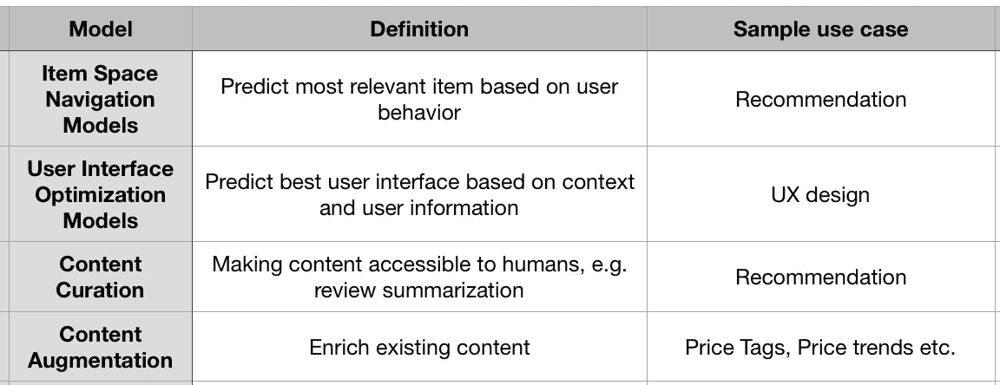
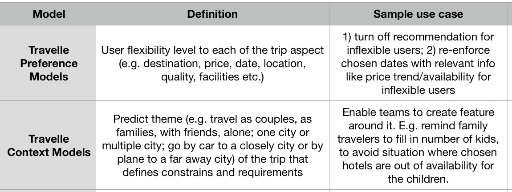
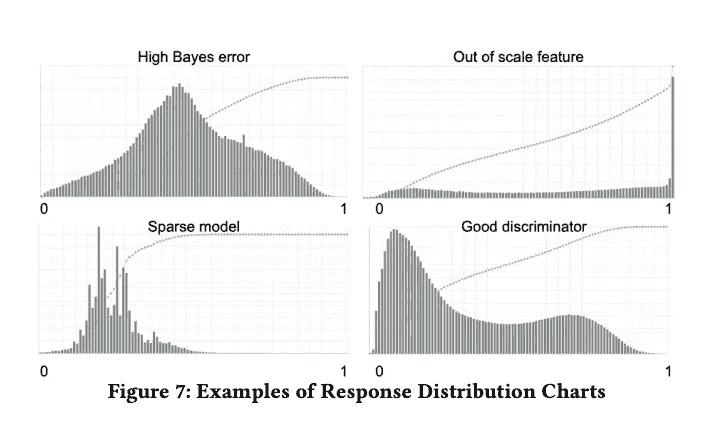
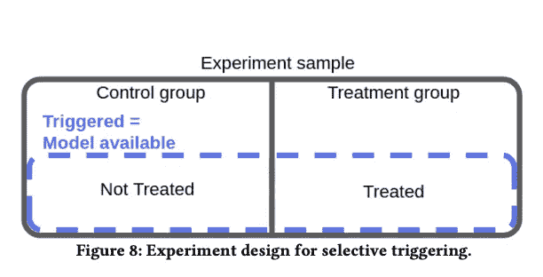
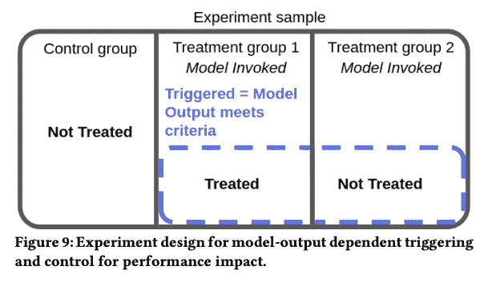
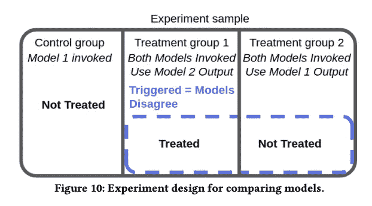

# 建立有效的机器学习模型

> 原文：<https://towardsdatascience.com/build-machine-learning-models-that-work-8cb060117584?source=collection_archive---------32----------------------->

## “150 个成功的机器学习模型:Booking.com 的 6 个经验教训”论文摘要

约书亚·索蒂诺在 [Unsplash](https://unsplash.com?utm_source=medium&utm_medium=referral) 上拍摄的照片

[150 个成功的机器学习模型:Booking.com 的 6 个教训](https://www.kdd.org/kdd2019/accepted-papers/view/150-successful-machine-learning-models-6-lessons-learned-at-booking.com)是 2019 [KDD 会议](https://www.kdd.org/)接受的论文。与业内大多数专注于机器学习理论方面的论文不同，本文更注重实践，并讨论了 Bookings.com 在构建其丰富的模型集合时遇到的挑战。我发现这篇论文非常有趣，因为它提供了我作为数据科学家一直思考的 6 个问题的见解；在本文中，我将尝试总结他们对每个问题的回答:

*   **机器学习可以解决哪些问题？**
*   **如何用机器学习提高业务 KPI？**
*   **如何提高模型性能？**
*   **当存在延迟/不完整的反馈时，如何评估模型？**
*   **有哪些方法可以加快预测过程？**
*   **如何 A/B 测试机器学习系统？**

1.  **机器学习可以解决哪些问题？**

数据科学团队的任务之一是确定组织中可以通过机器学习改进的领域，并对模型构建任务进行优先排序，以便有短期收益来证明团队的价值，并有长期计划来扩展团队的能力。Bookings.com 为他们的机器学习模型开发了一个分类法，可以作为这种规划的一个很好的参考点。他们将模型分为两大类:专用模型和通用模型:

**具体型号**

优势:良好的性能带来强大的业务影响

缺点:用例有限

**通用型号**

优势:适应范围广

缺点:对特定业务指标的影响有限

**2。如何用机器学习提高业务 KPI？**

机器学习模型经常优化相关指标，但不直接优化业务 KPI。例如，bookings.com 关心酒店预订率，但他们的推荐模型优化了点击率，即点击进入酒店描述页面的比率。**除非模型直接优化业务 KPI，否则模型离线性能增益不会总是转化为业务价值增益。**文中提到的情侣理由有:

a)模型指标与业务指标相关但不同，可能会无意中鼓励不良行为。例如，针对点击率(模型度量)进行优化的酒店推荐模型将推荐与用户已经参与的相似的酒店，这鼓励用户点击和比较更多的酒店列表。然而，这可能会将用户引入选择的悖论，并实际上伤害预订率(业务 KPI)。

b)机器学习模型对商业价值的贡献是有上限的。

c)模型太好，即模型比你自己更了解你。这让一些消费者感到不安，因此会产生负面影响，因为用户会有意尝试与模型建议相反的行为。

这个问题没有显而易见的解决方案，但该论文建议**仅将离线指标用作健康检查，并更多地基于业务指标的在线测试来评估模型。**本文中给出的一个例子是，当假设多样性对于推荐系统很重要，并且开发了一个具有更低均方根误差(RMSE)但更具多样性的新模型时，应该针对当前模型进行在线测试，而不考虑其更低的 RMSE，以查看它是否能提供更好的商业价值收益。

**3。如何提高模型性能？**

当谈到提高现有模型的性能时，收集更多的训练数据或试验不同的算法往往是首先想到的事情。不过，本文中提到了一个不同的选项——改变模型设置。

**在解决一个问题时，通常有不同的方法来构建目标变量**(例如，日期灵活性，愿意改变日期以获得更好的价值，或者考虑比典型用户更多的日期等。)、**和** **对于相同的构建目标变量**可以有不同的学习设置(例如，预测酒店停留时间的回归可以变成多类分类)。**改变设置是释放价值的非常有效的方式。**

**4。当反馈延迟/不完整时，如何评估模型？**

用于评估分类模型的度量通常比较真实目标和预测。然而，有时在模型开发时无法获得目标。为了解决这个问题，该论文建议检查预测分布，并基于启发式进行判断调用。下面的截图是来自**二元分类模型**的 4 种可能的预测分布及其含义。(我没有在论文中找到红线是什么的解释，但是感谢[威廉·凯塞多·托里斯](https://medium.com/u/7a925ed40bb4?source=post_page-----8cb060117584--------------------------------)指出它们是每种情况下的累积概率分布)

*   左上:模型的高错误率或数据的高偏差
*   右上:有问题的特征，例如错误的比例或错误的异常值
*   左下:过于稀疏的模型
*   右下:可以区分 2 类的好模型。

**5。有哪些方法可以加快预测过程？**

a)跨集群复制和分发模型

b)建立可简化为内积的内部线性预测引擎

c)建立具有较少参数的稀疏模型

d)当特征空间很小时，预计算所有预测并保存在键值对中；当特征空间很大时，预计算频繁请求

e)当每次预测需要许多请求时，批量请求变成一个

f)应用最小特征变换

**6。如何 A/B 测试机器学习系统？**

该论文描述了传统的随机 A/B 测试不够充分的三种情况，并且需要允许定制触发的更复杂的系统。

提到的第一个实验设置是仅当测试对象暴露于模型时才触发实验。我能想到的一个需要这种设置的例子是，当测试只对用户子集进行预测的算法时。在这种情况下，我们希望确保只有这样的用户包含在测试中。

第二种情况是处理标准取决于模型输出。该论文提到了一个例子，其中他们仅向被模型识别为目的地灵活的用户显示具有备选目的地的块。该实验将把随机选择的控制组用户与被预测为目的地灵活并被示出替代目的地的用户，以及被预测为目的地灵活但未被示出替代目的地的用户进行比较。实验组中被预测为目的地不灵活的用户被排除在治疗组之外。

第三个场景专门用于测试模型更新。在上面的截图中，模型 1 是原始模型，模型 2 是更新的挑战者模型。实验的设置使得只有两个模型不一致的情况被包括在处理组中进行分析。

如果你对更多细节感兴趣，可以在这里找到论文[；它非常容易消化，我强烈推荐每个人都去读一读。](https://www.kdd.org/kdd2019/accepted-papers/view/150-successful-machine-learning-models-6-lessons-learned-at-booking.com)