# 使用 OptimalFlow Web App 构建无代码自动化机器学习模型

> 原文：<https://towardsdatascience.com/build-no-code-automated-machine-learning-model-with-optimalflow-web-app-8acaad8262b1?source=collection_archive---------40----------------------->


凯文·Ku 在 [Unsplash](https://unsplash.com?utm_source=medium&utm_medium=referral) 上的照片

在[***optimal flow***](https://github.com/tonyleidong/OptimalFlow/)的最新版本(0.1.10)中，增加了一个“无代码”的 Web App，作为构建在 ***OptimalFlow*** 之上的应用演示。web 应用程序允许对 OptimalFLow 中的所有参数进行简单的点击和选择，这意味着用户可以构建端到端的自动化机器学习工作流，而无需编写任何代码！( [*文档*](https://optimal-flow.readthedocs.io/) )。

[***optimal flow***](https://github.com/tonyleidong/OptimalFlow/)一开始就设计了高度模块化，便于继续开发。用户可以在此基础上构建应用程序。[***optimal flow***](https://github.com/tonyleidong/OptimalFlow/)*的 web app 是一个用户友好的工具，供没有编码经验的人简单快速地构建一个 Omni-ensemble 自动化机器学习工作流程。*

> *为什么我们要用 ***OptimalFlow*** ？你可以阅读另一个介绍它的故事:[*一个全方位自动化机器学习——optimal flow*](/an-omni-ensemble-automated-machine-learning-optimalflow-369d6485e453)。*

**

*Web App 目前包括 3 个功能组件:*管道群遍历实验(PCTE)* 构建器、LogsViewer 和可视化。用户可以为每个 OptimalFlow 的关键模块设置参数，并通过点击网页运行工作流程。此外，当自动机器学习过程(PCTE)完成后，用户可以立即检查日志信息并查看可视化输出。*

*与其他流行的“无代码”机器学习平台相比，该 Web 应用程序诞生于 ***OptimalFlow*** 独特的 Omni-ensemble 自动化机器学习框架，并建立在*管道集群遍历实验(PCTE)* 理论之上。它也是轻量级的、可扩展的，并且对用户是开源的。它是为需要更多关注本地实现的数据科学家设计的，并且可以很容易地在机器之间移植。当数据科学团队希望将其部署在服务器上时，基于 Flask 的 Web 应用程序可以快速实现，并且具有很高的灵活性。*

# *如何部署 Web 应用程序:*

## *第一步:安装 ***OptimalFlow*** :*

*如果您没有安装***optimal flow****的* 最新版本，您应该从 PYPI 中完成，只需使用 PIP。要安装 OptimalFlow 的最新版本，请在终端或提示符下运行以下命令:*

```
*pip install --upgrade optimalflow*
```

## *第二步:下载 Web App 的源代码:*

*有两种方法下载它的源代码:*

*   *方法 1 从***optimal flow***[GitHub](https://github.com/tonyleidong/OptimalFlow/tree/master/optimalflow)中获取。下载文件夹' **webapp** 中的所有代码和子文件夹。*

*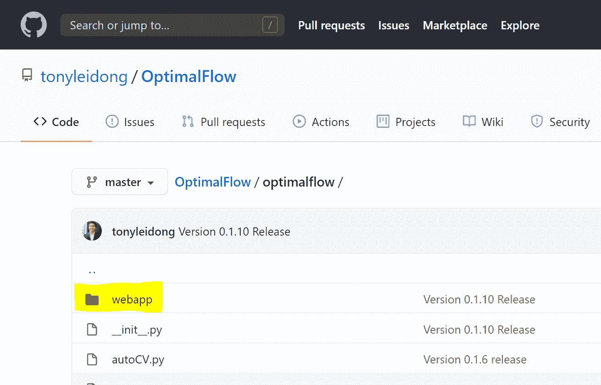*

*方法 2 —从 OptimalFlow 的包中获取。您可以在 Python 核心文件夹中找到它。在这个例子中，您可以找到“ **Webapp** ”文件夹。*

*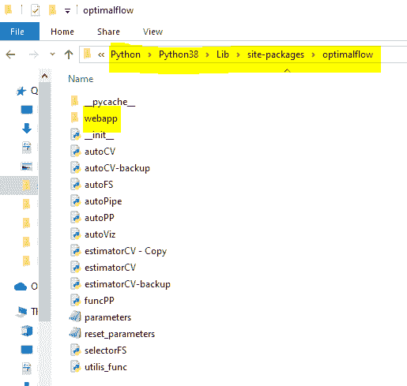*

## *步骤 3:启动服务器端口:*

*将下载的“Webapp”文件夹移动到您想要存储它的位置。使用您的终端或提示符输入它的目录并运行 app.py(当您不在 VS 代码中运行它时，请忽略这里的“py ”)*

*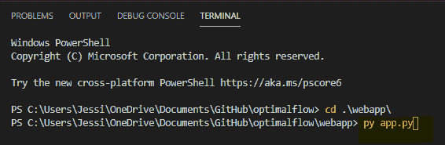*

*您将看到类似下图的输出:*

*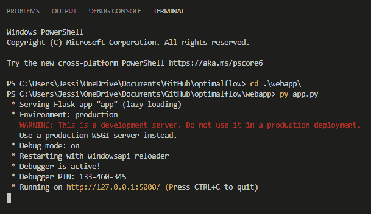*

*搞定了。你现在可以打开你的浏览器(推荐 Chrome)，输入 *127.0.0.1:500* 打开笔记本电脑上的 web app。*

# *构建管道集群遍历实验(PCTE)工作流:*

*当您完成部署步骤并开始运行服务器时，您将在浏览器中看到 web 应用程序，如下图所示:*

*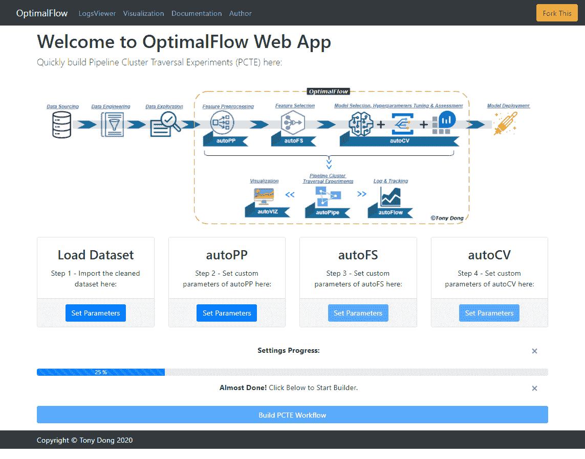*

*要构建一个 PCTE 自动化机器学习工作流，需要为每个 ***OptimalFlow*** 的模块输入参数: *autoPP* ， *autoFS，*和 *autoCV* 。*

> ***但是在此之前，你需要将你想要建立模型的数据集移动到*中。/输入*文件夹。您将在那里看到一个名为“breast-cancer.csv”的样本数据集。***

*完成后，我们可以通过单击“加载数据集”下的按钮来选择数据集:*

*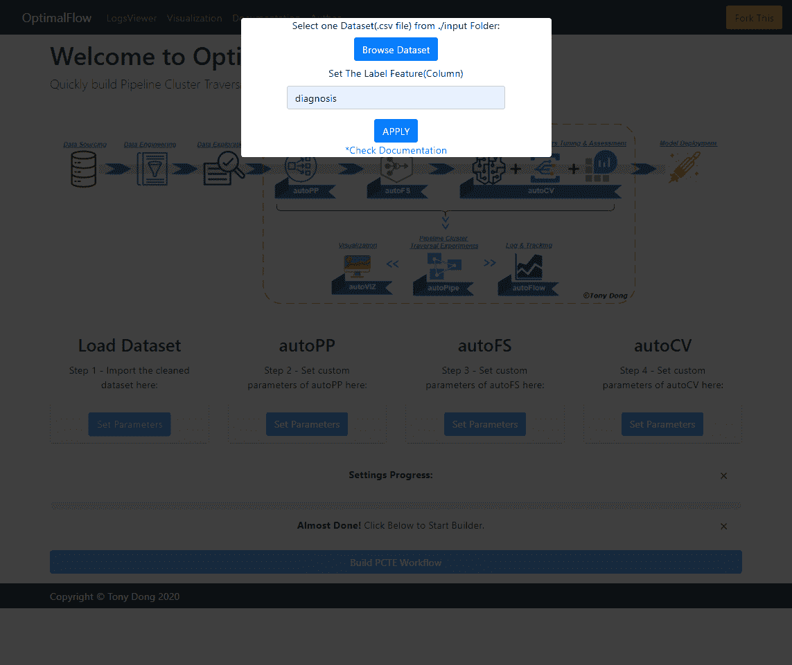*

*然后，您需要逐步完成 *autoPP* 、 *autoFS* 和 *autoCV* 的设置。*

***请注意:**注意设置 *autoPP* 参数面板中的“稀疏度”和“列数”值，如果特征预处理的组合不能满足您设置的限制值，**T5【optimal flow】T6**将无法继续运行下面的模块。更多细节可以在 *autoPP 的* [*文档*](https://optimal-flow.readthedocs.io/en/latest/autoPP.html) 中找到。*

*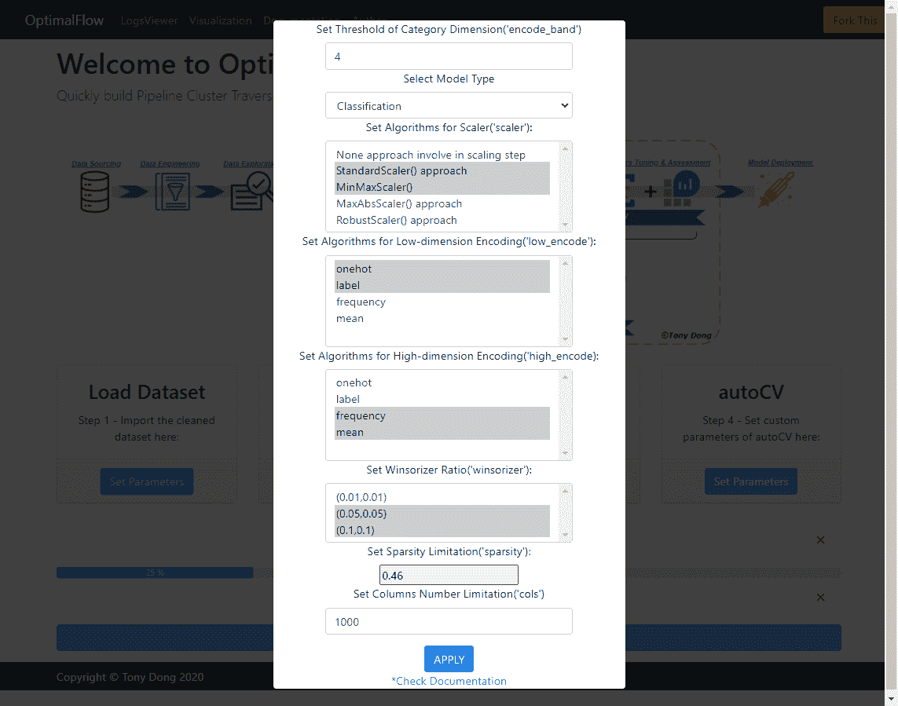*

*接下来，您需要在 *autoFS* 模块中完成参数设置，即设置您想要选择多少个顶级特征，以及您想要 PCTE 通过什么算法。关于 *autoFS* 模块[的更多细节请点击](https://optimal-flow.readthedocs.io/en/latest/autoFS.html)。*

*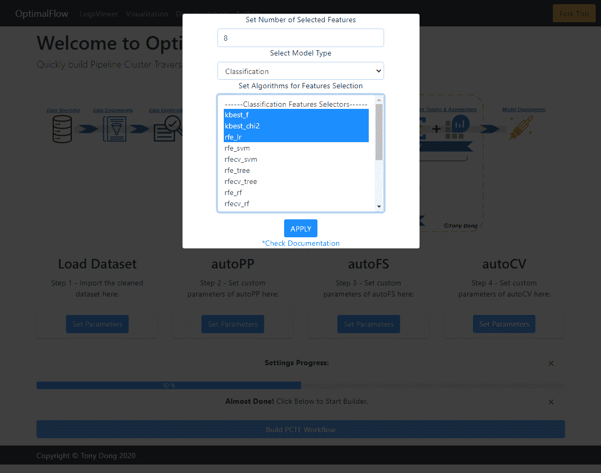*

*对于 *autoCV* 模块的设置，您可以点击*autoCV*’*设置参数*按钮，输入您想要 OptimalFlow 自动测试的调优策略和算法比较范围。关于 *autoCV* 模块[的更多详情请点击](https://optimal-flow.readthedocs.io/en/latest/autoCV.html)。*

*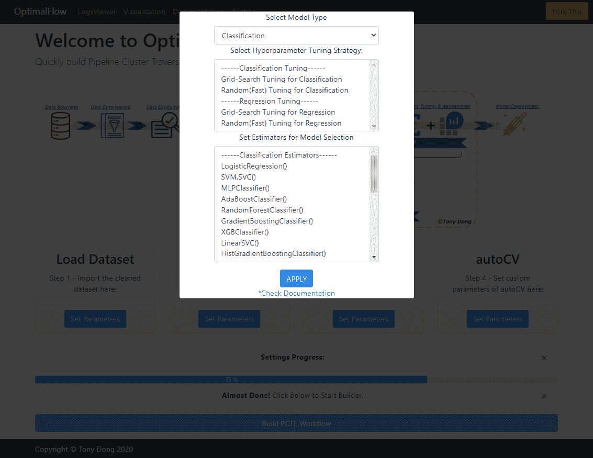*

*最后，当你完成了所有的设置步骤(进度条应该 100%完成)，你可以点击'*建立 PCTE 工作流*按钮，来运行 Omni-ensemble 自动化机器学习操作。该功能基于*自动管道*模块，关于*自动管道*的更多细节在此[处](https://optimal-flow.readthedocs.io/en/latest/autoPipe.html)。*

*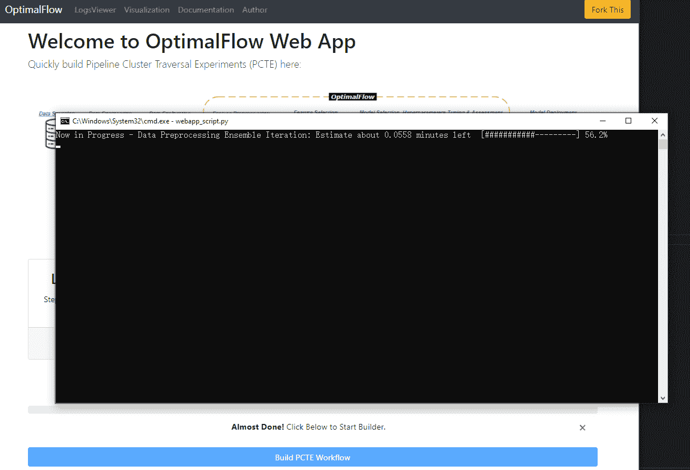*

*这是流程完成后的输出示例。您将在那里找到带有评估指标的前 5 个最佳模型。关于 *OptimalFlow* 模块和笔记本样本的更多细节和用例可以在[文档](https://optimal-flow.readthedocs.io/en/latest/demos.html#examples)中找到。*

*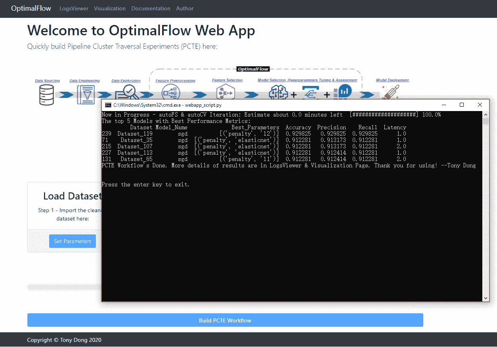*

# *日志查看器:*

*您可以在“**日志查看器**页面查看各个模块的相关日志信息。请注意，您只能在之前的自动机器学习过程完成后使用它。*

*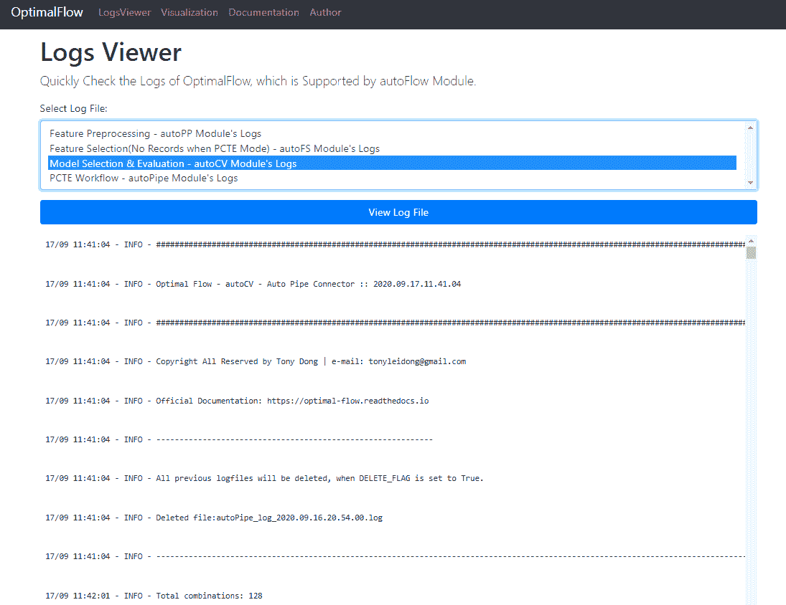*

# *可视化:*

*您还可以从“可视化”页面查看可视化输出。对于分类问题，将给出“管道群遍历实验模型检索图”和“管道群模型评价动态表”。对于回归问题，只呈现'*管道集输模型评价动态表*。所有的可视化输出都是基于 Plotly 的，所以你可以通过拖动或滚动来玩它们。你会在示例[页面](https://optimal-flow.readthedocs.io/en/latest/demos.html#pipeline-cluster-traversal-experiments-model-retrieval-diagram-using-autoviz)找到更多细节。*

**

# *更新:*

## *搜索空间*

*在 OptimalFlow 的下一个版本 0.1.11 中，你可以通过 Web 应用程序编辑评估者的搜索空间。*

*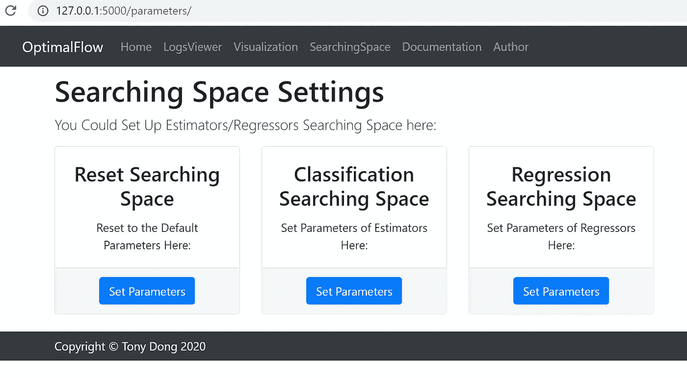**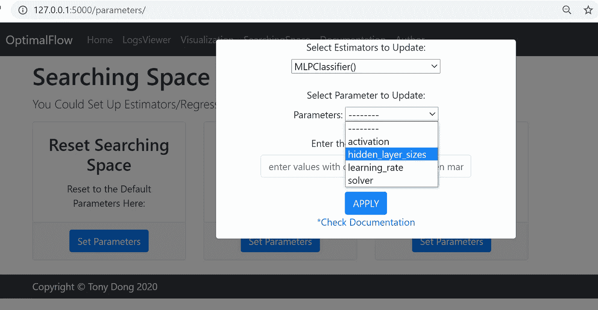*

# *总而言之:*

**OptimalFlow* 是一个简单易用的 API 工具，用简单的代码实现 Omni-ensemble 自动化机器学习，也是证明*管道簇遍历实验* (PCTE)理论的最佳实践库。*

*最新版本的 Web 应用程序是建立在 ***OptimalFlow*** 库上的少数应用程序，它使自动机器学习工作流构建过程变得简单，并且完全没有代码。*

*它的 6 个模块既可以连接起来实现 PCTE 过程，也可以单独使用来优化传统机器学习工作流的组件。你可以在 [***文档***](https://optimal-flow.readthedocs.io/en/latest/demos.html) 中找到它们各自的用例。*

*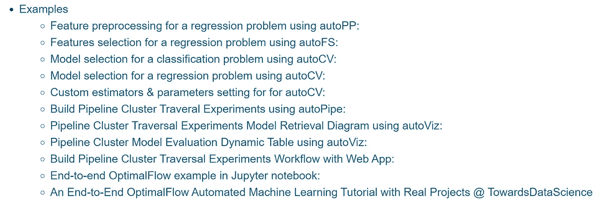*

*关于 ***OptimalFlow*** 的相关阅读:*

> *[使用 OptimalFlow 在机器学习中进行集成特征选择——使用简单代码选择顶级特征的简单方法](/ensemble-feature-selection-in-machine-learning-by-optimalflow-49f6ee0d52eb)*
> 
> *[集成模型选择&使用 OptimalFlow 的机器学习评估—使用简单代码选择最佳模型的简单方法](/ensemble-model-selection-evaluation-in-machine-learning-by-optimalflow-9e5126308f12)*
> 
> *[端到端 OptimalFlow 自动化机器学习教程结合真实项目-公式 E 圈数预测第 1 部分](/end-to-end-optimalflow-automated-machine-learning-tutorial-with-real-projects-formula-e-laps-8b57073a7b50)*
> 
> *[端到端 OptimalFlow 自动化机器学习教程结合真实项目-公式 E 圈数预测第二部分](/end-to-end-optimalflow-automated-machine-learning-tutorial-with-real-projects-formula-e-laps-31d810539102)*

# *关于我:*

*我是一名医疗保健和制药数据科学家以及大数据分析和人工智能爱好者。我开发了 ***OptimalFlow*** 库，帮助数据科学家以一种简单的方式构建最优模型，并用简单的代码实现机器学习工作流的自动化。*

*作为一名拥有多年分析经验的大数据洞察寻求者、流程优化者和人工智能专家，我使用数据科学中的机器学习和问题解决技能将数据转化为可操作的洞察，同时提供战略和量化产品作为最佳结果的解决方案。*

*你可以在 [LinkedIn](https://www.linkedin.com/in/lei-tony-dong/) 或者 [GitHub](https://github.com/tonyleidong) 上和我联系。*