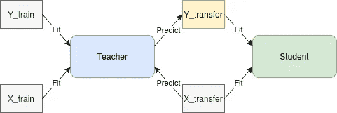
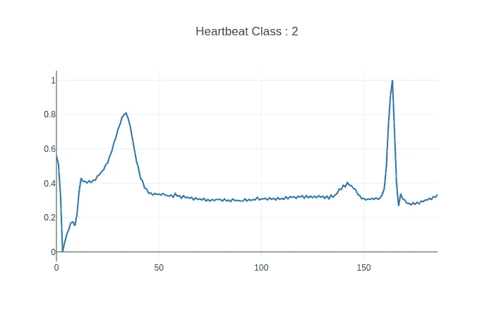
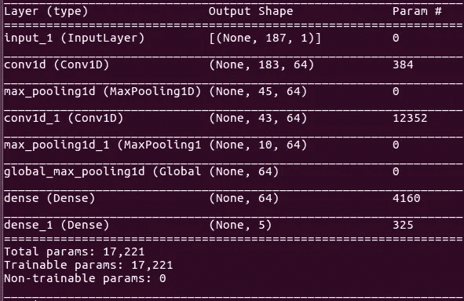
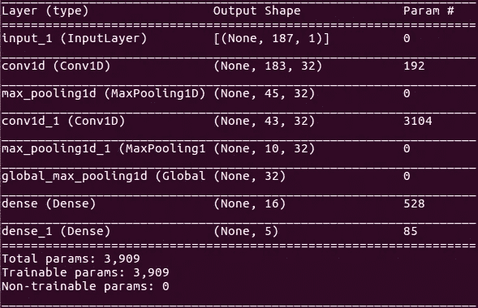

# 使用知识蒸馏构建强大的轻量级模型

> 原文：<https://towardsdatascience.com/build-powerful-lightweight-models-using-knowledge-distillation-618f69b569d9?source=collection_archive---------26----------------------->

## 通过师生培训计划获得高性能的微型模型

照片由 [Tra Nguyen](https://unsplash.com/@thutra0803?utm_source=unsplash&utm_medium=referral&utm_content=creditCopyText) 在 [Unsplash](https://unsplash.com/s/photos/teacher?utm_source=unsplash&utm_medium=referral&utm_content=creditCopyText) 上拍摄

过去几年，机器学习领域的趋势是获得最大的模型，在大量数据上训练它们，然后集成它们，以获得最后几个百分点的准确性。这种方法的一个缺点是，在现实生活的应用程序中部署大型模型或集成可能会很困难。对于任何实际应用来说，它们的权重可能太大，或者它们的推理时间可能太长，尤其是当您试图在嵌入式设备或 web 应用程序的客户端使用它们时。
还有一项积极的研究，即如何通过为移动设备(如 [MobileNets](https://arxiv.org/pdf/1704.04861.pdf) 或[权重量化](https://arxiv.org/abs/1609.07061))构建定制架构，在小巧快速的同时实现不错的性能。

在这篇文章中，我们将展示如何通过使用知识蒸馏(来自[提取神经网络](https://arxiv.org/abs/1503.02531)中的知识)和混合(来自[混合:超越经验风险最小化](https://arxiv.org/abs/1710.09412))来提高微型神经网络的性能。知识蒸馏背后的基本思想是，你定义一个老师(可以是单个模型或整体)和一个学生(这是你想在生产中使用的轻量级模型)，然后你在目标任务上训练老师，并让学生尝试模仿老师。

# 数据:

我们将使用在 Kaggle 数据集[https://www.kaggle.com/mondejar/mitbih-database](https://www.kaggle.com/shayanfazeli/heartbeat)上处于预处理状态的[麻省理工学院-BIH 数据集](https://physionet.org/content/mitdb/1.0.0/)。该数据集包含与心律失常异常相关的五类个体心跳。

# 教师模型:

教师模型是 1D CNN，其具有卷积层，每个卷积层具有 64 个滤波器和两个完全连接的层。总共有**17221 个**可训练参数。

教师模型

# 学生模型:

学生模型的结构与教师模型相同，但卷积层更小。总共有**3909 个**可训练参数，因此**比教师模型**小 4 倍。

# 目标函数:

我们使用应用于独热标签的分类交叉熵来训练教师模型。当应用知识提炼时，使用 Kullback Leibler 散度和由教师模型作为目标预测的软标签上的 MAE 损失之间的混合来训练学生模型。

Kullback Leibler 散度测量两个概率分布之间的差异，因此这里的目标是使学生预测的分布{在班级上}尽可能接近教师。

# 结果:

在没有使用任何知识提炼的情况下，微型模型获得了 F1 分数 **0.67 +- 0.02** ，在使用知识提炼后，微型模型的性能被提升到 **0.78 +- 0.02** 。当使用知识提炼时，我们能够使用相同的架构获得 F1 分数方面的 **11** 个绩效点。

结果概述:

*   F1 教师模型: **0.82 +- 0.006**
*   F1 微型模式+知识提炼: **0.78 +- 0.02**
*   F1 微型模式从零开始: **0.67 +- 0.02**

# 结论:

在这篇文章中，我们能够实现一个简单的知识蒸馏训练方案，该方案能够使用完全相同的架构将一个非常小的模型的性能从 **0.67** F1 提升到 **0.78** F1。例如，当拥有尽可能小且性能良好的模型对于部署非常重要时，这可能非常有用。当使用这种方法时，有很多需要探索的地方，比如使用合奏作为老师，或者老师和学生之间的大小差异如何影响知识提炼的质量。这将在以后的文章中完成😃。

# 参考资料:

*   [在神经网络中提取知识](https://arxiv.org/pdf/1503.02531.pdf)

# 代码:

[https://github.com/CVxTz/knowledge_distillation](https://github.com/CVxTz/knowledge_distillation)