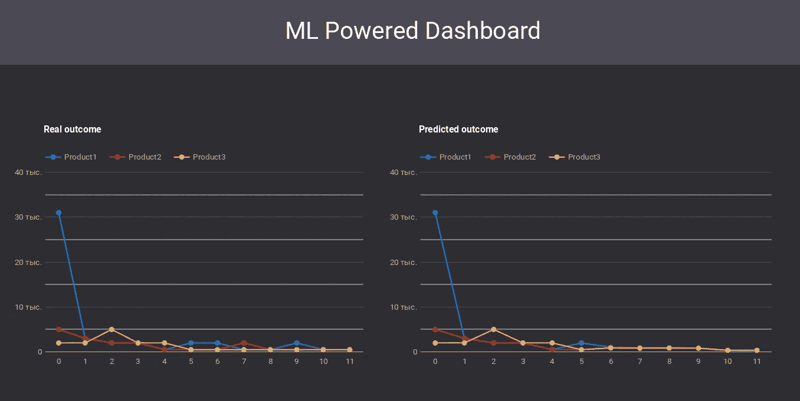
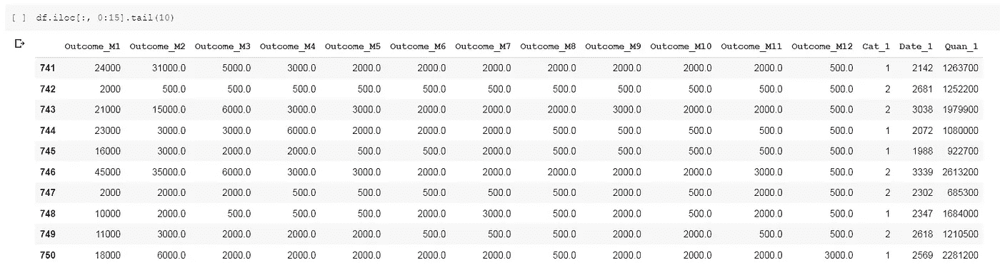
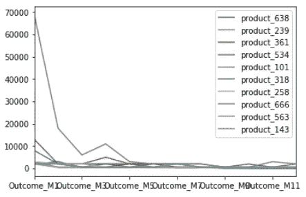
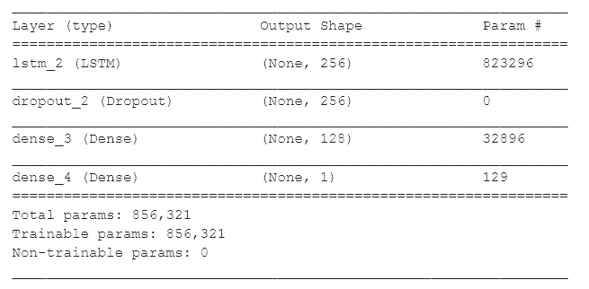
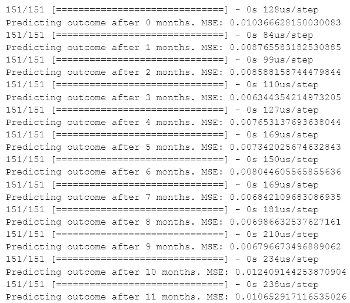
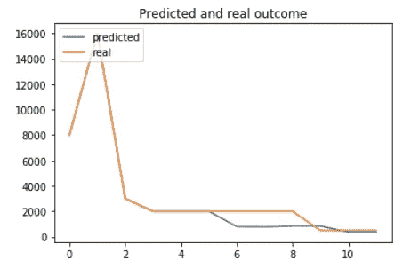

# 使用 Google Colab、Google Data Studio 和 Google Sheets 构建预测性商业智能

> 原文：<https://towardsdatascience.com/build-predictive-business-intelligence-with-google-colab-google-data-studio-and-google-sheets-9a5c1559124f?source=collection_archive---------28----------------------->

## 基于免费 Google 服务的预测性 BI 解决方案的实验结果



图片作者:Rostyslav Neskorozhenyi

我们许多人习惯于认为商业智能是大公司使用的东西，是用昂贵且通常难以学习的工具创建的(尽管也有令人愉快的例外，如[元数据库](https://www.metabase.com/)和[超集](https://superset.incubator.apache.org/))。在我的文章中，我想展示几乎每个人都可以使用商业智能的力量，甚至可以通过普遍可用和免费的在线工具为其添加一些预测分析，如[谷歌 Colab](https://colab.research.google.com/) 和[谷歌数据工作室](https://datastudio.google.com/)。不需要部署数据库。所有用于分析和可视化的数据，我们将存储在谷歌表。

我们将在 Google Colab 中实现一个机器学习模型，根据产品的销售历史，我们将能够预测未来几个月的销售情况，并在 Google Data Studio 中可视化我们的预测。

我们将使用包含产品列表信息和每种产品 12 个月的销售历史的数据集。

该模型将分析每个月的销售历史和产品功能的变化，因此任何变化都会动态地影响模型预测。这将使我们能够迅速评估某些决定的后果，并采取最佳发展战略。

# 加载数据

我们认为，我们在 Google Colab 中的所有操作。首先，我们将使用 **kaggle** 模块下载所需的数据集。你可以通过这个[链接](https://github.com/Kaggle/kaggle-api)阅读更多关于模块和如何获得 Kaggle API 令牌的细节。

> **数据集描述:**[**https://www.kaggle.com/c/online-sales/data**](https://www.kaggle.com/c/online-sales/data)**。**

```
!pip install kaggle
```

由于我们正在使用 Google Colab，我们将连接到 Google Drive 来复制 Kaggle 凭据。

```
from google.colab import drive
drive.mount(‘/content/drive/’)
```

用保存的凭证设置一个工作目录(在我们的例子中，该目录称为“Colab 笔记本”)。

```
import os
os.chdir(“/content/drive/My Drive/Colab Notebooks”)
```

复制 Kaggle API 的凭据。

```
import os
os.chdir(“/content/drive/My Drive/Colab Notebooks”)
```

下载数据集。

```
!kaggle competitions download -c online-sales
```

将数据集加载到内存中，并用零替换空值。

```
import pandas as pd
import numpy as np
from matplotlib import pyplot as pltdf = pd.read_csv(“TrainingDataset.csv”)
df = df.replace(np.nan, 0, regex=True)
```

现在我们可以预览数据集了。



图片作者:Rostyslav Neskorozhenyi

我们将把数据集分成训练部分(我们将在其上训练我们的模型)和测试部分(我们将在其上测试我们的模型的正确性)。

```
from sklearn.model_selection import train_test_splitdf_train, df_test = train_test_split(df, test_size=0.2)
print(df_train.shape)
print(df_test.shape)
```

# 探索性数据分析

让我们将数据可视化。我们将展示 10 个随机产品的价格变化动态。

```
import randomindexes = random.sample(range(len(df)), 10)
df_plot = pd.DataFrame()for i in indexes:
  df_plot[“product_”+str(i)] = df.iloc[i, 0:12]df_plot.plot();
```



图片作者:Rostyslav Neskorozhenyi

正如我们所看到的，在大多数情况下，全年的销售额都在下降。

# 准备数据

我们需要以一种特殊的方式准备数据，以便加载到我们的模型中。我们将建立一个模型，根据以前的值预测未来一个月的结果。对于每个月，模型将分析产品功能和有关上个月结果的信息。

首先，我们将分开产品功能和每月结果的信息。

```
y_train_real = df_train.iloc[:, 0:12].values
print(y_train_real.shape)y_test_real = df_test.iloc[:, 0:12].values
print(y_test_real.shape)x_train_real = df_train.iloc[:, 12:].values
x_test_real = df_test.iloc[:, 12:].values
print(x_train_real.shape)
print(x_test_real.shape)
```

在一个范围内缩放值以获得更好的预测。

```
from sklearn.preprocessing import MinMaxScaler#scale datasets
x_scaler = MinMaxScaler()
x_scaler = x_scaler.fit(x_train_real)
x_train = x_scaler.transform(x_train_real)
x_test = x_scaler.transform(x_test_real)y_scaler = MinMaxScaler()
y_scaler = y_scaler.fit(y_train_real)
y_train = y_scaler.transform(y_train_real)
y_test = y_scaler.transform(y_test_real)
```

现在让我们转到这个过程中最重要的一步:将价格历史转换成多维时间序列。对于每个产品，我们将创建 1-12 个时间步的时间序列，其中包含有关产品功能和以前时间步结果的信息。我们不知道第一个时间步长的先前结果，所以我们只取零。

在这里，我们为训练和测试数据创建列表，每个列表将包含 12 个三维 numpy 数组。每个数组的第二维将代表时间步长，并逐渐增加 1。

```
x_train_series = []
x_test_series = []for k in range(len(y_train[0])):
  x_train_series.append(np.zeros((x_train.shape[0], k+1, x_train.shape[1]+1)))for k in range(len(y_test[0])):
  x_test_series.append(np.zeros((x_test.shape[0], k+1, x_test.shape[1]+1)))
```

向每个时间步长添加有关产品功能和先前时间步长结果的信息。现在，我们对每个时间步长使用相同的产品功能，但是该模型允许跟踪每个时间步长上的功能变化，以做出更准确的预测。

```
for k in range(len(y_train[0])):
  for i in range(len(x_train)):
    for j in range(k + 1):
      shifted_index = j - 1
      if shifted_index < 0:
        x_train_series[k][i, j] = np.append(x_train[i], 0)
      else:
        x_train_series[k][i, j] = np.append(x_train[i], y_train[i, shifted_index])
```

测试数据的相同时间步长转换。

```
for k in range(len(y_test[0])):
  for i in range(len(x_test)):
    for j in range(k + 1):
      shifted_index = j - 1
      if shifted_index < 0:
        x_test_series[k][i, j] = np.append(x_test[i], 0)
      else:
        x_test_series[k][i, j] = np.append(x_test[i], y_test[i, shifted_index])
```

制作 12 个列表，列出每个时间、每个产品的结果信息。

```
y_train_series = []
y_test_series = []for k in range(len(y_train[0])):
  y_train_series.append(np.zeros((len(y_train), 1)))
  y_test_series.append(np.zeros((len(y_test), 1)))

for k in range(len(y_train[0])):
  y_train_series[k] = y_train[:, k].reshape(-1, 1)
  y_test_series[k] = y_test[:, k].reshape(-1, 1)
```

# 构建 LSTM 神经网络

我们将使用长短期记忆(LSTM)网络的递归神经网络(RNN)。你可以在这里阅读更多关于这些类型的神经网络:

[http://colah.github.io/posts/2015-08-Understanding-LSTMs/](http://colah.github.io/posts/2015-08-Understanding-LSTMs/)

我们使用 Keras 框架进行深度学习。我们的模型仅由一个具有 256 个单元的 LSTM 层、一个具有 128 个单元的密集层和具有一个神经元的密集连接输出层组成。我们还添加了一个脱层，以避免过度拟合。模型保持简单和快速，仍然能够做出有用的预测。

```
from keras.models import Sequential
from keras.layers import Dense
from keras.layers import LSTM
from keras.layers import Dropoutmodel = Sequential()
model.add(LSTM(256, input_shape=(None, x_train.shape[1]+1)))
model.add(Dropout(0.5))
model.add(Dense(128, activation = "relu"))
model.add(Dense(1))
model.summary()
```



```
model.compile(loss='mse', optimizer='rmsprop')
```

训练我们的模型:

```
for i in range(len(x_train_series)):
  print(i)
  model.fit(x_train_series[i], y_train_series[i], epochs=10, validation_split=0.2)
```

评估模型，预测几个月后的结果。

```
for i in range(len(x_test_series)):
  accr = model.evaluate(x_test_series[i], y_test_series[i])
  print("Predicting outcome after {} months. MSE:".format(i), accr)
```



# 结果预测函数

我们将使用我们的模型创建一个递归函数，该函数将在几个月内获取有关产品特性和结果历史的信息。因此，这个函数可以预测未来几个月的结果。

```
def predictor(features, history, future):
  '''
  features: list of product features
  history: list with outcome per month
  future: int, number of months to predict outcome
  '''
  if future == 0:
    return history  

  p_serie = np.zeros((1, len(history), len(features)+1))  

  for j in range(len(history)):
    shifted_index = j - 1
    if shifted_index < 0:
      p_serie[0, j] = np.append(features, 0)
    else:
      p_serie[0, j] = np.append(features, history[shifted_index])

  prediction = model.predict(p_serie)    

  history.append(prediction[0][0])
  future -= 1  

  return predictor(features, history, future)
```

我们将在随机产品 *n* 上测试我们的功能。我们将创建两个列表。首先是前 *m* 个月的成果历史，其次是产品特性

```
import randomn = random.choice(range(len(x_test)-1))
m = 6
future = 6features = x_test[n].tolist()
history = y_test[n, 0:m].tolist()
```

绘制预测结果与实际数据的对比图

```
prediction = predictor(features, history, future)plt.plot(y_scaler.inverse_transform([prediction])[0])
plt.plot(y_scaler.inverse_transform([y_test[n, :m+future]])[0])
plt.title('Predicted and real outcome')
plt.legend(['predicted', 'real'], loc='upper left')
axes = plt.gca()plt.show()
```



图片作者:Rostyslav Neskorozhenyi

正如我们所看到的，它相当准确地显示了销售变化的总体趋势。对于一个相对简单的模型来说，这是一个不错的结果。

# 在 Google Data Studio 中显示预测

现在，当我们有了我们的预测数据，我们可以在谷歌的商业智能解决方案[谷歌数据工作室](https://datastudio.google.com/)中显示它。这个工具的一个优点是可以免费用来制作自定义报表和仪表盘。

Google Data Studio 可以连接多个数据源进行报告。Google Sheets 作为数据源很适合我们的目的。我们将把我们的预测保存为 Google Sheet，Google Data Studio 将在 dashbord 上显示其中的数据。因此，我们可以很容易地整合谷歌实验室和数据工作室。

我不会详细解释谷歌数据工作室的功能。你可以在 https://developers.google.com/datastudio/[的官方文件中了解到](https://developers.google.com/datastudio/)

我们将随机抽取三个产品，保存每个产品的预测和结果历史。为了将我们的数据保存到谷歌电子表格中，我们将使用 **gspread** 库。

我们将需要一个客户端密钥写在谷歌电子表格。这里介绍如何得到钥匙[https://gspread.readthedocs.io/en/latest/oauth2.html](https://gspread.readthedocs.io/en/latest/oauth2.html)。

```
!pip install — upgrade oauth2client gspread
```

连接到 Google Sheets。

```
import gspread
from oauth2client.service_account import ServiceAccountCredentialsscope = ['[https://spreadsheets.google.com/feeds'](https://spreadsheets.google.com/feeds'),
         '[https://www.googleapis.com/auth/drive'](https://www.googleapis.com/auth/drive')]credentials = ServiceAccountCredentials.from_json_keyfile_name('spreadkey.json', scope)gc = gspread.authorize(credentials)
```

列出三种随机产品的真实和预测结果历史。出于测试目的，我们使用来自测试数据集的数据，但在实际情况下，您可以在 Google Sheets 中插入产品功能的任何变化，从 Google Sheets 加载数据并做出预测。

```
real_data = []
predicted_data = []for i in range(3):
  n = random.choice(range(len(x_test)-1))
  m = 6
  future = 6
  features = x_test[n].tolist()
  history = y_test[n, 0:m].tolist() prediction = predictor(features, history, future) predicted_data.append(y_scaler.inverse_transform([prediction])[0])
  real_data.append(y_scaler.inverse_transform([y_test[n, :m+future]])[0])
```

打开谷歌工作表保存真实和预测的数据。我们有两个工作表:“真实”代表真实数据，“预测”代表预测数据。

```
ws = gc.open('TrainingDataset2')ws_predicted = ws.worksheet("predicted")
ws_real = ws.worksheet("real")
```

把我们真实的和预测的数据写到 Google Sheets。我们将从第二行开始写，保留第一行作为列名(Product1、Product2、Product3)。

```
for j in range(len(real_data)):
  for i in range(len(real_data[0])):
    ws_predicted.update_cell(i+2, j+1, float(predicted_data[j][i]))
    ws_real.update_cell(i+2, j+1, float(real_data[j][i]))

for i in range(len(real_data[0])):    
    # add index column
    ws_predicted.update_cell(i+2, len(real_data)+1, i)
    ws_real.update_cell(i+2, len(real_data)+1, i)
```

在 Google Sheets 查看我们的数据

```
ws_real.get_all_records()[6:11]
```


由于我们已经有了充满真实和预测结果的 Google Sheets，现在我们可以将 Google Sheets 作为 Google Data Studio 中的数据源进行连接。

在 Google Data Studio 中，创建新的仪表板并为其创建数据源。你会在资源列表中找到谷歌工作表。将您的 Google 工作表添加为数据源。

基于“预测的”和“真实的”工作表中的数据，我们可以做出显示结果变化的图表。

就是这样！现在你有人工智能驱动的仪表板，显示对未来结果的预测！


图片作者:Rostyslav Neskorozhenyi

# 结论

这篇文章的主要思想是，甚至带有一些人工智能特征的商业智能比我们想象的更容易获得。您可以创建高级分析，将建议的图表嵌入到您的分析报告中，并对当前情况和不久的将来有所了解。所有的变化，你想检查可以迅速插入谷歌表，预测的后果将在谷歌 Colab 计算，并显示在谷歌数据工作室。

你可以通过这个[链接](https://colab.research.google.com/drive/1O3_LJOL40ZvIWtnYE36HSBWzKgIZCC9W?usp=sharing)找到所有描述代码的 Google Colab 笔记本。