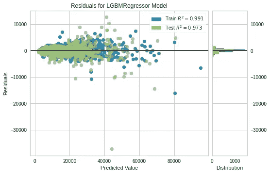

# 用 PyCaret 构建:部署在 Google 云平台上

> 原文：<https://towardsdatascience.com/build-pycaret-deploy-gcp-521415a6c330?source=collection_archive---------36----------------------->

## 实用教程

## 将机器学习模型部署到谷歌云平台


由作者创建

在这个故事中，我开发了一个关于在谷歌云平台上部署一个用`pycaret`训练的模型的工作教程。本教程可以用来部署任何机器学习模型，稍加修改。

我们将学习如何将使用`pycaret`训练的模型部署到 Google 云平台。正如你可能知道的，`pycaret`已经支持在 AWS 上部署训练好的模型，但目前还不支持 GCP 或 Azure。我遵循了库中用于在 [AWS](https://aws.amazon.com/) 上部署模型的类似代码实践，并为 GCP 部署添加了必要的实用程序。

> PyCaret 是 Python 中的一个开源、低代码机器学习库，它允许您在选择的笔记本环境中在几秒钟内从准备数据到部署模型。

PyCaret 是公民数据科学家的 autoML 框架，在其官方文档中使用。PyCaret 相对来说是一个新的库，几个月前发布供公众使用，目前仍在积极开发中。在浏览了一些源代码后，我意识到当前的公开版本缺乏对将经过训练/最终确定的模型部署到 Google 云平台的支持。但是，它只支持在 Amazon web services 上部署。

考虑到 GCP 作为云服务的广泛使用，我尝试添加了一个教程，使用 PyCaret 的方式在 google cloud 上部署训练好的模型。

对于本教程，我们将使用[回归教程(REG101) —初级初学者](https://pycaret.org/reg101/)进行模型训练。

## 正在安装 PyCaret

```
!pip install pycaret
```

## 安装 Gdrive

我们需要安装 google drive 来在 colab 环境中读/写数据。下面是最简单的安装方法。您将被要求输入访问过程生成的令牌。这里是关于[安装 gdrive](https://medium.com/@prajwal.prashanth22/google-colab-drive-as-persistent-storage-for-long-training-runs-cb82bc1d5b71) 的文章的链接

在本教程中，我们将在 Google drive 上本地保存模型。

```
from google.colab import drive
drive.mount('/content/drive')Drive already mounted at /content/drive; to attempt to forcibly remount, call drive.mount("/content/drive", force_remount=True).
```

让我们创建一个目录来本地保存模型。

```
# Create directory on google drive to save models locally. You can use temp paths.
import os
model_dir = '/content/drive/My Drive/gcp_deploy_model/'
os.makedirs(model_dir, exist_ok=True)
```

# 获取数据

您可以从这里找到的原始源[](https://github.com/DardenDSC/sarah-gets-a-diamond)**下载数据，并使用 pandas [**(了解如何使用)**](https://pandas.pydata.org/pandas-docs/stable/reference/api/pandas.read_csv.html) 加载数据，或者您可以使用 PyCaret 的数据存储库使用`get_data()`函数加载数据(这将需要互联网连接)。**

```
from pycaret.datasets import get_data
dataset = get_data('diamond')
```

****

```
#check the shape of data
dataset.shape(6000, 8)data = dataset.sample(frac=0.9, random_state=786).reset_index(drop=True)
data_unseen = dataset.drop(data.index).reset_index(drop=True)

print('Data for Modeling: ' + str(data.shape))
print('Unseen Data For Predictions: ' + str(data_unseen.shape))Data for Modeling: (5400, 8)
Unseen Data For Predictions: (600, 8)
```

## **在 PyCaret 中设置环境**

**让我们使用 PyCaret 的设置模块准备一个建模管道。**

```
from pycaret.regression import *exp_reg101 = setup(data = data, target = 'Price', session_id=123)Setup Succesfully Completed!
```

****

## **创建一个轻型 GBM 模型**

**对于本教程，我们使用 PyCaret 中实现的许多选项中的轻量级 GBM 对数据进行建模。您可以选择任何您喜欢的模型，但这不是本教程的重点。**

```
lightgbm = create_model('lightgbm')
```

****

## **调谐光梯度增强机**

**让我们来训练这个模型，用 PyCaret 的术语来说也叫做调整模型。**

```
tuned_lightgbm = tune_model('lightgbm')
```

****

## **残差图**

**下图显示了模型的残差**

```
plot_model(tuned_lightgbm)
```

****

**让我们画出预测误差与目标值的关系图。**

```
plot_model(tuned_lightgbm, plot = 'error')
```

****

## **特征重要性图**

**特征重要性是一个非常有用的图，可以看到模型中每个特征的贡献。**

```
plot_model(tuned_lightgbm, plot='feature')
```

****

**分析模型性能的另一种方法是使用`evaluate_model()`函数，该函数显示给定模型的所有可用图的用户界面。它在内部使用`plot_model()`功能。**

```
evaluate_model(tuned_lightgbm)interactive(children=(ToggleButtons(description='Plot Type:', icons=('',), options=(('Hyperparameters', 'param…
```

## **根据测试/保留样本进行预测**

```
predict_model(tuned_lightgbm);
```

****

## **最终确定用于部署的模型**

```
final_lightgbm = finalize_model(tuned_lightgbm)#Final Light Gradient Boosting Machine parameters for deployment
print(final_lightgbm)LGBMRegressor(boosting_type='gbdt', class_weight=None, colsample_bytree=1.0,
              importance_type='split', learning_rate=0.4, max_depth=10,
              min_child_samples=20, min_child_weight=0.001, min_split_gain=0.9,
              n_estimators=90, n_jobs=-1, num_leaves=10, objective=None,
              random_state=123, reg_alpha=0.9, reg_lambda=0.2, silent=True,
              subsample=1.0, subsample_for_bin=200000, subsample_freq=0)predict_model(final_lightgbm)
```

********

## **根据看不见的数据预测**

```
unseen_predictions = predict_model(final_lightgbm, data=data_unseen)
unseen_predictions.head()
```

****

**`Label`列被添加到`data_unseen`集合中。标签是使用`final_lightgbm`模型的预测值。如果您想对预测进行四舍五入，您可以在`predict_model()`中使用`round`参数。**

## **在本地保存模型**

**让我们首先在本地保存模型**

```
model_dir
model_name = 'Final_lightgbm_model''/content/drive/My Drive/gcp_deploy_model/'# Saving model to google drive

save_model(final_lightgbm, model_dir + model_name)Transformation Pipeline and Model Succesfully Saved
```

## **加载保存的模型**

**为了在将来的某一天在相同或不同的环境中加载已保存的模型，我们将使用 PyCaret 的`load_model()`函数，然后轻松地将已保存的模型应用于新的未知数据进行预测。**

```
saved_final_lightgbm = load_model(model_dir + model_name)Transformation Pipeline and Model Sucessfully Loaded
```

**一旦模型被加载到环境中，您可以使用相同的`predict_model()`函数简单地使用它来预测任何新数据。下面我们应用了加载模型来预测我们在上一节中使用的相同的`data_unseen`。**

```
new_prediction = predict_model(saved_final_lightgbm, data=data_unseen)new_prediction.head()
```

****

**注意`unseen_predictions`和`new_prediction`的结果是相同的。**

# **在谷歌云平台上部署训练好的模型**

**一旦我们有了训练好的模型，下一个任务就是部署它来为客户服务。有各种部署选项可用，但在这一节中，我将重点放在部署在谷歌云人工智能平台上。我尝试使用类似于`pycaret`库中的方法在 AWS 上部署。**

## **先决条件**

**在 google cloud 上部署机器学习模型的先决条件是**

*   **熟悉谷歌云项目**
*   **对存储桶和 it gsutil 命令行工具有基本的了解**
*   **基本了解 gcloud 命令行工具与 Google Cloud 的交互**
*   **使用 PyCaret 的最终训练模型**

> **[阅读指南](https://cloud.google.com/ai-platform/prediction/docs/deploying-models#scikit-learn-or-xgboost-model-file)**

```
from google.colab import auth
auth.authenticate_user()
```

**定义 google cloud project，target bucket，设置 cloud_project 环境变量。创建一个谷歌云项目，如果之前没有创建的话。请遵循上述指南获取更多信息。**

```
# GCP project name, Change the name based on your own GCP project.
CLOUD_PROJECT = 'gcpessentials-rz' # GCP project name
bucket_name = 'pycaret-reg101-rz' # bucket name for storage of your model
BUCKET = 'gs://' + CLOUD_PROJECT + '-{}'.format(bucket_name)
# Set the gcloud consol to $CLOUD_PROJECT Environment Variable for your Desired Project)
!gcloud config set project $CLOUD_PROJECTUpdated property [core/project].
```

**我们定义了一些实用函数来创建 google 云存储桶，将 blob 上传到存储桶，并从存储桶下载 blob。**

**代码取自谷歌官方文档，并根据我们的要求稍作修改。**

```
from google.cloud import storage

def create_bucket(project_name, bucket_name):
    """Creates a new bucket."""
    # bucket_name = "your-new-bucket-name"

    storage_client = storage.Client(project_name)

    buckets = storage_client.list_buckets()

    if bucket_name not in buckets:
      bucket = storage_client.create_bucket(bucket_name)
      print("Bucket {} created".format(bucket.name))
    else:
      raise FileExistsError('{} already exists'.format(bucket_name))

def upload_blob(project_name, bucket_name, source_file_name, destination_blob_name):
    """Uploads a file to the bucket."""
    # bucket_name = "your-bucket-name"
    # source_file_name = "local/path/to/file"
    # destination_blob_name = "storage-object-name"

    storage_client = storage.Client(project_name)
    bucket = storage_client.bucket(bucket_name)
    blob = bucket.blob(destination_blob_name)

    blob.upload_from_filename(source_file_name)

    print(
        "File {} uploaded to {}.".format(
            source_file_name, destination_blob_name
        )
    )

def download_blob(project_name, bucket_name, source_blob_name, destination_file_name):
    """Downloads a blob from the bucket."""
    # bucket_name = "your-bucket-name"
    # source_blob_name = "storage-object-name"
    # destination_file_name = "local/path/to/file"

    storage_client = storage.Client(project_name)

    bucket = storage_client.bucket(bucket_name)
    blob = bucket.blob(source_blob_name)

    if destination_file_name is not None: 
      blob.download_to_filename(destination_file_name)

      print(
          "Blob {} downloaded to {}.".format(
              source_blob_name, destination_file_name
          )
      )

    return blob
```

## **将模型保存到 GCP 存储桶**

**使用上面的实用程序，使用下面的代码将模型上传到 GCP 存储桶。**

```
# Create Bucket
create_bucket(CLOUD_PROJECT, bucket_name)Bucket pycaret-reg101-rz created
```

**将模型上传到 google 云存储桶**

```
# Save Model Local/google drive and upload to GCP
model_name_gcp = 'lightgbm-reg101-gcp'
save_model(final_lightgbm, model_name= model_dir + model_name_gcp, verbose=False)
model_src = model_dir + model_name_gcp +'.pkl'
model_dst = str(model_name)+'.pkl'upload_blob(CLOUD_PROJECT, bucket_name, model_src, model_dst)File /content/drive/My Drive/gcp_deploy_model/lightgbm-reg101-gcp.pkl uploaded to Final_lightgbm_model.pkl.
```

## **从 GCP 下载预测模型**

**一旦你的模型上传到 GCP，你可以随时下载来进行预测。我遵循一个简单的流程，首先在本地或 google drive 中下载模型，然后使用`load_model`函数，可以生成预测。**

```
outfile_name = model_dir + 'lightgbm-reg101-gcp-downloaded'
model_gcp_src = str(model_name)+'.pkl'
model_downloaded = download_blob(CLOUD_PROJECT, bucket_name, model_gcp_src, outfile_name + '.pkl')Blob Final_lightgbm_model.pkl downloaded to /content/drive/My Drive/gcp_deploy_model/lightgbm-reg101-gcp-downloaded.pkl.os.listdir(model_dir)['Final_lightgbm_model.pkl',
 'lightgbm-reg101-gcp.pkl',
 'lightgbm-reg101-gcp-downloaded.pkl']
```

**使用最近从 GCP 下载的模型进行预测。**

```
# Loading the model for predictions
gcp_final_lightgbm = load_model(outfile_name)Transformation Pipeline and Model Sucessfully Loaded# Predictions from deployed model
new_prediction_gcp = predict_model(gcp_final_lightgbm, data=data_unseen)new_prediction_gcp.head()
```

****

# **谷歌 Colab 笔记本**

**按照下面的谷歌合作笔记本来复制和实践这个指南。**

# **结论**

**在本教程中，我们学习了如何在使用`pycaret`库训练时将模型部署到 GCP。**

**主要目标是使用`[pycaret](https://github.com/pycaret/pycaret)`的内置实用程序从 GCP 部署和加载模型。以下是一些亮点**

*   **安装 google drive 以保存模型**
*   **用`pycaret`训练回归模型**
*   **保存并加载经过训练/最终确定的模型 google drive**
*   **将经过培训/最终确定的模型部署到 GCP 存储桶**
*   **使用 GCP 部署的模型来执行预测**