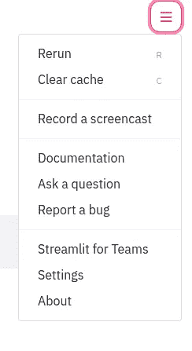
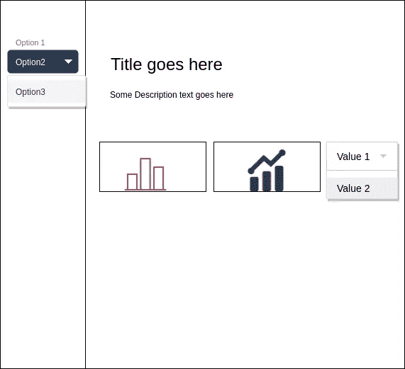
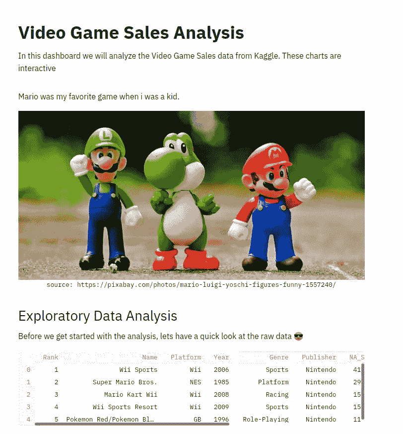
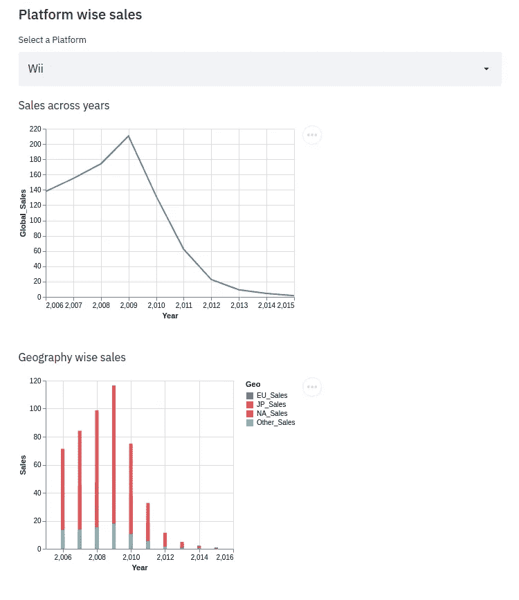
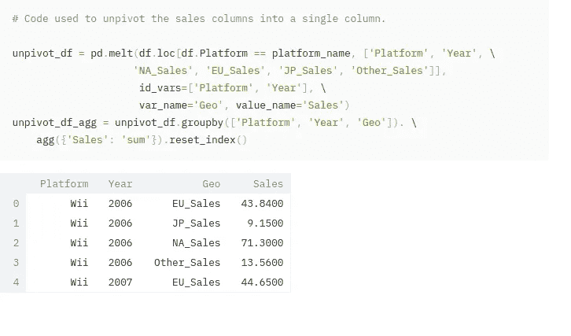
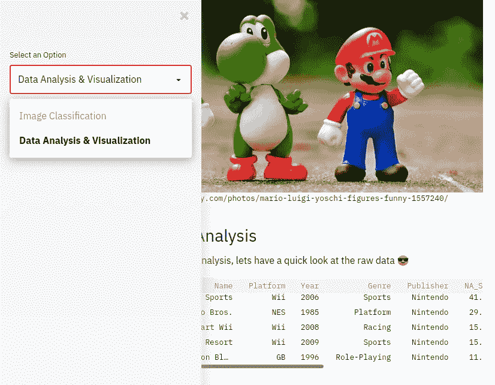
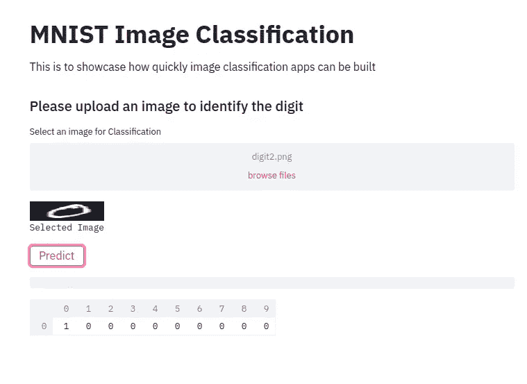

# 使用 Streamlit 构建快速美观的应用程序

> 原文：<https://towardsdatascience.com/build-quick-and-beautiful-apps-using-streamlit-85f32ed01fb2?source=collection_archive---------31----------------------->

## 在几个小时内轻松构建一个交互式应用

卢克·切瑟在 [Unsplash](https://unsplash.com?utm_source=medium&utm_medium=referral) 上的照片

每一个数据都讲述了一个故事。通过视觉表现比查看成千上万的记录更容易理解它们。数据科学家经常利用条形图、折线图、面积曲线等图表向他们的利益相关者传达这个故事。在处理数据时，Python 和 R 一直是首选语言。有多个库，如 Matplotlib、Seaborn、pyVis 等，通过它们可以在 Jupyter 笔记本或独立应用程序中使用 Bokeh、Flask 等创建可视化效果。

在本文中，我将尝试向您介绍 **Streamlit** 并熟悉它。在本文结束时，您将能够根据您的数据创建一个交互式应用程序。让我们从 [Kaggle](https://www.kaggle.com/gregorut/videogamesales) 获取一个公开的数据集。最终，我们将能够创建一个这样的应用程序。

演示应用程序(作者提供的 Gif)

上面的 gif 其实是演示 app 的一段屏幕记录。Streamlit 为您提供了一个简单的选项来录制音频应用程序，以防您需要演示。如果你计划向观众展示它，这是非常有用的。

(图片由作者提供)

# 设置简化 it

在我们开始构建应用程序之前，让我们设置一下 streamlit。我在用 Ubuntu 机器。对于所有操作系统来说，命令几乎都是一样的。

> python3 -m pip 安装细流

如果您遇到这样的错误，这是一个很常见的错误:
*AttributeError:模块' google.protobuf.descriptor '没有属性' _internal_create_key'*

修复方法是升级 protobuf

> python3 -m pip 安装—升级 protobuf

# 让我们构建我们的应用程序

## 设计

在我们开始编码之前，应该花一些时间来创建一个粗略的布局。我的做法是把它画在一张纸上——图表应该放在哪里，下拉框应该放在哪里？图表会连接到按钮吗？…等等
如果你没有纸和笔，draw.io 是绘制设计/流程图/UML 图等的替代方法。这是我在一张纸上画的。

应用布局(图片由作者提供)

## 密码

既然我们已经记住了设计，让我们开始添加标题，然后添加一些分析描述。如果增加应用程序的吸引力，您可能希望添加一个图像。

代码非常简单直观。要加载图像，只需读取图像并调用 ***streamlit.image*** 方法。你也可以写出与 Github 非常相似的降价。要添加描述，我们只需调用带有 python 对象作为参数的 ***write*** 方法。它可以是字符串或熊猫数据框。

在上面的代码中，我们正在读取数据集并显示值的一瞥。就代码而言，它非常简单。你可以称之为取样熊猫数据框。这是 streamlit 的魔法部分，也称为**魔法命令**。当您编写变量名时，streamlit 会隐式地将它写出到您的应用程序中，就像您使用 *write* 方法一样。我们将利用这个应用程序中的一些神奇的命令来创建图表和交互式选项。

启动应用程序— **streamlit 运行 app.py** 。你会得到一个这样的应用程序:

数据概述(图片由作者提供)

看过数据后，我们想创建一些双变量可视化。这些也应该是交互的，以便人们可以选择不同的值并分析趋势。例如，我想显示各种平台的跨年度销售额。为了使它具有交互性，我们添加一个下拉菜单，最终用户可以在其中选择值。

在上面的代码中，我们创建了一个下拉列表和两个图表(折线图和堆积条形图)。要在 streamlit 中创建下拉菜单，非常简单——只需调用 **Magic** 命令 st.selectbox

> platform_name = st.selectbox('选择一个平台'，options= df)。Platform.unique()

现在，我们如何确保在下拉选项中选择的值反映在图形上呢？嗯，那也很容易。您做出的任何选择都会被分配到 *platform_name* 变量中。在这个例子中，我们使用 **altair** 库来创建图表。参考第 6 行。要在应用程序中嵌入图表，只需调用

> 圣牛郎星图表(基本图表)
> 圣牛郎星图表(堆叠条形图)

还有魔法！以下是您在应用程序中获得的内容

(图片由作者提供)

我在 API 中发现了一个有趣的功能。如果你想在应用程序中分享代码片段，它只是 streamlit 中的一行代码。在你调用 ***st.echo*** 之后写你的代码

上面的代码用于为上面的堆积条形图创建数据框。

这是代码在应用程序中的呈现方式(图片由作者提供)

## 侧砂坝

如果你希望你的应用程序有多个部分，你肯定可以这样做。

(图片由作者提供)

> analysis = st.sidebar.selectbox('选择一个选项'，['图像分类'，'数据分析&可视化')
> if analysis== '数据分析&可视化':
> 代码渲染 app 第 1 部分
> else:
> 渲染 app 第 2 部分

## 建立了一个令人敬畏的基于深度学习的图像分类模型，想要快速建立一个演示吗？

基于计算机视觉的模型已经在工业应用中得到应用，如基于人脸识别的生物特征认证；检测栽培中是否有害虫等。

数据科学家花大量时间处理数据，然后建立模型。构建一个演示来展示和构建一个一样重要。Streamlit 也让这项工作变得更容易。比方说，我构建了一个基于 keras 的模型来识别数字(0–9)。

只需遵循以下简单的 5 个步骤，你就能打造出一款应用

1.  添加标题、页眉和描述与第一个应用程序非常相似。
2.  为了对图像进行分类，我们需要上传图像——我们需要一个文件上传小部件。
3.  只需调用 *st.file_uploader* ，将支持的文件类型作为参数(第 5 行)。
4.  加载 keras 模型
5.  检查按钮是否按下— *如果**ST . button(‘按钮名称’)*。这一行创建按钮，并处理按钮被点击的事件。
6.  显示一些进度条，以防模型需要一些时间

完整代码可以在这个 [Github repo](https://github.com/anuda/streamlit_demo/tree/master) 上找到。

我认为这篇文章可以帮助你开始使用 Streamlit。他们已经有很好的文档可以参考。如果你有任何疑问，请发表在评论区。