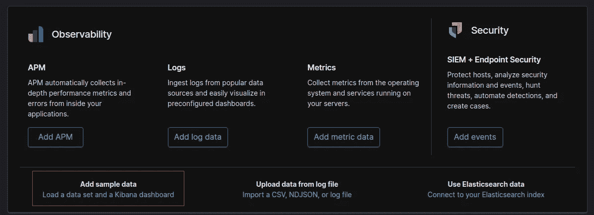

# 使用 Elasticsearch 构建闪亮的仪表板

> 原文：<https://towardsdatascience.com/build-shiny-dashboard-with-elasticsearch-1723a448016f?source=collection_archive---------21----------------------->

## 使用带有弹性搜索功能的闪亮仪表板，让数据变得生动


卡伦·艾姆斯利在 [Unsplash](https://unsplash.com?utm_source=medium&utm_medium=referral) 上的照片

在企业中，由于拥有大量的数据，可能需要处理多个数据源。当试图构建一个仪表板来展示商业想法时，通常需要集成来自 NoSQL 数据库、关系数据库和搜索引擎的数据。因此，像 Kibana 或 Google Data Studio 这样的仪表板并不是合适的选择，因为多数据源的灵活性有限。于是人们需要一个同样简单明了替代方案。对于这种情况，我推荐[闪亮的仪表板](https://rstudio.github.io/shinydashboard/)来完成任务，因为它满足了要求:灵活、直截了当和美观。然而，在构建仪表板时，连接 Amazon Elasticsearch 服务有一个直接的实现障碍，这促使我写这篇文章。

**本文展示了如何将 Elasticsearch 数据集成到一个闪亮的仪表板中。**使用的编程语言主要是 R，用 Python 进行后端连接。同时，对于数据可视化部分，在 R 中用 3 个不同的绘图包绘制图形，分别是: *ggplot2* 、 *plotly* 和 *wordcloud2* 。

文章的内容:

1.  Elasticsearch 连接(与[亚马逊 Elasticsearch 服务](https://aws.amazon.com/elasticsearch-service/)
2.  使用 r 的数据操作。
3.  展示工具[闪亮的仪表板](https://rstudio.github.io/shinydashboard/)无需太多的样式定制即可将数据带入生活。

使用的环境:

*   r 版本 3.4.4
*   Python 3.7.4
*   Ubuntu 18.04

Elasticsearch 是企业中流行的搜索引擎。一般来说，在进行汇总统计或及时定位特定批次的大量数据**时，我建议将其添加到数据基础设施中**。对于设置，一个方便的方法是使用 Amazon Elasticsearch 服务，因为它只需要处理一些高级参数，如碎片数量。此外，还提供了全面的文档和示例代码，当公司已经在 AWS 中构建了基础设施时，没有理由不使用它。亚马逊提供了[样本代码](https://docs.aws.amazon.com/elasticsearch-service/latest/developerguide/es-request-signing.html)，这是有据可查的，但支持语言不包含 R。虽然 R 中有各种用于 Elasticsearch 连接的包，但**将其与亚马逊 Web 服务版本 4 认证(AWS4Auth)集成的方法并不直接。**要构建仪表板，最关键的部分是克服这个实施障碍。


照片由[王思然·哈德森](https://unsplash.com/@hudsoncrafted?utm_source=medium&utm_medium=referral)在 [Unsplash](https://unsplash.com?utm_source=medium&utm_medium=referral) 上拍摄

# 连接 Amazon Elasticsearch 服务和 Python 后端

首先，我们需要定位 Python 路径。我建议用两种方法来寻找它:

1.  在 Python 环境中显示

```
import sys
# Python search for libraries at the ordering of the path
print(sys.path[0])
```

2.在命令行中显示，并激活所选的 Python 环境

```
which python
```

这两种方法都可以定位 Python 可执行文件的系统路径。

一旦知道了 python 路径，我们就可以开始连接了。我们将在 R 中使用 *reticulate* 包，它为 Python 和 R 之间的互操作性提供了一套全面的工具。详细内容可以在[这里找到](https://github.com/rstudio/reticulate)并且我推荐你阅读这个很棒的[备忘单](https://ugoproto.github.io/ugo_r_doc/pdf/reticulate.pdf)！

这个简单的方法管用！为了避免卡住，同时学习 R 和 Python 总是一个好主意。


照片由 [Mirko Blicke](https://unsplash.com/@mirkoblicke?utm_source=medium&utm_medium=referral) 在 [Unsplash](https://unsplash.com?utm_source=medium&utm_medium=referral) 上拍摄

# 示范

因为我们目前没有托管的 Elasticsearch 实例。出于演示目的，让我们在本地机器上创建一些样本数据。

使用本地机器中的样本数据设置 Elasticsearch 的步骤:

1.  下载并遵循 [Elasticsearch](https://www.elastic.co/downloads/elasticsearch) 的说明。
2.  下载并遵循[基巴纳的指示。](https://www.elastic.co/downloads/kibana)
3.  主持 Elasticsearch 和 Kibana。
4.  将样本飞行数据加载到基巴纳。Kibana 托管在 [http://localhost:5601/](http://localhost:5601/) 上。



从 Kibana 加载样本数据。(图片由作者提供)

5.连接到 Elasticsearch

```
elasticsearch <- import("elasticsearch")host <- "localhost:9200"es <- elasticsearch$Elasticsearch(hosts = host)
```

由于没有使用 AWS4Auth，因此有多种连接方式。你也可以使用 R only 方法。

6.安装闪亮仪表板的必要组件，包括*闪亮仪表板*和*闪亮仪表板。*

## 使用 R 操作数据并构建闪亮仪表板

连接后，我们现在就可以开始在仪表板中编写功能了。首先让我们从结构开始:

```
├── global.R
├── server.R
└── ui.R
```

为了更好地组织代码，我将文件分成了以上 3 个部分。

`global.R`

顾名思义，这个文件存储了在应用程序启动之前运行一次的全局变量和函数。因此，我包含了 Elasticsearch 连接和查询。

*全局中的连接和查询。R*

`server.R`

一旦 dashboard 应用程序启动，它就会处理后端任务。例如，文件中应包含关于如何渲染图以及何时重新运行查询的逻辑。

使用[*Elasticsearch . search*](https://elasticsearch-py.readthedocs.io/en/master/api.html#elasticsearch.Elasticsearch.search)*从 elastic search 得到的响应数据是字典格式的，并根据[](https://ugoproto.github.io/ugo_r_doc/pdf/reticulate.pdf)*转换成命名列表。为了便于绘图，最好将所有响应数据转换为 R 数据帧格式，我们有两种选择:**

1.  **转换 r 中的数据。**
2.  **用 Python 转换数据，转换*熊猫。r 中的数据帧*至*数据帧*。**

**在演示中，我们将使用 r。考虑到命名列表响应数据的复杂性，更有效地编写合适的数据转换函数的方法是使用 [*str*](https://www.rdocumentation.org/packages/utils/versions/3.6.2/topics/str) *不断观察对象的结构。***

****

**响应子集数据的示例结构**

**在 R 控制台中经过多轮反复试验后，我们提出了两个函数来转换来自单个和两个聚集查询的数据。**

**现在我们为图表绘制准备数据框。首先，我们创建数据框架，并使用 *Plotly R* 绘制航班数量的饼图。**

**函数来渲染一个 plotly 图形**

**以下形式的转换后的数据帧。**

****

**航班数量的转换数据框架**

***Plotly* 是一个流行的图表可视化工具，它允许用户创建具有交互性选项的交互性可视化。使用 *Plotly* 制作的图形支持放大和缩小以及悬停文本等功能。然而，与 *ggplot* 相比，在 *Plotly* 中渲染图表在显示大量数据时会非常慢。**

**然后我们创建数据框架，并使用 *ggplot 绘制航班延误时间序列数据的堆积条形图。*我们将在控制面板中制作一个时间滑块，供用户选择图表的时间范围，因此我们必须按选定的时间输入进行过滤。**

**以下形式的转换后的数据帧。**

****

**航班延误的转换数据帧**

***ggplot* 允许用户快速可视化趋势，并在层中添加定制。如果需要更具交互性的图表，您可以通过代码`ggplotly(p)`将您的图形转换为 *Plotly* 。**

**最后，我们使用 *wordcloud2 为天气数据创建数据框架和单词云。*此外，我们将在仪表板中制作一个滑块，供用户调整所需的 wordcloud 大小。**

**以下形式的转换后的数据帧。**

****

**天气的转换数据帧**

**用 *wordcloud2* 制作的单词云自动计算单词的大小和位置，当鼠标悬停时，它支持显示原始值。因此，用户可以获得数据的概览，以及针对特定的词进行数据洞察。**

****

**照片由[兰斯·安德森](https://unsplash.com/@lanceanderson?utm_source=medium&utm_medium=referral)在 [Unsplash](https://unsplash.com?utm_source=medium&utm_medium=referral) 上拍摄**

**`ui.R`**

**它处理应用程序的前端外观。闪亮的部件和风格的代码应该放在这里。基本上所有想要的仪表板外观都应该在这里。交互式仪表板的基本要素是小部件的使用。有很多资源可以用来创建闪亮的小工具，比如这里的。一旦你有了一个想法，你就可以简单地搜索合适的小部件并把它放到`ui.R`文件中。除此之外，一些闪亮的仪表板元素可以在找到[。只要确保每次添加新的小部件时都处理了数据逻辑。](https://rstudio.github.io/shinydashboard/structure.html)**

**作为演示的一个例子，对于我们的 word cloud 框，我们创建一个 *sliderInput* 来控制它的整体大小。**

**关于 UI 的更多细节，欢迎您阅读我的源代码。**

**最后，让我们在 R 控制台中托管闪亮的应用程序:**

```
**runApp(host="0.0.0.0", port=1234)**
```

**访问 [http://localhost:1234/](http://localhost:1234/) 可以查看演示仪表盘。**

****

**本次演示中制作的仪表板。(图片由作者提供)**

# **结论**

**在本文中，我们已经完成了创建一个闪亮的仪表板的基本步骤，将数据带入生活。特别是，我们有**

1.  **使用 Python 后端连接 Elasticsearch 并将数据转换为 R 命名列表。**
2.  **用 r 创建多个数据转换函数。**
3.  **利用 *Plotly、ggplot* 和 *wordcloud2* 包进行绘图。**

**感谢阅读！希望这篇文章对你有用。源代码贴在我的 [GitHub 库](https://github.com/wfkwan/Shiny-with-Elasticsearch)里。请随时给我留言，告诉我你对这篇文章的看法。如果你有更方便的方法，请告诉我:)**

****领英:****

**[https://www.linkedin.com/in/andy-k-1b1a44103/](https://www.linkedin.com/in/andy-k-1b1a44103/)**