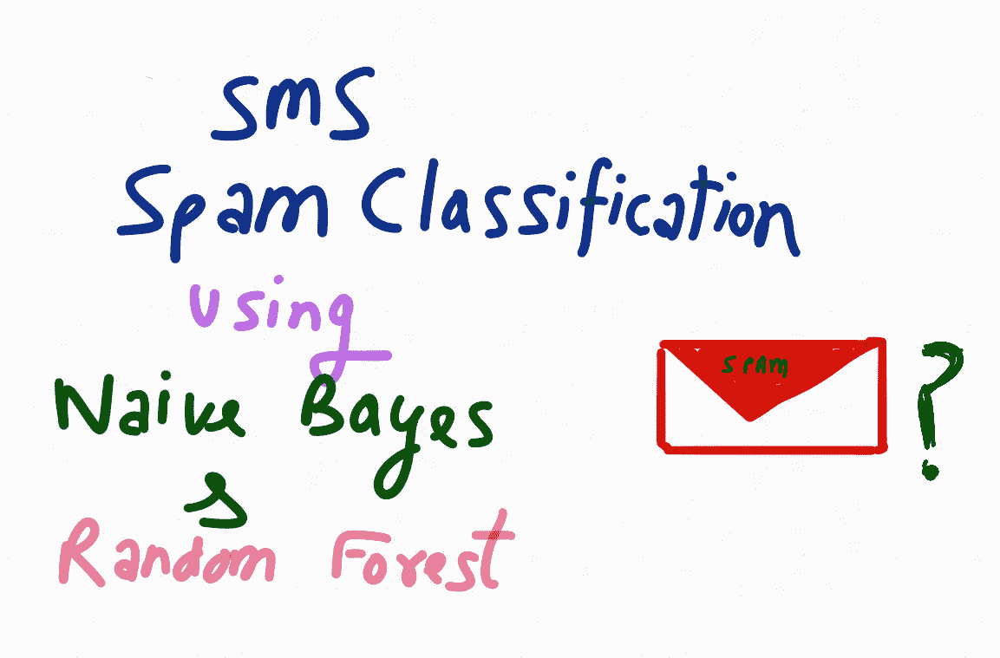
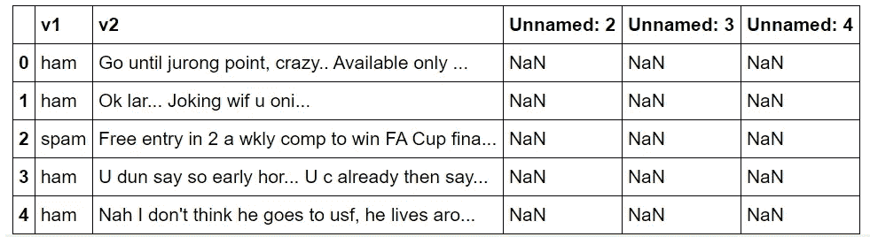
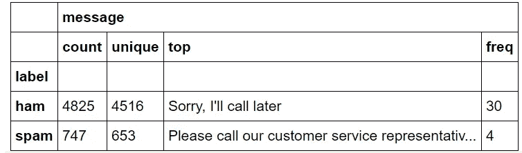
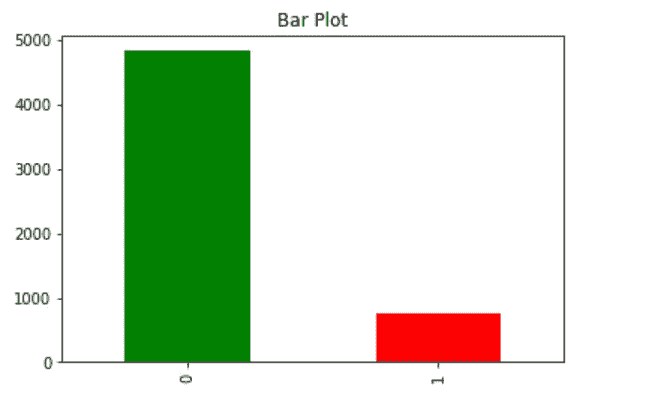
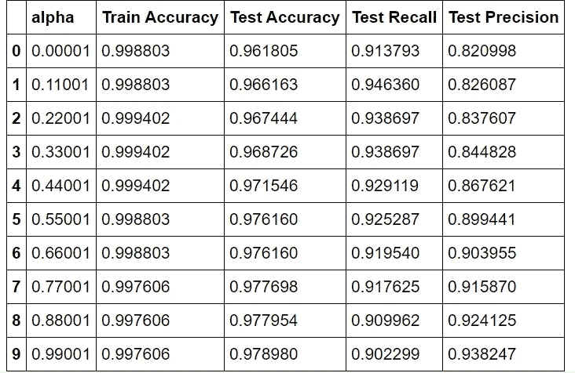

# 利用朴素贝叶斯和随机森林建立垃圾短信分类模型

> 原文：<https://towardsdatascience.com/build-sms-spam-classification-model-using-naive-bayes-random-forest-43465d6617ed?source=collection_archive---------13----------------------->

如果你对数据科学感兴趣，并且正在寻找入门项目，那么垃圾短信分类项目是你应该着手的项目之一！在本教程中，我们将一步一步地从导入库到完整的模型预测，然后测量模型的准确性。



Dhaval 的图片(在 iPad 上绘制)

# 关于垃圾短信分类

一个好的文本分类器是这样一种分类器，它能在合理的时间范围内以可接受的准确度有效地对大量文本文档进行分类，并提供人类可读的分类规则以进行可能的微调。如果分类器的训练也很快，这可能在一些应用领域中成为分类器的良好资产。已经设计了许多用于自动文本分类的技术和算法。

文本分类任务可以被定义为基于在训练阶段在分类系统中获得的知识将类别标签分配给新文档。在训练阶段，给我们一组附有类别标签的文档，并使用学习方法构建一个分类系统。分类是数据挖掘和机器学习领域的一项重要任务，然而，文本分类中的大多数学习方法都来自于机器学习研究。

# 使用 Python 和 Pandas 构建垃圾短信分类

对于这个项目，我会使用谷歌 Colab，但你也可以使用 python 笔记本来达到同样的目的。

**导入库**

首先，我们将导入所需的库，如 pandas、matplotlib、numpy、sklearn

```
import numpy as np
import pandas as pd
import matplotlib.pyplot as plt
import seaborn as sns
import scipy as sp
from google.colab import drive
from sklearn import feature_extraction, model_selection, naive_bayes, metrics, svm
from sklearn.ensemble import RandomForestClassifier
from sklearn.model_selection import train_test_split
from sklearn.metrics import precision_recall_fscore_support as score
%matplotlib inline
*drive.mount*('/content/drive')
```

**注意:**如果您没有使用 Google Colab，可以删除代码片段的最后一行。最后一行是为了在 Google Colab 上安装我的 Google Drive，这样我就可以使用我的 Drive 中的数据集。

**导入数据集**

我会上传我的 GitHub repo 中的数据集，可以在这里找到。

下载数据集后，我们将使用 pandas 的 read_csv 函数导入它。

```
dataset = pd.read_csv(*"/content/drive/My Drive/SMS_Spam_Classification/spam.csv",* encoding='latin-1')
```

**注意:请使用您自己的数据集路径。**

现在我们已经导入了数据集，让我们看看是否使用 head()函数导入了格式不正确的数据集。

```
dataset.head()
```



从上面的数据集片段中，我看到了我们不需要的列名！因此，现在的任务是清理和重新格式化数据，以便我们使用它来构建我们的模型。

**数据清理&探索**

现在我们必须删除未命名的列。为此，我们将使用 drop 函数。

```
*#removing unnamed columns*
dataset = dataset.drop('Unnamed: 2', 1)
dataset = dataset.drop('Unnamed: 3', 1)
dataset = dataset.drop('Unnamed: 4', 1)
```

现在，下一个任务是将列 **v1** 和 **v2** 分别重命名为标签和消息！

```
dataset = dataset.rename(columns = {'v1':'label','v2':'message'})
```

现在，另外(这是一个可选的步骤，但是做一些数据探索总是好的:P)

```
dataset.groupby('label').describe()
```



接下来，我们想知道在我们的数据集中有多少邮件是垃圾邮件。为此:

```
count_Class=pd.value_counts(dataset["label"], sort= True)
count_Class.plot(kind = 'bar',color = ["green","red"])
plt.title('Bar Plot')
plt.show();
```

**解释:**这里我们设置 sort = True，使用熊猫的 value_counts 方法。这段代码将为垃圾邮件类**和非垃圾邮件类**和非垃圾邮件类**分别制作一个**绿色**和**红色**的条形图。**

您可能会得到类似如下的输出:



我们看到我们有很多垃圾邮件，而垃圾邮件却很少。在本教程中，我们将继续使用这个数据集，但不增加它(没有过采样/欠采样)。

# 实现用于垃圾短信分类的朴素贝叶斯

首先，让我将垃圾邮件和非垃圾邮件分别编码为 1 和 0。

```
*# Classifying spam and not spam msgs as 1 and 0*

dataset["label"]=dataset["label"].map({'spam':1,'ham':0})
X_train, X_test, y_train, y_test = model_selection.train_test_split(X, dataset['label'], test_size=0.70, random_state=42)
```

现在，上面代码片段的第二行使用 sklearn 库 splot 方法将数据分成训练和测试数据集。这里我提到了测试数据的大小是整个数据集的 70%。(您可以在这里根据您的意愿进行更改)

**奖励:** *DONT 知道数据集的拆分及其好处吗？* [*阅读我的这篇文章，我在这里解释了所有*](https://dhavalthakur.medium.com/splitting-datasets-from-0-to-hero-2d8a3d5267ad) *！*

现在我将使用多项式朴素贝叶斯算法！

```
list_alpha = np.arange(1/100000, 20, 0.11)
score_train = np.zeros(len(list_alpha))
score_test = np.zeros(len(list_alpha))
recall_test = np.zeros(len(list_alpha))
precision_test= np.zeros(len(list_alpha))
count = 0
**for** alpha **in** list_alpha:
    bayes = naive_bayes.MultinomialNB(alpha=alpha)
    bayes.fit(X_train, y_train)
    score_train[count] = bayes.score(X_train, y_train)
    score_test[count]= bayes.score(X_test, y_test)
    recall_test[count] = metrics.recall_score(y_test, bayes.predict(X_test))
    precision_test[count] = metrics.precision_score(y_test, bayes.predict(X_test))
    count = count + 1
```

正如您所看到的，我还加入了一个回忆测试和精度测试，以便更准确地评估我的模型的性能。

现在，对于不同的α值，我会制作一个表格来查看各种度量，如训练准确度、测试准确度、测试召回率、测试精确度。

```
matrix = np.matrix(np.c_[list_alpha, score_train, score_test, recall_test, precision_test])
models = pd.DataFrame(data = matrix, columns = 
             ['alpha', 'Train Accuracy', 'Test Accuracy', 'Test Recall', 'Test Precision'])
models.head(n=10)
```



现在我们必须看到测试精度的最佳指标，因为我在这里更关心它。请注意，我们并不总是必须使用精度来评估我们的模型。它总是取决于您的用例！

```
best_index = models['Test Precision'].idxmax()
models.iloc[best_index, :]**OUTPUT: -**alpha             10.670010
Train Accuracy     0.977259
Test Accuracy      0.962574
Test Recall        0.720307
Test Precision     1.000000
```

# 实现随机森林

我将使用 RandomForestClassifier 函数，n_estimators 为 100(您可以根据自己的意愿更改它以获得最佳结果)

```
rf = RandomForestClassifier(n_estimators=100,max_depth=**None**,n_jobs=-1)
rf_model = rf.fit(X_train,y_train)
```

在上面的代码片段中，上次我用 X_train 和 y_train 拟合我的模型。

现在，让我们看看预测。我会使用预测功能和计算精度，召回，f 分数，以及准确性措施。

```
y_pred=rf_model.predict(X_test)
precision,recall,fscore,support =score(y_test,y_pred,pos_label=1, average ='binary')
print('Precision : **{}** / Recall : **{}** / fscore : **{}** / Accuracy: **{}**'.format(round(precision,3),round(recall,3),round(fscore,3),round((y_pred==y_test).sum()/len(y_test),3)))
```

**车型评价**

```
Precision : 0.995 / Recall : 0.726 / fscore : 0.839 / Accuracy: 0.963
```

因此，我们看到，我们的模型的准确性约为 96 %,我认为这相当不错。它的精度值也接近 1，这也是一个不错的值。

在我的下一篇文章中，我将使用 NLP 和神经网络，并解释我们如何才能得到一个更准确的模型！

如果你喜欢这个教程，请分享给你的朋友或在社交媒体上！

想聊聊数据科学吗？在 [LinkedIn](https://www.linkedin.com/in/thedhavalthakur/) 上 Ping 我！