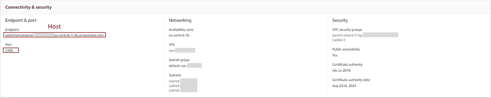
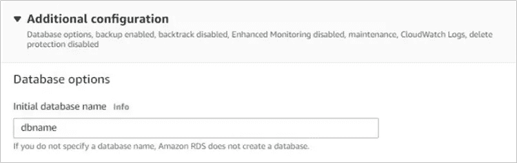
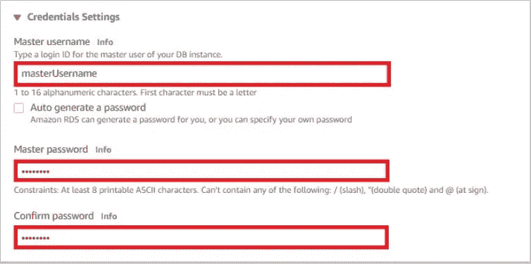
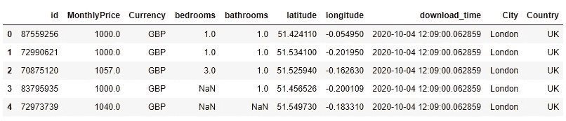
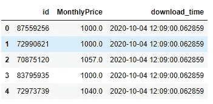
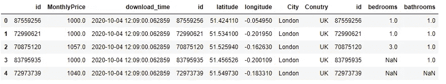

# 使用 SQLAlchemy 和 AWS RDS 为您的投资组合项目构建坚实的基础

> 原文：<https://towardsdatascience.com/build-solid-foundations-for-your-data-science-projects-with-aws-rds-and-sqlalchemy-da8388e1e209?source=collection_archive---------28----------------------->

## 借助 SQL Alchemy 和 AWS RDS，您可以将数据发送到云中，并在舒适的 Jupyter 中利用 SQL。


法比奥在 Unsplash 上拍摄的照片

通常情况下，项目所需的数据存储在一些关系数据库中……如果它目前以 csv 文件的形式四处传播，那么您也应该将它存储在安全的地方。最简单的方法当然是 SQL。

好消息是，如果您不喜欢使用 MySql 或其他关系数据库管理系统(RDBMS ),由于 SQLAlchemy，您仍然可以在舒适的 Jupyter 上完成大部分工作！

# 从 AWS 云服务入手比你想象的要容易！

AWS、Azure 或 Google Cloud 等云服务通常是部署模型的最简单方式，这使得它们成为申请数据科学职位时所需的技能。哪怕只有其中一种的基本经验，也会让您在数据科学之旅中有一个良好的开端。

嗯……你已经完成了几门 Coursera 课程，参加了 Kaggle 比赛，掌握了 Scikit-Learn 但是云服务听起来像是很复杂，自己很难掌握的东西？你大错特错了…与理解机器学习的基础相比，这是小菜一碟。通过这一点额外的工作，你真的可以提高你创建 E2E 项目的技能。

在本文中，我旨在向您展示如何轻松地开始使用 AWS 环境，并使用它来创建您的私有 RDS。我选择 AWS，因为我相信它是最好的学习材料之一，并且易于使用。在小规模学习项目方面，它也有不错的定价——你几乎可以免费获得所有东西。然而，在选择服务时要小心——我建议在任何变化后的几天内检查账单，以确保你在月底不会被收取太多费用。

在以后的文章中，我还将关注 AWS 的其他方面，比如 EC2 与 Docker 的结合，用于模型的稳定部署。由于数据不是数据科学中的第一个词，我决定建立一个稳定的数据基础将在未来节省您的时间和精力。

# 1.建立自己的 MySql 数据库

如果你已经专业地处理数据，你可能熟悉你公司的关系数据库。然而，我相信至少整个数据管道的基本知识是有用的，包括建立一个数据库。

另一方面，数据科学需要不断学习，参与私人项目是这一旅程的重要组成部分。出于这个原因，我建议你建立你的私人数据库。

我自己花了将近两年的时间，基于本地或 GitHub 上存储的 csv 和 json 输入构建自己的项目组合，相信我，过一段时间后，所有的输入和输出文件都变得一团糟，我真希望早点创建自己的私有 DB。

在 AWS RDS 上建立一个数据库需要大约 10 分钟，并且不需要任何经验:你需要做的就是遵循 AWS 本身的这份出色的入门材料——他们做得如此之好，以至于我自己都不会试图写它，因为它不可能更清楚了。按照下面的说明设置数据库，直到第 1 步结束-我们将直接从 Python 继续第 2 步:

[](https://aws.amazon.com/getting-started/hands-on/create-mysql-db/) [## 如何创建一个 MySQL 数据库-亚马逊网络服务

### 在本教程中，您将学习如何创建一个运行 MySQL 数据库的环境(我们称这个环境为…

aws.amazon.com](https://aws.amazon.com/getting-started/hands-on/create-mysql-db/) 

请记住选择免费层，记下所选密码(如果丢失，将无法找回)，并将 Publicly Accessible 设置为 Yes —(您需要扩展附加连接配置)。要记住的另一个重要部分是在步骤 e 中设置数据库名称——忽略这一点会使以后的工作更加困难。一旦你准备好了，我们可以在舒适的 Jupyter 笔记本上做剩下的工作。

# 2.使用 SQL Alchemy 连接到 AWS RDS

恭喜你！您已经创建了自己的基于私有云的关系数据库。现在让我们用 SQL-Alchemy 将我们的 Jupyter 笔记本连接到数据库。文章这一部分的代码和数据可以从 [GitHub](https://github.com/Jan-Majewski/Medium_articles/tree/master/02_AWS_RDS_with_SQLAlchemy) 获得。

首先，我们需要定义 4 个关键参数，它们允许 SQLAlchemy 连接到 AWS RDS。

```
host="sqlalchemytutorial.*****.eu-central1.rds.amazonaws.com"
port=3306
dbname="TUTORIAL"
user="admin"
password="Baloney1" #now they make you add numbers...
```

*   前两个参数可以在连接性和安全性详细信息中找到，一旦进入 DB 实例就会出现这些信息



关于数据库实例的关键信息

*   dbname 是您在创建数据库期间定义的名称(或者您将来可能要使用的任何其他模式名称)



*   用户和口令已由您在设置数据库时的身份证明设置过程中定义



一旦我们完成了排序，我们需要做的就是用这个简单的查询建立一个连接

```
database_connection = sqlalchemy.create_engine('mysql+mysqlconnector://{0}:{1}@{2}/{3}'
            .format(user, password,host, dbname)).connect()
```

现在我们已经连接好了，准备向我们的数据库写入一些数据！

# 3.将数据从 csv 文件写入数据库

目前，我们的数据库是空的，我们需要填充它。出于本教程的目的，我将使用从 Right move 删除的伦敦租金数据的一个小样本:如果你对这个话题感兴趣，你可以在我的文章[中阅读更多关于伦敦租金列表的漂亮汤的网络抓取初学者指南](https://medium.com/@janekmajewski/beginners-guide-to-web-scraping-with-beautiful-soup-on-london-rent-listings-1ab6824c11b8)。

```
#Reading data from csv file
data = pd.read_csv(r"[https://raw.githubusercontent.com/Jan-Majewski/Medium_articles/master/02_AWS_RDS_with_SQLAlchemy/London_property_data.csv](https://raw.githubusercontent.com/Jan-Majewski/Medium_articles/master/02_AWS_RDS_with_SQLAlchemy/London_property_data.csv)")data.head()
```



目前，所有数据都存储在一个堆栈中，但这不是很容易扩展，让我们将它分成 3 个表，以利用 SQL 的优势。我们将能够根据“id”键加入数据。值得确保键列具有 int 类型，因为在 floats 上连接比较慢，并且可能由于舍入误差而导致困难。

```
property_features=['id','bedrooms', 'bathrooms']
location_features=['id','latitude','longitude','City', 'Country']
price_features=['id', 'MonthlyPrice','download_time']table_properties=data[property_features]
table_locations=data[location_features]
table_prices=data[price_features]table_price.head()
```



将我们的数据拆分到单独的表中有一个很大的优势，我们可以节省存储空间——在这种情况下，我们可以很有信心，一旦我们有了关于物业位置及其特征的数据，它就不太可能改变。然而，价格可能会经常变化，这就是为什么我只在 table_price 中包含 download _ time 我们可以追加更新的价格，而不必将我们已经拥有的位置和属性数据追加到其他表中。

既然我们已经准备好了数据，我们可以将它写入我们的数据库。我们不需要担心游标、数据类型等等，我们可以只使用 pd.to_sql。

```
table_property.to_sql(con=database_connection, name="PROPERTIES", if_exists='replace',chunksize=100, index=False)table_location.to_sql(con=database_connection, name="LOCATIONS", if_exists='replace',chunksize=100, index=False)table_prices.to_sql(con=database_connection, name="PRICES", if_exists='replace',chunksize=100, index=False)
```

我选择 chunksize 为 100 来批量写入数据，但是如果容量不大，您也可以一次写入所有数据。

在这里，我们已经填充了数据库中的前 3 个表:属性、位置和价格。

# 4.使用 SQL 查询数据

测试 data foundation 的最后一步是查询保存的数据，这样我们就不需要再次使用 csv 文件。让我们编写一个简单的查询，其中我们连接“id”上的所有表并执行它。

```
sql_query='''
SELECT * FROM PRICES a
JOIN LOCATIONS b
ON a.id=b.id
JOIN PROPERTIES c
ON a.id=c.id
'''property_data=pd.read_sql(sql_query,con=database_connection)
property_data.head()
```



我们设法检索并连接存储在数据库中的财产数据。这个数据集非常简单，存储在关系数据库中没有什么优势，但是对于频繁更新的更大、更复杂的数据集，它有一个巨大的优势，您可以使用与这里演示的完全相同的方法。

# 5.创建新模式

为了使您的数据库可伸缩，您可能需要不止一个模式，它很像数据库中的一个文件夹。您也可以从 Python 中添加它。但是，您需要安装 sqlalchemy_utils 库。您需要做的就是使用新模式的名称创建另一个连接。然后测试模式是否已经存在，如果不存在，则创建它—类似于在本地工作时检查文件夹并在需要时创建它。

```
dbname_2='TUTORIAL_ADVANCED'
database_connection_2 = 'mysql+mysqlconnector://{0}:{1}@{2}/{3}'.format(user, password,host, dbname_2)if not database_exists(database_connection_2):
    create_database(database_connection_2)
```

# 摘要

在这篇简短的文章中，我旨在展示如何快速开始使用 AWS RDS 并为您的项目构建稳定的数据基础，同时通过使用 SQL Alchemy 将所有主要步骤都保留在笔记本中。

我希望这种方法能够帮助您构建可扩展的数据科学项目，并避免存储在几十个不同文件中的数据出现混乱。

这篇文章是我计划在 AWS 上写的一系列文章中的第一篇，所以如果你对这个话题感兴趣，请关注我的简介，这样你就不会错过了！

感谢您的宝贵时间！希望你喜欢这篇文章。