# 构建、训练和部署一个包含 102 种花卉类型的真实世界花卉分类器

> 原文：<https://towardsdatascience.com/build-train-and-deploy-a-real-world-flower-classifier-of-102-flower-types-a90f66d2092a?source=collection_archive---------29----------------------->

## 借助 TensorFlow 2.3、Amazon SageMaker Python SDK 2.5.x 和定制 SageMaker 培训和服务 Docker 容器


Lotus Flower taken at Summer Palace (颐和园), Beijing China in 2008\. © Juv Chan. All rights reserved.

# **简介**

我喜欢花。上面的荷花是我最喜欢的花卉照片之一，是我 2008 年参观北京颐和园时拍的。由于我是一名开发人员，并且喜欢学习和从事人工智能和云项目，我决定写这篇博客来分享我与 TensorFlow、Amazon SageMaker 和 Docker 一起构建真实世界花卉分类器的项目。

这篇文章展示了一步一步的指南:

*   使用现成的 [**花数据集**](https://www.tensorflow.org/datasets/catalog/oxford_flowers102) 从 [**TensorFlow 数据集**](https://www.tensorflow.org/datasets) 。
*   使用 [**转移学习**](https://www.tensorflow.org/tutorials/images/transfer_learning) 从来自[**tensor flow Hub**](https://www.tensorflow.org/hub)的预训练模型中提取特征。
*   使用 [tf.data](https://www.tensorflow.org/guide/data) API 为分割成训练、验证和测试数据集的数据集构建输入管道。
*   使用 [tf.keras](https://www.tensorflow.org/api_docs/python/tf/keras) API 建立、训练和评估模型。
*   使用[回调](https://www.tensorflow.org/guide/keras/custom_callback)定义**提前停止**阈值进行模型训练。
*   准备[训练脚本](https://sagemaker.readthedocs.io/en/stable/frameworks/tensorflow/using_tf.html#id1)以 [SavedModel](https://www.tensorflow.org/guide/saved_model) 格式训练并导出模型，用于部署[**tensor flow**](https://www.tensorflow.org/overview/)**和[**Amazon SageMaker Python SDK**](https://sagemaker.readthedocs.io/en/stable/v2.html)。**
*   **准备推理代码和配置以运行 [**TensorFlow 服务模型服务器**](https://www.tensorflow.org/tfx/serving/serving_advanced) 为模型服务。**
*   **用亚马逊 SageMaker Python SDK 和[](https://sagemaker.readthedocs.io/en/stable/overview.html#local-mode)**中的 [**SageMaker TensorFlow 训练工具包**](https://github.com/aws/sagemaker-tensorflow-training-toolkit) 构建自定义[Docker 容器](https://www.docker.com/resources/what-container) 用于训练和服务 TensorFlow 模型。****

****公众可通过以下网址获得该项目:****

****[](https://github.com/juvchan/amazon-sagemaker-tensorflow-custom-containers/) [## juv chan/亚马逊-sage maker-tensor flow-自定义-容器

### 这个项目展示了一步一步的指导如何建立一个现实世界的花卉分类器的 102 种花卉类型使用…

github.com](https://github.com/juvchan/amazon-sagemaker-tensorflow-custom-containers/) 

# **设置**

以下是用于开发和测试项目的系统、硬件、软件和 Python 包的列表。

*   LTS
*   12 年 3 月 19 日
*   Python 3.8.5
*   康达 4.8.4
*   英伟达 GeForce RTX 2070
*   NVIDIA 容器运行时库 1.20
*   NVIDIA CUDA 工具包 10.1
*   sagemaker 2.5.3
*   sagemaker-tensor flow-培训 20.1.2
*   张量流-gpu 2.3.0
*   张量流数据集 3.2.1
*   张量流-集线器 0.9.0
*   张量流-模型-服务器 2.3.0
*   木星实验室 2.2.6
*   枕头 7.2.0
*   matplotlib 3.3.1

# **花卉数据集**

TensorFlow Datasets (TFDS)是一个公共数据集的集合，可用于 TensorFlow、 [JAX](https://github.com/google/jax) 和其他机器学习框架。所有 TFDS 数据集都以 [tf.data.Datasets](https://www.tensorflow.org/api_docs/python/tf/data/Dataset) 的形式公开，易于用于高性能的输入管道。

迄今为止，TFDS 共有 195 个现成可用的数据集。TFDS 有 **2 个花卉数据集**:**Oxford _ flowers 102**， **tf_flowers**

使用[**Oxford _ flowers 102**](https://www.tensorflow.org/datasets/catalog/oxford_flowers102)数据集是因为它具有更大的数据集大小和更大数量的花类别。

```
ds_name = 'oxford_flowers102'
splits = ['test', 'validation', 'train']
ds, info = tfds.load(ds_name, split = splits, with_info=True)
(train_examples, validation_examples, test_examples) = dsprint(f"Number of flower types {info.features['label'].num_classes}")
print(f"Number of training examples: {tf.data.experimental.cardinality(train_examples)}")
print(f"Number of validation examples: {tf.data.experimental.cardinality(validation_examples)}")
print(f"Number of test examples: {tf.data.experimental.cardinality(test_examples)}\n")

print('Flower types full list:')
print(info.features['label'].names)

tfds.show_examples(train_examples, info, rows=2, cols=8)
```

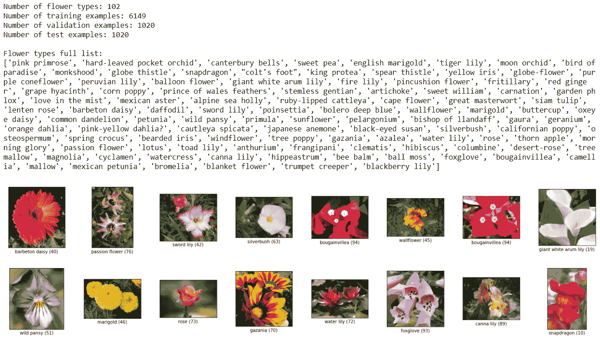

oxford_flowers 数据集摘要和示例

# **创建 SageMaker TensorFlow 培训脚本**

Amazon SageMaker 允许用户使用训练脚本或推理代码，就像在 SageMaker 外部运行定制的训练或推理算法一样。其中一个区别是，亚马逊 SageMaker 使用的训练脚本可以利用 SageMaker 容器中的[](https://github.com/aws/sagemaker-containers#important-environment-variables)**环境变量，例如 SageMaker 容器中的 **SM_MODEL_DIR** ，**SM _ NUM _ GPU**，**SM _ NUM _ CPU**。**

> **Amazon SageMaker 在运行脚本、训练算法或部署模型时总是使用 Docker 容器。亚马逊 SageMaker 为其内置算法提供了容器，并为一些最常见的机器学习框架提供了预构建的 Docker 映像。您还可以创建自己的容器映像来管理 Amazon SageMaker 提供的容器无法解决的更高级的用例。**

**自定义培训脚本如下所示:**

# **使用 TensorFlow Hub 进行迁移学习(TF-Hub)**

**[**tensor flow Hub**](https://tfhub.dev/)是一个可重用的预训练机器学习模型库，用于不同问题领域的迁移学习。对于这个花分类问题，我们基于不同的图像模型架构和来自 TF-Hub 的数据集评估**预训练的图像特征向量**，如下用于在 **oxford_flowers102** 数据集上的迁移学习。**

*   **[ResNet50 特征向量](https://tfhub.dev/tensorflow/resnet_50/feature_vector/1)**
*   **[MobileNet V2 (ImageNet)特征向量](https://tfhub.dev/google/imagenet/mobilenet_v2_100_224/feature_vector/4)**
*   **[Inception V3 (ImageNet)特征向量](https://tfhub.dev/google/imagenet/inception_v3/feature_vector/4)**
*   **[Inception V3(非自然语言)特征向量](https://tfhub.dev/google/inaturalist/inception_v3/feature_vector/4)**

**在最终的训练脚本中， **Inception V3(非自然主义者)特征向量**预训练模型用于该问题的迁移学习，因为它与上面的其他模型**(在 5 个时期内约 95%的测试准确性，无需微调)**相比表现最佳。该模型使用 Inception V3 架构，并在来自[https://www.inaturalist.org/](https://www.inaturalist.org/)的**超过 5000**种不同动植物的[**inauturalist(iNat)2017**](https://arxiv.org/abs/1707.06642)数据集上进行训练。相比之下， [**ImageNet 2012**](https://www.tensorflow.org/datasets/catalog/imagenet2012) 数据集只有 1000 个类，其中的花类型非常少。**

# **具有张量流服务的服务花分类器**

****TensorFlow Serving** 是一个灵活、高性能的机器学习模型服务系统，专为生产环境而设计。它是部署生产机器学习(ML)管道的端到端平台[**tensor flow Extended(TFX)**](https://www.tensorflow.org/tfx)的一部分。 [**TensorFlow 服务模型服务器二进制**](https://www.tensorflow.org/tfx/serving/setup#available_binaries) 有两种变体:**tensor flow-model-server**和**tensor flow-model-server-universal**。 **TensorFlow 服务模型服务器**支持[gRPC API](https://github.com/tensorflow/serving/blob/master/tensorflow_serving/apis/prediction_service.proto)和[RESTful API](https://www.tensorflow.org/tfx/serving/api_rest)。**

**在推理代码中，**tensor flow-model-server**用于通过 RESTful APIs 为模型提供服务，从这里将模型导出到 SageMaker 容器中。它是一个完全优化的服务器，使用一些特定于平台的编译器优化，应该是用户的首选。推理代码如下所示:**

# **为 SageMaker 训练和推理构建定制的 Docker 映像和容器**

**Amazon SageMaker 利用 Docker 容器来运行所有的训练作业和推理端点。亚马逊 SageMaker 提供了支持机器学习框架的预建 Docker 容器，如 [**SageMaker Scikit-learn 容器**](https://github.com/aws/sagemaker-scikit-learn-container) 、 [**SageMaker XGBoost 容器**](https://github.com/aws/sagemaker-xgboost-container) 、 [**SageMaker SparkML 服务容器**](https://github.com/aws/sagemaker-sparkml-serving-container) 、 [**深度学习容器**](https://github.com/aws/deep-learning-containers) (TensorFlow、PyTorch、MXNet 和 Chainer)以及 [**SageMaker RL(强化这些预先构建的 SageMaker 容器应该足以用于通用机器学习训练和推理场景。**](https://github.com/aws/sagemaker-rl-container)**

**有一些场景是预构建的 SageMaker 容器无法支持的，例如**

*   **使用不支持的机器学习框架版本**
*   **使用预构建的 SageMaker 容器中没有的第三方包、库、运行时或依赖项**
*   **使用定制的机器学习算法**

**Amazon SageMaker 支持用户为上述高级场景提供的定制 Docker 图像和容器。用户可以使用任何编程语言、框架或包来构建自己的 Docker 映像和容器，这些映像和容器是为亚马逊 SageMaker 的机器学习场景量身定制的。**

**在这个花卉分类场景中，自定义 Docker 图像和容器用于训练和推理，因为预构建的 SageMaker TensorFlow 容器没有训练所需的包，即 **tensorflow_hub** 和 **tensorflow_datasets** 。下面是用于构建自定义 Docker 映像的**Docker 文件**。**

**下面的 Docker 命令用于构建自定义 Docker 映像，该映像用于本项目的培训和 SageMaker 托管。**

```
docker build ./container/ -t sagemaker-custom-tensorflow-container-gpu:1.0
```

**在 Docker 映像成功构建之后，使用下面的 Docker 命令来验证新映像是否按预期列出。**

```
docker images
```

**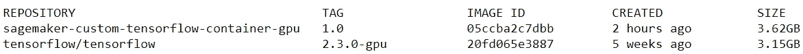**

# ****本地模式下的 SageMaker 培训****

****SageMaker Python SDK** 支持 [**本地模式**](https://sagemaker.readthedocs.io/en/stable/overview.html#local-mode) ，允许用户创建估算器、训练模型并将其部署到他们的本地环境中。这对于任何想要在运行到云中之前，在本地实例上使用 SageMaker Python SDK 在 Jupyter 笔记本中原型化、构建、开发和测试他或她的机器学习项目的人来说，都是非常有用和具有成本效益的。**

**亚马逊 SageMaker 本地模式支持**本地 CPU 实例(单实例和多实例)**和**本地 GPU 实例(单实例)**。它还允许用户通过更改 SageMaker Estimator 对象的 **instance_type** 参数，在本地和云实例(即 [Amazon EC2 实例](https://aws.amazon.com/ec2/instance-types/))之间无缝切换(注意:该参数在 SageMaker Python SDK 1.x 中以前称为 **train_instance_type** )。其他一切都一样。**

**在这种情况下，如果可用，默认使用本地 GPU 实例，否则回退到本地 CPU 实例。注意**输出路径**设置为本地当前目录(**文件://)。**)将训练好的模型工件输出到本地当前目录，而不是上传到亚马逊 S3。 **image_uri** 被设置为本地定制的 Docker 映像，该映像是在本地构建的，因此 SageMaker 不会从基于框架和版本的预构建的 Docker 映像中获取。您可以参考最新的[sage maker tensor flow Estimator](https://sagemaker.readthedocs.io/en/stable/frameworks/tensorflow/sagemaker.tensorflow.html)和[sage maker Estimator Base](https://sagemaker.readthedocs.io/en/stable/api/training/estimators.html)API 文档了解全部细节。**

**此外，通过设置 SageMaker 估计器对象的**超参数**，可以将**超参数**传递给训练脚本。可以根据训练脚本中使用的超参数来设置的超参数。在这种情况下，它们是*【epochs】**【batch _ size】**【learning _ rate】*。**

**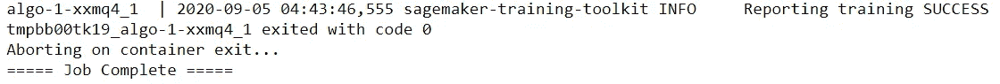**

**在自定义 TensorFlow 容器中完成 SageMaker 培训作业**

# **SageMaker 本地端点部署和模型服务**

**SageMaker 培训作业完成后，运行该作业的 Docker 容器将退出。当训练成功完成后，通过调用 SageMaker 估计器对象的 **deploy** 方法，并将 **instance_type** 设置为 local instance type(即 **local_gpu** 或 **local** ，可以将训练好的模型部署到 **local SageMaker 端点**。**

**将启动一个新的 Docker 容器来运行定制推理代码(即 **serve** 程序)，该程序运行 TensorFlow Serving ModelServer 来为模型提供实时推理服务。ModelServer 将在 RESTful APIs 模式下提供服务，并期待 JSON 格式的请求和响应数据。当本地 SageMaker 端点部署成功时，用户可以向端点发出预测请求，并实时获得预测响应。**

```
tf_local_predictor = tf_local_estimator.deploy(initial_instance_count=1,                                                          
                          instance_type=instance_type)
```

**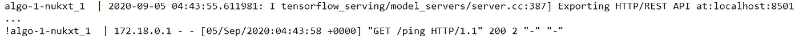**

**在自定义 TensorFlow 服务容器上运行的 SageMaker 推理端点**

**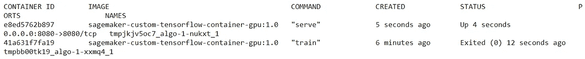**

**SageMaker TensorFlow 服务容器正在运行，训练容器已退出**

# **利用花图像的外部来源预测花的类型**

**为了使用**准确度**度量来评估这种花分类模型的性能，使用了来自独立于 **oxford_flowers102** 数据集的外部源的不同花图像。这些测试图片的主要来源是提供高质量免费图片的网站，如[**【unsplash.com】**](https://unsplash.com/)[](https://pixabay.com/)**以及自拍照片。****

****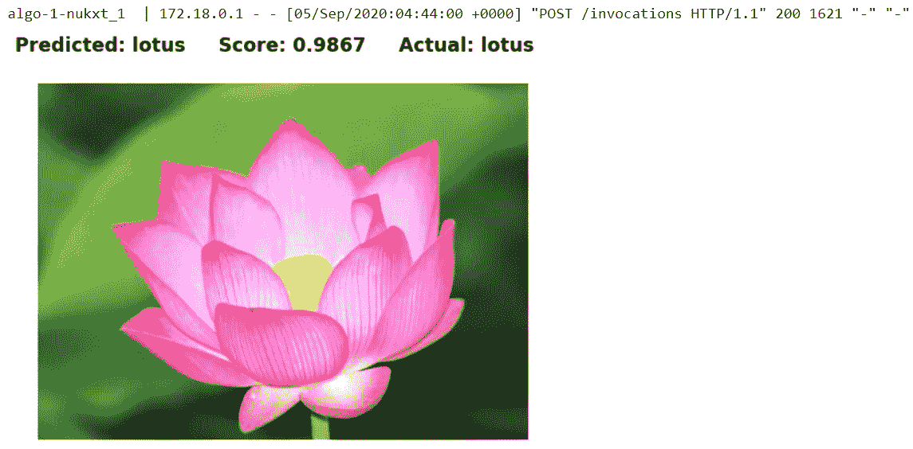********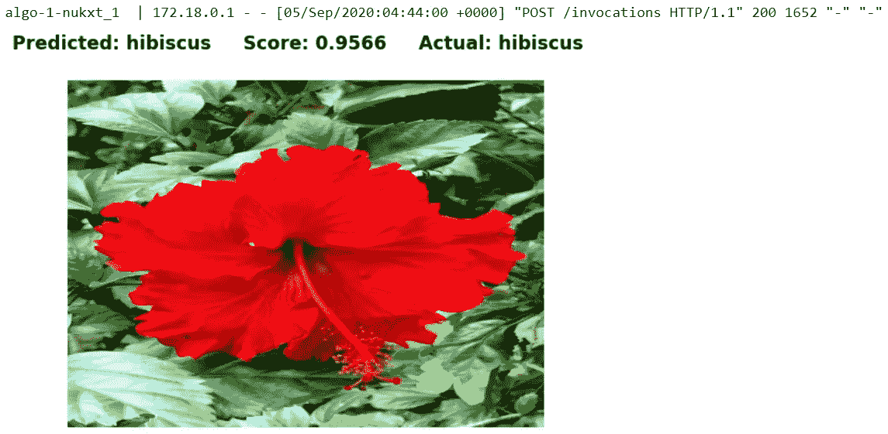********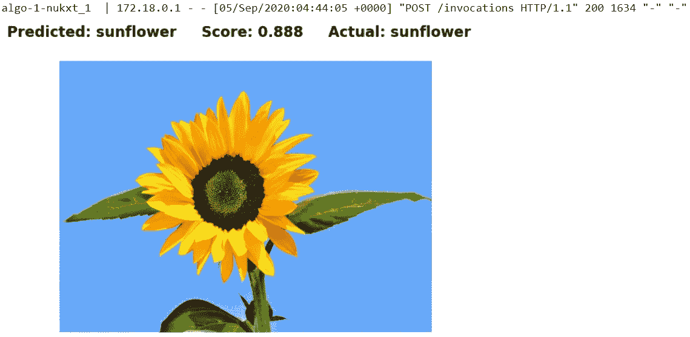********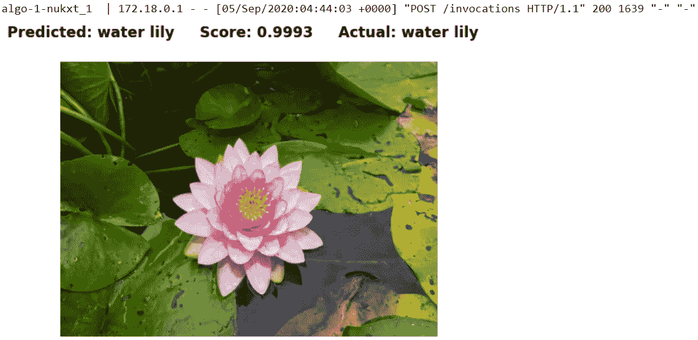********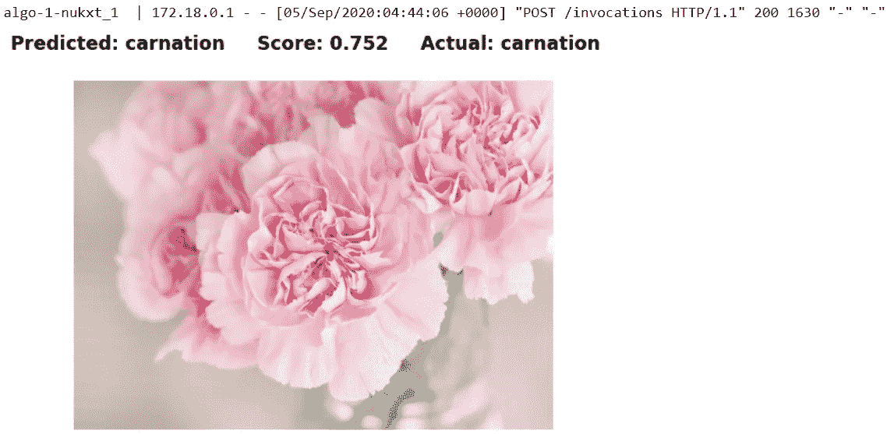********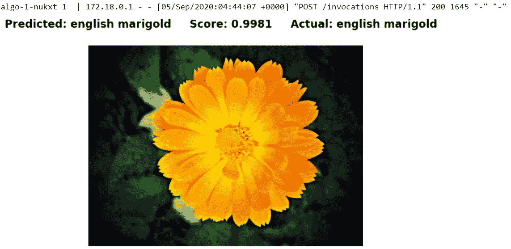********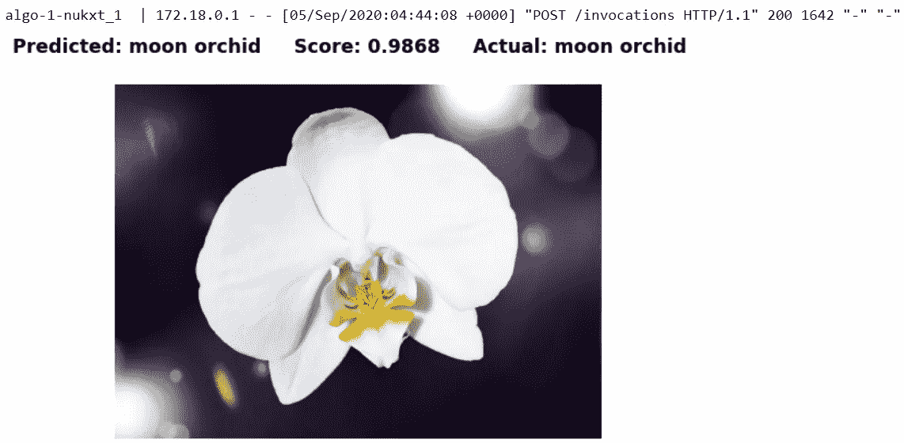****

# ****总结****

****最终的花卉分类模型根据一组来自外部来源的不同类型的真实世界花卉图像进行评估，以测试它对看不见的数据的概括程度。因此，该模型能够正确地分类所有看不见的花图像。模型大小约为 **80 MB** ，对于生产中的边缘部署来说，这可以认为是相当紧凑和高效的。总之，该模型似乎能够在给定的一小组不可见数据上表现良好，并且对于生产边缘或 web 部署来说相当紧凑。****

# ****提议的改进****

****由于时间和资源的限制，此处的解决方案可能无法提供最佳实践或最佳设计和实施。这里有一些想法，对任何有兴趣改进当前解决方案的人都有用。****

*   ****应用[](https://www.tensorflow.org/tutorials/images/data_augmentation)**，即随机(但真实)的变换，如旋转、翻转、裁剪、亮度和对比度等。以增加其规模和多样性。******
*   ******使用 [**Keras 预处理图层**](https://keras.io/guides/preprocessing_layers/) 。 [**Keras**](https://keras.io/) 提供预处理层，如**图像预处理层**和**图像数据增强预处理层**，它们可以作为 Keras SavedModel 的一部分进行组合和导出。因此，模型可以接受原始图像作为输入。******
*   ****将 TensorFlow 模型(SavedModel 格式)转换为[**tensor flow Lite**](https://www.tensorflow.org/lite/)模型(。tflite)，用于移动和物联网设备上的边缘部署和优化。****
*   ****优化 TensorFlow 服务签名(SavedModel 中的 **SignatureDefs** )以最小化预测输出数据结构和有效载荷大小。当前模型预测输出返回所有 102 种花类型的预测类别和分数。****
*   ****使用[**TensorFlow Profiler**](https://www.tensorflow.org/guide/profiler)工具跟踪、分析和优化 tensor flow 模型的性能。****
*   ****使用 [**英特尔发布的 OpenVINO toolkit**](https://software.intel.com/content/www/us/en/develop/tools/openvino-toolkit.html) 在英特尔硬件如 CPU、iGPU、VPU 或 FPGA 上进行模型优化和高性能推理。****
*   ****优化 Docker 图像尺寸。****
*   ****为 TensorFlow 培训脚本添加单元测试。****
*   ****为 docker 文件添加单元测试。****

# ****后续步骤****

****在机器学习工作流已经在本地环境中测试为预期工作后，下一步是将这个工作流完全迁移到带有 [**亚马逊 SageMaker 笔记本实例**](https://docs.aws.amazon.com/sagemaker/latest/dg/nbi.html) 的 [AWS 云](https://aws.amazon.com/)。在下一个指南中，我将演示如何调整这个 Jupyter notebook 以在 SageMaker Notebook 实例上运行，以及如何将自定义 Docker 映像推送到[**【Amazon Elastic Container Registry(ECR)**](https://aws.amazon.com/ecr/)，以便整个工作流完全在 AWS 中托管和管理。****

# ****清理****

****最佳做法始终是在最后清理过时的资源或会话，以回收计算、内存和存储资源，如果在云或分布式环境中清理，还可以节省成本。对于这个场景，本地 SageMaker 推理端点以及 SageMaker 容器被删除，如下所示。****

```
**tf_local_predictor.delete_endpoint()**
```

****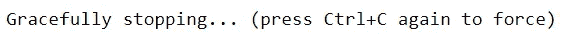****

****删除 SageMaker 推理端点并停止 TensorFlow 服务容器****

```
**docker container ls -a**
```

****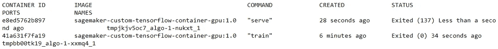****

****SageMaker 培训和服务容器均处于退出状态****

```
**docker rm $(docker ps -a -q)
docker container ls -a**
```

****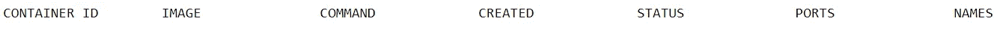****

****所有容器都被移除********