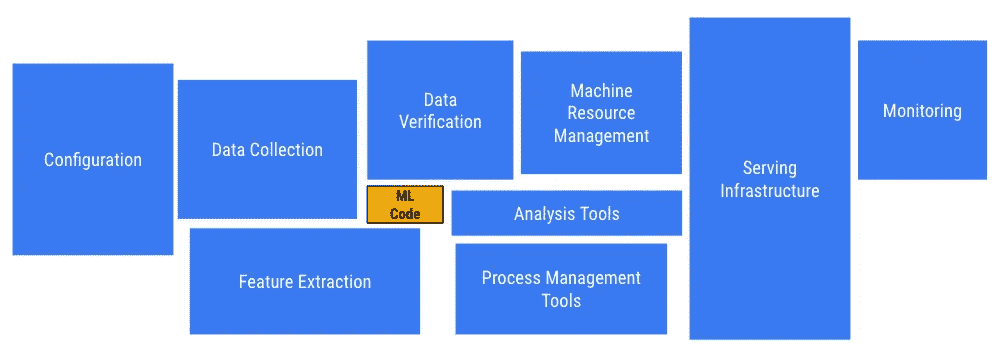
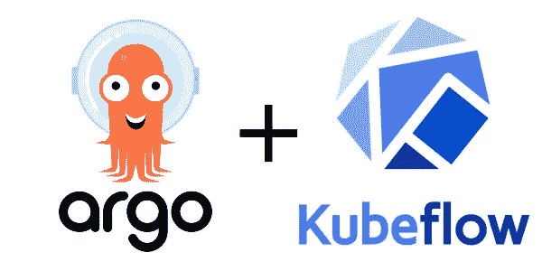
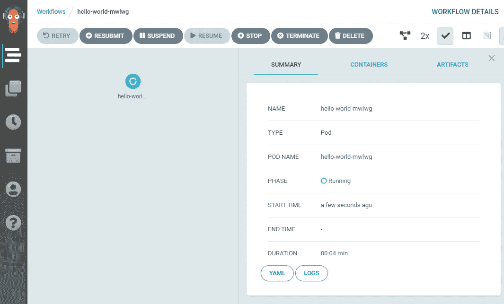
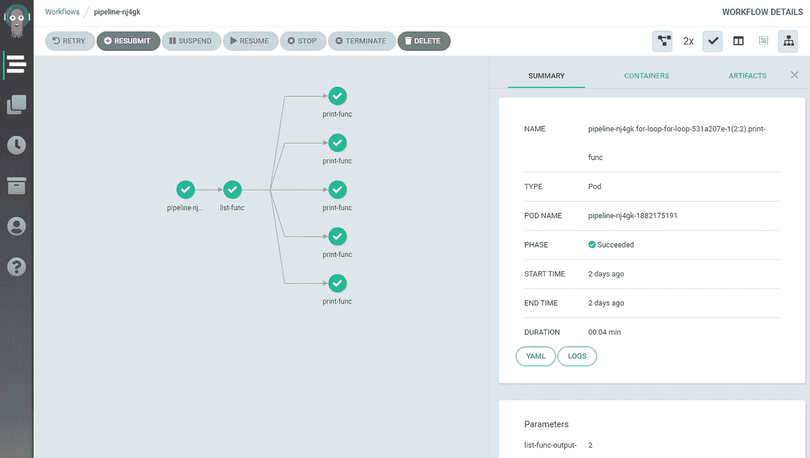

# 使用 Kubeflow Pipelines SDK 和 Argo 工作流在 Kubernetes 上构建您的数据管道

> 原文：<https://towardsdatascience.com/build-your-data-pipeline-on-kubernetes-using-kubeflow-pipelines-sdk-and-argo-eef69a80237c?source=collection_archive---------14----------------------->

## 运行 K8 本地数据管道

# 良好数据管道的重要性



在构建你的机器学习管道的元素上花了多少精力？参考“机器学习系统中隐藏的技术债务”——斯卡利等人。

对于那些没有看过上图的人，我强烈推荐阅读论文[“机器学习系统中隐藏的技术债务”](https://papers.nips.cc/paper/5656-hidden-technical-debt-in-machine-learning-systems.pdf)。它涵盖了构建机器学习系统的最佳实践。本文中有一节是关于 ML 系统反模式和管道丛林的:

> **管道丛林**。作为胶水代码的特例，管道丛林经常出现在数据准备中。随着新信号的识别和新信息源的增加，这些可以有机地发展。如果不小心的话，以 ML 友好格式准备数据的结果系统可能会变成一个由抓取、连接和采样步骤组成的丛林，通常还会有中间文件输出。管理这些管道、检测错误和从故障中恢复都是困难和昂贵的。

# 如何避开管道丛林

使用工作流引擎。

有许多工作流引擎可以帮助管道编排和构建 ETL。我不会深入讨论每个框架的利弊，因为那将需要一个完全不同的博客帖子，实际上，我不认为有一个明确的赢家。

这篇博文的目的是向你展示如何使用 [Kubeflow Pipelines SDK](https://www.kubeflow.org/docs/pipelines/sdk/sdk-overview/) 来运行 [Argo 工作流](https://github.com/argoproj/argo)。



# 为什么选择 Argo 工作流？

简单的答案是，它是云原生的，这意味着如果您已经有一个 Kubernetes 集群在运行， [Argo](https://argoproj.github.io/projects/argo) 被实现为 [Kubernetes CRD](https://kubernetes.io/docs/concepts/extend-kubernetes/api-extension/custom-resources/) 并允许您在集群上原生运行管道。有了 Argo，每个任务都在一个 pod 中执行，你可以像一个 [DAG](https://en.wikipedia.org/wiki/Directed_acyclic_graph) 一样轻松地执行多个任务。它包含许多重要的特性，如在任务间传递工件、参数化、调度[和更多](https://argoproj.github.io/projects/argo/)。

# 如何运行 Argo 工作流？

运行 Argo 工作流的方法是使用 YAML 配置文件。
下面是一个运行简单的“hello world”任务的示例，该任务运行 python docker 图像并打印“hello world”。

```
apiVersion: argoproj.io/v1alpha1
kind: Workflow                     # new type of k8s spec
metadata:
  generateName: hello-world-       # name of the workflow spec
  namespace: default
spec:
  entrypoint: hello-world-template # invoke the template
  templates:
  - name: hello-world-template     # name of the template
    container:
      image: python:latest
      command: ["python","-c"]
      args: ["print('hello world')"]
```

Argo 工作流引擎的用户界面具有以下功能:

*   监控和运行 Argo 工作流
*   查看容器日志、环境变量、任务参数和输出
*   查看和运行 cron 工作流



Argo 工作流用户界面

# 那么我们为什么需要 Kubeflow Pipelines SDK 呢？

YAML 有它的局限性，特别是当你想运行有许多任务的管道和进行快速迭代的时候。出于这个原因，目前正在构建各种 Argo SDKs，这些 SDK 将使您能够以编程方式在 Python 中定义 Argo 工作流，并将您的代码转换为 Argo YAML 规范。

最成熟的 SDK 之一是在 [Kubeflow](https://www.kubeflow.org/) 项目下构建的。Kubeflow 是一个开放的、社区驱动的项目，使得在 [Kubernetes](https://kubernetes.io/) 上部署和管理 ML 栈变得容易。包括谷歌、思科、IBM、微软、红帽、亚马逊网络服务和阿里巴巴在内的公司都在生产中使用它。它有一个松散耦合的微服务架构。

其中一个服务是 [Kubeflow Pipelines](https://www.kubeflow.org/docs/pipelines/overview/pipelines-overview/) (KFP)，这是一个基于 Docker 容器构建和部署可移植、可扩展的机器学习(ML)工作流的平台。它有一个用户界面，用于管理和跟踪实验、作业和运行。

阿尔戈工作流和 KFP 之间有细微的区别。Argo 是 KFP 背后的工作流引擎，而 KFP 主要用于与 ML 相关的应用。

> 与 Argo 不同，ML 相关的用法一直是 Kubeflow 管道的唯一焦点；它不是针对其他数据处理任务的。

**ML 相关用法在哪里开始和结束？**我发现 Argo 对于像数据摄取和一般数据处理管道这样的任务来说更自然，这些任务并不意味着以运行 ML 实验来结束。

由于 Argo 是 KFP 背后的工作流引擎，**我们可以使用 KFP python SDK 来定义 python 中的 Argo 工作流**。 [KFP SDK](https://kubeflow-pipelines.readthedocs.io/en/latest/source/kfp.html) 提供了一组 Python 包，您可以使用它们来指定和运行您的工作流。这些管道将按照阿尔戈 YAML 规范进行编译。只需用`pip install kfp`安装包即可使用。

# 工作流程示例

在下面的例子中，我将向您展示如何用 KFP python SDK 编写一个简单的管道。管道将接收一个参数，运行 for-each 循环，并在任务之间传输数据(大多数数据处理管道的一般构造块)。它是使用 KFP python SDK 编写的，将被编译成阿尔戈 YAML 配置。

```
import kfp@kfp.components.func_to_container_op
def print_func(param: int):
  print(str(param))@kfp.components.func_to_container_op
def list_func(param: int) -> list:
  return list(range(param))@kfp.dsl.pipeline(name='pipeline')
def pipeline(param: int):
  list_func_op = list_func(param)
  with kfp.dsl.ParallelFor(list_func_op.output) as param:
    print_func(param)if __name__ == '__main__':
  workflow_dict = kfp.compiler.Compiler()._create_workflow(pipeline)
  workflow_dict['metadata']['namespace'] = "default"
  del workflow_dict['spec']['serviceAccountName']
  kfp.compiler.Compiler._write_workflow(workflow_dict, 'pipe.yaml')
```

让我们解释一下脚本的不同部分

```
@kfp.components.func_to_container_op
def print_func(param: int):
  print(str(param))@kfp.components.func_to_container_op
def list_func(param: int) -> list:
  return list(range(param))
```

用`@func_to_container_op` decorator 包装 python 函数(任务)会将函数转换成*任务组件*并返回一个任务(ContainerOp)工厂。该任务将在 Docker 容器内部运行(默认图像是*tensor flow/tensor flow:1 . 13 . 2-py3*)。也可以改变[基本图像](https://kubeflow-pipelines.readthedocs.io/en/latest/_modules/kfp/components/_python_op.html#func_to_container_op)。

```
@kfp.dsl.pipeline(name='pipeline')
def pipeline(param: int):
  list_func_op = list_func(param)
  with kfp.dsl.ParallelFor(list_func_op.output) as param:
    print_func(param)
```

用一个`@dsl.pipeline`装饰器包装你的函数会将函数转换成一个*管道组件*，它描述了*任务组件*如何相互交互。任务之间有许多不同的交互方式(Dag、loops、conditions 等)。

在上面的例子中，管道接收一个参数，该参数将指定要运行的子任务的数量。`*list_func_op*` 是一个运行`*list_func*`的容器组件，对于`*list_func*` 返回的列表中的每一项，KFP 将启动另一个运行`*print_func*` 的容器，并将相关列表项作为参数。每个任务将在 Kubernetes pods 上并行运行。

眼尖的读者可能会问:“不同的任务之间是如何传输数据的？”。要做到这一点，你需要为 Argo(例如 S3 或 GCS)配置一个*工件库* 。您还可以使用`kfp.dsl.ArtifactLocation.`为每个管道配置不同的工件存储库。在我们的例子中，KFP 通过用 JSON 序列化程序包装我们的函数来保存和加载数据，JSON 序列化程序将数据保存到工件存储中。

最终线路将编译管道并输出阿尔戈 YAML。

```
workflow_dict = kfp.compiler.Compiler()._create_workflow(pipeline)# The following lines are needed to adapt kfp to argo yaml
workflow_dict['metadata']['namespace'] = "default"
del workflow_dict['spec']['serviceAccountName']# Save yaml output
kfp.compiler.Compiler._write_workflow(workflow_dict, 'pipe.yaml')
```

一旦你得到了 YAML，你就可以使用 Argo 命令行界面运行它:

```
argo submit --watch pipe.yaml -p param=**5**
```

最后，这是它在 Argo UI 中的样子:



您可以在以下要点中查看完整的管道脚本，包括工件配置:

## 如果你喜欢这篇文章，请随时在推特上关注我