# 使用 PyCaret 在 Power BI 中构建第一个异常检测器

> 原文：<https://towardsdatascience.com/build-your-first-anomaly-detector-in-power-bi-using-pycaret-2b41b363244e?source=collection_archive---------3----------------------->

## 在 Power BI 中实现异常检测的分步指南

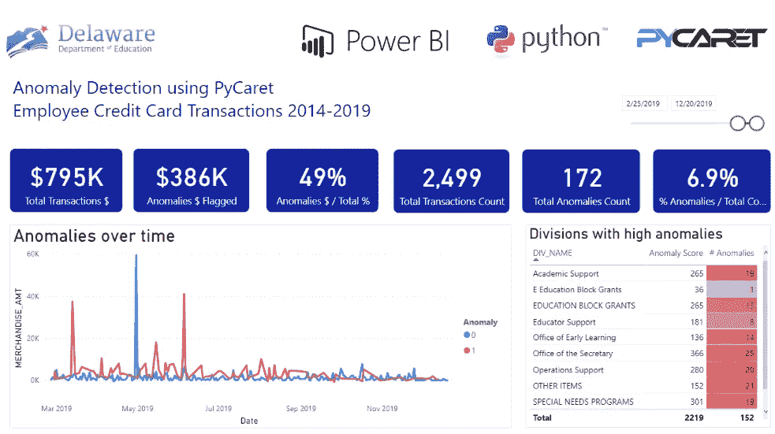

Power BI 中的异常检测仪表板

在我们的上一篇文章中，[使用 PyCaret](/machine-learning-in-power-bi-using-pycaret-34307f09394a) 在 Power BI 中进行机器学习，我们展示了一个关于如何将 PyCaret 集成到 Power BI 中的**分步教程**，从而允许分析师和数据科学家在没有任何额外许可成本的情况下，将机器学习层添加到他们的仪表板和报告中。

在这篇文章中，我们将深入探讨并使用 PyCaret 在 Power BI 中实现一个异常检测器。如果你以前没有听说过 PyCaret，请阅读这个[公告](/announcing-pycaret-an-open-source-low-code-machine-learning-library-in-python-4a1f1aad8d46)以了解更多信息。

# 本教程的学习目标

*   什么是异常检测？异常检测的类型？
*   在 Power BI 中训练和实现一个无监督的异常检测器。
*   在仪表板中分析结果和可视化信息。
*   如何在电力 BI 生产中部署异常检测器？

# 开始之前

如果您以前使用过 Python，很可能您的计算机上已经安装了 Anaconda 发行版。如果没有，[点击这里](https://www.anaconda.com/distribution/)下载 Python 3.7 或更高版本的 Anaconda 发行版。


[https://www.anaconda.com/products/individual](https://www.anaconda.com/products/individual)

# 设置环境

在我们开始在 Power BI 中使用 PyCaret 的机器学习功能之前，我们必须创建一个虚拟环境并安装 pycaret。这是一个三步走的过程:

[✅](https://fsymbols.com/signs/tick/) **步骤 1——创建一个 anaconda 环境**

从开始菜单打开 **Anaconda 提示符**并执行以下代码:

```
conda create --name **myenv** python=3.7
```

[✅](https://fsymbols.com/signs/tick/) **第二步—安装 PyCaret**

在 Anaconda 提示符下执行以下代码:

```
pip install pycaret
```

安装可能需要 15-20 分钟。如果您在安装时遇到问题，请查看我们的 [GitHub](https://www.github.com/pycaret/pycaret) 页面，了解已知问题和解决方案。

[✅](https://fsymbols.com/signs/tick/)t24】第三步——在 Power BI 中设置 Python 目录

创建的虚拟环境必须与 Power BI 链接。这可以使用 Power BI Desktop 中的全局设置来完成(文件→选项→全局→ Python 脚本)。默认情况下，Anaconda 环境安装在以下位置:

C:\Users\ ***用户名***\ AppData \ Local \ Continuum \ anaconda 3 \ envs \ myenv


文件→选项→全局→ Python 脚本

# 什么是异常检测？

异常检测是机器学习中的一种技术，用于识别**罕见项目**、**事件**或**观察值**，这些观察值通过与大多数数据显著不同而引起怀疑。

通常，异常项目会转化为某种问题，如银行欺诈、结构缺陷、医疗问题或错误。有三种方法可以实现异常检测器:

**(a)受监督:**当数据集具有标识哪些交易是异常的，哪些是正常的标签时使用。*(这类似于监督分类问题)*。

**(b)半监督:**半监督异常检测背后的思想是仅在正常数据上训练模型*(没有任何异常)*。当训练好的模型随后用于看不见的数据点时，它可以预测新的数据点是否正常(基于训练好的模型中数据的分布)。

**(c)无监督:**顾名思义，无监督意味着没有标签，因此没有训练和测试数据集。在无监督学习中，在完整的数据集上训练模型，并假设大多数实例是正常的。同时寻找似乎最不适合其余部分的实例。有几种无监督的异常检测算法，如隔离森林或单类支持向量机。每种方法都有自己识别数据集中异常的方法。

本教程是关于在 Power BI 中使用名为 PyCaret 的 Python 库实现无监督异常检测的。对这些算法背后的具体细节和数学的讨论超出了本教程的范围。

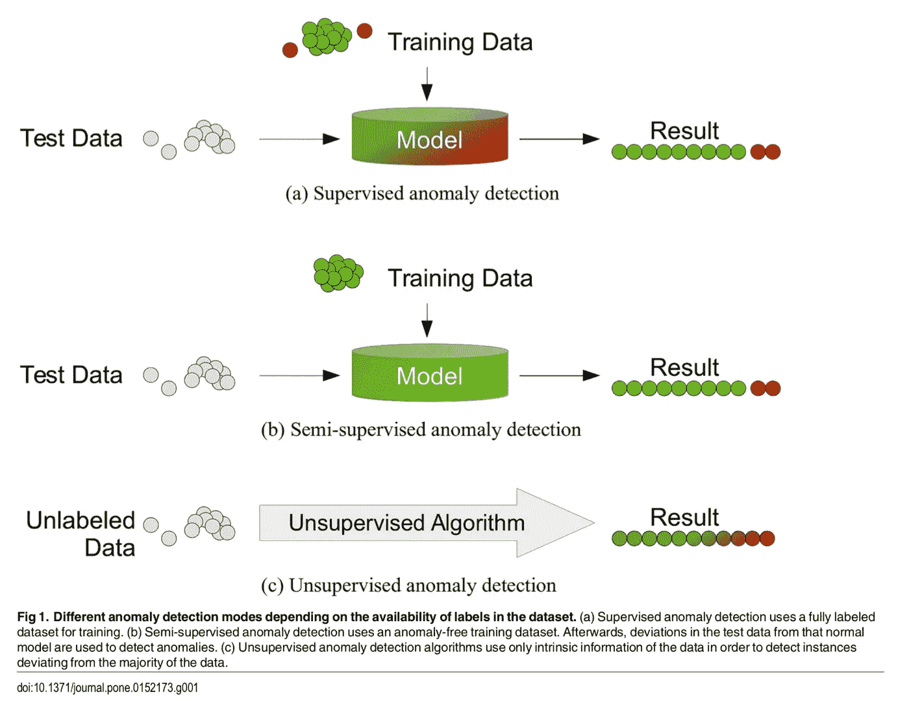

Goldstein M，Uchida S (2016)多元数据的无监督异常检测算法的比较评估。巴勒斯坦解放组织

# 设置业务环境

许多公司向员工发放公司信用卡(*也称为采购卡或* *采购卡*)以有效管理运营采购。通常情况下，员工可以通过电子方式提交报销申请。收集的数据通常是交易性的，可能包括交易日期、供应商名称、费用类型、商家和金额。

在本教程中，我们将使用美国特拉华州教育部 2014 年至 2019 年的州雇员信用卡交易。这些数据可以在他们的[开放数据](https://data.delaware.gov/Government-and-Finance/Credit-Card-Spend-by-Merchant/8pzf-ge27)平台上在线获得。

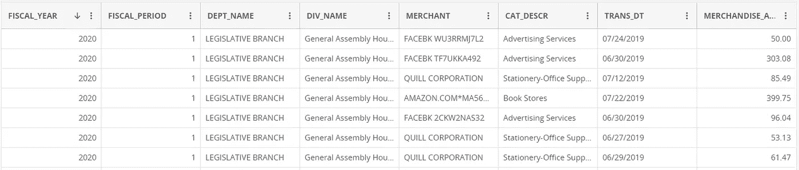

[https://data . Delaware . gov/Government-and-Finance/信用卡消费商户/8pzf-ge27](https://data.delaware.gov/Government-and-Finance/Credit-Card-Spend-by-Merchant/8pzf-ge27)

**免责声明:** *本教程演示了在 Power BI 中使用 PyCaret 构建一个异常检测器。在本教程中构建的示例仪表板并不反映实际的异常情况，也不是为了识别异常情况。*

# 👉我们开始吧

现在，您已经设置了 Anaconda 环境，安装了 PyCaret，了解了异常检测的基础知识，并且有了本教程的业务上下文，让我们开始吧。

# 1.检索数据

第一步是将数据集导入 Power BI Desktop。您可以使用 web 连接器加载数据。(Power BI 桌面→获取数据→来自 Web)。

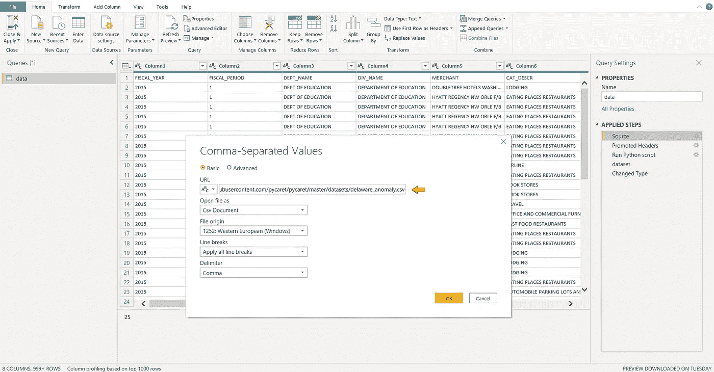

Power BI 桌面→获取数据→其他→ Web

**链接到 csv 文件:**[https://raw . githubusercontent . com/py caret/py caret/master/datasets/Delaware _ anomaly . CSV](https://raw.githubusercontent.com/pycaret/pycaret/master/datasets/delaware_anomaly.csv)

# 2.模特培训

为了在 Power BI 中训练异常检测器，我们必须在 Power Query Editor 中执行 Python 脚本(Power Query Editor→Transform→Run Python script)。将以下代码作为 Python 脚本运行:

```
from **pycaret.anomaly** import *
dataset = **get_outliers**(dataset, ignore_features=['DEPT_NAME', 'MERCHANT', 'TRANS_DT'])
```

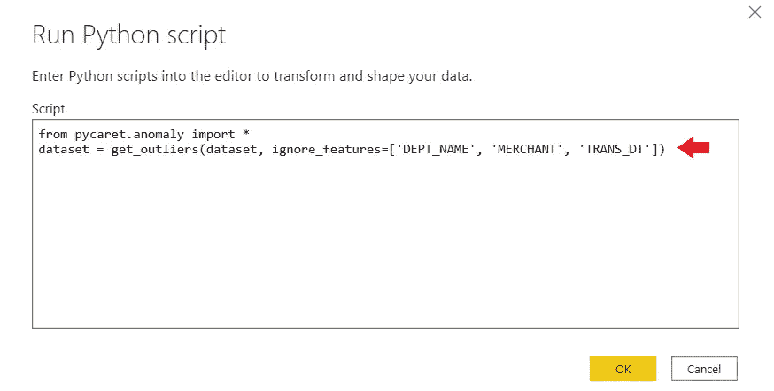

超级查询编辑器(转换→运行 python 脚本)

我们忽略了数据集中的一些列，将它们传递到 **ignore_features** 参数下。可能有许多原因导致您不想使用某些列来训练机器学习算法。

PyCaret 允许您隐藏而不是删除数据集中不需要的列，因为您可能需要这些列用于以后的分析。例如，在这种情况下，我们不想使用事务日期来训练算法，因此我们在 **ignore_features 下传递它。**

PyCaret 中有超过 10 种现成的异常检测算法。

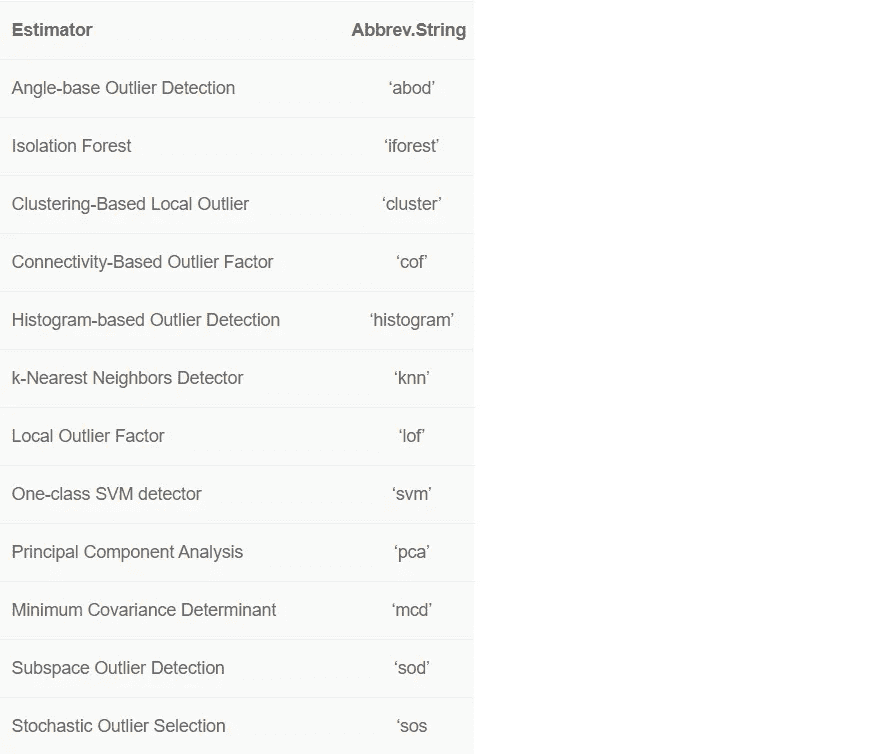

默认情况下，PyCaret 用 5%的分数训练一个 **K 最近邻异常检测器**(即表中总行数的 5%将被标记为异常值)。默认值可以很容易地更改:

*   要更改分数值，您可以使用 **get_outliers( )** 函数中的 ***分数*** 参数。
*   要更改模型类型，请使用 **get_outliers()** 中的 ***模型*** 参数。

参见用于训练分数为 0.1 的**隔离森林**检测器的示例代码:

```
from **pycaret.anomaly** import *
dataset = **get_outliers**(dataset, model = 'iforest', fraction = 0.1, ignore_features=['DEPT_NAME', 'MERCHANT', 'TRANS_DT'])
```

**输出:**

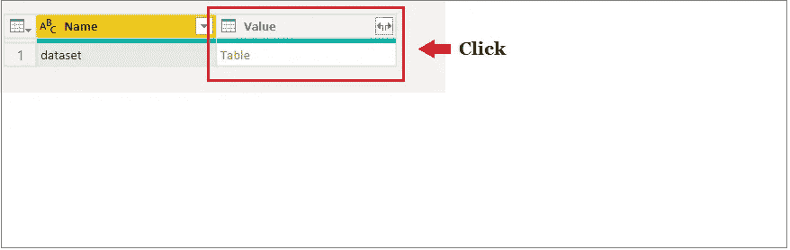

异常检测结果(执行 Python 代码后)

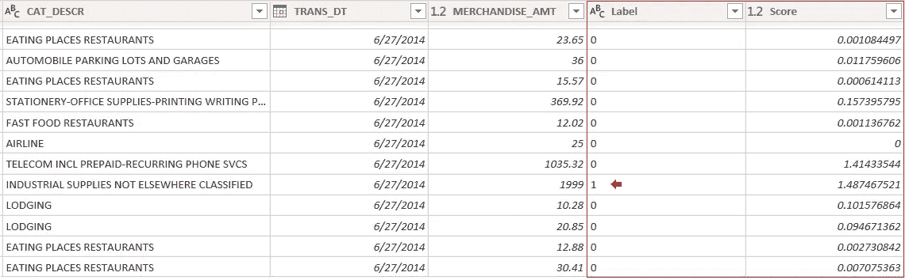

最终输出(点击表格后)

两个新列附加到原始表。标签(1 =异常值，0 =内部值)和分数(具有高分数的数据点被归类为异常值)。应用查询以查看 Power BI 数据集中的结果。

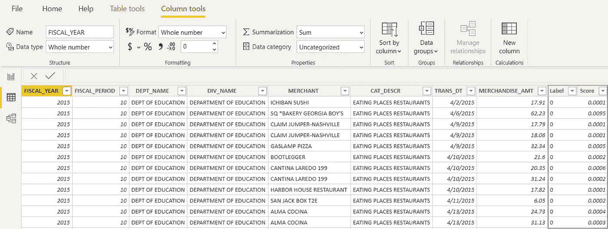

Power BI Desktop 中的结果(应用查询后)

# 3.仪表盘

一旦您在 Power BI 中有了异常值标签，以下是如何在 dashboard 中可视化它的示例:

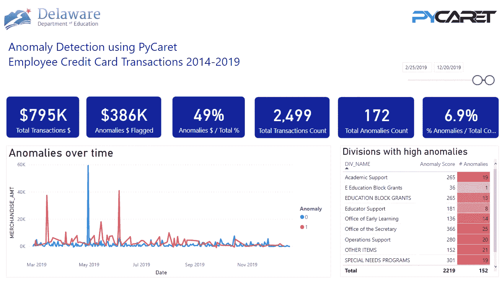

仪表板的摘要页面

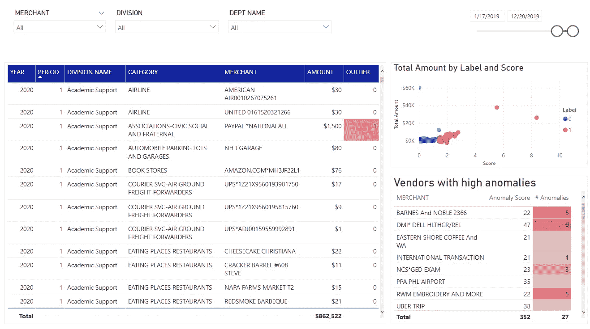

仪表板的详细信息页面

你可以从我们的 [GitHub](https://github.com/pycaret/powerbi-anomaly-detection) 下载 PBIX 文件和数据集。

# 👉在生产中实施异常检测

上面展示的是在 Power BI 中实现异常检测的一种简单方法。然而，重要的是要注意，每当 Power BI 数据集被刷新时，上面所示的方法训练异常检测器。这可能是一个问题，原因有二:

*   当用新数据重新训练模型时，异常标签可能会改变(以前被标记为异常值的一些事务可能不再被认为是异常值)
*   你不想每天花几个小时的时间重新训练模型。

在 Power BI 中实现异常检测的另一种方法是将预先训练好的模型传递给 Power BI 进行标记，而不是在 Power BI 本身中训练模型。

# **事前培训模型**

你可以使用任何集成开发环境(IDE)或笔记本来训练机器学习模型。在此示例中，我们使用 Visual Studio 代码来训练异常检测模型。

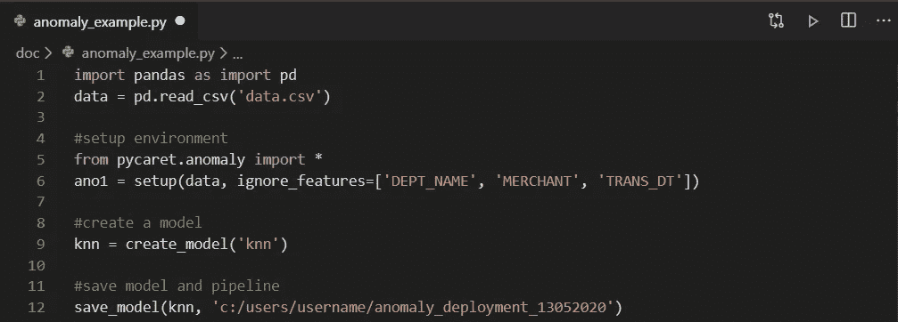

Visual Studio 代码中的模型定型

然后将训练好的模型保存为 pickle 文件，并导入到 Power Query 中以生成异常标签(1 或 0)。

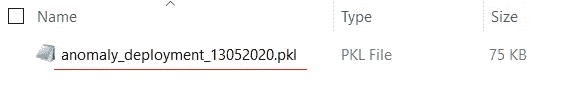

异常检测管道保存为文件

如果您想了解有关使用 PyCaret 在 Jupyter 笔记本中实施异常检测的更多信息，请观看这个 2 分钟的视频教程:

[https://www.youtube.com/channel/UCxA1YTYJ9BEeo50lxyI_B3g](https://www.youtube.com/channel/UCxA1YTYJ9BEeo50lxyI_B3g)

# 使用预先训练的模型

以 Python 脚本的形式执行以下代码，从预训练的模型中生成标签。

```
from **pycaret.anomaly** import *
dataset = **predict_model**('c:/.../anomaly_deployment_13052020, data = dataset)
```

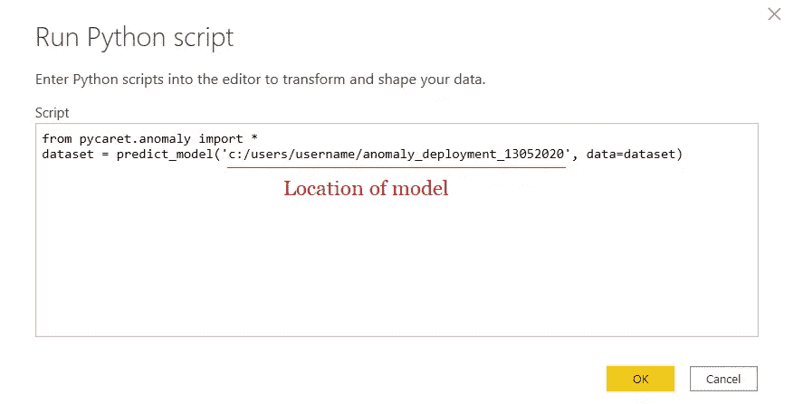

超级查询编辑器(转换→运行 python 脚本)

它的输出将和我们上面看到的一样。但是，不同之处在于，当您使用预训练模型时，标签是在使用相同模型的新数据集上生成的，而不是在每次刷新 Power BI 数据集时重新训练模型。


最终输出(点击表格后)

# **使其在 Power BI 服务上工作**

一旦你上传了。pbix 文件到 Power BI 服务，还需要几个步骤来实现机器学习管道到数据管道的无缝集成。其中包括:

*   **为数据集**启用计划刷新—要使用 Python 脚本为包含您的数据集的工作簿启用计划刷新，请参见[配置计划刷新](https://docs.microsoft.com/en-us/power-bi/connect-data/refresh-scheduled-refresh)，其中还包括关于**个人网关**的信息。
*   **安装个人网关** —你需要一个**个人网关**安装在文件所在的机器上，并且安装了 PythonPower BI 服务必须能够访问 Python 环境。您可以获得关于如何[安装和配置个人网关](https://docs.microsoft.com/en-us/power-bi/connect-data/service-gateway-personal-mode)的更多信息。

如果您有兴趣了解有关异常检测的更多信息，请查看我们的[笔记本教程。](https://pycaret.org/ano101/)

# PyCaret 1.0.1 来了！

我们收到了来自社区的大力支持和反馈。我们正在积极改进 PyCaret，并准备我们的下一个版本。 **PyCaret 1.0.1 会更大更好**。如果您想分享您的反馈并帮助我们进一步改进，您可以[在网站上填写此表格](https://www.pycaret.org/feedback)或者在我们的 [GitHub](https://www.github.com/pycaret/) 或 [LinkedIn](https://www.linkedin.com/company/pycaret/) 页面上发表评论。

关注我们的 [LinkedIn](https://www.linkedin.com/company/pycaret/) 并订阅我们的 [Youtube](https://www.youtube.com/channel/UCxA1YTYJ9BEeo50lxyI_B3g) 频道，了解更多关于 PyCaret 的信息。

# 重要链接

[用户指南/文档](https://www.pycaret.org/guide)
[GitHub 资源库](https://www.github.com/pycaret/pycaret) [安装 PyCaret](https://www.pycaret.org/install)
[笔记本教程](https://www.pycaret.org/tutorial)
[贡献于 PyCaret](https://www.pycaret.org/contribute)

# 想了解某个特定模块？

从第一个版本 1.0.0 开始，PyCaret 有以下模块可供使用。点击下面的链接，查看 Python 中的文档和工作示例。

[分类](https://www.pycaret.org/classification)
[回归](https://www.pycaret.org/regression) [聚类](https://www.pycaret.org/clustering)
[异常检测](https://www.pycaret.org/anomaly-detection) [自然语言处理](https://www.pycaret.org/nlp)
关联规则挖掘

# 另请参见:

笔记本中的 PyCaret 入门教程:

[聚类](https://www.pycaret.org/clu101)
[异常检测](https://www.pycaret.org/anom101)
[自然语言处理](https://www.pycaret.org/nlp101)
[关联规则挖掘](https://www.pycaret.org/arul101)
[回归](https://www.pycaret.org/reg101)
分类

# 你愿意投稿吗？

PyCaret 是一个开源项目。欢迎每个人都来投稿。如果您愿意投稿，请随意处理[未决问题](https://github.com/pycaret/pycaret/issues)。dev-1.0.1 分支上的单元测试接受拉请求。

如果你喜欢 PyCaret，请给我们 GitHub 回购的⭐️。

中:[https://medium.com/@moez_62905/](https://medium.com/@moez_62905/machine-learning-in-power-bi-using-pycaret-34307f09394a)

领英:【https://www.linkedin.com/in/profile-moez/ 

推特:【https://twitter.com/moezpycaretorg1 