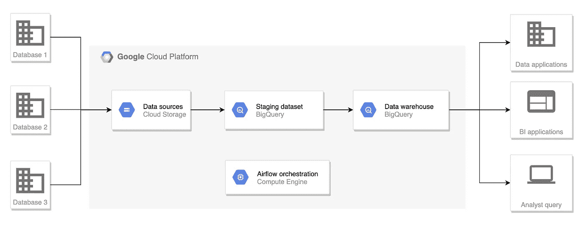
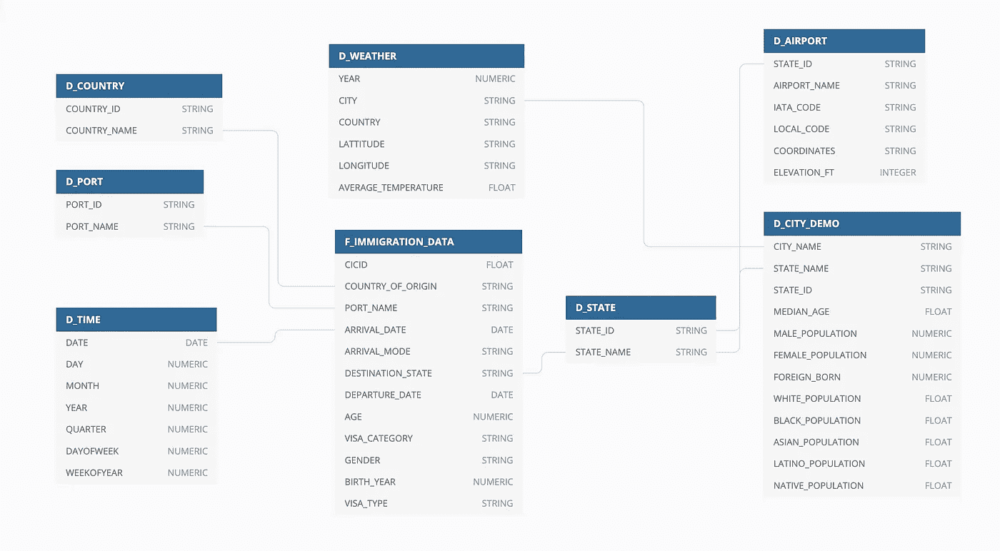
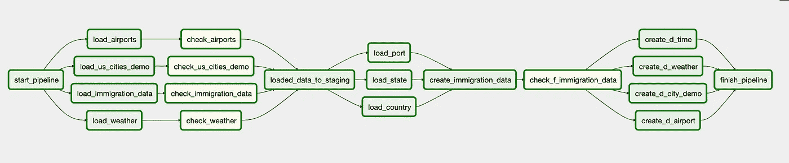
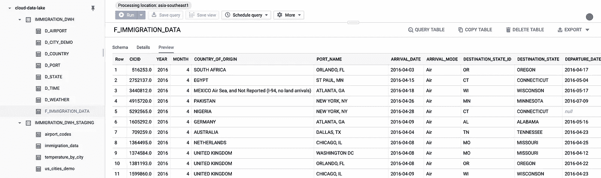
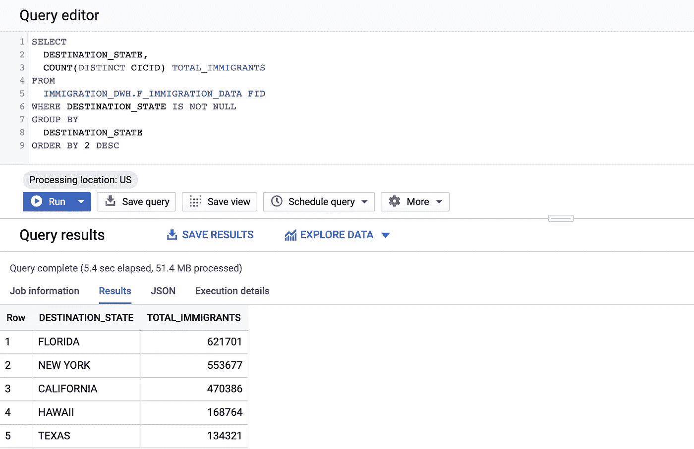

# 在 GCP 建立你的第一个数据仓库

> 原文：<https://towardsdatascience.com/build-your-first-data-warehouse-with-airflow-on-gcp-fdd0c0ad91bb?source=collection_archive---------6----------------------->

## 构建数据仓库的步骤是什么？你应该使用什么云技术？如何利用气流来协调你的管道？



这个项目的架构

作为一名数据专业人员，气流已经成为我的工具集的重要组成部分。在我之前的帖子之后，很多人联系我，询问如何开始学习气流。和许多其他事情一样，我相信开始学习一件事情的最好方法是通过实践。

在这个项目中，我们将在谷歌云平台上建立一个数据仓库，帮助回答常见的业务问题，并为仪表盘提供动力。您将直接体验如何构建 DAG 来实现常见的数据工程任务:从数据源提取数据，加载到数据接收器，转换数据并为业务消费建模。

如果你不知道什么是气流或者需要帮助来设置它，看看我以前的帖子。

[](/getting-started-with-airflow-locally-and-remotely-d068df7fcb4) [## 从本地和远程开始使用气流

### 气流已经存在了一段时间，但最近它获得了很大的牵引力。那么什么是气流呢？你如何使用…

towardsdatascience.com](/getting-started-with-airflow-locally-and-remotely-d068df7fcb4) 

# 为什么选择谷歌云平台？

简短的回答是 BigQuery。虽然市场上有许多数据仓库解决方案，或者作为云提供商的解决方案，或者作为内部部署，但我对 BigQuery 的体验是最愉快的。

## 费用

首先，定价模式简单明了，无论规模大小都可以承受。您不需要为一个永不停机的实例(向您眨眼、红移)付费，而是每月每 TB 存储花费 20 美元，每次查询时每 TB 扫描花费 5 美元。

假设您的数据集大小为 200GB，这对于结构化数据集来说相当大。你每月只需支付 2 美元的仓储费。就查询成本而言，您也不会花费太多，因为 BigQuery 是一个列数据库，这意味着每次查询时，引擎不会扫描整个表，而是只扫描您选择的列，这取决于您构建数据仓库的方式，这是一个显著的成本节约。粗略估计，您一个月将扫描所有数据大约 50 次，这相当于扫描 10TB，花费您 50 美元。

因此，对于一个规模合理的结构化数据仓库，每月只需 52 美元，相比之下，最便宜的始终在线红移实例每月需要 146 美元。如果最低层的红移不能满足您的需求，那么无论您是否大量使用您的数据仓库，您每月都要支付大约 2，774 美元。对我来说，BigQuery 的按需定价更可取。

## 易用性

这更多的是个人意见，而不是确凿的事实，但我认为 GCP 比 AWS 更方便用户。在 GCP，从浏览器中维护权限或查询数据等操作通常更加用户友好。此外，BigQuery 会自动进行许多优化，在后台为您加速查询。

# 商业目标

在着手进行任何数据仓库项目之前，您应该有一个明确定义的、您试图解决的业务问题。对于这个项目，我选择了美国政府提供的 I94 移民数据，以及几个补充数据集。

假设你是美国移民局的数据工程师。你的老板找到你，说目前分析移民模式的方法是手工的，耗时且容易出错。他希望您提出一个解决方案，使分析过程更加简单、快速和可扩展。

> 该数据仓库将帮助美国官员分析移民模式，以了解是什么因素驱使人们迁移。

# 数据集

您可以为这个项目选择任何免费的数据源，并遵循。你可以在 [Kaggle](https://www.kaggle.com/datasets) 或者[谷歌数据集搜索](https://datasetsearch.research.google.com/)上找到很多有用的数据集。以下是这个项目中使用的数据集。

*   I94 移民数据:该数据来自美国[国家旅游和贸易办公室](https://travel.trade.gov/research/reports/i94/historical/2016.html)。
*   I94 数据字典:字典伴随着 I94 移民数据
*   世界温度数据:该数据集来自 [Kaggle](https://www.kaggle.com/berkeleyearth/climate-change-earth-surface-temperature-data) 。
*   美国城市人口统计数据:该数据来自 OpenSoft。你可以在这里阅读更多信息[。](https://public.opendatasoft.com/explore/dataset/us-cities-demographics/export/)
*   机场代码表:这是一个简单的机场代码和相应城市的表格。这里来自[这里来自](https://datahub.io/core/airport-codes#data)。

# 数据建模

根据原始数据，我们的下一步是为数据仓库设计一个数据模型。数据模型应该与业务目标和您试图回答的问题紧密联系在一起。

我根据星型模式原理设计了以下模型，其中包含一个事实表和七个维度表。



我们数据仓库的数据模型

*   `F_IMMIGRATION_DATA`:包含入境信息，如到达日期、离开日期、签证类型、性别、原籍国等。
*   `D_TIME`:包含日期列的维度
*   `D_PORT`:包含端口标识和端口名称
*   `D_AIRPORT`:包含州内的机场
*   `D_STATE`:包含状态标识和状态名称
*   `D_COUNTRY`:包含国家标识和国家名称
*   `D_WEATHER`:包含一个州的平均天气
*   `D_CITY_DEMO`:包含一个城市的人口统计信息

# 体系结构


这个项目的架构

我们将跳过从不同数据库中提取数据的步骤，并假设我们在 Google 云存储(GCS)中拥有这个项目的所有数据。

GCS 将作为存储所有原始文件的数据源。然后，数据将被加载到 BigQuery 上的临时表中。ETL 过程将从这些临时表中获取数据，并创建数据仓库表。

Airflow 实例部署在 Google 计算引擎上或本地，以协调我们管道的执行。

以下是使用这些技术的理由:

*   谷歌云存储:充当我们的数据源，纵向可扩展。
*   Google Big Query:充当数据仓库、数据集市和 ETL 过程的数据库引擎。BigQuery 是一种无服务器的解决方案，可以高效地处理 Pb 级数据集。
*   Apache Airflow:通过发出 CLI 命令将数据加载到 BigQuery 或 SQL 查询中以执行 ETL 过程，从而协调工作流。Airflow 本身不需要处理任何数据，因此允许我们的管道进行扩展。

# 建立基础设施

要运行这个项目，你应该有一个 GCP 帐户。您可以免费创建一个新的 Google 帐户，并获得 300 美元的点数。与免费学分和免费层，你应该通过这个项目，无需支付任何费用。你可以参考我以前的文章[这里](/getting-started-with-airflow-locally-and-remotely-d068df7fcb4)在谷歌计算引擎实例上设置气流，并在这里运行我的代码[来轻松地为项目创建必要的云资源。](https://github.com/tuanchris/cloud-data-lake/blob/master/src/setup_gcp_iac.py)

否则，您可以使用 GCP 用户界面创建 GCS bucket、BigQuery 数据集和 BigQuery 表。

*   创建一个关于 GCP 的项目
*   通过添加信用卡启用计费(您有价值 300 美元的免费点数)
*   导航到 IAM 并创建一个服务帐户
*   授予帐户项目所有者。这对于本项目来说很方便，但不建议用于生产系统。你应该把钥匙放在安全的地方。

您可以通过运行以下命令将数据复制到存储桶中:

```
gsutil cp -r gs://cloud-data-lake-gcp/ gs://{your_bucket_name}
```

查看我的 GitHub [repo](https://github.com/tuanchris/cloud-data-lake#gcp-setup) 了解更多信息。

# 数据管道



数据管道

随着所有的设计和设置的方式，我们可以开始与这个项目的实际管道。下面用的代码可以参考我的 GitHub repo。

[](https://github.com/tuanchris/cloud-data-lake) [## Tuan Chris/云数据湖

### 该项目在谷歌云平台上创建了一个数据湖，主要侧重于建立一个数据仓库和数据…

github.com](https://github.com/tuanchris/cloud-data-lake) 

一个`DummyOperator` start_pipeline 启动流水线，随后是四个加载操作。这些操作将数据从 GCS bucket 加载到 BigQuery 表中。`immigration_data`被加载为`parquet`文件，而其他的被格式化为`csv`。在装载到 BigQuery 后，有检查行的操作。

接下来，管道从 I94 数据字典加载三个主数据对象。然后创建`F_IMMIGRATION_DATA`表，并检查以确保没有重复。还创建了其他维度表，管道也完成了。

## 导入气流库

定义新 dag 的第一件事是从 Airflow 导入所需的库。我们应该从 Airflow 导入 DAG，以及您希望使用的任何操作符。您可以阅读 Airflow 文档，了解操作员的工作内容和使用方法。

不同的操作符可以有相同的参数，每次使用操作符时定义所有相同的参数是重复的。这就是为什么您应该定义一个默认的 set 参数，它将被传递给所有的任务。

## 定义 DAG

接下来要做的是定义一个 DAG。您应该给它一个唯一的名称、开始日期和 schedule_interval。您还可以将上面定义的默认参数传递到 DAG。

可以使用 Airflow [变量](https://airflow.apache.org/docs/stable/concepts.html#variables)传入变量，而不是像我下面这样在 DAG 定义代码中定义。经验法则是，对于经常变化的变量，使用气流变量。否则，您可以不使用标准的 Python 变量。请记住，您不应该定义大量的气流变量；否则，您可能会使气流的元数据数据库过载。

## 从 GCS 定义加载任务

对于我们的四个数据集，我们将使用`GoogleCloudStorageToBigQueryOperator`将数据从 GCS 加载到 BigQuery。您可以阅读 Airflow 文档，了解更多关于如何将变量传递给操作符的信息。

在我们的例子中，我们加载 CSV 格式的尺寸文件和 parquet 格式的`immigration`数据。请注意，对于 CSV 文件，您应该提供一个模式来确保以预期的格式加载数据。对于 parquet 格式，您不需要这样做，因为 parquet 文件已经附带了一个模式。

## 定义数据检查

在我们将数据加载到 BigQuer 之后，我们应该检查我们之前的任务是否按预期运行。我们可以通过检查表中的行数来验证是否有行存在。根据您的业务需求，您可以在这里实现更复杂的数据质量检查。

## 创建事实和维度表

在临时数据集中加载并检查了临时数据后，我使用 BigQueryOperator 执行 SQL 查询来转换和加载事实表和 dim 表。

注意，我在查询中传递参数，而不是数据集和表。这使得在开发和生产环境之间切换变得更加容易。查看我在 GitHub repo 中的 SQL 查询，找出我在转换中使用了什么逻辑。

## 定义任务相关性

最后，我们必须定义任务依赖性，即哪些任务相互依赖。您可以使用`>>`或`<<`操作符来实现。您也可以使用列表对多个任务进行分组。

# 结果

在所有这些步骤之后，您将有一个数据仓库呈现给您的老板。



我们的数据仓库

让我们运行一下我们的数据仓库。让我们看看哪些州的移民人数最多。在我们的数据集中，佛罗里达的移民人数最多，其次是纽约和加利福尼亚。



谁要移民到美国，他们的性别是什么？


## 打扫

请记住关闭 Airflow 实例/删除未使用的资源，以避免不必要的费用。

# 摘要

在本文中，我使用 Airflow 作为编排器，完成了在 GCP 设计和部署数据仓库的许多步骤。如您所见，这是一个漫长而复杂的过程，因此我无法在一篇文章中涵盖所有内容。

我希望你能更好地理解数据工程师是做什么的，并能运用这些知识。

快乐学习！