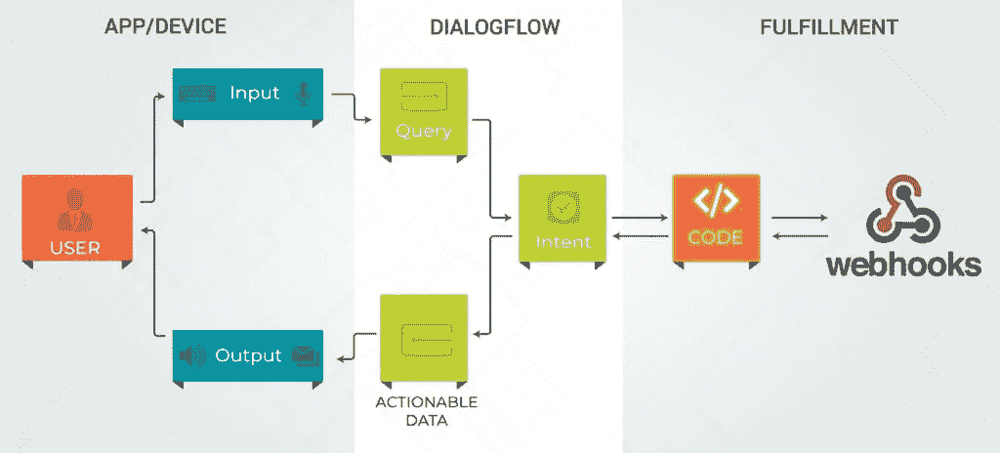
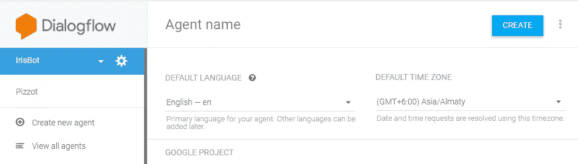
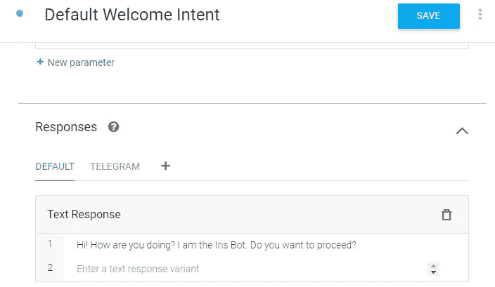
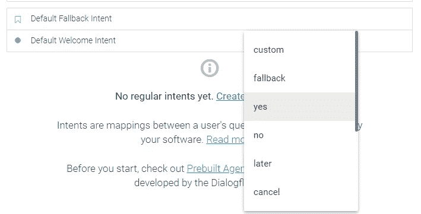
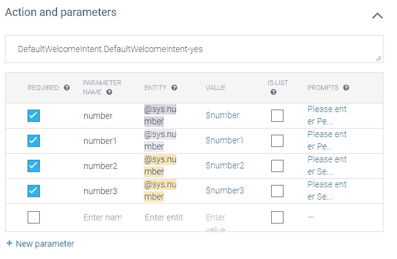
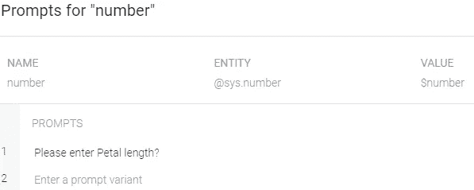
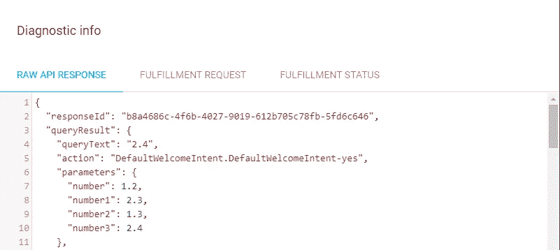
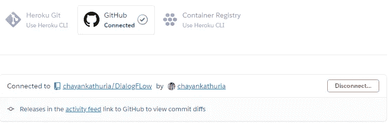

# 在 DialogFlow 上构建您的第一个 ML 集成聊天机器人！

> 原文：<https://towardsdatascience.com/build-your-first-ml-integrated-chatbot-on-dialogflow-7543bf768619?source=collection_archive---------23----------------------->


丹尼尔·科尔派在 [Unsplash](https://unsplash.com?utm_source=medium&utm_medium=referral) 上拍摄的照片

> 您在 Google 的 DialogFlow 上的第一个机器学习集成聊天机器人只需 4 个步骤！

任何机器学习模型都是无用的，除非你把它应用到现实生活中。在 Jupyter 笔记本上运行模型，吹嘘 99.99%的准确率，都于事无补。你需要把它做成一个端到端的应用程序，把它呈现给外界。聊天机器人是一种有趣又简单的方式。

构建聊天机器人从未如此简单。谷歌的 DialogFlow 是一个显而易见的选择，因为它非常简单，快速和免费！在继续之前，先自己试用一下这个应用程序[这里](http://t.me/Irispredictor_bot)！

# 流动

现在您已经尝试过了，接下来要构建完整的应用程序，我们将讨论以下步骤:

1.  你的机器学习模型(这里是 Iris)
2.  获取用户输入的对话流聊天机器人
3.  部署在任何公共主机上的 Flask 应用程序，用于呈现请求和响应
4.  聊天机器人对 flask api 进行的 webhook 调用，用于发送数据和获取结果
5.  集成 DialogFlow 和 Telegram

我们将一个接一个地检查每个步骤。让我们先来看看我们的完整应用程序的架构会是什么样子:



建筑

# 发生了什么事？

因此，用户可以访问 Telegram 聊天机器人，我们将建立在 DialogFlow 上，稍后与 Telegram 集成。对话开始，聊天机器人提示用户输入数据，这些数据是花的尺寸(花瓣长度、花瓣宽度、萼片长度和萼片宽度)。一旦聊天机器人接收到最后一个输入，它将触发对 flask API 的 webhook 调用，该 API 将部署在公共主机上。这个 flask API 由我们的应用程序组成，它将检索 4 个数据点，并将其与我们的机器学习模型相匹配，然后将预测回复给聊天机器人。你可以在我的 [Github](https://github.com/chayankathuria/Iris-Dialogflow) 找到完整的代码。

现在让我们来看一下每一步！

# 构建组件

## ML 模型

首先，让我们建立一个基本的最大似然模型，该模型采用虹膜尺寸并预测虹膜类型。这里没有火箭科学。只是一个非常基本的模型，它能以相当高的精度呈现结果。下面是快速实现这一点的基本代码。

```
#Load data
iris = load_iris() 
X = iris.data      
y = iris.target

#Train test split
X_train, X_test, y_train, y_test = train_test_split(X, y, random_state = 42, test_size = 0.25)

#Define and fit to the model
clf = RandomForestClassifier(n_estimators=10)
clf.fit(X_train, y_train)
predicted = clf.predict(X_test)
print(accuracy_score(predicted, y_test))
print(clf.predict(X_test))

#Save the model as Pickle
import pickle
with open(r'rf.pkl','wb') as model_pkl:
    pickle.dump(clf, model_pkl, protocol=2)
```

我们只需加载数据，并使其适合随机森林分类器。不需要清理数据，因为数据集已经非常小了。我不会为了避免复杂性而在这里进行任何优化，因为我们的主要目标不是模型的准确性，而是完整的应用程序。然后只需 [pickle](https://www.geeksforgeeks.org/understanding-python-pickling-example/) 这个模型，之后这个模型、*‘RF . pkl’、*就会被加载到我们的 flask 应用中。

# 对话流聊天机器人

现在让我们直接进入 DialogFlow 来制作我们的聊天机器人。您也可以使用其他 API 和框架来构建聊天机器人，但 Google 的 DialogFlow 是一个显而易见的选择，因为它简单、免费且构建速度极快！前往 [DialogFlow](https://dialogflow.cloud.google.com/) ，用你的谷歌账户登录。然后点击“创建代理”来创建您的聊天机器人。



创建代理

接下来，我们需要创建一个向用户请求数据并进行 webhook 调用的意图。让我们首先编辑默认的欢迎意图，让它要求用户回答“是”或“否”。



现在，只要用户键入“Yes”，DialogFlow 就会调用另一个 intent，要求用户输入并将数据点存储在“Entities”中。这里我们处理简单的随机数，所以我们不需要创建自定义实体。DialogFlow 有默认的实体来处理这样的数据。因此，我们需要为这个意图创建一个“Yes-follow-Intent ”,因为该意图将在用户的肯定回复之后被调用。



点击“添加跟进意向”>“是”。如果您愿意，可以将此意图重命名为其他名称。我将把它重命名为“IrisData”。现在我们需要添加实体，这些实体将保存从用户那里收到的数据。我们将在这里为所有 4 个输入使用默认的 *@sys.number* 实体。为用户需要的 4 个数据点设置 4 个不同的参数——花瓣长度、花瓣宽度、萼片长度、萼片宽度。确保添加提示，并要求用户单独输入。



添加参数



添加提示

用一些输入来训练模型，以便它知道会发生什么。您现在可以在右侧面板测试聊天机器人，检查它是否相应地运行。

完成后，您需要通过“为此目的启用 webhook 调用”来启用履行。通过这样做，这个特定的意图将对我们部署在公共主机 Heroku 上的应用程序进行 webhook 调用。我们现在需要构建 flask 应用程序，并将其部署在 Heroku 上，然后将 URL 放在左侧的“Fulfillment”选项卡中。

# Heroku 上的 Flask 应用程序

我们现在需要构建我们的 flask 应用程序，它从我们的 chatbot 获取 webhook 调用，检索数据，然后适应 ML 模型(rf.pkl ),并将履行文本和预测一起返回给 DialogFlow。下面是代码:

```
# Importing necessary libraries
import numpy as np
from flask import Flask, request, make_response
import json
import pickle
from flask_cors import cross_origin

# Declaring the flask app
app = Flask(__name__)

#Loading the model from pickle file
model = pickle.load(open('rf.pkl', 'rb'))

# geting and sending response to dialogflow
@app.route('/webhook', methods=['POST'])
@cross_origin()
def webhook():

    req = request.get_json(silent=True, force=True)
    res = processRequest(req)
    res = json.dumps(res, indent=4)
    r = make_response(res)
    r.headers['Content-Type'] = 'application/json'
    return r
```

一旦完成，我们需要处理来自 DialogFlow 的 JSON 格式的实现请求来检索数据。履行请求看起来像这样:



API 请求格式

所以我们需要进入' query result ' > > ' parameters ' > > ' number '，' number1 '，' number2 '，' number4 '。一旦检索到，我们将把这些数据点转储到一个数组中，并将其应用到我们的模型中，从而得到预测。

```
# processing the request from dialogflow
def processRequest(req):

    result = req.get("queryResult")

    #Fetching the data points
    parameters = result.get("parameters")
    Petal_length=parameters.get("number")
    Petal_width = parameters.get("number1")
    Sepal_length=parameters.get("number2")
    Sepal_width=parameters.get("number3")
    int_features = [Petal_length,Petal_width,Sepal_length,Sepal_width]

    #Dumping the data into an array
    final_features = [np.array(int_features)]

    #Getting the intent which has fullfilment enabled
    intent = result.get("intent").get('displayName')

    #Fitting out model with the data points
    if (intent=='IrisData'):
        prediction = model.predict(final_features)

        output = round(prediction[0], 2)

        if(output==0):
            flowr = 'Setosa'

        if(output==1):
            flowr = 'Versicolour'

        if(output==2):
            flowr = 'Virginica'

        #Returning back the fullfilment text back to DialogFlow
        fulfillmentText= "The Iris type seems to be..  {} !".format(flowr)
        #log.write_log(sessionID, "Bot Says: "+fulfillmentText)
        return {
            "fulfillmentText": fulfillmentText
        }

if __name__ == '__main__':
    app.run()
```

一旦完成，我们只需要在公共主机上部署代码。我再次选择了 Heroku，它简单、免费、超级快捷！你只需要添加以下文件到你的新 Github 库:flask 应用程序，模型 pickle 文件，一个 Procfile(这是非常重要的，帮助 Heroku 定位 flask 应用程序)，和一个需求文本文件，告诉 Heroku 要正确运行应用程序需要预装哪些库和版本。

只需在 Github 上创建一个存储库，然后访问 Heroku。创建一个“新应用”,并在那里“连接”你的 Github 库。一旦连接，只需点击部署按钮，你就大功告成了！



将 Github repo 连接到 Heroku 应用程序

# Webhook 调用

现在进入最后一步。我们现在需要将部署的应用程序连接到我们的聊天机器人。只需输入部署您的应用程序的 URL，并在其中添加“/webhook”即可。记住上面的 flask 代码，应用程序被路由到“/webhook”。只需转到 DialogFlow 左侧面板的“履行”选项卡，启用“网页挂钩”并添加<your_app>/网页挂钩即可。</your_app>


在 DialogFlow 上启用 Webhook

我们完了。(不要忘记点击保存按钮！)您可以在右侧面板上通过发起聊天来测试 webhook 请求/响应是否工作正常。您应该得到带有预测的实现响应。

# 与电报集成

到了最后一步。这里没什么要做的，因为将 web 应用程序与 DialogFlow 集成非常容易。我们首先需要去[电报](https://web.telegram.org/)那里生成一个虚拟机器人，并生成它的令牌。搜索“机器人父亲”并点击“新机器人”。它会问你机器人的名字。根据需要输入任何名称。然后它会提示您输入用户名。

在你完成之后，你的机器人的一个令牌和一个链接将会在这里生成。只需复制令牌并转到左边的 DialogFlow“集成”面板。在那里启用 Telegram，粘贴您刚刚生成的令牌，然后单击 start。就是这样！现在只需进入电报机器人链接，并尝试应用程序！