# 构建您的第一个随机森林分类器

> 原文：<https://towardsdatascience.com/build-your-first-random-forest-classifier-cbc63a956158?source=collection_archive---------44----------------------->

## 预测病人的心脏病


图片由来自 Pixabay 的 Gordon Johnson 提供

在本文中，我将指导您使用 scikit-learn 库中的随机森林构建一个简单的分类器。

我们将从从 Kaggle 下载数据集开始，之后，我们将做一些基本的数据清洗，最后，我们将拟合模型并评估它。同时，我们还将创建一个用于评估的基线模型。

这篇文章适合希望了解机器学习项目的基本工作流程并构建他们的第一个分类器的初级数据科学家。

**下载并加载数据集**

我们将使用这个[链接](https://www.kaggle.com/ronitf/heart-disease-uci)从 Kaggle 下载心脏病数据集。

该数据集包括近 300 名患有或未患有心脏疾病的患者。这就是我们将要预测的。

为此，我们将使用十三种不同的功能:

1.  年龄
2.  性
3.  胸痛类型(4 个值)
4.  静息血压
5.  血清胆固醇(毫克/分升)
6.  空腹血糖> 120 毫克/分升
7.  静息心电图结果(值 0，1，2)
8.  达到最大心率
9.  运动诱发的心绞痛
10.  oldpeak =运动相对于休息诱发的 ST 段压低
11.  运动 ST 段峰值的斜率
12.  荧光透视着色的主要血管数量(0-3)
13.  thal: 3 =正常；6 =修复缺陷；7 =可逆缺陷

现在花点时间熟悉一下这些描述，这样您就能理解每一列代表什么。

下载完数据集并将其放入 Jupyter 笔记本文件所在的文件夹后，您可以使用以下命令加载数据集。

```
import pandas as pd 
df = pd.read_csv('data.csv') 
df.head()
```

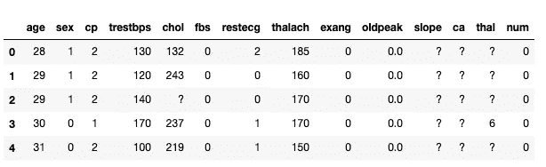

这是您将使用的数据框的头部。

**数据清理**

你发现上面数据框中的问号了吗？看起来这个数据集的作者用它们来表示空值。让我们用真正的 Nones 来代替它们。

```
df.replace({'?': None}, inplace=True)
```

现在我们已经完成了，我们可以检查我们的数据集中有多少空值。我们可以用 info()函数来实现。

```
df.info()
```

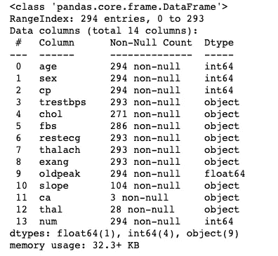

我们可以看到第 10、11 和 12 列有很多空值。*Ca’*和*‘thal’*实际上几乎是空的，‘slope’只有 104 个条目。缺少的值太多，无法填写，所以让我们删除它们。

```
df.drop(columns=['slope', 'thal', 'ca'], inplace=True)
```

其余的列没有或很少缺少值。为了简单起见，我建议删除那些有它们的条目。我们不应该丢失太多数据。

```
df.dropna(inplace=True)
```

我们可以从 info()函数的结果中读取的另一个信息是，大多数列都是对象，即使它们看起来有数值。

我怀疑这是由初始数据集中的问号引起的。现在我们已经删除了它们，我们应该能够将对象更改为数值。

为了做到这一点，我们将对整个数据帧使用 pd.to_numeric()函数。对象值应该变成数字，它不应该影响已经编号的值。

```
df = df.apply(pd.to_numeric)
df.info()
```

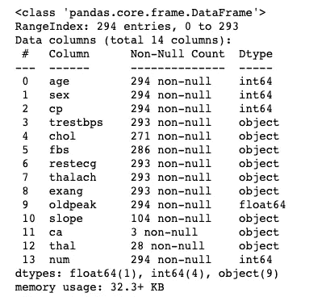

如你所见，我们现在只剩下浮点数和整数。info()函数还确认删除了列'*Ca '，' thal '*和[T2 '，' slope '。

此外，具有空值的行被删除，因此，我们有一个包含 261 个数值变量的数据集。

在我们继续之前，我们还需要做一件事。我注意到最后一列*‘num’*的名称中有一些尾随空格(肉眼看不出来)，所以让我们来看看列名列表。

```
df.columns
```

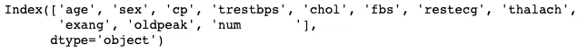

您应该在最后一列*‘num’*中看到尾随空格。让我们通过应用 strip()函数来移除它们。

```
df.columns = [column.strip() for column in df.columns]
```

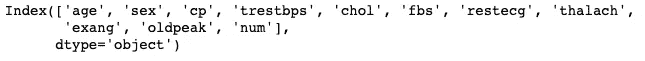

搞定了。

**探索性数据分析**

我们来做一些基本的数据分析。我们将首先使用直方图来观察变量的分布。

```
import matplotlib.pyplot as plt 
plt.figure(figsize=(10,10)) 
df.hist() 
plt.tight_layout()
```

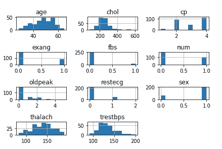

我们能立即注意到的是，有些变量不是连续的。实际上，只有五个特征是连续的:'*'年龄'，' chol '，' oldpeak '，' thalach '，' trestbps'* ，而其他的都是分类变量。

因为我们想在探索中区别对待他们，我们应该把他们分成两组。

```
continous_features = ['age', 'chol', 'oldpeak', 'thalach', 'trestbps'] non_continous_features = list(set(df.columns) - set(continous_features + ['num']))
```

完成后，您可以通过在 Jupyter 笔记本单元格中键入变量名来检查它们的值。

```
continous_features
```


```
non_continous_features
```

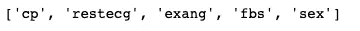

现在，我们将检查连续特征在目标变量中有何不同。我们将通过散点图来实现这一点。

```
import seaborn as sns 
df.num = df.num.map({0: 'no', 1: 'yes'})
sns.pairplot(df[continous_features + ['num']], hue='num')
```

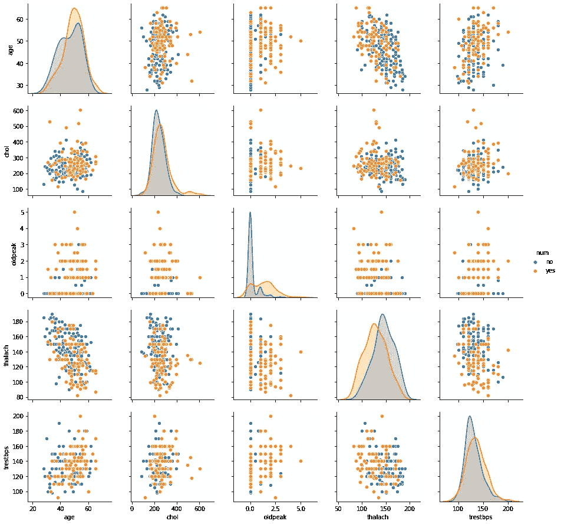

*请注意，我们必须将*‘num’*变量设为字符串，以便将其用作色调参数。我们是这样做的，将 0 映射为“否”,表示健康的患者，将 1 映射为“是”,表示患有心脏病的患者。

如果你看散点图和 kde，你会发现心脏病患者和健康患者相比有地区模式。

为了探究分类变量，我们将通过使用 describe()函数来查看它们可以取的不同值。

```
df[non_continous_features].applymap(str).describe()
```

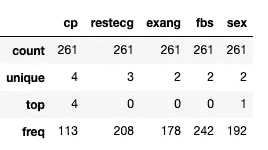

我们可以看到' *exang '，' fbs'* 和 *'sex'* 是二进制的(它们只取两个不同的值)。而*‘CP’*和*‘reste ceg’*分别取四个和三个不同的值。

最后两个是数据集作者编码的有序分类变量。我不确定我们是否应该这样对待它们，或者将它们改为伪编码。这将需要进一步的调查，我们可以在未来改变方法。现在，我们将让它们保持有序。

最后但同样重要的是，我们将探索目标变量。

```
df.num.value_counts()
```

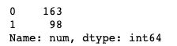

我们有 163 名健康患者和 98 名有心脏问题的患者。不是理想的平衡数据集，但对我们的目的来说应该没问题。

**创建基线模型**

在快速的探索性数据分析之后，我们准备好构建一个初始分类器。我们首先将数据集分为特征和目标变量。

```
X = df.drop(columns='num')
y = df.num.map({'no': 0, 'yes': 1})
```

*注意，我必须反转创建 seaborn 图时应用的映射，因此，在创建 y 变量时需要 map()函数。

我们还使用了数据集的所有功能，通过查看我们的快速 EDA，它们似乎都是相关的。

现在，我们将使用 train_test_split()函数将 X 和 y 变量进一步划分为它们的训练和测试对应变量。

```
from sklearn.model_selection import train_test_splitX_train, X_test, y_train, y_test = train_test_split(X, y, test_size=0.2, random_state=1) X_train.shape, X_test.shape, y_train.shape, y_test.shape
```

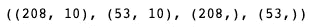

作为上述操作的结果，我们现在应该有四个不同的变量:X_train，X_test，y_train，y_test，它们的尺寸打印在上面。

现在我们将使用 DummyClassifier 构建一个基线。

```
from sklearn.dummy import DummyClassifier
from sklearn.metrics import accuracy_score
dc = DummyClassifier(strategy='most_frequent')
dc.fit(X,y) dc_preds = dc.predict(X)
accuracy_score(y, dc_preds)
```

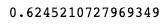

如你所见，基线分类器在训练集上给了我们 62%的准确率。我们基线的策略是预测最频繁的类。

看看能不能用随机森林打败它。

**随机森林分类器**

下面的代码设置了一个随机森林分类器，并使用交叉验证来查看它在不同折叠上的表现。

```
from sklearn.ensemble import RandomForestClassifier from sklearn.model_selection
import cross_val_score rfc = RandomForestClassifier(n_estimators=100, random_state=1)
cross_val_score(rfc, X, y, cv=5)
```

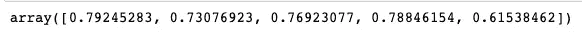

如您所见，这些精度通常比我们的虚拟基线高得多。只有最后一次折叠的准确度较低。看起来这最后一个折叠有很难识别的例子。

然而，如果我们取这五个的平均值，我们会得到大约 74%的准确率，这远远高于 62%的基线。

通常，这是一个我们希望使用 GridSearchCV 等工具进一步调整模型参数的阶段，但这不是本教程的一部分。

现在让我们看看模型在测试集上的表现如何。如果你注意到了，我们到目前为止还没有对测试做任何事情。它一直被搁置到现在。

**评估模型**

我们将从准确性方面检查模型性能开始。

首先，我们将使用整个训练数据来拟合模型，然后我们将在测试部分上调用 accuracy_score()函数。

```
rfc.fit(X_train, y_train)
accuracy_score(rfc.predict(X_test), y_test)
```

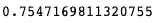

我们的测试准确率达到了 75%。类似于我们在 74%的训练集上的平均交叉验证准确度计算。

让我们看看虚拟分类器在测试集上的表现如何。

```
accuracy_score(dc.predict(X_test), y_test)
```

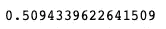

基线分类器的准确度约为 51%。这实际上比我们的随机森林模型的准确性差得多。

然而，在评估分类器时，我们不应该只看准确性。让我们看看随机森林和基线模型的混淆矩阵。

我们将从使用 scikit-learn 函数计算随机森林的混淆矩阵开始。

```
from sklearn.metrics import plot_confusion_matrix
plot_confusion_matrix(rfc, X_test, y_test)
```

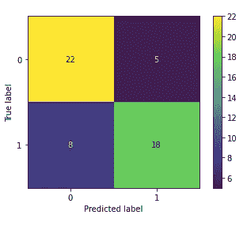

事实上，我们做得一点也不差。我们只有五个假阳性，还有八个假阴性。此外，我们预测 26 个有心脏问题的人中有 18 个会有心脏病。

不是很好，但也没那么糟。请注意，我们甚至没有调整模型！

让我们将这个混淆矩阵与为基线模型计算的混淆矩阵进行比较。

```
from sklearn.metrics import plot_confusion_matrix
plot_confusion_matrix(dc, X_test, y_test)
```

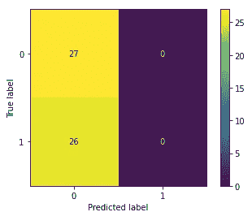

仔细看看上面的图表。你能看到我们总是预测标签 0 吗？这意味着我们预测所有患者都是健康的！

没错，我们已经设置了虚拟分类器来预测多数类。请注意，对于我们的目的来说，这将是一个可怕的模型，因为我们不会发现任何有心脏问题的患者。

兰登森林做得好多了！实际上，在测试的 26 人中，我们发现了 18 人有心脏问题。

**总结**

在这篇文章中，你已经学习了如何使用随机森林构建一个基本的分类器。

这是对在数据集上构建模型时使用的主要技术的概述，没有涉及太多的细节。

这是有意的，所以这篇文章不会太长，并且可以作为想要构建他们的第一个分类器的人的起点。

快乐学习！

*最初发表于 about datablog . com:*[2020 年 8 月 13 日打造你的第一个随机森林分类器](https://www.aboutdatablog.com/post/build-your-first-random-forest-classifier-and-predict-heart-disease-across-patients)，*。*

*PS:我正在 Medium 和*[***aboutdatablog.com***](https://www.aboutdatablog.com/)*上写文章，深入浅出地解释基本的数据科学概念。你可以订阅我的* [***邮件列表***](https://medium.com/subscribe/@konkiewicz.m) *在我每次写新文章的时候得到通知。如果你还不是中等会员，你可以在这里加入*[](https://medium.com/@konkiewicz.m/membership)**。**

*下面还有一些你可能喜欢的帖子*

*[](/medium-writers-you-should-follow-as-an-aspiring-data-scientist-13d5a7e6c5dc) [## 作为一名有抱负的数据科学家，你应该关注的中型作家

### 我最喜欢的 10 个数据科学博主，让你的学习之旅更轻松。

towardsdatascience.com](/medium-writers-you-should-follow-as-an-aspiring-data-scientist-13d5a7e6c5dc) [](/pandas-profiling-and-exploratory-data-analysis-with-line-one-of-code-423111991e58) [## 熊猫概况和探索性数据分析的第一行代码！

### 了解如何为自动 EDA 安装和使用 pandas profiling

towardsdatascience.com](/pandas-profiling-and-exploratory-data-analysis-with-line-one-of-code-423111991e58) [](/jupyter-notebook-autocompletion-f291008c66c) [## Jupyter 笔记本自动完成

### 数据科学家的最佳生产力工具，如果您还没有使用它，您应该使用它…

towardsdatascience.com](/jupyter-notebook-autocompletion-f291008c66c) [](/top-9-jupyter-notebook-extensions-7a5d30269bc8) [## 9 大 Jupyter 笔记本扩展

### 改进笔记本电脑功能，提高您的工作效率

towardsdatascience.com](/top-9-jupyter-notebook-extensions-7a5d30269bc8)*