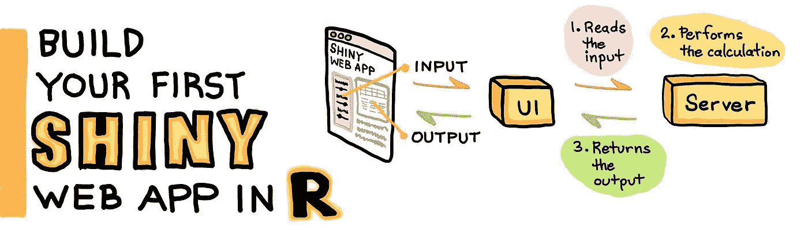
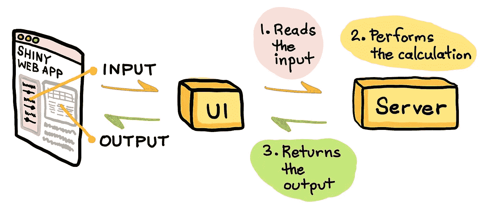
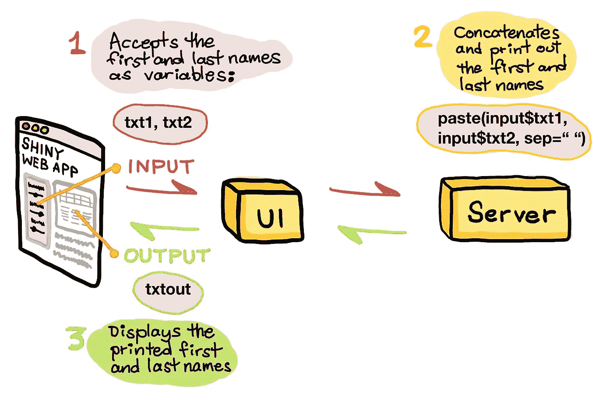
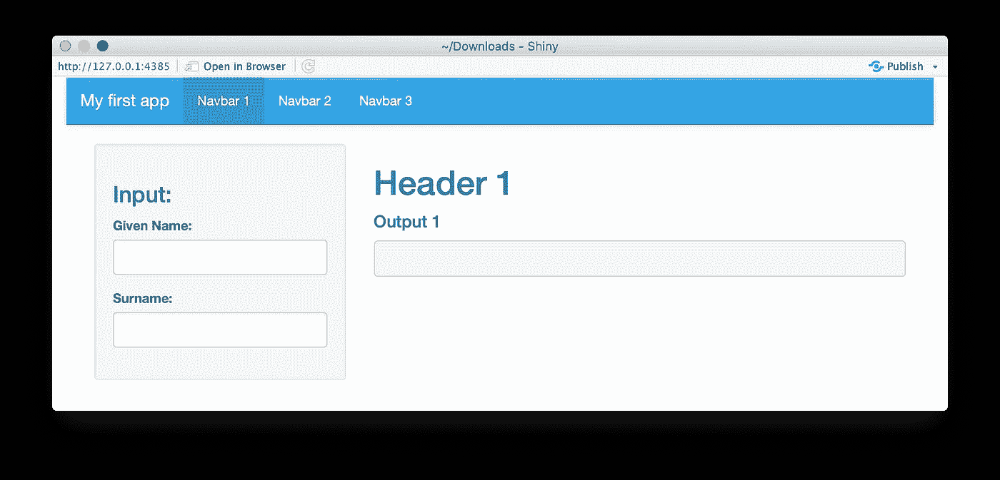
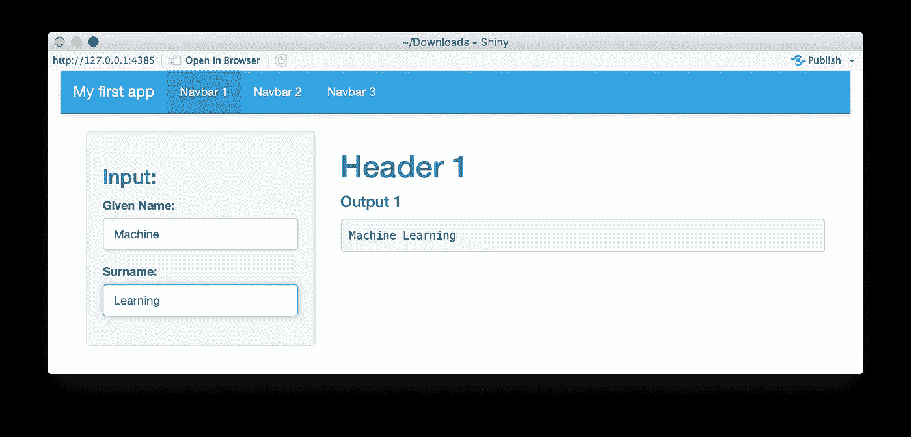

# 在 R 中构建您的第一个闪亮的 Web 应用程序

> 原文：<https://towardsdatascience.com/build-your-first-shiny-web-app-in-r-72f9538f9868?source=collection_archive---------8----------------------->

作者绘制的图像

## 数据科学

## 闪亮教程第 1 集

你想公开你的 R 代码给其他人使用吗？如果您的回答是肯定的，那么这篇文章是为您准备的，因为我将向您展示如何使用 Shiny 包在 R 中构建您的第一个 web 应用程序。

为了补充这篇文章，你也可以观看我在我的 YouTube 频道 Data Professor 上制作的视频*用 R* 构建你的第一个 Web 应用。

# 数据科学生命周期

数据科学生命周期从收集数据开始，这些数据将作为数据集和数据科学项目的核心组成部分。接下来，需要清理该数据集，以消除缺失数据和任何异常。顾名思义，探索性数据分析(EDA)将允许我们了解数据集的一般特征，这可以通过执行描述性统计和数据可视化来实现。从 EDA 中获得的见解可以为构建预测模型(例如，分类、回归、聚类、关联分析等)提供起点和思路。).为了完成生命周期，可以将性能最佳的模型部署为应用程序编程接口(API)和 web 应用程序。

**数据科学生命周期。**(由 Chanin Nantasenamat 绘制)

# 为什么要构建 Web 应用程序？

所以问题是，你为什么想要构建一个 web 应用程序？这是一个很好的问题！

部署的 web 应用程序提供了一个图形化的前端(用户界面或 UI ),允许用户输入输入参数，后端(服务器)将处理这些参数并将其发送回来，以便在 web 前端上显示。在机器学习的上下文中，将经过训练的机器学习模型部署为 web 应用允许用户通过简单地将输入参数输入到 web 前端上提供的表格中来容易地进行预测，该表格将用作经过训练的机器学习模型的输入特征，其中该模型将进行预测。

所有这些都是通过点击几下鼠标来实现的，因为用户不需要任何编码方面的技术知识来进行这种预测。在本文中，您将学习如何使用 Shiny 包在 R 中制作 web 应用程序。

除了部署机器学习模型，还可以创建 web 应用程序来托管数据驱动的仪表板。这些仪表板可以提供有用的感兴趣的汇总数据，这些数据基本上可以用于实时监控和评估指标和性能。

# 什么是闪亮的？

在我们进一步讨论之前，也许先简单介绍一下什么是闪亮的。

Shiny 是一个 R 包，可以让你轻松构建交互式 web 应用。使用 Shiny 的好处是，它可以将你的 R 代码扩展到网络上，这将有助于将它的可用性扩展到更广泛的社区中(从单个用户使用到成百上千的用户通过互联网使用)。

除了 Shiny 包提供的功能外，还有几个扩展包补充了 Shiny 的功能，如 [shinythemes](https://github.com/rstudio/shinythemes) 、 [shinydashboard](https://rstudio.github.io/shinydashboard/) 、 [shinyjs](https://deanattali.com/shinyjs/) 等。

## 你能用闪亮建造什么？

这是一个很好的问题！以下是一些开始的想法，我相信你能想出更多的。

*   机器学习驱动的网络应用
*   数据驱动的仪表板
*   数据收集表格

在[闪亮画廊](https://shiny.rstudio.com/gallery/)还有很多其他的例子。

## 将 Web 应用程序部署到互联网

在你自己的本地计算机上测试了闪亮的网络应用程序后，你确信它可以工作并准备好发布到互联网上，你可以将它部署到你自己的服务器上，或者通过应用程序托管服务，例如 Shinyapps.io 和 Heroku T21。那么这两者有什么区别呢？

拥有自己的服务器*的好处是你可以完全控制电脑，因此你可以随心所欲地安装所有软件、模块和软件包。这样做的缺点是，您需要掌握大量的知识来管理服务器。例如，你可能需要精通 BASH 命令，以便通过服务提供商管理云上的 Ubuntu 服务器，如[数字海洋(100 美元免费信用)](https://m.do.co/c/082445d5f7b1)、Linode、亚马逊网络服务或谷歌云平台。*

*使用 ***应用托管服务*** 的好处是，你不用担心管理服务器。没错，不再需要处理服务器更新，不再需要配置路径和复杂的软件和库编译。这些应用程序托管服务提供商允许你将精力集中在构建应用程序上，就是这样！*

# *闪亮网络应用的结构*

*闪亮的 web 应用程序由 3 个组件组成:*

1.  ***用户界面(ui。r)**—UI 是接受用户输入值的前端。*
2.  ***服务器功能(Server。R)** —服务器是后端，处理这些输入值，最终产生最终显示在网站上的输出结果。*
3.  ***shinyApp 功能** —将 UI 和服务器组件结合在一起的应用本身。*

**

***一个闪亮的 web 应用程序如何工作的示意图。**(由 Chanin Nantasenamat 绘制)*

# *闪亮网络应用的代码*

*现在，有趣的部分来了，让我们看看我们今天将要构建的闪亮的 web 应用程序的代码(如下所示)。*

# *闪亮的 Web 应用程序是如何工作的？*

*下面的 3 个简单步骤总结了我们使用这个闪亮的 web 应用程序时发生的事情。*

**

# *运行闪亮的网络应用程序*

*现在，让我们运行 web 应用程序。*

***第一步。继续启动你的 RStudio。***

***第二步。**点击文件→新建文件→ R 脚本，粘贴上图所示的整块代码，另存为`app.R`(也可以下载 [app。r 档](https://gist.github.com/dataprofessor/f9dc9d878e97e907aae807b6345433e4))。*

***第三步。**点击位于*文件面板*右上方的**运行 App** 按钮(如下图白色圆圈所示)。*

**

***app 截图。r 文件包含 RStudio 中闪亮的 Web 应用程序。***

*几分钟后，您将看到一个弹出窗口，显示闪亮的 web 应用程序，如下所示。请注意，web 应用程序的输出值为空，因为输入参数仍然为空。*

**

***已执行 app 截图。r 文件(点击运行应用程序按钮后)。***

*让我们在两个输入框(名和姓)中填入值，您将看到输出框(主面板)现在将显示连接在一起的名+姓。例如，我们用*“机”*作为**的名**，用*“学”*作为**的姓**。在底层，UI 组件接受来自 2 文本框的输入参数，输入名和姓。接下来，我们连接这两个变量以产生一个输出*“机器学习”*。最后，UI 在主面板(灰色框)上显示这个输出。*

**

***输入了输入参数的 web app 截图。***

# *对代码的逐行解释*

*上面显示的代码已被注释，将代码的主要**部分**标记如下:*

*   *`# Load R packages`(第 1 行)，*
*   *`# Define UI`(第 5 行)，*
*   *`# Define server function`(31 行)*
*   *`# Create Shiny object`(第三十九行)*

*现在，我们将在接下来的小节中更深入地讨论上述 4 个部分。*

## *加载 R 包(第 1–3 行)*

*   ***线 2** —装载`shiny`包装*
*   ***线 3** —装载`shinythemes`包*

## *定义用户界面(第 5–29 行)*

*   ***第 6 行**—`fluidPage()`函数创建了流畅的页面布局，元素可以通过这种方式缩放以占据浏览器的可用宽度。所有的 UI 元素都包含在`fluidPage()`函数中。我们使用的第一个输入参数是`theme`选项，其中我们定义了来自`shinytheme` R 包的`cerulean`主题的使用。
    (注意:右括号在第 29 行)。*
*   ***第 7 行**—`navbarPage()`顾名思义，函数创建一个带有顶级导航栏的页面。
    **第 9 行**—web app 的名称定义为`“My first app”`。
    **第 10 行** —这里我们使用`tabPanel()`功能定义选项卡面板。这代表三个选项卡面板中的第一个，因此我们将选项卡面板定义为`“Navbar 1”`。*
*   ***第 11 行** —这里我们使用了`sidebarPanel()`函数(右括号在第 16 行)，以便 web 应用程序可以在 web 应用程序的左侧有一个侧边栏面板，接受用户输入参数。第 12 行 HTML 标签`tags$h3`用于向侧边栏面板提供`“Input:”`的*子标题*标题。
    **第 13-14 行**—`textInput()`函数用于接受用户以文本字段形式输入的值。textInput()函数中包含的输入参数包括(1)变量名(如`txt1`或`txt2`)，(2)显示在文本字段上方的标题(如`“Given Name:”`和`“Surname:”`)以及(3)
    (注意:右括号在第 28 行)。*
*   ***第 17 行** —这里我们使用了`mainPanel()`函数(右括号在第 22 行)。
    **第 18 行** —使用`h1()`标签功能显示`“Header 1”`的标题。
    **第 20 行** —通过使用`h4()`标签功能显示`“Output1”`的*子标题*(不是错别字，而是表示标题的层次)。
    **第 21 行** —显示将输入值(名和姓)组合在一起得到的输出值。*
*   ***第 25–26 行** —其余两个选项卡面板通过`tabPanel()`功能显示在这两行上。第一个输入参数是选项卡面板的名称`“Navbar 2”`或`“Navbar 3”`，而第二个输入参数是`“This panel is intentionally left blank”`。因此，在点击这两个选项卡面板时，我们将看到消息`“This panel is intentionally left blank”`，这是这两个选项卡面板的内容。*

## *定义服务器功能(第 31–37 行)*

*   ***第 32 行**——定义服务器，输入和输出变量通过反应性本质上连接在一起(*即*输入值的变化将立即或反应性地导致输出值的更新)。*
*   ***第 34–36 行** —如上图漫画所示，用户输入的来自`input$txt1`和`input$txt2` ( *即*分别对应`Given Name`和`Surname`)的输入值被赋给`output$txtout`变量(*即*处理后的输出值)，该变量将被传回 UI，显示在输出文本框中(第 21 行)。特别是，`Given Name`和`Surname`将通过`paste()`函数组合在一起，输入参数是来自 UI 文本输入的`txt1`和`txt2`变量(即第 35 行的`input$txt1`和`input$txt2`)
    注意第 34–36 行的`output$txtout`(来自服务器函数)与第 21 行的`txtout`是同一个变量(来自 UI 函数)。同样，第 13 行和第 14 行上的 txt1 和 txt2(来自 UI 函数)与`input$txt1`和`input$txt2`(来自服务器函数)是相同的变量。*

## *创建闪亮的对象(第 39-40 行)*

*   ***第 40 行**—`shinyApp()`函数将上面定义的 ui 和服务器变量作为输入参数，并将它们融合在一起，以构建我们最终看到的真正闪亮的 web 应用程序。*

# *恭喜你！您现在已经成功地在 R 中创建了您的第一个闪亮的 Web 应用程序！*

## *订阅我的邮件列表，获取我在数据科学方面的最佳更新(偶尔还有免费赠品)!*

# *关于我*

*我是泰国一所研究型大学的生物信息学副教授和数据挖掘和生物医学信息学负责人。在我下班后的时间里，我是一名 YouTuber(又名[数据教授](http://bit.ly/dataprofessor/))制作关于数据科学的在线视频。在我做的所有教程视频中，我也在 GitHub 上分享 Jupyter 笔记本([数据教授 GitHub page](https://github.com/dataprofessor/) )。*

* [## 数据教授

### 数据科学、机器学习、生物信息学、研究和教学是我的激情所在。数据教授 YouTube…

www.youtube.com](https://www.youtube.com/dataprofessor?sub_confirmation=1) 

## 在社交网络上与我联系

YouTube: [http://youtube.com/dataprofessor/](http://youtube.com/dataprofessor/)

[LinkedIn:](https://www.linkedin.com/company/dataprofessor/)[https://www.linkedin.com/company/dataprofessor/](https://www.linkedin.com/company/dataprofessor/)

[https://www.linkedin.com/company/dataprofessor/](https://twitter.com/thedataprof)

[【HTTP://facebook.com/dataprofessor/】](https://www.youtube.com/redirect?redir_token=w4MajL6v6Oi_kOAZNbMprRRJrvJ8MTU5MjI5NjQzN0AxNTkyMjEwMDM3&q=http%3A%2F%2Ffacebook.com%2Fdataprofessor%2F&event=video_description&v=ZZ4B0QUHuNc)
【GitHub:[【HTTPS://github.com/dataprofessor/】](https://github.com/dataprofessor/)
[Instagram:【HTTPS://www.instagram.com/data](https://www.instagram.com/data.professor/)*