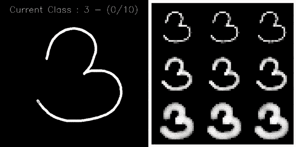
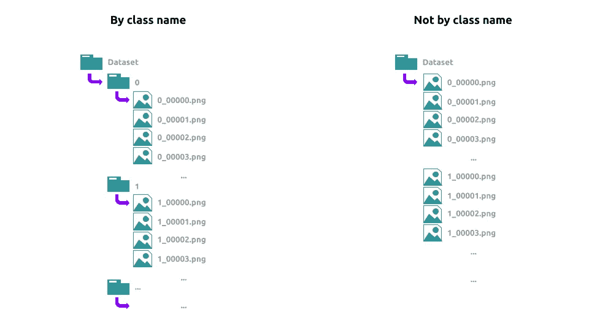
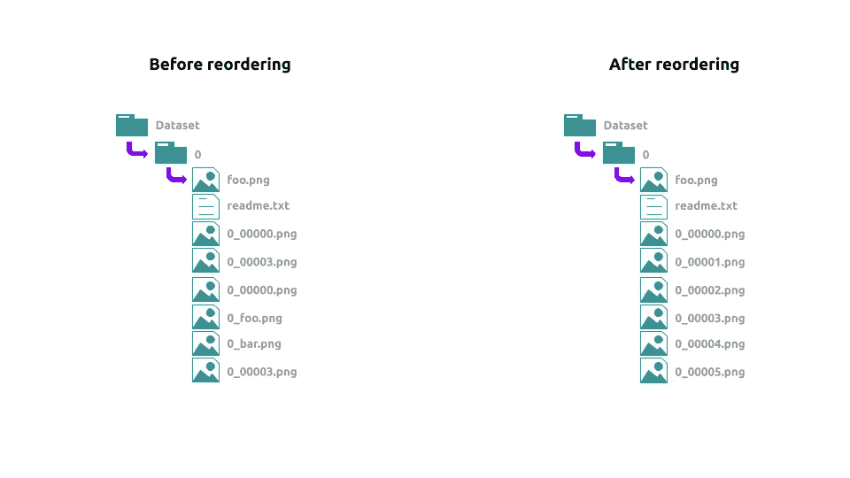

# 构建完全可配置的界面，用 Python 在 10 分钟内创建类似 MNIST 的数据集

> 原文：<https://towardsdatascience.com/build-your-fully-configurable-interface-to-create-mnist-like-dataset-with-python-in-10-minutes-43ab414a875e?source=collection_archive---------40----------------------->

## 一步一步的用户友好的 python 界面，从 JSON 配置文件中编写数据集(带代码)



# 动机

为了一个个人项目，也许是一篇论文(手指交叉)，我需要创建一个类似 MNIST 的数据集。我以为可以**对别人有用**。因此，我将解释**我是如何用 Python** 编写这个**接口的。( [github 库](https://github.com/AxelThevenot/Python-Interface-to-Create-Handwritten-dataset/blob/master/README.md))**

本文的目的是**能够将自己的界面**设计成尽可能的**灵活**和**快速**。这个界面将允许我们用鼠标绘制我们的角色**，其他所有事情都将通过配置文件中指定的**大量参数**自动**完成**。**

# 完全可配置

我正在从一个 JSON 文件中寻找一个完全可配置的接口。再也不用摸代码，就是**灵活**、**便捷**和**可伸缩**。我们将在本文中讨论不同的参数，但是所有的参数都包含在我命名为`config.json`的文件中。你可以随意命名。它允许您更改:

*   我们在上面绘制的图像的尺寸。
*   输出图像的**尺寸，以完成**数据集**。**
*   **每个类别的预期图像数量**，首选绘图**节奏**以及我们输出图像的**渲染**的存在。
*   包含数据集的**文件夹名称**，可以为每个类创建**子文件夹。**
*   我们铅笔的**尺寸**、**强度**和**褪色**..
*   **插补**方法。
*   **命名类的**。

# 存储和公用设施

重要的事情先来。我们需要知道如何组织我们的数据。在文件`config.json`中，我们有`storage`部分:

*   **root** (str):数据集的 **root** 文件夹的路径
*   **by_class_name** (bool):数据集的存储方式



我们所有的图像都将有**相同的图案**。图像的名称总是以类名开头。然后是下划线，然后是 5 个字符的数字来标识它。所以我们有一个`root/(subfolderclass)/name_id.png`格式。

您会注意到 id 是递增设置的**。换句话说，你可以看到每个类已经生成了多少图像。然而，作为用户，你可能需要也可能不需要将其他文件放入这些文件夹中，或者有时删除图像或重命名它们。我们将在代码的开头放一小部分，让**自动重新排列我们的图像名称**。**

****

**在`utils.py`中我们设置了一些功能:**

*   ****get_json** :返回 json 文件的**内容，作为 python **字典**。****
*   ****check_folder_path** :检查文件夹**是否存在**，否则新建一个**。****
*   ******order _ filename _ by _ prefix**:**按照正确的名称格式对文件重新排序**。****

# ****设计师****

****我们想要的是能够用手(鼠标)画出我们的角色**。从**绘图窗口**中，我们想要快速创建数据集。然后我们需要一个`class Designer`，我们将把它存储在`designer.py`文件中。为了理解我们为什么需要这个类，让我们仔细看看配置文件中的一些参数:******

*   ****输入**:包含要绘制图像的尺寸和绘图铅笔的**粗细**(仅用于可视化)。**
*   ****输出**:包含输出图像的尺寸，以构成我们的数据集。**
*   ****插值** → **方法** (str 或 str 列表):我们的绘图图像和我们的输出图像的尺寸不一样。所以我们需要一个**插值**方法来调整图像的大小。然后我们可以选择由 **OpenCV** 提供的所有插值方法:`INTER_NEAREST`、`INTER_LINEAR`、`INTER_AREA`、`INTER_CUBIC`、`INTER_LANCZOS4`。我们可以精确`RANDOM`来改变每个图像的插值方法。该参数**可以是一个列表**:在这种情况下，指定的插值方法有多少个设计器，输入图像就有多少个输出图像。**
*   ****线条→粗细**(浮动或浮动列表):输出图像上的铅笔粗细**与图像对角线**成比例。该参数**可以是一个列表**:在这种情况下，设计者的数量将和笔的粗细一样多。结果是一个**设计矩阵**结合了插值方法和指定厚度。**
*   ****line → range_value** (int 或 int 的列表):像素在绘制时的亮度。在列表的情况下:所画像素的亮度将在指定范围内**随机**选择。**
*   ****线条→渐变**(浮点):线条的**边缘**的渐变值，渐变为线性。对数值`fading=1`没有影响。**

****

**注意绘图将由**线条组合**完成。因此有了`draw(self, pt_1, pt2)`的角色。所以我们仍然需要用鼠标来控制这一切。**

# **控制器**

**首先我们需要创建一个`class Controller`和**从配置字典中初始化**。**

**在初始化期间，会发生几件事:**

*   ****提取**的所有配置参数。**
*   ****验证**文件夹是否存在，如果不存在，创建它们。**
*   ****设计器**的初始化。**
*   **按已经完成的类别计算**数量的图像**。**
*   **创建用于绘图的 OpenCV **窗口和用于可视化**的 OpenCV **窗口。****

**为了创建我们所有的设计师，将有一个**设计师矩阵**，其中**垂直**用于铅笔粗细，而**水平**用于插值方法。同时我们可以创建一个函数来**捕捉绘图窗口上的鼠标事件**。只有按下鼠标左键**才能绘图。最后，您可以检索已经绘制的图像数量。****

# **让我们画画吧**

****

**在我们开始绘制之前，让我们来看看`process`中我们最后的参数建议:**

*   ****volume** (int):每个类要到达的图像数量。**
*   ****选择** (str):选择下一个要绘制的字符的方式。可以是`RANDOM`、`CLASSBYCLASS`写完一个字再去写其他的，或者`ROTATE` 轮流换不同的类。**
*   ****display_output** (bool):显示或不显示输出窗口。**

**现在**可以创建**一个新的图像来绘制，**绘制**它，**以正确的格式保存**(`root/(subfolderclass)/name_id.png`)。**

**剩下的就是能够从 OpenCV 窗口中查看**所有内容，并且只要没有达到每个类的图像量就运行程序。****

# **主要的**

**最后，为了更加方便，我们可以让用户选择使用 shell 中的命令来指定他的配置文件:**

```
python3 main.py -c path/to/the/config/file.json
or 
python3 main.py -config path/to/the/config/file.json
```

****

> **知识就是分享。
> **支持**我，一键获得**访问 [**中我所有文章的**。](https://axel-thevenot.medium.com/membership)****

****

# **来源**

**[项目的 Github 库](https://github.com/AxelThevenot/Python-Interface-to-Create-Handwritten-dataset/blob/master/README.md)**

**一切都是自制的，可以免费使用**