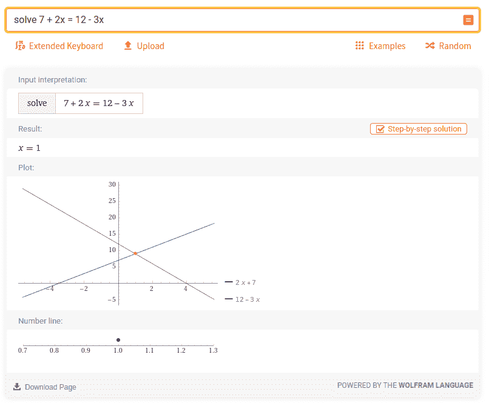
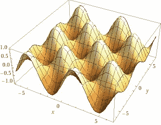

# 用 Wolfram Alpha API 和 Python 构建您的下一个项目

> 原文：<https://towardsdatascience.com/build-your-next-project-with-wolfram-alpha-api-and-python-51c2c361d8b9?source=collection_archive---------16----------------------->

## [实践教程](https://towardsdatascience.com/tagged/hands-on-tutorials)

## 让我们将 Wolfram Alpha 中的精选数据、自然语言处理、文本到语音转换、绘图渲染等功能应用到您的下一个项目中吧！

任何在某一点上与数学斗争的人都知道 Wolfram Alpha，并且可能因为它解决任何方程、绘制任何函数或可视化逻辑电路的能力而得救。Wolfram Alpha can 然而，做的远不止这些，包括化学、语言学或历史，最重要的是，它可以使用它的公共 API 给你所有的答案。因此，在这篇文章中，我们将探索如何使用它来回答简单的问题，解决数学问题，渲染情节，甚至描述 DNA 序列！

照片由[韦恩·范](https://unsplash.com/@vnwayne?utm_source=unsplash&utm_medium=referral&utm_content=creditCopyText)在 [Unsplash](https://unsplash.com/?utm_source=unsplash&utm_medium=referral&utm_content=creditCopyText) 上拍摄

# 安装

Wolfram Alpha API 是免费的(用于非商业用途)，但是我们仍然需要获得 API key (AppID)来对 API 端点执行查询。为了获得 API 密钥，我们将首先在 https://account.wolfram.com/login/create 的[处创建 Wolfram ID。创建帐户后，我们可以导航到](https://account.wolfram.com/login/create)[developer.wolframalpha.com/portal/myapps](https://developer.wolframalpha.com/portal/myapps/index.html)，点击*注册获得您的第一个 AppID* 按钮，填写*获得新的 AppID* 对话框。之后，我们将看到 API 键，这里称为 *AppID* ，我们可以使用下面的示例查询来测试它:

上面的代码使用 *Wolfram|Alpha 完整结果 API* 来找出蚊子的寿命。为此，它向`http://api.wolframalpha.com/v2/query`发出`GET`请求，其中包含指定我们的 AppID 进行身份验证的参数、`input`字段中的问题、格式参数为`plaintext`(而不是图像)以及最终的输出类型为 JSON(而不是默认的 XML)。

我们以字典的形式遍历结果，寻找感兴趣的字段进行打印。返回的 JSON(或 XML)可能相当复杂，解析它的最简单方法是打印它，并在其中寻找任何有用的字段。上述查询的响应的精简示例如下所示:

# 做数学

Wolfram Alpha 最有用的部分(在我看来)是解决复杂数学问题的能力。因此，让我们尝试使用 API 来做一些数学计算:

上一节中展示的*完整结果 API* 不仅仅回答一些奇怪的问题，它还做数学(和几乎所有的事情)。为了让 API 意识到我们想要做数学运算——在本例中——求解方程，我们需要在实际的方程前面加上单词`solve`。除了输入本身，该查询看起来与上一节中的查询非常相似。添加到这个参数中的一个额外的东西是`includepodid`参数，它告诉 API 在这种情况下我们只希望在响应中包含`Result` pod。“但是，pod 是什么？”，你可能会问。

来自 Wolfram Alpha(网站和 API)的每个结果通常包括多个类别的数据。例如，这可以是图表、图像、逐步解决方案或表格。其中的每一个都属于它自己的叫做 *pod* 的部分，而 pod 又包括*子 pod*来保存单独的数据。考虑到每个响应有时甚至可能包括 10 个左右的 pod，描述一下我们希望从 API 中得到什么是可取的。为此，可以使用`podtitle`和更健壮的`includepodid`参数，如上所示。

因此，上述查询的过滤响应如下所示:

为了进行比较，相同的(但图形)结果，但所有的豆荚看起来像这样:

带有输入、结果、绘图和数字行窗格的结果

Wolfram Alpha 可以成为很好的学习资源，因为它不仅能够显示结果，而且所有的计算步骤和 API 都可以做到这一点。为了获得一个查询的逐步解决方案，我们需要包含另一个名为`podstate`的参数，它指定 pod 状态变化。这将使用修改后的版本替换原来的 pod，例如，更多位数的十进制数，如圆周率(`DecimalApproximation`)、扩展的天气数据(更多天/月/年)或在我们的情况下，方程解的步骤:

# 渲染数学降价

您可以使用 Wolfram Alpha API 的一个巧妙技巧是呈现 MathML。如果你不熟悉 MathML，那么这里有一个快速概述——[MathML](https://www.w3.org/Math/whatIsMathML.html)代表*数学标记语言*，它是一种基于 XML 的格式，用于在 web 浏览器中呈现类似 *LaTeX* 的数学表达式。尽管这种格式已经存在很长时间了，但只有 Firefox 才真正支持它，这可能让它看起来像是一个糟糕的选择，但名为 [MathJax.js](https://github.com/mathjax/MathJax) 的 JavaScript 显示引擎使得在任何浏览器中呈现 MathML 成为可能，如果你想在你的 web 应用程序或博客中以 *LaTeX* 格式显示非常好看的复杂公式，这是一个不错的选择。说完了，我们来查询一下吧！

我们再次使用上一节中的例子，通过逐步求解来查询方程，但是用`format=plaintext`代替`format=mathml`，同样用`mathml`代替所有其他出现的`plaintext`，例如`result = data[0]["mathml"]`。上面你可以看到 API 给出的一点 MathML 输出，由于完整的输出非常长，所以它被修剪得很短，但我鼓励你自己尝试运行查询，通过 MathJax.js 传递它，并享受美丽的 *LaTeX* 数学表达式。

# 求解布尔代数

Wolfram Alpha 的另一个常见用例是求解布尔代数。与基本方程一样，我们需要做的就是将公式传递给 API，这是我们将得到的结果:

除了我们选择的特定 pod—`Input`、`MinimalForms`和`TruthDensity`之外，上面的查询没有显示任何新内容。在解析这 3 个 pod 中的数据后，我们可以看到输出，其中包括提交的输入公式的更好的形式，它的其他计算形式(CNF，DNF...)以及分数和百分比形式的真实密度。

# 渲染和下载图

我最喜欢用 Wolfram Alpha 做的事情之一就是渲染复杂的情节。实现这一点甚至不需要太多的代码更改，唯一真正的更改是选择 pod 及其字段:

在这种情况下，我们使用`includepodid`参数来选择`3DPlot`和`ContourPlot`窗格，这些窗格在其`img.src`字段中保存相应地块图像的 URL。然后可以下载这些图，并以二进制模式写入，生成以下图像:

三维绘图

# 不仅仅是数学

在这一点上，我认为我们已经看到了足够多的 Wolfram Alpha 和 math 的应用程序。那么，我们还能做什么？举个简单的例子，让我们探索一些 DNA 序列:

我们再次使用相同的 API 端点，但是这次我们提交代表 DNA 序列的字符串。您可能会注意到，我们不需要像前面的`solve`或`plot`那样在查询前包含关键字。这次我们没有使用关键字，而是添加了`scanner`参数，它指定了搜索查询的主题区域，在本例中是`Genome`。要找到哪个扫描仪将为某个查询返回相关数据，最简单的方法是运行不带`scanner`参数的查询，并查找每个包含预期数据的 pod 的`scanner`属性。

DNA 序列显然不是你可以搜索的唯一酷的东西。其他一些有趣的话题可以是历史、化学、交通或音乐——仅举几例。

# 自然语言(口语)答案

如果只是寻找信息，那么前面例子中的例子和 API 就足够了。然而，如果你想要/需要更自然的回答，那么你可以使用*口语结果 API* :

对`v1/spoken`端点的查询非常简单。我们需要传入的只是一个 AppID 和我们在`i`参数中的问题。这产生了完整句子形式的反应，而不是简单的事实。这在构建智能聊天机器人时非常有用，或者可以作为文本到语音引擎的输入。

# 使用对话 API 聊天

作为对*口语结果 API* 的一种扩展，Wolfram Alpha 还提供了*对话 API* ，允许你提出后续问题，从而与 API 进行对话。所以，让我们试一试，问 Wolfram Alpha 一些问题:

考虑到我们要问多个问题，我们也必须进行多个查询。第一个是针对`v1/conversation`端点，并在`i`参数中包含一个问题。我们还用`geolocation`参数指定我们的位置——这是可选值之一(其他的是`ip`和`units`),可以为问题提供上下文。第一个请求与*口语结果 API* 做的事情差不多，这意味着它以完整句子的形式返回信息。

当我们提出后续问题时，乐趣就开始了。为此，我们进行另一个查询，但是这一次，我们将它发送到作为对第一个查询(`host = r["host"]`)的响应的一部分提供的主机。第一个响应还包括`conversationID`，我们也必须为 API 传递它，以了解在它之前说了什么。

然后，第二个查询返回与第一个相同类型的结果，这允许我们使用提供的`conversationID`和`host`继续询问更多问题。

我想在这里强调的最后一点是，问题和答案是如何很好地流动和使用上下文的。在这个例子中，我们使用了*“离这里有多远？”*作为后续问题，没有具体说明*【它】*或*【这里】*到底是什么。这些信息是从前面的问题和`geolocation`参数中自动推断出来的。

# 结论

就 Wolfram Alpha 提供的信息而言，这篇文章只是冰山一角。这些 API 不仅仅可以用于数学，我认为它是构建酷机器人、智能设备或基于语音的应用程序的良好起点。即使它不是免费的商业用途，你仍然会每月收到 2000 个请求，这足以启动一些很酷的项目。我建议查看[https://products.wolframalpha.com/api/](https://products.wolframalpha.com/api/)获取每个 API 端点的文档，以及 [Wolfram Alpha 登录页面](https://www.wolframalpha.com/)，它显示了所有不同的主题，可能会给你一些关于可以用它构建什么的想法。😉

*本文最初发布于*[*martinheinz . dev*](https://martinheinz.dev/blog/36?utm_source=tds&utm_medium=referral&utm_campaign=blog_post_36)

 [## 编写更加地道和 Pythonic 化的代码

### 使你的 Python 代码可读、有效、简洁和可靠的习惯用法和惯例。

towardsdatascience.com](/writing-more-idiomatic-and-pythonic-code-c22e900eaf83)  [## 为您的 GitHub 档案创建一个精彩的自述文件

### 使用 GitHub 隐藏的新功能— GitHub Profile READMEs，在 GitHub 上展示您的项目和技能！

towardsdatascience.com](/build-a-stunning-readme-for-your-github-profile-9b80434fe5d7)  [## 用 Python 从公共 API 抓取新闻和文章

### 让我们探索纽约时报、卫报、黑客新闻和其他 API，并为您的下一个项目收集一些新闻数据！

towardsdatascience.com](/scraping-news-and-articles-from-public-apis-with-python-be84521d85b9)