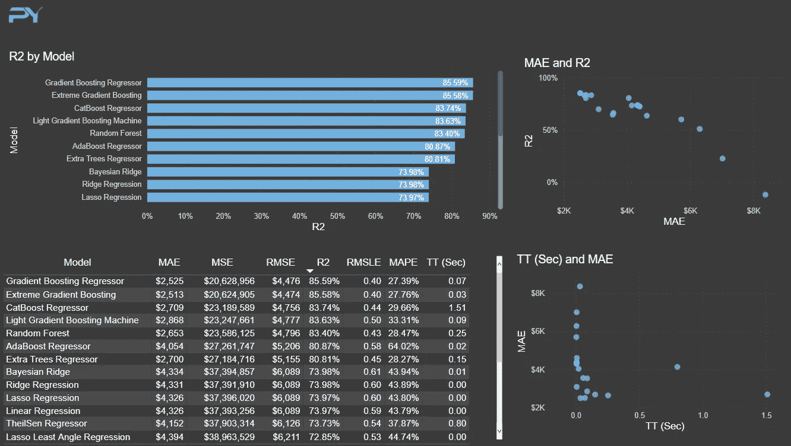
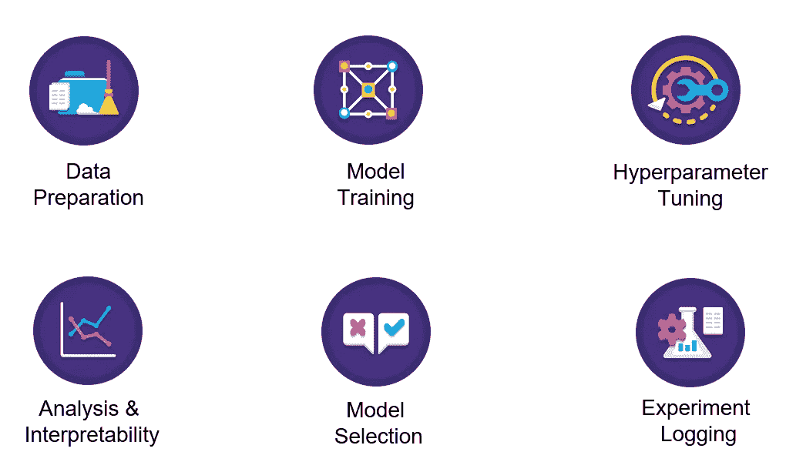
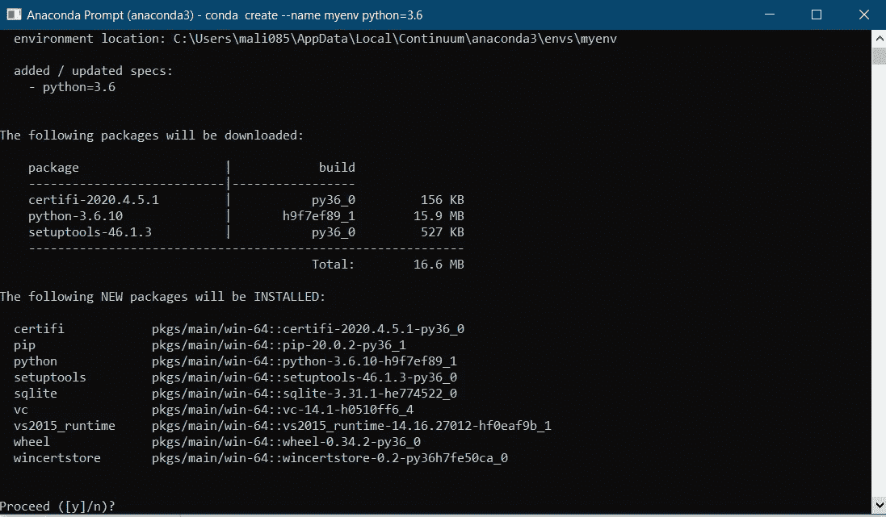
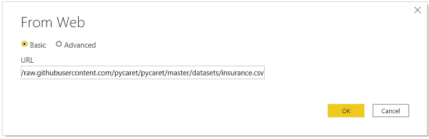
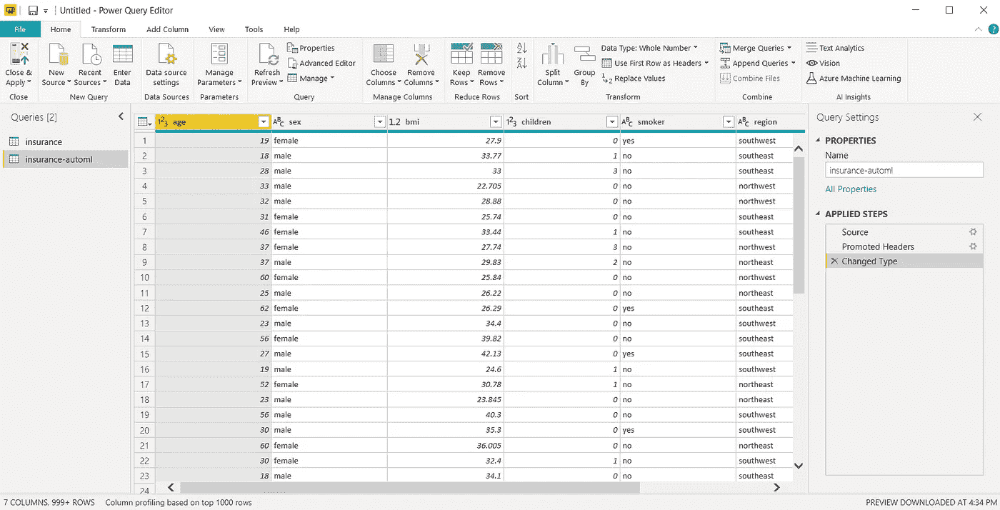
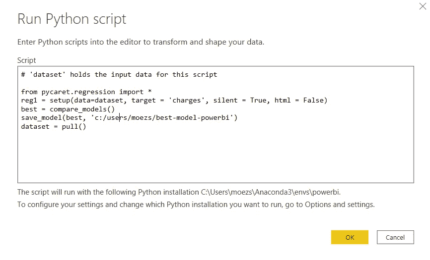
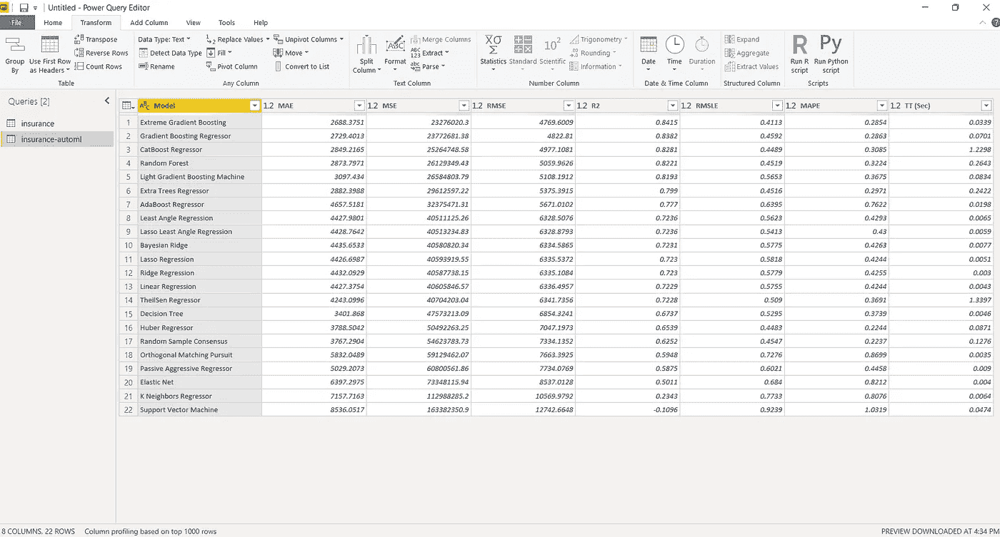
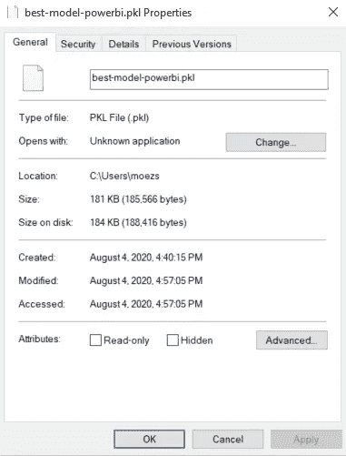
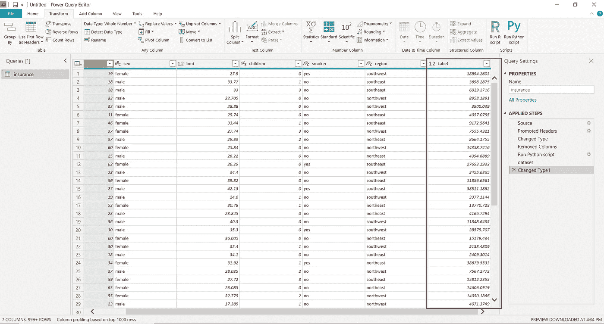

# 使用 PyCaret 2.0 在 Power BI 中构建您自己的 AutoML

> 原文：<https://towardsdatascience.com/build-your-own-automl-in-power-bi-using-pycaret-8291b64181d?source=collection_archive---------4----------------------->



py caret——Python 中的开源低代码机器学习库

# **PyCaret 2.0**

上周我们已经宣布了 [PyCaret 2.0](/announcing-pycaret-2-0-39c11014540e) ，这是一个开源的、**Python 中的低代码**机器学习库，可以自动化机器学习工作流。它是一个端到端的机器学习和模型管理工具，可以加快机器学习实验周期，帮助数据科学家变得更加高效和多产。

在本帖中，我们展示了一个**分步教程**，介绍如何使用 PyCaret 在 [Power BI](https://powerbi.microsoft.com/en-us/) 中构建自动化机器学习解决方案，从而允许数据科学家和分析师在没有任何额外许可或软件成本的情况下，向他们的仪表板添加一层机器学习。PyCaret 是一个开源的**免费使用的** Python 库，它提供了广泛的功能，可以在 Power BI 中工作。

在本文结束时，您将了解如何在 Power BI 中实现以下内容:

*   设置 Python conda 环境并安装 pycaret==2.0。
*   用 Power BI 链接新创建的 conda 环境。
*   在 Power BI 中构建您的第一个 AutoML 解决方案，并在仪表板上展示性能指标。
*   在 Power BI 中生产/部署您的 AutoML 解决方案。

# Microsoft Power BI

Power BI 是一种业务分析解决方案，可让您在整个组织中可视化数据和共享见解，或将它们嵌入到您的应用程序或网站中。在本教程中，我们将通过将 PyCaret 库导入 Power BI 来使用 [Power BI Desktop](https://powerbi.microsoft.com/en-us/downloads/) 进行机器学习。

# 什么是自动机器学习？

自动机器学习(AutoML)是将机器学习的耗时、迭代任务自动化的过程。它允许数据科学家和分析师高效地构建机器学习模型，同时保持模型质量。任何 AutoML 解决方案的最终目标都是基于一些性能标准最终确定最佳模型。

传统的机器学习模型开发过程是资源密集型的，需要大量的领域知识和时间来产生和比较几十个模型。借助自动化机器学习，您可以轻松高效地加快生产就绪型 ML 模型的速度。

# 【PyCaret 是如何工作的？

PyCaret 是一个用于监督和非监督机器学习的工作流自动化工具。它被组织成六个模块，每个模块都有一组可用于执行某些特定操作的功能。每个函数接受一个输入并返回一个输出，在大多数情况下，这是一个经过训练的机器学习模型。第二版中可用的模块有:

*   [分类](https://www.pycaret.org/classification)
*   [回归](https://www.pycaret.org/regression)
*   [聚类](https://www.pycaret.org/clustering)
*   [异常检测](https://www.pycaret.org/anomaly-detection)
*   [自然语言处理](https://www.pycaret.org/nlp)
*   [关联规则挖掘](https://www.pycaret.org/association-rules)

PyCaret 中的所有模块都支持数据准备(超过 25 种基本预处理技术，附带大量未经训练的模型&支持定制模型、自动超参数调整、模型分析和可解释性、自动模型选择、实验日志记录和简单的云部署选项。



https://www.pycaret.org/guide

要了解更多关于 PyCaret 的信息，[点击这里](/announcing-pycaret-2-0-39c11014540e)阅读我们的官方发布公告。

如果你想开始使用 Python，[点击此处](https://github.com/pycaret/pycaret/tree/master/examples)查看入门笔记本示例库。

> “PyCaret 通过为业务分析师、领域专家、公民数据科学家和经验丰富的数据科学家提供免费、开源和低代码的机器学习解决方案，使机器学习和高级分析的使用民主化”。

# 开始之前

如果您是第一次使用 Python，安装 Anaconda 发行版是最简单的入门方式。[点击这里](https://www.anaconda.com/distribution/)下载 Python 3.7 或更高版本的 Anaconda 发行版。


[https://www.anaconda.com/products/individual](https://www.anaconda.com/products/individual)

## 设置环境

在我们开始在 Power BI 中使用 PyCaret 的机器学习功能之前，我们需要创建一个虚拟环境并安装 pycaret。这是一个分为三步的过程:

[✅](https://fsymbols.com/signs/tick/) **步骤 1——创建一个 anaconda 环境**

从开始菜单打开 **Anaconda 提示符**并执行以下代码:

```
conda create --name **myenv** python=3.7
```



Anaconda 提示符—创建环境

[✅](https://fsymbols.com/signs/tick/)步骤 2 —安装 PyCaret

在 Anaconda 提示符下执行以下代码:

```
pip install **pycaret==2.0**
```

安装可能需要 15-20 分钟。如果您在安装时遇到问题，请查看我们的 [GitHub](https://www.github.com/pycaret/pycaret) 页面，了解已知问题和解决方案。

[✅](https://fsymbols.com/signs/tick/) **第三步——在 Power BI 中设置 Python 目录**

创建的虚拟环境必须与 Power BI 链接。这可以使用 Power BI Desktop 中的全局设置来完成(文件→选项→全局→ Python 脚本)。默认情况下，Anaconda 环境安装在以下位置:

C:\Users\ ***用户名***\ AppData \ Local \ Continuum \ anaconda 3 \ envs \ myenv


文件→选项→全局→ Python 脚本

# **👉让我们开始吧**

# 设置业务环境

一家保险公司希望通过使用住院时的人口统计和基本患者健康风险指标来更好地预测患者费用，从而改善其现金流预测。


*(* [*)数据来源*](https://www.kaggle.com/mirichoi0218/insurance#insurance.csv) *)*

# 目标

根据数据集中的其他变量，如年龄、性别、体重指数、儿童、吸烟者和地区，训练和选择预测患者费用的最佳回归模型。

# 👉步骤 1-加载数据集

你可以直接从 GitHub 加载数据集，方法是进入 Power BI Desktop → Get Data → Web

链接到数据集:[https://raw . githubusercontent . com/py caret/py caret/master/datasets/insurance . CSV](https://raw.githubusercontent.com/pycaret/pycaret/master/datasets/insurance.csv)



Power BI 桌面→获取数据→ Web

在超级查询中创建重复数据集:



超级查询→创建重复数据集

# 👉步骤 2-以 Python 脚本形式运行 AutoML

在 Power Query 中运行以下代码(转换→运行 Python 脚本):

```
**# import regression module**
from pycaret.regression import ***# init setup**
reg1 = setup(data=dataset, target = 'charges', silent = True, html = False)**# compare models**
best_model = compare_models()**# finalize best model** best = finalize_model(best_model)**# save best model**
save_model(best, 'c:/users/moezs/best-model-power')**# return the performance metrics df** dataset = pull()
```



超级查询中的脚本

前两行代码用于导入相关模块和初始化设置函数。设置功能执行机器学习中所需的几个必要步骤，例如清除缺失值(如果有的话)、将数据分成训练和测试、设置交叉验证策略、定义度量、执行特定于算法的转换等。

训练多个模型，比较和评估性能指标的神奇函数是 **compare_models。**它根据可以在 compare_models 中定义的' **sort'** 参数返回最佳模型。默认情况下，它对回归用例使用“R2 ”,对分类用例使用“准确性”。

其余的行用于最终确定通过 compare_models 返回的最佳模型，并将其保存为本地目录中的 pickle 文件。最后一行返回数据帧，其中包含模型训练的详细信息及其性能指标。

输出:



Python 脚本的输出

仅用几条线，我们就训练了 20 多个模型，该表显示了基于 10 倍交叉验证的性能指标。

最高性能模型**梯度推进回归器**将与整个转换管道一起作为 pickle 文件保存在您的本地目录中。稍后可以使用该文件在新数据集上生成预测(请参见下面的步骤 3)。



转换管道和模型保存为 pickle 文件

PyCaret 致力于模块化自动化的想法。因此，如果您有更多的资源和时间进行培训，您可以扩展脚本来执行超参数调整、集成和其他可用的建模技术。请参见下面的示例:

```
**# import regression module**
from pycaret.regression import ***# init setup**
reg1 = setup(data=dataset, target = 'charges', silent = True, html = False)**# compare models**
top5 = compare_models(n_select = 5)
results = pull()**# tune top5 models** tuned_top5 = [tune_model(i) for i in top5]**# select best model** best = automl()**# save best model**
save_model(best, 'c:/users/moezs/best-model-power')**# return the performance metrics df** dataset = results
```

我们现在返回了前 5 名的型号，而不是一个最高性能的型号。然后，我们创建了一个列表理解(循环)来调整顶级候选模型的超参数，最后 **automl 函数**选择一个性能最佳的模型，然后保存为 pickle 文件(注意，这次我们没有使用 **finalize_model** ，因为 automl 函数返回最终模型)。

# **样本仪表板**

示例仪表板已创建。PBIX 文件[上传到这里](https://github.com/pycaret/pycaret-powerbi-automl)。


使用 PyCaret AutoML 结果创建的仪表板

# 👉步骤 3-部署模型以生成预测

一旦我们将最终模型保存为 pickle 文件，我们就可以使用它来预测新数据集的电荷。

# **加载新数据集**

出于演示目的，我们将再次加载相同的数据集，并从数据集中删除“charges”列。在 Power Query 中以 Python 脚本的形式执行以下代码以获得预测结果:

```
**# load functions from regression module**
from pycaret.regression import load_model, predict_model**# load model in a variable** model = load_model(‘c:/users/moezs/best-model-powerbi’)**# predict charges** dataset = predict_model(model, data=dataset)
```

输出:



Power 查询中的 predict_model 函数输出

# **部署电源 BI 服务**

当您将包含 Python 脚本的 Power BI 报告发布到服务时，这些脚本也将在您的数据通过本地数据网关刷新时执行。

要实现这一点，您必须确保托管您的个人网关的计算机上也安装了 Python 运行时以及相关的 Python 包。请注意，由多个用户共享的本地数据网关不支持 Python 脚本执行。[点击此处](https://powerbi.microsoft.com/en-us/blog/python-visualizations-in-power-bi-service/)阅读更多相关信息。

本教程中使用的 PBIX 文件被上传到这个 GitHub 库:【https://github.com/pycaret/pycaret-powerbi-automl 

如果你想了解更多关于 PyCaret 2.0 的信息，请阅读这个[公告](/announcing-pycaret-2-0-39c11014540e)。

如果您以前使用过 PyCaret，您可能会对当前版本的[发行说明](https://github.com/pycaret/pycaret/releases/tag/2.0)感兴趣。

使用 Python 中的这个轻量级工作流自动化库，您可以实现的目标是无限的。如果你觉得这有用，请不要忘记给我们 github 回购⭐️。

要了解更多关于 PyCaret 的信息，请关注我们的 LinkedIn 和 Youtube。

# **你可能也会感兴趣:**

[使用 PyCaret 在 Power BI 中进行机器学习](/machine-learning-in-power-bi-using-pycaret-34307f09394a)
[使用 PyCaret 在 Power BI 中构建您的第一个异常检测器](/build-your-first-anomaly-detector-in-power-bi-using-pycaret-2b41b363244e)
[如何使用 PyCaret 在 Power BI 中实现聚类](/how-to-implement-clustering-in-power-bi-using-pycaret-4b5e34b1405b)
[主题使用 PyCaret 在 Power BI 中建模](/topic-modeling-in-power-bi-using-pycaret-54422b4e36d6)

# 重要链接

[博客](https://medium.com/@moez_62905)
[py caret 2.0 发行说明](https://github.com/pycaret/pycaret/releases/tag/2.0)
[用户指南/文档](https://www.pycaret.org/guide) [](https://github.com/pycaret/pycaret/releases/tag/2.0) [Github](http://www.github.com/pycaret/pycaret)
[stack overflow](https://stackoverflow.com/questions/tagged/pycaret)
[安装 PyCaret](https://www.pycaret.org/install)
[笔记本教程](https://www.pycaret.org/tutorial)
[贡献于 PyCaret](https://www.pycaret.org/contribute)

# 想了解某个特定模块？

单击下面的链接查看文档和工作示例。

[分类](https://www.pycaret.org/classification)
[回归](https://www.pycaret.org/regression) [聚类](https://www.pycaret.org/clustering)
[异常检测](https://www.pycaret.org/anomaly-detection) 自然语言处理
[关联规则挖掘](https://www.pycaret.org/association-rules)