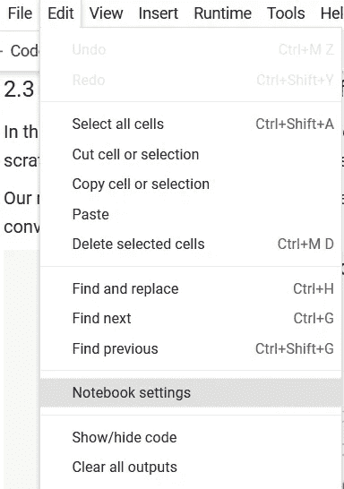
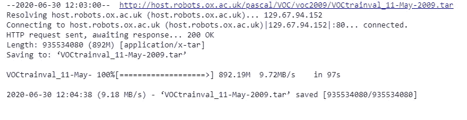
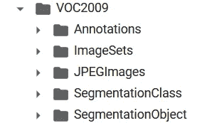
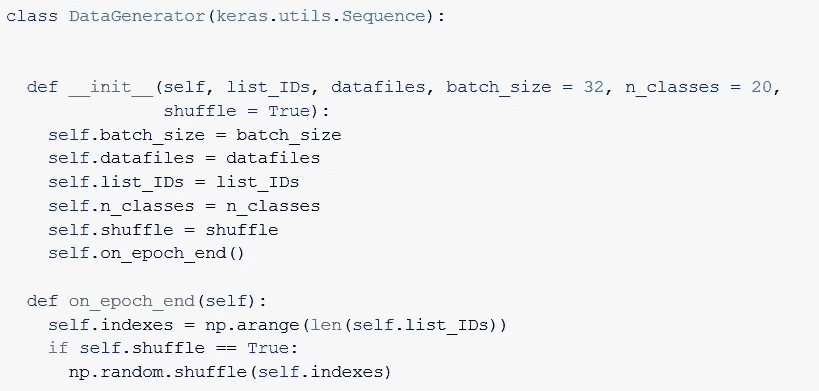
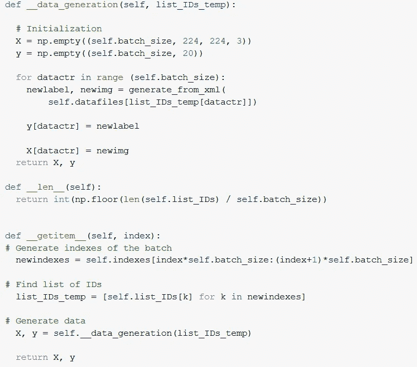
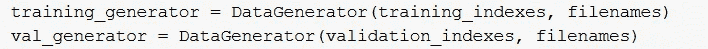
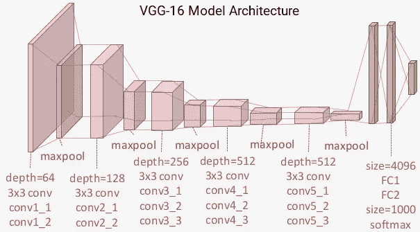
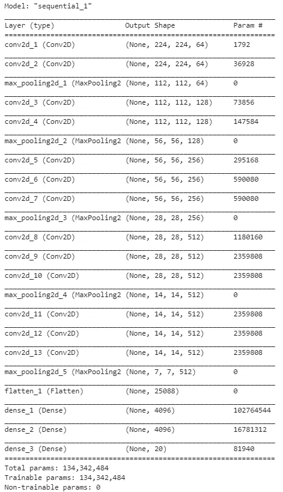
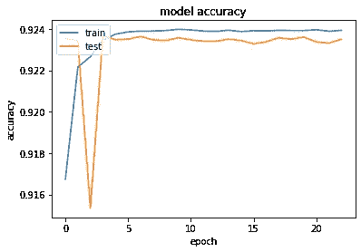
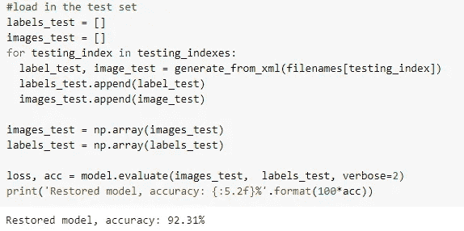

# 在 Keras 中构建自己的深度学习图像分类模型

> 原文：<https://towardsdatascience.com/build-your-own-deep-learning-classification-model-in-keras-511f647980d6?source=collection_archive---------16----------------------->

## 从头开始构建自己的深度学习图像分类模型的直观指南


图 1:Pascal-VOC 数据集的分类示例

# 介绍

图像分类是近年来越来越受欢迎的人工智能领域。它有各种各样的应用:自动驾驶汽车，人脸识别，增强现实，…

在这篇文章中，你将学习如何建立一个深度学习图像分类模型，该模型能够在**的 10 个步骤**中检测出图像中存在哪些对象。

完整的代码可以在[共享的 google collab](https://colab.research.google.com/drive/1HmUBIzRkoO8KKFpAVBVDonLiFZKEqof9?usp=sharing) 中找到，所以你可以在阅读文章的同时轻松地跟着编码。

读完这本指南，你会知道以下事情:

*   如何建立一个为深度学习模型设计的编码环境？
*   如何连接流行的影像分类数据集(Pascal VOC)
*   如何使用 Keras & Tensorflow 的组合创建深度学习卷积神经网络
*   如何使用数据生成器高效地训练深度学习模型
*   如何评估数据生成器的性能

## 步骤 1:设置环境

请查看[谷歌协作](https://colab.research.google.com/drive/1HmUBIzRkoO8KKFpAVBVDonLiFZKEqof9?usp=sharing)获取所需的软件包。

从零开始构建深度学习卷积网络需要巨大的计算能力。普通的笔记本电脑不具备处理这些请求的能力。

幸运的是，谷歌来拯救我们了！他们已经开发了一个[在线 python 笔记本](https://colab.research.google.com/)，给用户**免费的计算能力。**

您可以通过在笔记本电脑设置中选择 GPU 选项来启用计算能力功能。



## 步骤 2:导入数据

我们将使用 [Pascal VOC 图像数据集](http://host.robots.ox.ac.uk/pascal/VOC/)用于我们的深度学习模型。

Pascal VOC 数据集是一个图像数据集，在 Kaggle 上的计算机视觉竞赛中非常受欢迎。

使用 Wget 包下载数据集。这个包获取数据并下载到你当前的工作目录。

```
import tarfile!wget -nc http://host.robots.ox.ac.uk/pascal/VOC/voc2009/VOCtrainval_11-May-2009.tar
```

最后一步，打开 tarfile 并提取它。

```
tf = tarfile.open("/content/VOCtrainval_11-May-2009.tar")tf.extractall()
```

干得好！现在，您已经成功地加载并提取了数据集。



图 1: VOC 数据集结构

## 步骤 3:加载数据

当前的数据结构对于构建深度学习卷积模型不是最优的。
因此，需要将数据转换成更可行的格式。

您提取的 Pascal VOC 数据集应该包含以下两个文件夹:

*   注释:该文件夹包含所有关于图像标签的信息。
*   JPEGImages:该文件夹包含所有原始图像

创建两个列表:

*   文件名:在这个列表中，你保存所有图片的文件名。例如“2208–001068 . JPEG”
*   分类:在这个列表中，你保存了所有的分类标签。例如“自行车、沙发”

```
directory_annotations = '/content/VOCdevkit/VOC2009/Annotations'filenames = []
classification = []
```

遍历注释目录，提取文件名和标签，并将其添加到各自的列表中。

```
for xml_file in os.listdir(directory_annotations): # Save image for classification and their class label if os.path.isfile(xml_file):
    xml_tree = ET.parse(xml_file)
    root = xml_tree.getroot()
    imgname = root.find('filename').text.strip('.jpg')
    labels = []
    for obj in root.findall('object'):
    label = obj.find('name').text
    labels.append(label) filenames.append(imgname)
    classification.append(labels)
```

## 步骤 4:预处理

在这一步中，您必须对数据进行预处理:

*   在训练和测试集中拆分文件名和它们各自的分类。

```
label_filenames_temp = os.listdir(directory_annotations)
filenames = []for lbl in label_filenames_temp:
    filenames.append(lbl.split('.')[0])filecount = len(filenames)indexes = []for index in range(filecount):
     indexes.append(index)training_indexes = indexes[:int(filecount*0.7)]
validation_indexes = indexes[int(filecount*0.7):int(filecount*0.9)]
testing_indexes = indexes[int(filecount*0.9):] 
```

*   输出标签需要转换成数值，因为当输入和输出变量是数字时，深度学习网络表现得更好。

```
directory_images = '/content/VOCdevkit/VOC2009/JPEGImages'directory_annotations = '/content/VOCdevkit/VOC2009/Annotations'labelnames = preprocessing.LabelEncoder()labelnames.fit(["aeroplane", "bicycle", "bird", "boat", "bottle", "bus", "car", "cat", "chair", "cow", "diningtable", "dog", "horse", "motorbike", "person", "pottedplant", "sheep", "sofa", "train", "tvmonitor"])
```

*   图像大小调整为 224，224，3 格式。在基于 VGG16 模型架构构建深度学习网络时，文献综述对此提出了建议。(西蒙扬&齐瑟曼，2014 年)

```
def generate_from_xml(filename):label = np.zeros((20), dtype = 'float32')tree = ET.parse(os.path.join(directory_annotations, filename + ".xml"))raw_image = cv2.imread(os.path.join(directory_images, filename + ".jpg"))res_img = cv2.resize(raw_image, (224,224)) for elems in tree.iter():
         if elems.tag == "object":
            name = elems.find("name").text
            labelnr = labelnames.transform([name])[0]
            label[labelnr] = 1return label, res_img
```

## 第 5 步:数据生成器

在巨大的数据集上训练模型需要大量的 ram 内存。

如果你像我一样，没有超级计算机，你必须使用数据生成器。

数据生成器将小批量的数据提供给模型。这允许我们在没有大量内存的情况下训练我们的模型。

使用大数据集时，最好使用数据生成器(而不是购买更多的 ram 内存)。数据生成器的细节超出了本文的范围，但是如果您感兴趣的话，可以查看下面的[链接](https://stanford.edu/~shervine/blog/keras-how-to-generate-data-on-the-fly)。

在下一个代码块中，创建一个 datagenerator 类实例，并调用它两次:

*   一次用于训练集
*   一次用于验证集



## 步骤 6:创建我们的模型

在此步骤中，您将构建分类卷积神经网络的架构。

模型架构基于流行的 VGG-16 架构。这是一个总共有 13 个卷积层的 CNN(CFR。图 1)。



下面的代码块表明您将按顺序构建模型。这意味着你会一层又一层。

```
model = Sequential()
```

你增加两个卷积层。
在卷积层，对图像应用多个滤波器以提取不同的特征。

给出的参数:

- Input-shape:给定图像的形状应为(224，224，3)。

- Filters:卷积层将学习的过滤器数量。

- Kernel_size:指定 2D 卷积窗口的宽度和高度。

-填充:指定“相同”可确保卷积后空间维度相同。

-激活:这更多的是一个方便的论点。这里，我们指定哪个激活函数将在卷积层之后**被应用。我们将应用 ReLU 激活功能。稍后将详细介绍。**

```
model.add(Conv2D(input_shape=(224,224,3),filters=64,kernel_size=(3,3),padding="same", activation="relu"))model.add(Conv2D(filters=64,kernel_size=(3,3),padding="same", activation="relu"))
```

接下来，添加 1 个 maxpool 层。

池用于通过减少前一卷积层输出中的像素数量来降低图像的维数。

- Pool_size= 2，2-->这是一个“矩阵”,它将检查输出并从中获取最大值

-跨距= 2，2-->池矩阵沿 x 和 y 轴移动的增量。

```
model.add(MaxPool2D(pool_size=(2,2),strides=(2,2)))
```

我们继续向我们的深度学习网络添加层。应用如上所述的相同逻辑。

```
model.add(Conv2D(filters=128, kernel_size=(3,3),padding="same", activation="relu"))model.add(Conv2D(filters=128, kernel_size=(3,3),padding="same", activation="relu"))model.add(MaxPool2D(pool_size=(2,2),strides=(2,2)))model.add(Conv2D(filters=256, kernel_size=(3,3),padding="same", activation="relu"))model.add(Conv2D(filters=256, kernel_size=(3,3),padding="same", activation="relu"))model.add(Conv2D(filters=256, kernel_size=(3,3),padding="same", activation="relu"))model.add(MaxPool2D(pool_size=(2,2),strides=(2,2)))model.add(Conv2D(filters=512, kernel_size=(3,3),padding="same", activation="relu"))model.add(Conv2D(filters=512, kernel_size=(3,3),padding="same", activation="relu"))model.add(Conv2D(filters=512, kernel_size=(3,3),padding="same", activation="relu"))model.add(MaxPool2D(pool_size=(2,2),strides=(2,2)))model.add(Conv2D(filters=512, kernel_size=(3,3),padding="same", activation="relu"))model.add(Conv2D(filters=512, kernel_size=(3,3),padding="same", activation="relu"))model.add(Conv2D(filters=512, kernel_size=(3,3),padding="same", activation="relu"))model.add(MaxPool2D(pool_size=(2,2),strides=(2,2)))
```

现在卷积的基础已经建立了。为了能够产生一个预测，你必须使卷积基的输出变平。

```
model.add(Flatten())
```

添加密集层。密集层将卷积基底的输出馈送给它的神经元。

参数:

-单位:神经元的数量

-激活功能:Relu

Relu 激活功能加速了训练，因为梯度计算非常简单(0 或 1)。这也意味着负值不会传递或“激活”到下一层。这使得只有一定数量的神经元被激活，这使得计算变得有趣。

```
model.add(Dense(units=4096,activation="relu"))model.add(Dense(units=4096,activation="relu"))
```

您添加了一个 sigmoid 层，以便将前一层的输出转换为概率分布。sigmoid 是多标签分类的理想选择，因此我们使用 sigmoid 代替 softmax 激活。

由 sigmoid 产生的概率是独立的，并且不局限于总和为 1。这在具有多个输出标签的分类中至关重要。

您将单位参数设置为 20，因为我们有 20 个可能的类。

```
model.add(Dense(units=20, activation="sigmoid"))
```



## 步骤 7:损失函数和优化器

在步骤 7 中，您必须编译模型。您使用 RMSprop optimier 来达到全局最小值。你设置学习率为 0.001。

**RMSprop** ，均方根 prop，是一个未发表的优化算法，但很受机器学习从业者的欢迎。它减少了垂直方向的波动，同时加快了水平方向的学习。这使得我们的模型更快地收敛到全局最小值。与常规梯度下降算法的主要区别在于梯度的计算方式。梯度的计算公式如下图所示。

你设置**二元交叉熵损失**作为你的损失函数。
建议将此损失函数用于多标签分类，因为属于某个类别的每个元素不应受到另一个类别的决策的影响。

```
model.compile(optimizer= keras.optimizers.RMSprop(lr=0.001), loss='binary_crossentropy',metrics=['accuracy'])model.summary()
```

## 第八步:模型训练

一旦模型性能在保留数据集上停止改善，就可以使用 earlystopping 方法来停止定型。
通过这种方式，您可以在监控过度拟合的同时自动获得完美的时期数。

你给提前停止的人下达指令，寻求验证损失的最小值。

早期停止方法仅在没有检测到进一步改善时停止训练。

但是，最后一个纪元不一定是性能最好的纪元。

因此，您也可以使用模型检查点方法。这将保存在基于验证损失的训练期间观察到的最佳模型。

```
filepath = "/content/drive/My Drive/MYCNN/CNN1505_v1.h5"earlyStopping = EarlyStopping(monitor='val_loss', verbose=0, mode='min', patience = 4)mcp_save = ModelCheckpoint(filepath, save_best_only=True, monitor='val_loss', mode='min')
```

现在，你将开始训练我们的深度学习神经网络。我们使用 keras 的 fit 生成器批量加载数据。这是必要的，因为我们的整个训练集不适合我们的内存。

您可以设置以下参数:

*   使用多重处理:是否使用基于进程的线程
*   Workers:并行生成批处理的线程数。

```
history = model.fit_generator(generator=training_generator,
validation_data=val_generator,
use_multiprocessing=True,
workers=6,
epochs = 20,
callbacks=[earlyStopping, mcp_save])
```

当我们的培训结束后，您可以看到我们的培训和验证结果。绘制了两个指标:

*   模型精度
*   模型损失

## 步骤 9:验证我们的模型

你可以看到模型很快从第一个时期的巨大训练损失收敛到更低的数字。
这种快速学习速率是由于所选优化器(RMS prop)的性质，它加快了收敛速度。
当该度量在四个时期内没有改进时，训练过程挑选具有最低验证损失的模型。

```
df = pd.DataFrame(history.history)
print(history.history.keys())# summarize history for accuracyplt.plot(history.history['accuracy'])plt.plot(history.history['val_accuracy'])plt.title('model accuracy')plt.ylabel('accuracy')plt.xlabel('epoch')plt.legend(['train', 'test'], loc='upper left')plt.show()# summarize history for lossplt.plot(history.history['loss'])plt.plot(history.history['val_loss'])plt.title('model loss')plt.ylabel('loss')plt.xlabel('epoch')plt.legend(['train', 'test'], loc='upper left')plt.show()
```



## 步骤 10:测试我们的模型性能

在我们的最后一步，我们在看不见的数据(测试集)上测试我们的模型性能。

