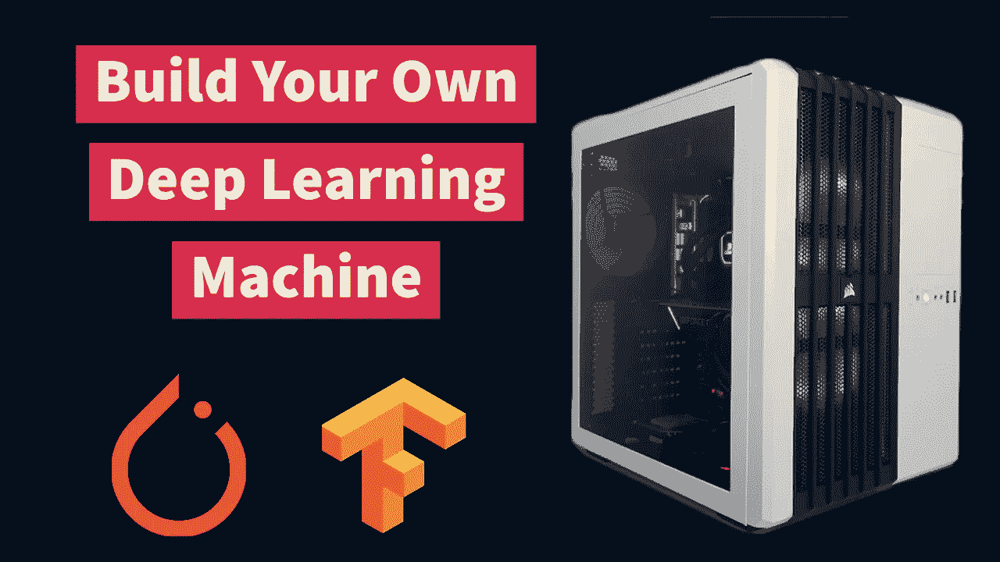
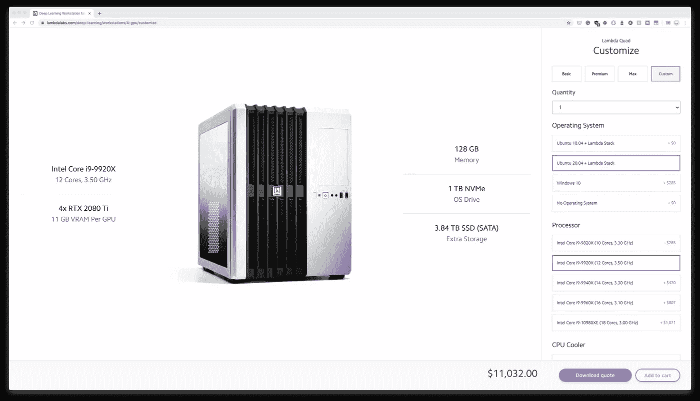
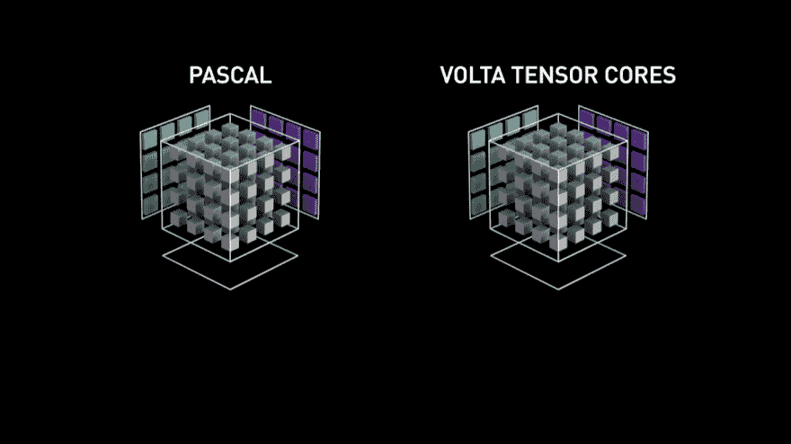
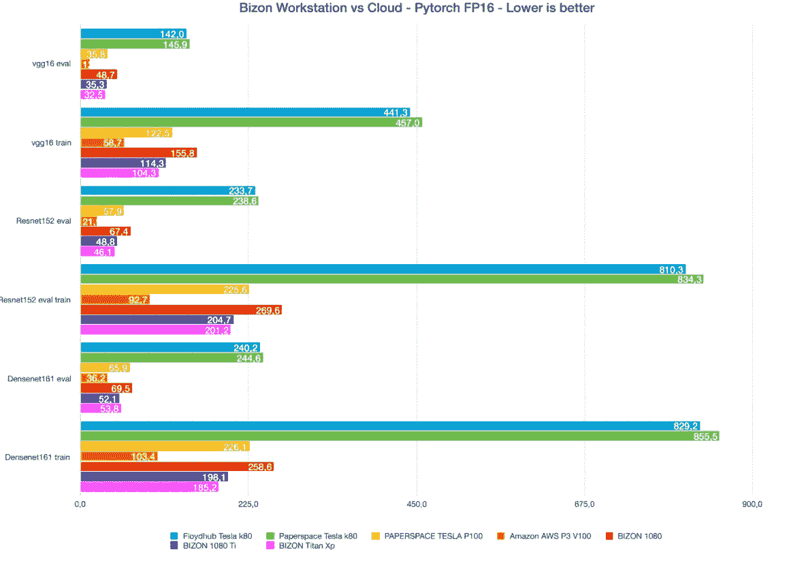

# 打造自己的深度学习机器——你需要知道的

> 原文：<https://towardsdatascience.com/build-your-own-deep-learning-machine-what-you-need-to-know-85c7a0a1604a?source=collection_archive---------5----------------------->

深度学习需要大量的计算，所以为了有效地训练深度学习模型，大多数人使用像 AWS 这样的云，或者在他们自己购买的硬件上进行训练。

我决定建立自己的机器，因为我在云上花了很多钱，并希望节省成本。介绍…战争机器！Warmachine 是一台非常有能力的机器，旨在承担从深度学习到强化学习的高级人工智能任务。Warmachine 是使用货架硬件的消费者构建的。

点击下面的链接，在电脑零件挑选处查看 Warmachine 的零件。

 [## 保存的零件列表

### 编辑描述

pcpartpicker.com](https://pcpartpicker.com/user/learnedvector/saved/#view=f4c8Jx) 

在这篇文章中，我将给出如何正确构建人工智能训练机器的技巧。最后，我将讨论构建自己的平台和使用云的优缺点。

如果你想看这个的视频版本，看看这个…

# 零件

所以 Warmachine 主要是为了解决深度学习和强化学习问题而建立的。我想要一台具有 4 个 GPU 的大量内核的机器，这样我就可以快速迭代训练我的机器学习模型。我的最终目标是最终拥有一台类似于 lambda quad 的机器，但不用支付 Lambda Quad 的价格。

用于 4 GPU RTX 2080 TI 机器的 Lambda Lab Quad

当 Warmachine 完成时，我将花费大约 7000 美元，比 Lambda Labs 便宜 4000 美元！

深度学习装备需要特定的组件，所以比平时更难在网上找到关于如何构建这些东西的可靠资源。让我们来看看你需要知道的所有知识，以构建你自己的深度学习机器。

# 国家政治保卫局。参见 OGPU

训练深度学习模型的核心是 GPU。GPU 在计算深度学习算法方面速度超快，因为与拥有非常少量复杂计算核心的 CPU 不同，GPU 拥有数百或数千个简单核心，在矩阵乘法方面超高效。GPU 用于深度学习最可靠的品牌是英伟达。大多数深度学习框架完全支持英伟达的 CUDA SDK，这是一个与他们的 GPU 接口的软件库。

当选择一个 GPU 时，为了让你的钱发挥最大的作用，你需要有张量核的东西。张量核是一种执行专门矩阵数学的处理核，使您能够使用半精度或混合精度训练模型。

这允许更有效地使用 GPU 内存，为更大的批量、更快的训练和更大的模型打开了大门。张量核可以在英伟达 RTX GPU 模型中找到。GPU 的内存需求取决于您计划训练的模型类型。

如果你只打算为嵌入式设备训练超小型模型，你可以用内存更少的 GPU。如果你计划训练更大的模型，比如 NLP 领域的 GPT，我会得到尽可能多的内存。

拥有更多的 GPU 内存为..你猜对了…更大的批量，更快的训练，更大的模型。如果你打算做一个多 GPU 设置，你需要使用吹风机式风扇或更昂贵的液冷选项。

你需要吹风机式的风扇，因为它们是为了将热量排出机箱，当你有多个 GPU 运行时，这是必要的。如果您没有鼓风机式风扇，您的系统可能会过热，并可能损坏您的硬件。

对于 Warmachine，我选择了华硕的 Nvidia RTX 2080 TI Turbo。它有 11GB 的 VRam 和鼓风机式风扇，可以在多 GPU 设置上实现更好的加热管理。我计划再买 3 个 GPU 来完成我的设置。

# 中央处理器

CPU 主要用于深度学习中的数据加载。CPU 上更多的线程意味着您可以并行加载更多的数据，以输入到您的模型中进行训练。如果你在大批量上训练，这是有用的，所以 GPU 不必等待 CPU 太长时间来加载数据。

如果你打算做强化学习问题，CPU 是很重要的，因为大部分计算将在你的学习环境中完成，而这很可能是在 CPU 上完成的。如果你使用强化学习的大型神经网络，那么 GPU 肯定有助于加快训练速度。

如果你只打算只做深度学习，那么确保你的 CPU 兼容你计划拥有的任何数量的 GPU。

选择 CPU 时，问问自己，这些问题…

1.  你打算进行强化学习吗？如果你想要更快的训练，那么选择一个在基准测试中表现良好的高端 CPU。
2.  你是不是只想做深度学习？然后，您可以使用更便宜的 CPU，但是更多的线程将有助于数据加载。
3.  你计划有一个多 GPU 设置吗？然后确保你的 CPU 支持你想要的 GPU 数量。

Warmachine 将用于深度学习和强化学习，因此它配备了一个英特尔 i9–10920 x，它有 12 个内核和 24 个线程。它的时钟速度高达 4.8 GHZ，支持 4 个 GPU。我选择了英特尔，但是阅读了很多使用 AMD 芯片的人的成功故事，这对你的钱来说是一个更大的冲击。英特尔 i9–10920 x 是一款非常强大的 CPU，可以进行深度学习和强化学习，因此非常适合我的需求。

# 随机存取存储

一个很大的错误是认为你需要具有高时钟频率的最快的 RAM。高 Ram 时钟速度是一个营销噱头，最好的解释是由[莱纳斯技术提示](https://www.youtube.com/watch?v=OT-qAQLGkGo)。更高的时钟频率在训练期间将显示出微不足道的改善，所以你的钱最好花在别的地方。

真正重要的是 RAM 上的内存量。你应该努力让你的内存至少和你的 GPU 内存一样多。我用的是 corsair 品牌，它的时钟速度为 2666Mhz，内存为 32 GB。当 Warmachine 完成时，我计划将它的内存增加到 128 GB，因为我特别喜欢这样。

# 母板

选择主板时，确保它有足够的 PCIe 插槽来容纳你想要的 GPU 数量。此外，确保 PCIe 插槽有足够的空间来容纳 GPU。通常，一个 GPU 将占用 2 个 PCIe 插槽的空间。此外，请确保主板与您的 CPU 和 RAM 兼容。

Warmachine 配备了一台华硕 WS X299 SAGE。这款主板支持 4 个 GPU。我唯一希望它有机载 wifi，但我使用以太网电缆连接，所以这不是太大的问题。

# 储存；储备

如果你想优化你的数据加载速度，你需要更快的存储，如固态硬盘。固态硬盘比标准硬盘更贵，因此为操作系统购买一个较小的固态硬盘，然后购买一个标准硬盘作为长期存储数据和模型的第二个驱动器是非常有用的。

训练的时候可以把感兴趣的数据转移到你的 SSD 上，加快数据加载速度。Warmachine 配备了 NVME 三星 970 Evo，操作系统存储空间为 1 TB。对于第二个驱动器，它有 8TB 存储的希捷 Exos 企业硬盘。

# 程序存储单元(Program Storage Unit)

对于电源单元，你需要有足够的功率来支持你的整个系统。一个很好的经验法则是将 CPU 和 GPU 所需的功率乘以 110%。

确定您的 PSU 有足够的 PCIe 连接器用于您的系统。Warmachine 配备了一个玫瑰将，1600 瓦 PSU。尽管我现在的设置不需要所有这些，但当它完成时，我会需要这么多，所以我继续购买了它以备将来使用。

# 冷却

你肯定需要一个 CPU 冷却器。为了降低风扇噪音，可以使用水冷装置。如果你有预算，你也可以看看液体冷却你的 GPU。这将构成一个超级安静的系统。如果你想坚持用空气冷却你的 GPU，确保你有鼓风机式的冷却，如果你计划有一个多 GPU 设置。Warmachine 目前配备了海盗船 H1 15i 专业这是一个 CPU 水冷却器。对于 GPU 来说，这只是股票鼓风机式的。

# 情况

当你选择一个箱子时，你可以选择任何你想要的东西，只要你的零件合适。我会建议买一个通风良好的箱子，因为我非常谨慎。我去了一个海盗船航空 540 ATX 中塔案件 Warmachine。它有充足的气流，看起来很酷，这和 Lambda 实验室使用的情况一样，为什么不呢？

# 确保你的零件合适

在装配钻机时，使用 [PC 零件拾取器](https://pcpartpicker.com/)。它有一个功能，它会检查部件兼容性，这样你就不会完全搞砸你的构建。虽然它并不完美，因为它提醒我，我的零件并不适合我的情况，但一切都非常适合，所以在建造时将它用作指南针。

# 云与您自己的硬件

现在你们很多人可能会好奇，为什么要造我自己的机器？我就不能用云吗？是的，是的，你可以。但是建造你自己的机器也有好处，包括长期的成本节约。

这里有 3 个理由说明为什么建立自己的深度学习平台可能是值得的。

1.节约成本。如果你经常使用你的 GPU 进行训练，那么从长远来看，建造一台机器实际上可以为你省钱！如果你租一辆 v100，那大约是每小时 3 美元或者一个月 2100 美元！你可以用那个价格建造你自己的机器..并且永远保持下去！

2.你自己的硬件其实比云还快。这是因为由于虚拟化，云在实例和 GPU 之间的 IO 很慢。Bizon-Tech 做了一个实验来比较云和你自己的硬件，他们发现你可以买到更便宜的消费硬件。

您可以在这里看到，1080 Ti 接近 V100 的性能

3.拥有自己的钻机就像一台生产力机器，可以做任何你想做的事情。我可以用它在最大设置下玩游戏，为大家制作很酷的视频，并在 chrome 上打开 10 多个标签页！

**奖励点:**这里有一个奖励点。我喜欢不用担心每轮模特训练要花多少钱。我觉得当我必须为每轮训练付费时，我总是不愿意尝试，因为我知道这会让我花钱。我认为拥有自己的机器鼓励我继续尝试，从而帮助我比使用云更快地完善深度学习的艺术。现在有其他免费的 GPU 支持选项，如 Google Colab 或 Kaggle 内核，但你可以训练的时间有限，这缩小了我对模型和要解决的问题的选择。不过，我强烈推荐大多数刚开始深度学习的人使用它们。

# 结论

原来如此！这是一个关于如何构建自己的深度学习机器的简短指南。如果你想要一份更详细的指南，我推荐你去看看[蒂姆·德特默斯指南](https://timdettmers.com/2018/12/16/deep-learning-hardware-guide/)。当 Warmachine 完成后，它将花费我大约 7k 美元，这仍然比 Lambda Labs 可比的机器 11K 美元便宜！对我来说，这是一个很大的省钱之道，完全值得你自己造一台机器。

✍🏽想要更多内容？查看我的博客[***https://www.michaelphi.com***](https://www.michaelphi.com/build-your-own-deep-learning-machine-what-you-need-to-know/)

📺喜欢看基于项目的视频？查看我的 [**Youtube**](https://www.youtube.com/channel/UCYpBgT4riB-VpsBBBQkblqQ?view_as=subscriber) ！

🥇注册我的 [**电子邮件简讯**](http://eepurl.com/gwy3hj) **，了解最新文章和视频！**