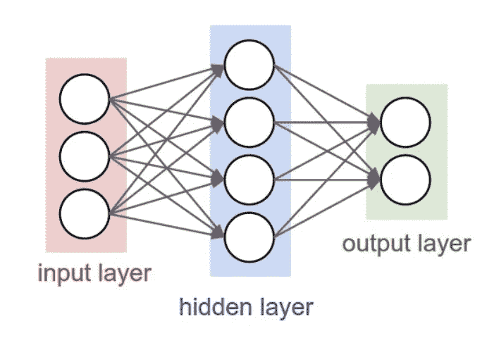
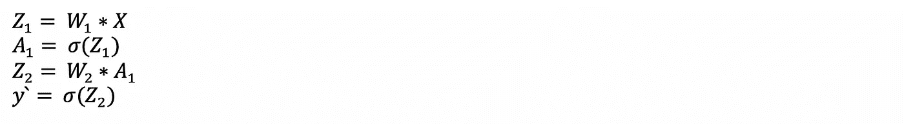
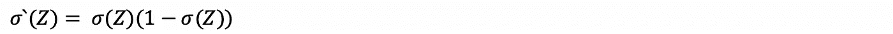
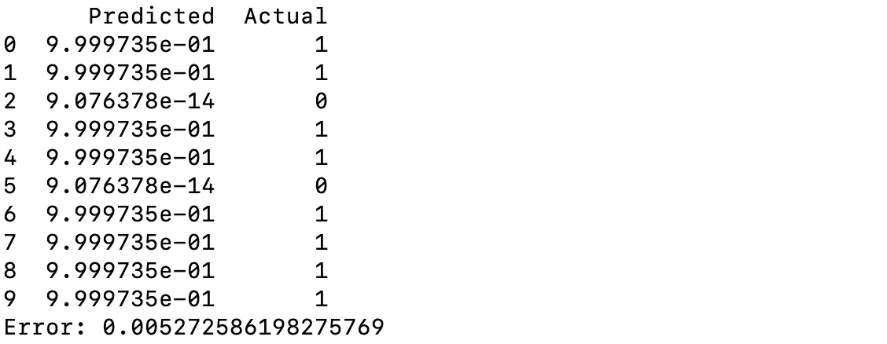

# 用 Python 从头开始构建自己的神经网络

> 原文：<https://towardsdatascience.com/build-your-own-neural-network-from-scratch-with-python-dbe0282bd9e3?source=collection_archive---------30----------------------->

## 了解神经网络的基础知识


娜塔莎·康奈尔在 [Unsplash](https://unsplash.com?utm_source=medium&utm_medium=referral) 上的照片

有许多 python 库可以用来构建和训练神经网络，如 Tensorflow 和 Keras。但要真正理解神经网络，我们需要了解它的基本结构，并能够建立和训练我们自己的网络。

与常规的机器学习算法相比，神经网络可以更好地学习数据。事实上，*神经网络算法可以解释为一堆线性回归*，其中每个节点都是一个线性回归的输出。

神经网络包括:

*   一个输入层， ***x***
*   任意数量的隐藏层
*   一个输出层， ***y`***

在下图中，输入层有 3 个节点，下一层(隐藏)有 4 个节点，输出层有 2 个节点。输入层不包括在层数中，因此它是一个 2 层网络。



两层神经网络结构

两层中的每个节点都是一个线性回归的输出。在每一层，在执行线性回归之后，这些值被馈送到激活函数。

神经网络的基本算法应该是这样的。

```
for n epochs:
    1\. forward_propagation() #predicting output
    2\. backward_propagation() #updating parameters according to loss
```

函数名暗示了算法的基本结构。在本文中，我们将建立一个 2 层神经网络。

让我们看看我们将使用的常见命名约定。



`Z`是线性向前值，即`Z = W.X`，`A`是节点激活，即`A = sigmoid(Z)`。我们将在网络中使用 sigmoid 激活函数。

# 1.初始化参数

首先，我们初始化神经网络的权重和层大小。

我们将变量定义如下:

*   `[num_samples, n_x]`:输入的形状
*   `n_x`:输入 X 的特征数
*   `n_h`:隐藏层节点
*   `n_y`:每个样本的目标值数量

让我们根据输入和输出值以及我们选择的隐藏层大小来初始化层大小。

然后，我们基于层大小初始化权重。

*   在上图中，对于第一层，我们需要定义权重，以便能够计算 4 个`(n_h)`线性回归，下一层中的每个节点一个。
*   所以第一层中的权重，`W1`应该是`(3,4)`或`(n_x,n_h)`(对三个(n_x)输入特征的四个(n_h)线性回归)。

用这个类比，你可以很容易地猜出上面网络中权重`W2`的形状。

让我们定义初始化权重的函数。

# 2.正向传播

正向传播由一组线性回归和每层的非线性激活函数组成。

我们将使用 sigmoid 函数作为神经网络的激活函数。

一旦你得到正确的权重，前向传播是非常简单的。

> 输出= sigmoid((W2 * sigmoid(W1 * X+B1))+B2)

让我们定义我们的前向函数。

正向传播

# 3.反向传播

这是棘手的部分。反向传播相应地在损失最小化的方向上更新权重参数。**我们将使用*均方差(MSE)* 损失来评估我们的网络。这个计算看起来很复杂，但实际上很简单。**



损失函数的加权导数和 sigmoid 导数

这很简单，对吧？现在，让我们定义反向传播的函数。我们将计算梯度，并在向后的步骤中更新权重。

反向传播

# 4.培养

训练中的一个时期包括一个向前和向后传播步骤。

我们将使用来自`sklearn.datasets`模块的乳腺癌数据集。该数据集有 30 个特征和 569 个样本，并用隐藏层中的 4 个节点训练我们的网络 1000 个时期。

比较 10 个随机样本的预测值和输出值。



看起来我们的网络工作得非常好！

请注意，预测值与实际值略有不同。这是可取的，因为这意味着模型不会过度拟合，并且会更好地概括。

# 结论

在我们的神经网络中，我们在激活层使用了 sigmoid 函数。但是，根据问题的类型，还有其他的激活功能可能会有用。事实上，激活函数可以是你选择的任何函数，如果你认为这个函数非常适合我们试图解决的特定问题。但是神经网络中常用的激活函数可以在这里找到[。](https://missinglink.ai/guides/neural-network-concepts/7-types-neural-network-activation-functions-right/)