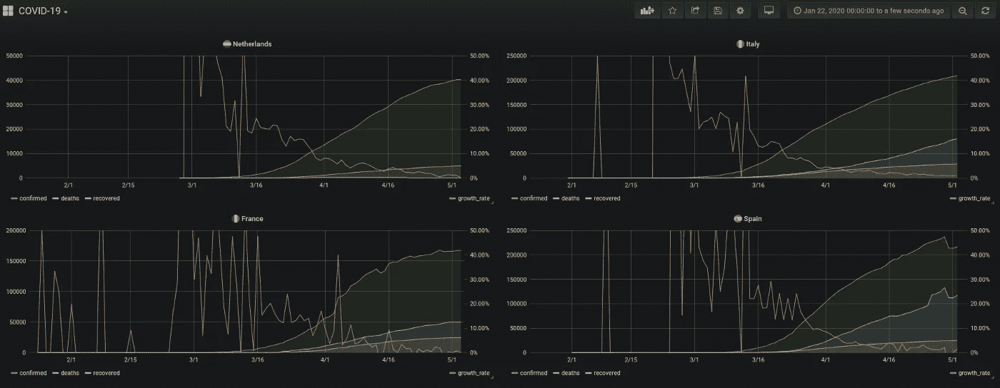
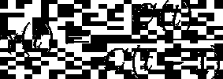

# 构建您自己的开放式仪表板来跟踪新冠肺炎

> 原文：<https://towardsdatascience.com/build-your-own-open-dashboard-to-keep-track-of-covid-19-f2b09e817320?source=collection_archive---------52----------------------->

## 跟踪对您自己的 RaspberryPi 有影响的派生指标



我们生活在一个相对前所未有的时代，因为今天活着的人(除了 1918 年左右的少数人)没有一个在他们生活的任何时候经历过疫情。这意味着，与任何其他情况相比，我们更有理由收集尽可能多的数据，以便做出更明智的决策。其中一部分是通过密切监测新病例、死亡和康复的数量，以及许多重要的指标(病毒扩散率、增长率、死亡率、达到 ICU 满负荷前的估计天数等)。)可以从那些数字中推断出来。

自从疫情开始以来，我已经看到世界各地的工程师和数据科学家做出了令人印象深刻的努力，提供可以帮助解决问题的工具。从 [3D 打印的面罩](https://cults3d.com/en/collections/useful-3d-printed-coronavirus-covid19-tool)，到 [RaspberryPi+Arduino 驱动的呼吸机](https://www.hackster.io/news/an-open-source-ventilator-powered-by-raspberry-pi-and-arduino-goes-into-testing-in-colombia-6c3f04b1ca94)，到构建快速管道来处理大量基因组数据或[计算病毒‘蛋白质’的结构](https://foldingathome.org/)，到构建 API 和仪表板来帮助共享数据，在疫情期间，各种类型的工程师都面临着大量挑战。

我将尝试再写几篇关于工程师和数据科学家如何在此时积极帮助世界的文章，从如何构建一个定制的仪表板开始，该仪表板在可用时自动提取关于传染的新数据，计算任何所需的派生指标，并将数据显示在 Grafana 仪表板上。收集尽可能多的关于这种疫情的准确数据对于有效地抗击它至关重要，同样至关重要的是计算并向最广泛的公众显示正确的衍生指标，以便更好地理解(或评估)政府的决策，或者比较世界上不同政策的不同国家如何产生不同的结果，或者甚至某个国家的病例数在实施某些措施前后如何变化。

我们将使用 PostgreSQL 存储数据(但是任何关系数据库都可以)，使用 Grafana 显示数据，使用 [platypush](https://github.com/BlackLight/platypush/) 填充数据并自动更新数据。不久前，我给[写了一篇文章](/how-to-build-your-home-infrastructure-for-data-collection-and-visualization-and-be-the-real-owner-af9b33723b0c)，讲述如何用这些工具构建你的定制仪表板，以存储和显示任何类型的数据(从你浴室中的湿度传感器到你一天中的位置)。可以参考一下，了解一下这些工具是如何配合使用的，以及如何入门。

# 问题 1:数据可用性和质量

新冠肺炎统计的第一个问题是公布数据的可用性和质量。首先，并不是世界上所有的国家都同样努力让尽可能多的人接受检测。第二，并非所有国家在报告所有数字时都具有相同的透明度或可靠性——包括恢复情况、死亡人数和进行检测的次数。在紧急情况下，可用数据的质量远非完美，这是完全可以预料的。虽然我们作为个人对数据的质量没有太多的控制，但我们仍然可以推断出有趣的信息，并根据手头的不完整数据建立模型。例如，可以查看每个人口单位进行测试次数最多的国家的数据，以更好地了解真实的死亡率和住院率。有可能将病毒扩散的时间线与政府采取措施的时间线重叠，以推断这些措施如何影响了疫情的扩散。考虑到该国现有的重症监护室床位数量，可以推断按照目前的增长速度，卫生系统达到满负荷需要多少天。考虑到这些模型是基于不完整的数据，所有这些信息都应该有所保留，但是根据不完整的数据做出的决策总是比没有数据的决策要好。

# 问题 2:数据可视化

像疫情这样的现象按照相对简单的指数定律传播。一般来说，时间 *t* 的*增长率*定义为 *t* 日确诊病例数与前一日 *t-1* 确诊病例数之比:



如果增长率保持不变(如果没有采取控制措施，情况大致如此)，那么只需给出初始病例数和增长率，就可以估计第 *t* 天的病例数:


如果你关注过这一时期的任何新闻，你可能会经常听说另一个数字——*R0*，也被称为*基本再生数*。这是每个感染者携带病原体时感染的平均人数。增长率 *γ* 和 *R0* 相互关系如下:


其中 *w(τ)* 为疾病的 [*世代时间分布*](https://www.ncbi.nlm.nih.gov/pubmed/17476782) (基本上是描述一个传播链中连续感染之间时间分布的概率密度函数)。如果我们有一个好的分布规律和关于增长率的准确数据，我们可以很好地估计疾病将传播多少，以及在采取一些行动后它的传播如何变化。

虽然数学定律相对简单，但我们很难理解这种现象究竟是如何发生的。在我们的日常经验中，我们非常习惯于涉及线性定律的现象。如果你把某样东西翻倍或减半，那么其他东西可能会翻倍或减半，或者增加/减少 4 倍，等等。对于我们来说，处理指数定律的现象通常更难描绘。这个术语在媒体上经常被滥用，这并没有什么帮助:大多数时候，你听到一个经济体、一个公司或一个行业的“指数增长”，你实际上听到的是一个任意大幅度的线性或多项式增长。

为了描述指数增长的真正含义，假设你的田里长了一些杂草，如果不加限制，它每天都会比前一天扩大一倍(换句话说， *γ=2* )。假设这种杂草如果任其自由生长，需要 60 天才能覆盖整个田地。如果你应用上面的公式，你会发现在第 59 天，杂草只覆盖了一半的田地，在第 54 天，杂草只覆盖了大约 1.5%的田地。

指数增长现象的反直觉性意味着，在做决定时，我们不能只依靠我们的本能或共同的经验。这确实需要以正确的方式可视化正确的数据，以了解是否、何时以及如何控制疫情。以正确的方式看待数据也很重要。虽然你正处于指数增长曲线的中间，但仅仅通过观察线性范围内确诊病例的数量，很难判断增长有多“糟糕”。你只会注意到曲线增长了“很多”，但几个小数点的差异意味着在相对较短的时间框架内出现数十万或数百万的新确诊病例。对数标度给出了曲线实际增长多少的更好的图像，但它也能产生一种虚假的保证感。一条持续指数增长的曲线在对数标度上看起来像一条直线，所以你应该记住，一条在对数标度上持续增长甚至一点点的直线通常不是一个好兆头。

许多新的网站和仪表板出现在网络上，以跟踪这种疫情的传播，但尽管它们都在线性和对数标度上显示病例、恢复和死亡的累积数量方面做得相对较好，但它们缺乏一些派生指标的可视化，这些指标将真正有助于更好地掌握问题。例如，随着时间的推移，在某个国家对每单位人口进行了多少次测试，或者在给定的增长率和严重率下 ICU 床位达到满负荷需要多少天，或者死亡率/严重率如何随着被测试人口的比例而变化。这就是为什么我最终决定制作自己的开放式仪表板，以跟踪我希望跟踪的指标，按国家过滤，并且可以根据每个人的需求轻松定制。

# 问题 3: API 可用性

尽管已经有许多仪表板可以用来跟踪疾病的传播，但大多数仪表板都在后端呈现数据，没有公开任何 API。我个人非常喜欢 [Worldometers](https://www.worldometers.info/coronavirus/) 提供的数据质量和数量，它提供了许多其他仪表板上没有的数据(如每个国家人口的检测数量，住院病例数量等)。)，但是我前面提到的一些派生指标并不容易获得，另外，也没有为数据提供 API。对于 platypush 集成，我最终选择了 covid19api.com[提供的数据，即使它没有提供 Worldometers 上可用的许多指标——我仍然用 Worldometers 上发布的每日数据手动填充数据库中缺失的指标。作为下一步，我计划为 Worldometers 数据开发一个刮刀，如果你知道谁已经完成了这项工作，请让我知道:)，对于那些开发这些仪表板的人，非常感谢你的工作，但也请确保公开一个 API，以便其他开发人员可以轻松地提取数据或将其集成到其他项目中。](https://covid19api.com/)

# 设置环境

我们将使用三种工具来设置仪表板:

*   PostgreSQL(但是任何其他关系数据库都可以)
*   格拉夫纳
*   鸭嘴兽

仪表板可以在任何电脑上运行，包括 RaspberryPi。如果你想了解更多关于这些解决方案的信息，请参考我之前关于 PostgreSQL+platypush+Grafana 的文章。

我假设您的系统上安装了 PostgreSQL 或另一个 RDBMS，以及 Grafana。如果您的系统上还没有安装 platypush，您可以通过 pip 轻松安装:

```
pip install platypush
```

还要安装并启动 Redis，platypush 将使用它作为后端来传递消息。

设置数据库:

```
initdb -D covid19
```

然后创建我们将用来管理统计数据的表和触发器:

基本思想是将新的非规范化行转储到`tmp_covid19_data`表，然后让触发器管理数据的规范化，而视图`vcovid19`将用于连接和计算我们想要的派生指标。

然后，您可以使用一个利用 [platypush Covid19 插件](https://platypush.readthedocs.io/en/latest/platypush/plugins/covid19.html)的简单 Python 脚本来填充您想要跟踪的国家的所有历史数据:

最后，配置 [Covid19 后端](https://platypush.readthedocs.io/en/latest/platypush/backend/covid19.html)来自动提取您感兴趣的国家的数据，方法是将以下代码行添加到`~/.config/platypush/config.yaml`:

```
backend.covid19:
    country:
        - nl
        - it
        - us
        - es
        - gb
        - cn
        - fr
        - ru
```

每当有这些国家的新数据时，platypush 就会触发一个`[Covid19UpdateEvent](https://platypush.readthedocs.io/en/latest/platypush/events/covid19.html)`。您可以用钩子捕获这个事件，并将新行存储在数据库中，但是您还可以做其他任何事情——发送通知、SMS 或设置任何类型的自动化。在`~/.config/platypush/scripts`下创建一个名为`covid19.py`的脚本(还要确保这个文件夹中有一个`__init__.py`文件，这样它就会被识别为一个包):

启动`platypush`服务。既然您已经获得了数据和更新数据的自动化，那么是时候去 Grafana 并创建一些面板来从`vcovid19`视图中提取和显示数据了。一些示例报告查询:

```
SELECT
  report_date AS "time",
  confirmed
FROM vcovid19
WHERE
  country = '<country name>' AND
  $__timeFilter(report_date)
ORDER BY 1
```

您可以将这些查询组合在一起，构建您喜欢的仪表板:

