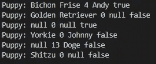

# 打造自己的小狗

> 原文：<https://towardsdatascience.com/build-your-own-puppy-dc0a49febe7c?source=collection_archive---------77----------------------->

## 了解如何对小狗使用 Java Builder 设计模式


照片由[乔·凯恩](https://unsplash.com/@joeyc?utm_source=unsplash&utm_medium=referral&utm_content=creditCopyText)在 [Unsplash](https://unsplash.com/s/photos/puppy?utm_source=unsplash&utm_medium=referral&utm_content=creditCopyText) 拍摄

设计模式是一个美丽的东西。他们接受普遍面临的软件开发问题，并为我们提供普遍接受的有效解决方案。

你知道还有什么是美丽的吗？小狗！

我们要用一件美好的事物来帮助我们理解另一件美好的事物。

如果没有简单的实现，理解这些设计模式可能会有点困难。

在学习构建器模式的工作原理时，我也遇到了同样的问题。在研究了这种模式的来龙去脉之后，我发现通过正确的解释，这个概念可以很快学会。

所以事不宜迟，让我们开始建立小狗！

# 目标

了解如何以及何时在 Java 应用程序中使用构建器设计模式。

# 设置

要跟随自己，我建议使用以下工具:

*   您最喜欢的 Java IDE
*   JDK 8

如果你正在寻找一种快速的方法来开始使用 VSCode 构建 Java 应用程序，我写了下面的教程[。](https://medium.com/p/62844abdb9cb/edit)

# 什么时候应该使用构建器模式？

想象你是一个小狗收养中心的主人。您需要存储每只小狗的所有信息，以便在应用程序的其他部分使用。

你需要保存品种、年龄、名字，以及它是否符合健康要求。它可能看起来像这样:

Puppy.java

这很简单，对吧？我们用一个构造器创建一个类，这个构造器具有这四个属性中的每一个，并在每次有小狗进来时实例化一个新的实例。

```
Puppy pup = new Puppy (“Bichon Frise”, 9, “Andy”, true);
```

在一个完美的世界里，这将是一个很好的解决方案。但是我们并不是生活在一个完美的世界里，不是吗？

有时当这些小狗进来时，它们没有我们需要的所有信息。我们可能不知道它的年龄或是否接种过疫苗。或者可悲的是，我们可能不知道它的名字。

试图用稀疏信息构造这些对象可能看起来像这样。

```
Puppy pup2 = new Puppy ("Golden Retriever", false);
Puppy pup3 = new Puppy (true);
Puppy pup4 = new Puppy ("Yorkie", "Johnny", false);
Puppy pup5 = new Puppy ("Doge", 13);
Puppy pup6 = new Puppy ("Shitzu");
```

在 Java 中，您必须创建不同的构造函数来支持这些实例化。或者你可以使用`null`值来填充空白点。但那很乱。

此外，如果顺序与原始构造函数中定义的顺序不同，值可能会映射到错误的变量。这可能会在将来给你带来意想不到的运行时错误。

一定有更好、更灵活的方法来创建这些复杂的对象，对吗？

我们使用构建器模式。

# 小狗建造者

让我们建造一些小狗吧！(说起来有点奇怪。)


照片由[卡斯滕·怀恩吉尔特](https://unsplash.com/@karsten116?utm_source=unsplash&utm_medium=referral&utm_content=creditCopyText)在 [Unsplash](https://unsplash.com/s/photos/puppies?utm_source=unsplash&utm_medium=referral&utm_content=creditCopyText) 上拍摄

本教程将是实现构建器模式的一个精简的、最基本的例子。

我们将从创建一个名为`PuppyMain.java`的主类开始。这个类是我们的切入点。

PuppyMain.java

接下来，我们将创建`Puppy.java`来存放我们的构建器代码并构建我们的小狗对象。

我将把它分成两个部分:T2 部分和 T3 部分。然而，这些都属于同一个`Puppy.java`级。如果您想查看整个班级，可以向下滚动到底部。

Puppy.java

这里，我们声明这些变量中的每一个都是不可变的。这意味着一旦它们被创建，就不能被改变。私有构造函数和 **final** 修饰符帮助我们实现了不变性。

创建新小狗的唯一方法是使用 PuppyBuilder。

我们将 PuppyBuilder 作为私有构造函数的一个参数，这样我们就可以将 Builder 变量映射到 Puppy 类变量。

现在让我们深入了解 PuppyBuilder 的核心:

Puppy.java

为了使这个对象尽可能灵活，我们将为每个变量创建一个单独的 setter。

如果我们想要任何必需的变量，我们可以这样定义构造函数内部的变量(其中`breed`是**必需的**):

```
public PuppyBuilder(String breed){
  this.breed = breed;
}
```

但是，这只是在我们希望包含必填字段的情况下。在这个例子中，我们所有的字段都是可选的。

另一个注意:这个类是静态的，所以我们不需要在每次想要构建小狗的时候都创建一个实例。这将允许我们使用我们的建设者作为一个实用的方法；需要时随时可用。

以下是完整的文件:

这是一个使用我们的`PuppyMain.java`类中的 PuppyBuilder 创建不同小狗对象的例子。我们在这里利用流畅的界面。

根据[维基百科](https://en.wikipedia.org/wiki/Fluent_interface)的说法，**流畅接口**是“一种面向对象的 API，其设计广泛依赖于方法链接。”

您可以看到，无论我们向 PuppyBuilder 提供什么信息，当我们打印出每个对象的字符串版本时，它都得到了充分的处理。



# 回顾

实现 Builder 模式的代码有点冗长，但是我向您保证，它更容易阅读，并且会改进您的代码库。

尤其是对于下一个查看你的代码的开发者，他们将能够毫无问题地阅读你的代码。


巴拉蒂·坎南在 [Unsplash](https://unsplash.com/s/photos/puppies?utm_source=unsplash&utm_medium=referral&utm_content=creditCopyText) 上拍摄的照片

如果您有任何问题、意见或顾虑，请随时留下您的意见。

我希望您喜欢学习如何使用小狗来实现构建器设计模式！