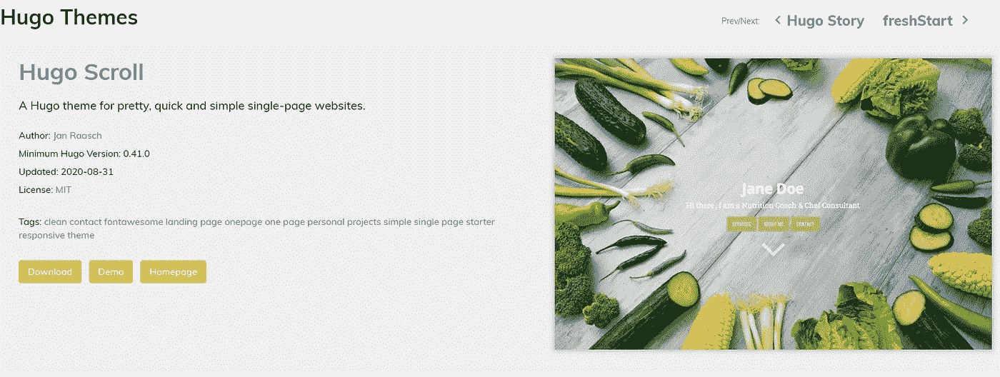

# 作为一个完全的初学者建立自己的网站:一本正经的指南

> 原文：<https://towardsdatascience.com/build-your-own-website-as-a-complete-beginner-no-nonsense-guide-45f6db28880f?source=collection_archive---------16----------------------->

## 如何使用 Hugo+Github+Netlify 免费构建一个静态站点并使用自定义域托管它的分步指南

图片由 [StartupStockPhotos](https://pixabay.com/users/StartupStockPhotos-690514/?utm_source=link-attribution&utm_medium=referral&utm_campaign=image&utm_content=849828) 来自 [Pixabay](https://pixabay.com/?utm_source=link-attribution&utm_medium=referral&utm_campaign=image&utm_content=849828)

**我一直想写博客，拥有自己的网站，我终于做到了！感觉真好！**

我从未想过自己会成为一名网络开发人员。老实说，web 开发本身及其背后的所有技术对我来说听起来很无聊。真正让我兴奋的是网站的设计部分。你如何做图形，互动，颜色，布局。你说吧。我认为一个网页设计师不仅应该精通技术，还应该是一个有创造性和艺术性的人，能够跳出框框思考:)

显然，我对 web 开发毫无头绪，从头开始学习 CSS、HTML 和 JS 的想法听起来也不太理想。我一直在谷歌上搜索，对所有的语言、平台和学习资源感到不知所措。如果你也有同样的感觉，不用担心。你并不孤单。相信我，你不必成为 HTML 和 CSS 专家就可以开始构建东西。一旦你知道了一些基本原理，你就可以边做边学了。

当你学习的时候，你可能不会从一个单一的来源学习， [Freecodecamp](https://www.youtube.com/watch?v=mU6anWqZJcc) 和 [Edureka](https://www.youtube.com/user/edurekaIN) 是初学者学习 css、js 和 Html 基础知识的好地方。你也可以在 Udemy 上找到 Edwin Diaz 的这个惊人的 CSS 和 HTML 免费课程。这些是我的最爱。

在本文中，我将向您展示如何使用 Hugo + Github + Netlify 的组合来构建和部署静态网站。

得到💬任何数据科学或编程问题的 GPT 式答案。为成千上万的人生成摘要和学习笔记📚只需一次点击即可获得学习资源。👉

 [## 面向数据科学家和开发人员的免费学习资源。精选的博客、教程、书籍和…

### 机器学习和人工智能工程师的培训课程、黑客马拉松、活动和工作

aigents.co](https://aigents.co/learn) 

# **什么是静态站点生成器？**

静态站点生成器是一个应用程序，它将使用 Markdown 语言编写的数据和内容应用到模板中，并以静态 Html 文件的形式生成页面视图，以便交付给访问者。应用程序本身可以用任何语言编写，例如，Ruby (Jekyll)、JavaScript 和 React (Gatsby)。我开始尝试盖茨比，因为它似乎有一个非常繁荣的社区。经过一个星期不断遇到 bug 和调试，我终于成功安装了盖茨比，下载了一个盖茨比网站的模板。然而，我最终决定使用 Hugo，这是一个用 go 编写的静态站点生成器，因为它非常用户友好，而且对我来说理解 go 并不是真正必要的。你可以在[这篇文章](https://www.freecodecamp.org/news/gatsby-vs-hugo-a-detailed-comparison-e78d94f640fc/)中找到盖茨比和雨果的详细比较。

好了，说够了。我们开始吧！

# 第一部分。用 Hugo 建立你的静态网站

**A .雨果装置**

**#1。安装巧克力**

要在你的 Windows 操作系统上安装 Hugo，你需要确保你安装了 Chocolately，这是一个用于 Windows 的软件包管理器。参见此处的说明[。](https://chocolatey.org/install)

**#2。安装 Hugo** 一旦安装了 Chocolately，打开您的终端，从那里，您可以简单地用下面的命令行安装 Hugo:

`choco install hugo -confirm`

对于 Mac 和 Linux 用户，请参见此处的安装指南。

太好了！现在你应该已经在你的系统上安装了 Hugo。让我们开始建立你的网站吧！

**B .建立你的网站**

**#1。生成 Hugo 网站**

接下来你需要做的是用 Hugo CLI 生成你的站点。打开您的终端，键入以下命令:

`hugo new site your_project_name`

将创建一个与您提供的名称(您的项目名称)相同的文件夹。您现在应该在 C:\ User \ Hugo \ Sites \ your _ project _ name 有一个目录。默认的文件夹结构如下所示:

以下是每个目录的高级概述:

**Config.toml**

这是 Hugo 站点的主要配置文件。在这里，您可以指定有关您的站点的信息，如站点标题和描述。查看配置文档了解更多细节。

**内容**

你的网站的内容，例如，你的博客文章和照片将存在于这个目录中。Hugo 中的每个文件夹都被视为一个内容部分。例如，如果您的网站有三个主要部分—博客、时尚和艺术—您将在内容目录中有三个子目录，包括博客、时尚和艺术。

**布局**

你可以为你的网站定义非常复杂的布局。你可以做很多事情。布局文件夹以。描述如何将内容视图呈现到静态网站中的 html 文件。

**静态**

这个目录存储所有的静态内容——不变的内容:比如 css 和 JavaScript。

**主题**

你可以下载一个预建的模板，并把它放在主题文件夹和 boom！你有你的网站。你当然可以按照你想要的方式来调整你的网站的主题。

**#2。让网站在本地运行**

在终端上的网站目录中，键入以下命令:`hugo server`

这个命令的作用是启动一个本地开发服务器，在你的机器上托管你的网站。

注意:如果您得到一个错误消息:错误:无法定位配置文件或配置目录。确保您位于包含 config.toml 文件的文件夹中。

现在，如果你打开浏览器: [http://localhost:1313/，](http://localhost:1313/,)你应该会看到你的网站。你会得到一个白页，因为服务器正在运行，但还没有主题/内容。

**#3。选择一个主题**

作为初学者，我发现拥有一个模板并使用结构良好和格式化的代码非常有帮助。你总是可以按照你想要的方式修改你的网站。Hugo 非常用户友好，它允许你使用预先构建的主题。去雨果的主题网站，有数百个主题可供选择。都是开源的。点击演示，你可以看到网站的样子，并选择你的选择之一。

比方说，你想安装 [hugo-scroll](https://themes.gohugo.io/theme/hugo-scroll/) 主题，从你的终端的 hugo 项目目录中，键入以下命令:

`git clone https://github.com/janraasch/hugo-scroll.git .\themes\hugo-scroll`

(注意:如果开发服务器仍在运行，您需要按 Ctrl-C 来杀死它，这样您就可以回到 Hugo 目录)

现在，您应该会在网站文件夹的主题目录中看到一个名为“hugo-scroll”的目录。

**#4。配置**

接下来我们需要告诉 Hugo 我们想使用新安装的主题。将下面一行添加到 config.toml 中:

`theme = “hugo-scroll”`

如果您现在查看本地主机上的网站，您会看到主题被直接应用。这是因为雨果跟踪所有需要建立您的网站的文件，将重建网站，并迫使网页在您的网页浏览器重新加载每当您编辑一个文件。

我相信你会想改变网站模板中的东西，例如，你的网站的名称！让我们在您的文本编辑器平台中再次进入 config.toml 文件，在我的例子中，我使用 Sublime。也可以使用 VisualStudio 之类的另一个平台。您可以添加网站的标题。

顺便说一句，请务必阅读许可文件。它基本上说的是，如果你在主题中做了任何改动，而你遇到了麻烦，那么创建主题的人不会对此负责。

***加入*** [***中等会员***](https://huonglanchu.medium.com/membership) ***计划继续无限制学习。如果你使用下面的链接，我会收到你的一部分会员费，不需要你额外付费。***

 [## 通过我的推荐链接加入媒体——蓝初

### 阅读兰楚的每一个故事(以及媒体上成千上万的其他作家)。你的会员费直接支持兰初…

huonglanchu.medium.com](https://huonglanchu.medium.com/membership) 

# 第二部分。用 GitHub 和 netlify 托管你的网站

**#1。找个地方存放你的代码**

你需要一个 GitHub 账户。如果您还没有创建，请在这里创建一个。接下来要做的是在 Github 上创建一个资源库。转到存储库并单击“新建”:

接下来，通过转到您网站的目录并键入以下命令来上传您的网站文件夹:

`git init`

`git add .`

`git commit –m “first commit”`

`git remote add origin <url_of_your_repository>`

`git push –u origin master`

到目前为止，您应该可以在 git 存储库中看到 website 文件夹中的所有子文件夹。

**#2。使用 Netlify** 部署您的网站

Netlify 是一个 web 开发平台，为 web 应用程序和静态网站提供托管和无服务器后端服务。Netlify 连接到你的 github 账户，通过你的 git 库，将所有代码复制到 Netlify。之后，它处理并发布网站。请遵循以下步骤:

第一步。创建一个网络账户

第二步。将您的 Netlify 帐户与 Github 帐户连接。

第三步。在 Netlify 上部署您的站点。

你可以在 [Netlify 的网站](https://www.netlify.com/blog/2016/09/29/a-step-by-step-guide-deploying-on-netlify/)上找到详细的说明。在这个过程之后，Netlify 将为您创建一个有趣的默认 url — random_name.netlify.app。我的名字是:深情-赫尔曼-8298bf。点击链接，看看你的网站现在是活的！祝贺你！

**#3。创建自定义域**

当然，你会希望有自己的域名，而不是一个有趣的来自 Netlify 的随机名称！在这篇[文章](https://dev.to/lost_semicolon/netlify-and-google-domains-hm)中，你可以找到为你的网站创建自定义域名的逐步指南。

# 更新您的网站

要更新您的网站，您可能需要在本地对您的网站进行更改。在将网站推送到 Git Repo 之前，您还可以在 [http://localhost:1313/](http://localhost:1313/) 运行以下命令来查看网站的外观:

`hugo server`

我惊讶地看到，在不到一秒钟的时间内，这些更改就在您的本地计算机上更新了！很酷吧？要将您的更改推送到您的网站，您首先需要使用以下命令添加更改、提交并将其推送到您的 Git 存储库:

`git add .`

`git commit -m "Updates website"`

`git push origin master`

Netlify 将立即检测到您推送到 git repo 的更改，并返回到 Netlify 站点部署新的更改，这将在几秒钟内发生！请看下面的快照，Netlify 在同一分钟内完成构建、处理和发布。

# 结论

一个 Hugo 模板并不能构建一个完美的网站。然而，作为一个初学者，你可以先建立一个基于模板的网站，然后在此基础上学习更多的 HTML、CSS 和 GO 技巧。一步一步来。熟能生巧。

我希望这有助于学习，并给你一些动力来建立自己的网站。我很乐意看看你的网站，一旦你完成建设。请在评论中告诉我。