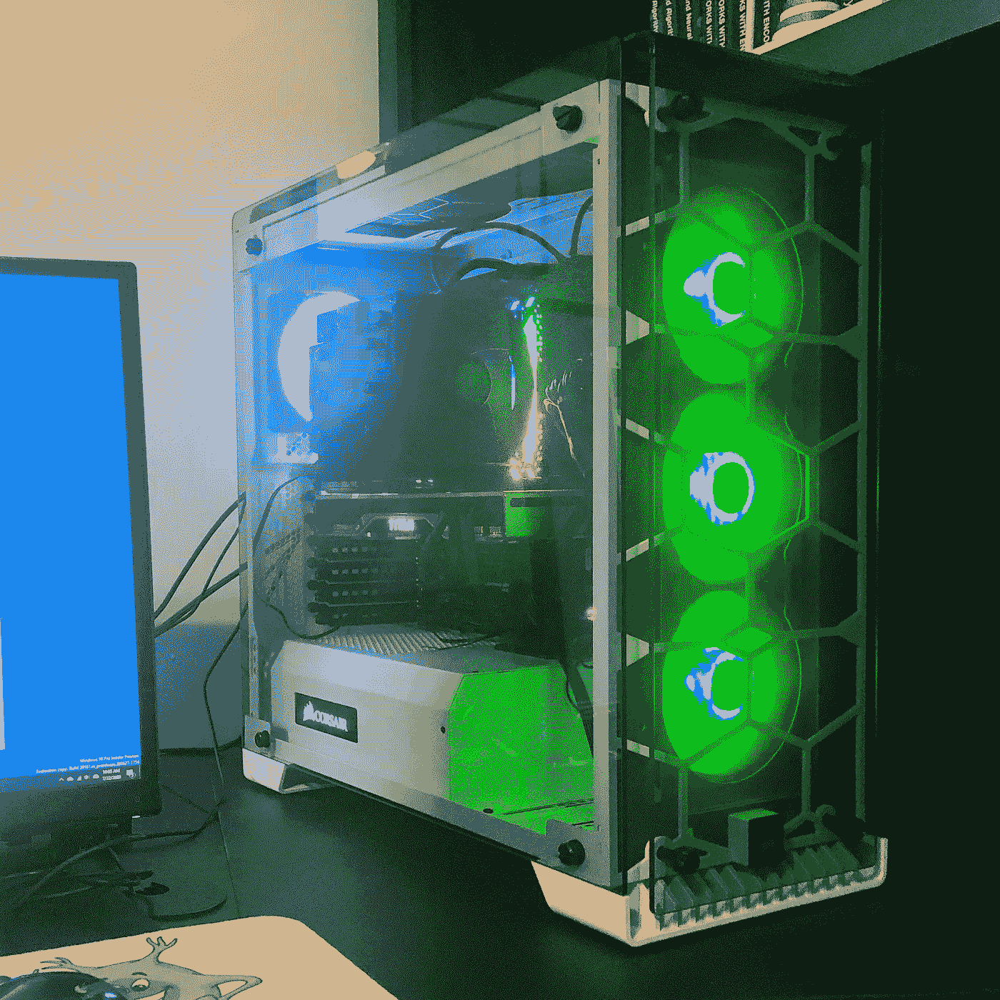
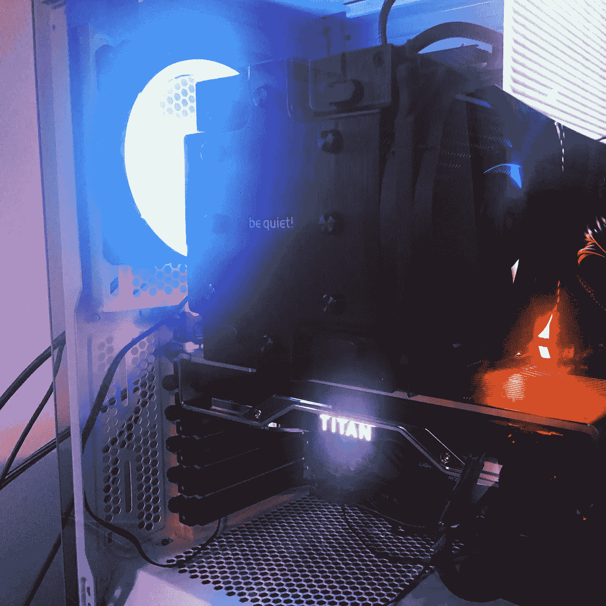

# 用英伟达泰坦 RTX 和 RYZEN ThreadRipper 构建一个价值 5000 美元的机器学习工作站

> 原文：<https://towardsdatascience.com/building-a-5-000-machine-learning-workstation-with-an-nvidia-titan-rtx-and-ryzen-threadripper-46c49383fdac?source=collection_archive---------6----------------------->

3.8 GHz、24 核、64 GB、基于泰坦 RTX 的机器学习工作站

不是每个人都适合制造电脑。在高端，建立一个机器可以节省资金，并允许您准确地指定您希望的硬件。此外，随着更高级的组件变得可用或更经济，自定义计算机版本允许您计划和执行增量升级路径。这篇文章描述了我如何在 5000 美元(USD，2020 年 7 月)的价格范围内构建一个机器学习工作站。我还提供了一些建议来提高或降低这个价格。

我将从描述我的用例开始。我处理的任务可能是 GPU 或 CPU 密集型的。有时，我确实希望有大量的 RAM 用于数据处理和暂存。对于超出这台机器能力的内存需求，我通常使用 Spark 或 Dask。因为这些需求，我在 CPU、RAM 和硬盘访问上花费了相当多的钱。因为我的处理需求最常见的瓶颈是神经网络训练，所以我选择了高端 GPU。

# 机器规格和零件清单

我构建的计算机是一个 3.8 GHz(4.5 GHz 的加速时钟速率)24 核 AMD ThreadRipper (3960X)，64GB 内存和一个[英伟达泰坦 RTX](https://nvda.ws/2OoXLG7) 。在我创造计算机的时候，NVIDIA TITAN GPU 是有意义的。在这一点上，我建议看看 NVIDIA 30 系列，如 3080。我将完整的零件清单发布给[电脑零件提货人](https://pcpartpicker.com/b/h6DxFT)。亮点包括:

*   [AMD thread ripper 3960 x 3.8 GHz 24 核处理器](https://www.amd.com/en/products/cpu/amd-ryzen-threadripper-3960x)
*   [英伟达泰坦 RTX 24 GB 显卡](https://nvda.ws/2OoXLG7)
*   [微星 TRX40 PRO WIFI ATX sTRX4 主板](https://www.msi.com/Motherboard/TRX40-PRO-WIFI)
*   [海盗船复仇 RGB Pro 64 GB(4x 16 GB)DDR 4–3200 CL16 内存](https://www.corsair.com/us/en/Categories/Products/Memory/Vengeance-PRO-RGB-Black/p/CMW64GX4M4C3200C16)
*   [Sabrent Rocket 4.0 2tb m . 2–2280 NVME 固态硬盘](https://www.sabrent.com/product/SB-ROCKET-NVMe4-2TB/2tb-rocket-nvme-pcie-4-0-m-2-2280-internal-ssd-maximum-performance-solid-state-drive/)
*   [Corsair RMx 1000 W 80+金牌认证全模块化 ATX 电源](https://www.corsair.com/us/en/Categories/Products/Power-Supply-Units/Power-Supply-Units-Advanced/RMx-Series/p/CP-9020094-NA)
*   [海盗船水晶 570X RGB ATX 中塔表壳](https://www.corsair.com/us/en/Categories/Products/Cases/570x-rgb-config/p/CC-9011098-WW)

硬盘足够快，程序加载非常快。此外，在内存和硬盘之间移动我的数据并不慢。我额外支付了更快的 RAM，希望加快 CPU 和 GPU RAM 之间的加载速度。进一步的基准测试将让我知道这有多好。

# 选择 GPU

GPU 是机器学习工作站的重要考虑因素。而机器学习工程师可能希望运行使用机器的图形潜力的复杂可视化；大多数现代 GPU 应该能够处理用户的图形需求。GPU 的数字处理能力是机器学习工作站的一个重要特征。对于游戏系统来说，应该在 AMD 和 NVIDIA 之间做出选择。对于机器学习，特别是深度学习，GPU 的选择真的只是英伟达。

[CUDA](https://developer.nvidia.com/cuda-zone) 或 [OpenCL](https://www.khronos.org/opencl/) 是允许 GPU 充当软件数学引擎的功能。TensorFlow、PyTorch 等常用 CUDA，需要和 NVIDIA。OpenCL 更加开放，支持来自英特尔、AMD 和 NVIDIA 的 GPU。然而，由于各种原因，主要是性能原因，CUDA 得到了最广泛的支持。还有，NVIDIA 主导了 AWS 和 Azure 的云平台。谷歌云平台(GCP)确实提供了一种叫做张量处理单元(TPU)的替代技术；然而，TPU 在本地系统上并不常见。出于这些原因，尤其是云兼容性，我坚持使用 NVIDIA 的 GPU 产品。

NVIDIA 为游戏应用程序提供 GeForce GPUs，为更多以计算为中心的任务提供 Quadro。弥合这一鸿沟的是泰坦卡，它提供的额外内存往往比游戏更有利于深度学习；同时仍然提供与其最高端游戏 GPU 一样多的 CUDA 内核。NVIDIA 非常友好地给我的 YouTube 频道[提供了一台泰坦 RTX。我决定，既然我得到了一个 2500 美元(2020 年 7 月)的 GPU，我就投资同样的金额，围绕这个神奇的 GPU 建立一个高级深度学习工作站。](https://www.youtube.com/user/HeatonResearch)

# 英特尔还是 AMD

我希望我的工作站足够灵活，能够为以 GPU 和 CPU 为中心的任务提供高性能。基于 GPU 的深度学习有多伟大；我确实发现自己在使用 CPU 繁重的任务进行数据预处理和一些可视化。另外，由于我经常用 Python 编写自动化任务的代码；我能够利用多核技术来设计我的软件。除非你正在制造一台计算机，否则你很少能直接选择英特尔或 AMD 就像你有时被允许从硬件制造商那里选择 CPU 类型。

在观看/阅读了相当数量的关于英特尔 vs AMD 现状的报道后；我得出了以下结论。AMD 提供更多核心；然而以稍微降低的时钟速度。所以 AMD 在多线程软件上效率会更高。英特尔将在并行性较低的软件上更加高效，这些软件受益于更大的单核速度优势。因为我的大部分软件是多线程的，我可以选择设计自己定制的多线程软件，所以我选择了 AMD。

我选了一个 24 核的 AMD RYZEN ThreadRipper，适配一个 TRX4 插座，这是目前 AMD 最新的插座类型。这意味着我以后可以轻松地将我的 CPU 升级到更高级的 AMD 产品。传统上，我一直使用英特尔。我在 AMD 遇到的唯一小麻烦是，有时我必须等待最新的“微软内幕”预发布 Windows 版本。

# 操作系统选择

对于这台电脑，我决定用 Windows 10 Pro。我对微软的 Linux 子系统(LSU)能力印象非常深刻；尤其是现在 Linux 子系统可以访问底层的 GPU。我刚刚开始使用 LSU-2，所以我对这个系统的看法还在发展中。我希望在后面的文章和视频中发布更多关于 LSU 的内容。

# 与云的成本比较

在构建这台机器之前，我将我的大部分 GPU 工作负载发送到了云。我最常见的任务要么是 [Kaggle](https://www.kaggle.com/jeffheaton) 竞赛，要么是为我在[华府大学](https://engineering.wustl.edu/Pages/home.aspx)的[深度学习课程](https://sites.wustl.edu/jeffheaton/t81-558/)重新运行和优化示例。这些工作负载的云成本并不小。为了将这台机器与 AWS 云进行比较，我使用了以下成本(截至 2020 年 7 月):

*   AWS 工作区:16 个 vCPU，122 GiB 内存，1 个 GPU，8 GiB 视频内存，每月 999.00 美元或每月 66.00 美元，每小时 11.62 美元。

上面引用的 AWS workspaces 实例比我的机器弱得多；然而，它是最接近的等效物。我有 24GB 的显存；而 AWS 机器只有 8 个。这可能需要对神经网络训练大小进行一些修改。此外，我有 24 个 CPU，而 AWS 上有 16 个，但 AWS 上的内存更多。在 999 美元/月，这是最有意义的重载，我会提前 5 个月出来。

如果你愿意围绕你的工作流程设计一些管道代码，并使用一些 AWS 专有技术，你可以通过使用 [SageMaker](https://aws.amazon.com/sagemaker/) 节省大量的 AWS 费用。我在这里不考虑 SageMaker 或 straight up EC2 实例，因为我正在寻找与我刚刚构建的系统最接近的桌面体验。

# 缩小比例

我敢肯定，阅读这篇文章的人都觉得我在这台机器上花了太多或太少。我曾经使用过基于特斯拉 V100 的先进系统，其造价是这台机器造价的 5 到 10 倍。如果你想少花钱，有很多选择。

其中最简单的就是审美。RGB 在系统构建者使用的组件中非常流行。你可以在下图中看到我的系统上的一些 RGB。不熟悉 RGB？任何发光的都是 RGB。

在计算机内部，发光的 RGB 组件

我是一个 Youtuber 用户，所以电脑是我“生活”中一个有趣的组成部分如果你打算把机器塞到桌子下面，买一个便宜但容易拿的箱子，不要用 RGB 组件。在这个构建的当前阶段，我在 RGB 方面有点失败。我有一个非常漂亮的 RGB RAM，被我真正有效的博格方块形状的“安静”冷却器所掩盖。不久的将来，我可能会把它换成液体 AIO 冷却器。

您可以缩减的零件:

*   **硬盘速度**:实际上，硬盘速度只是将数据加载到 RAM，一旦数据进入 RAM，硬盘速度就变得不那么重要了。
*   **RAM 速度**:较慢的 RAM 也能让你过关。可能反正大部分处理都是在 GPU 上完成的。
*   CPU:对于机器学习来说，内核越多越好。内核越少，性能越差。
*   **GPU** : CUDA 内核决定你的 GPU 训练速度。GPU 内存决定了您需要对批处理和网络结构进行多大程度的切割才能运行某些东西。你不一定需要一个泰坦 RTX。

# 已完成构建的 YouTube 视频

我在 YouTube 上制作了这台电脑的视频。我的侄子内森协助建造。你可以在这里看到这个视频。

展望未来，我现在期待着对这个 GPU 进行基准测试，并使用它为我的 GitHub 资源库和 YouTube 频道制作出色的示例。请考虑关注我，查看所有最新内容。