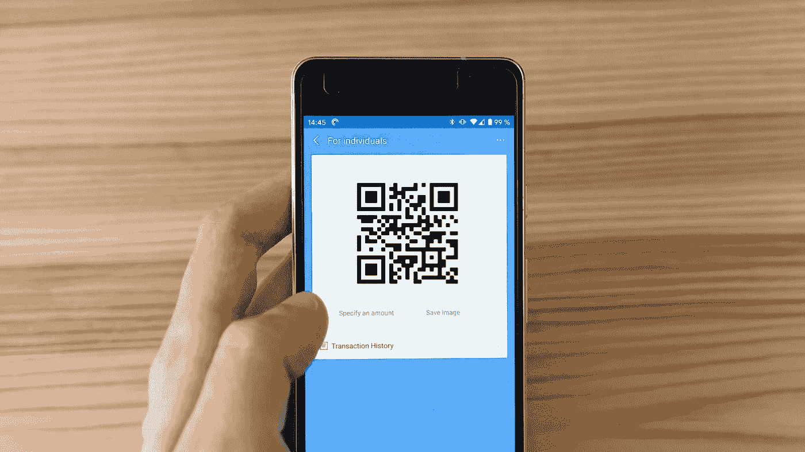

# 使用 Python 构建条形码/QR 码阅读器

> 原文：<https://towardsdatascience.com/building-a-barcode-qr-code-reader-using-python-360e22dfb6e5?source=collection_archive---------3----------------------->

## 使用 Pyzbar 库的简单且可实际操作的机器学习项目



马库斯·温克勒在 [Unsplash](https://unsplash.com/s/photos/barcode?utm_source=unsplash&utm_medium=referral&utm_content=creditCopyText) 上的照片

在这篇文章中，我将向你展示如何使用 Python 来构建一个条形码和二维码阅读器。这是一个很好的机器学习项目，可以从计算机视觉开始。在我以前的文章中，我展示了如何使用 python 来识别人脸和文本。这些都是锻炼你技能的好项目。今天，我们将介绍一些稍微不同的东西，那就是条形码和 QR 码阅读器。

我认为条形码/二维码非常酷和有趣，因为它们以不同的格式存储信息。有趣的是，在我们扫描它们之前，我们无法真正知道它们存储了什么。就像玩益智游戏一样。我喜欢它们的另一点是，它们可以成为现实世界的一部分，并且仍然将我们与互联网世界联系在一起。这不是很酷吗？

## 目录:

*   ***入门***
*   ***库***
*   ***解码功能***
*   ***主要功能***
*   ***视频演示***

[](/building-a-face-recognizer-in-python-7fd6630c6340) [## 用 Python 构建人脸识别器

### 使用 OpenCv 库进行实时人脸识别的分步指南

towardsdatascience.com](/building-a-face-recognizer-in-python-7fd6630c6340) 

# 入门指南

如果您想知道条形码和二维码阅读器是如何工作的，让我们做一个快速的实际练习。打开手机摄像头，显示这篇文章的特色图片。你会看到一个链接显示出来，这是非常简单的使用。今天，我们将创建我们自己的阅读器，马上开始吧！

我们将从安装这个项目所需的库开始，然后开始编程。对于这个项目，我建议使用常规的代码编辑器，而不是 Jupyter 笔记本。

# 图书馆

在这一步，我们将安装以下三个库:Pillow、OpenCV 和 Pyzbar。枕头库也被称为 PIL，代表 Python 图像库。OpenCV 是一个众所周知的库，尤其是在处理计算机视觉项目时。最后是 Pyzbar，它是一个 python 库，可以帮助我们读取条形码和二维码。让我们开始安装它们。

## 枕头

官方文件可以在这里找到。

```
pip install Pillow
```

## OpenCV

> OpenCV(开源计算机视觉库)是一个开源的计算机视觉和机器学习软件库。OpenCV 旨在为计算机视觉应用提供一个公共基础设施，并加速机器感知在商业产品中的应用。
> 
> 参考:【https://opencv.org 

```
pip install opencv-python
```

## 皮兹巴尔

Pyzbar 库的安装因您使用的计算机而异。我将显示 Mac OS 和 Windows 安装行。你也可以从 Pyzbar 的官方文档[页面](https://pypi.org/project/pyzbar/)了解更多。

```
# Mac OS version
brew install zbar# Windows OS version
pip install pyzbar
```

# 解码功能

在这一步，我们编写解码函数，大部分酷的事情将在这里发生。解码功能将主要做三件事，可列举如下:

*   识别和解码我们将展示给摄像机的条形码/QR 码。
*   将存储的信息作为文本添加到识别的条形码/QR 码上。
*   最后，将存储的信息导出为文本文档。

让我们在写入函数之前导入我们安装的库:

```
#import librariesimport cv2
from pyzbar import pyzbar
```

现在，让我们写函数。我不会一部分一部分地添加，而是将整个功能分享给你。因为在用 python 编写时缩进很重要，所以我不想通过破坏代码的结构来打乱事情。我将在代码下面添加我的注释。

```
def read_barcodes(frame):
    barcodes = pyzbar.decode(frame)
    for barcode in barcodes:
        x, y , w, h = barcode.rect #1
        barcode_info = barcode.data.decode('utf-8')
        cv2.rectangle(frame, (x, y),(x+w, y+h), (0, 255, 0), 2)

        #2
        font = cv2.FONT_HERSHEY_DUPLEX
        cv2.putText(frame, barcode_info, (x + 6, y - 6), font, 2.0, (255, 255, 255), 1) #3
        with open("barcode_result.txt", mode ='w') as file:
            file.write("Recognized Barcode:" + barcode_info) return frame
```

**了解功能:**

*   首先，我们从条形码或 QR 码中解码信息。然后在它周围画一个矩形。这有助于我们了解我们的机器是否检测到条形码/二维码。
*   其次，我们在创建的矩形上添加文本。文本将显示解码的信息。
*   第三，我们将信息导出到文本文档中。如果您计划使用多个条形码或 QR 码进行测试，我建议您更改文档名称，否则它会被覆盖。

# 主要功能

在这一步中，我们将编写主函数，其中应用程序被提示工作。main 函数将打开计算机的摄像机，然后调用解码函数。代码如下:

```
def main(): #1
    camera = cv2.VideoCapture(0)
    ret, frame = camera.read() #2
    while ret:
        ret, frame = camera.read()
        frame = read_barcodes(frame)
        cv2.imshow('Barcode/QR code reader', frame)
        if cv2.waitKey(1) & 0xFF == 27:
            break #3
    camera.release()
    cv2.destroyAllWindows()#4
if __name__ == '__main__':
    main()
```

**了解功能:**

*   首先，我们使用 OpenCV 打开计算机的摄像头。如果您有一个外部摄像头，您必须根据设备将值 0 更改为 1。
*   其次，我们运行一个 while 循环来继续运行解码功能，直到按下“Esc”键。否则，循环将不会停止并导致一些问题。
*   第三，我们正在释放我们在第一步中打开的摄像机。然后我们将关闭应用程序窗口。OpenCV 正在做所有的工作，我们只需要调用方法。
*   最后，我们调用*主函数*来触发程序。

完美！我们已经完成了编程部分。让我给你看一个快速演示，看看我们运行程序时它是如何工作的。

# 视频演示

测试程序

[](https://lifexplorer.medium.com/membership) [## 加入我的介绍链接媒体-贝希克居文

### 作为一个媒体会员，你的会员费的一部分会给你阅读的作家，你可以完全接触到每一个故事…

lifexplorer.medium.com](https://lifexplorer.medium.com/membership) 

恭喜你。！您已经创建了一个程序，可以为您读取条形码和 QR 码。现在，你已经知道如何在现实生活中使用计算机视觉和人工智能。从事像这样的动手编程项目是提高编码技能的最好方式。如果你今天学到了新东西，我会很高兴。

如果您在执行代码时有任何问题，请随时[联系我](https://sonsuzdesign.blog/)。

> 关注我的[博客](https://medium.com/@lifexplorer)和 [youtube 频道](http://youtube.com/behicguven)以获得灵感。谢谢你，