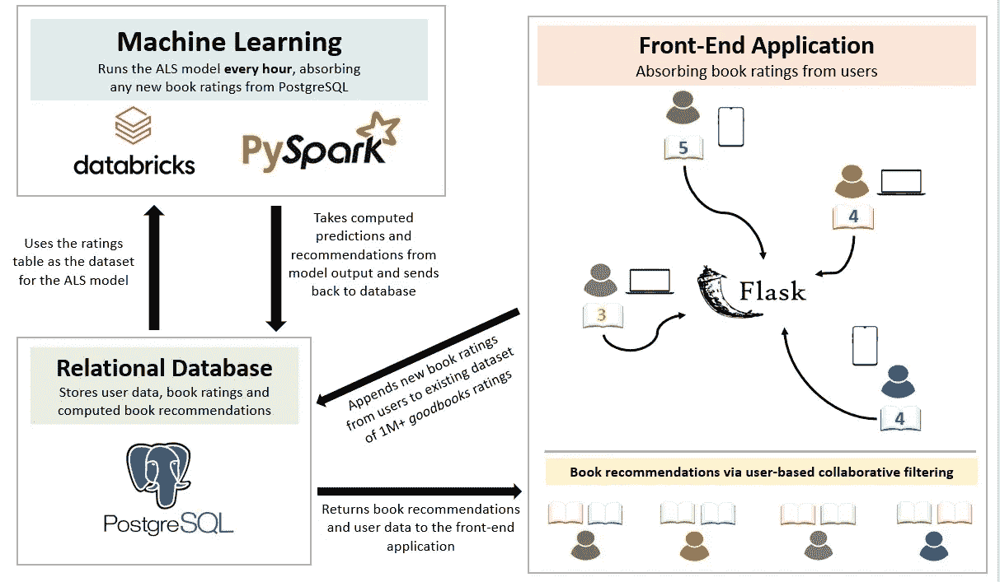
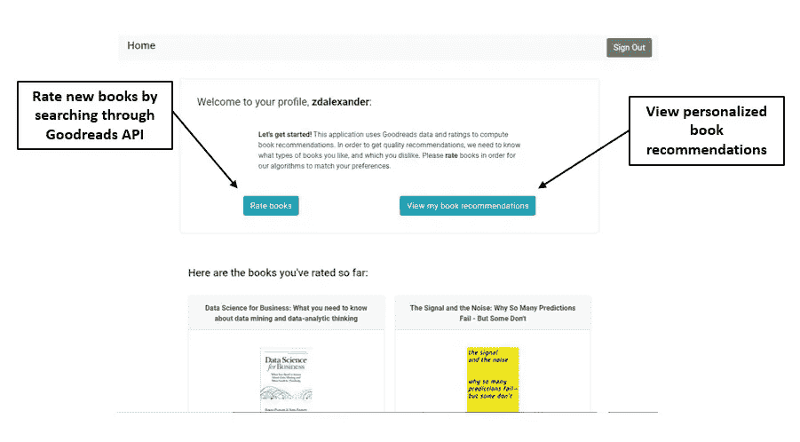
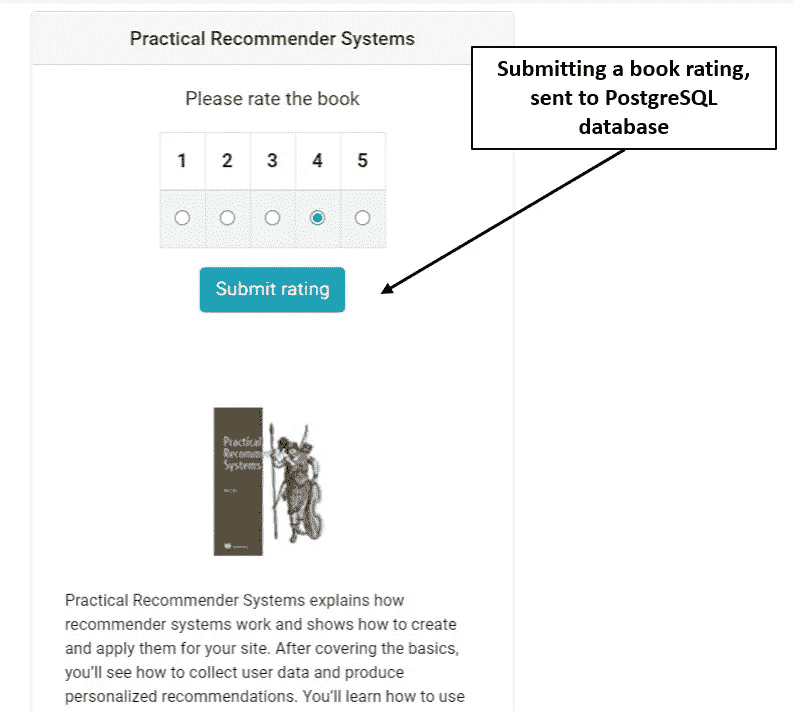
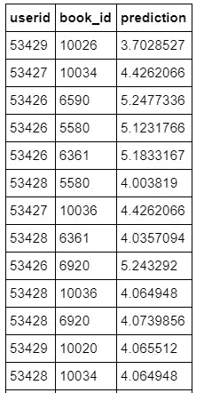
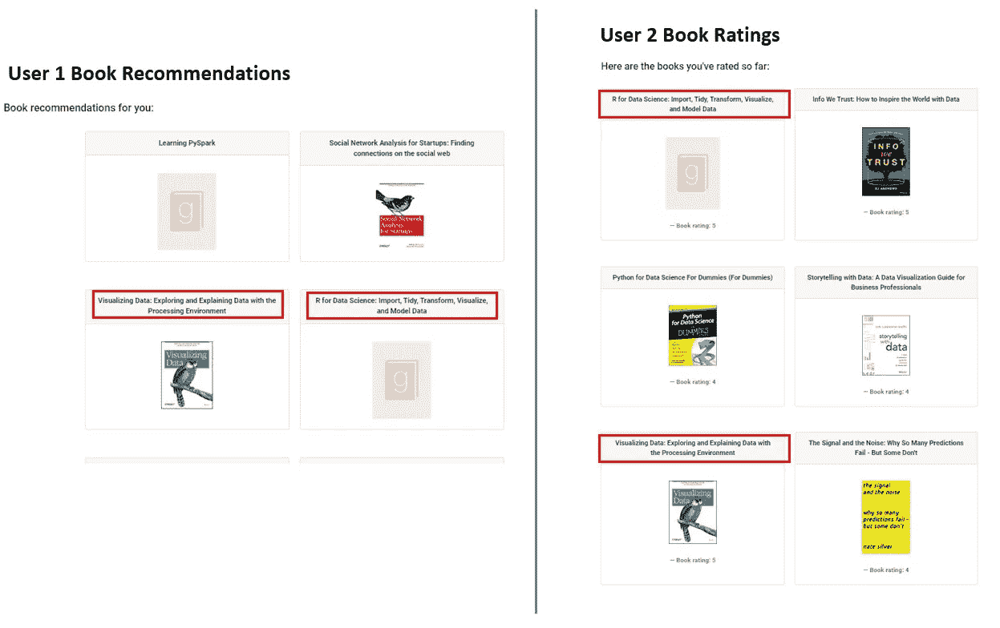

# 从头开始构建图书推荐引擎并将其部署到 Web 应用程序中

> 原文：<https://towardsdatascience.com/building-a-book-recommender-engine-from-scratch-and-deploying-it-to-a-web-application-eea029c4c1fb?source=collection_archive---------9----------------------->

## 概述了在完全部署的 web 应用程序中使用 Spark、Databricks 和 Flask 的分布式计算构建图书推荐系统的过程。


照片由[思想目录](https://unsplash.com/@thoughtcatalog?utm_source=unsplash&utm_medium=referral&utm_content=creditCopyText)在 [Unsplash](https://unsplash.com/s/photos/books?utm_source=unsplash&utm_medium=referral&utm_content=creditCopyText) 上拍摄

不管我们喜不喜欢，电子商务系统正在渗透我们生活的方方面面。从你的**网飞**个人资料上的*标题下的一长串节目和电影，到 **Spotify** 上的*为你制作的*歌曲列表，我们已经进入了一个内容、媒体和信息都是根据我们独特的兴趣定制的时代。*

虽然这可能是常识，但可能不太明显的是在幕后发生了什么来向用户提供这些推荐。我们经常听说“算法”和“机器学习”构成了这些系统的主干，但除此之外，我们通常将其余部分留给想象。

最近在研究生院上了一堂推荐系统课后，我开始钻研这些引擎背后的线性代数和软件。在课程的最后两周，我觉得我已经有足够的知识来构建一个完整的生产 web 应用程序，利用 [**PySpark 的分布式计算能力**](https://spark.apache.org/docs/latest/api/python/index.html) 、 [**PostgreSQL**](https://www.postgresql.org/) 、 [**Databricks**](https://databricks.com/) 和 [**Flask**](https://flask.palletsprojects.com/en/1.1.x/) 向用户推荐书籍。

如果对改编项目感兴趣，可以在我的 [**GitHub**](https://github.com/zachalexander/book-recommender) 上找到代码，并且可以在单独的 repo 中找到我的最终项目的描述，包括探索性分析和 ALS 算法在生产中的示例[。](https://github.com/zachalexander/data612_cuny/blob/master/FinalProject/DATA%20612%20-%20Final%20Project.ipynb)

我也在这篇文章的末尾添加了网络应用程序链接，但是如果你想创建一个帐户，并开始对书籍进行评级/接收书籍推荐，你可以在这里加入:[**https://zach-book-recommender.herokuapp.com/**](https://zach-book-recommender.herokuapp.com/)**。**

## **推荐系统如何工作？**

现在，在我们看一看我自己的引擎之前，提供一些关于这些系统的总体主题的背景可能是有帮助的。在非常基本的层面上，推荐系统通过机器学习算法来运行。通常，这些算法可以分为两类——基于内容的和协同过滤。

**基于内容的方法**测量项目属性的相似性，并根据用户以前的行为或明确的反馈(即通过调查或评级)重点推荐与用户喜欢的类似的其他项目。

尽管基于内容的方法在某些情况下非常有效，但它们也有缺点。**协同过滤方法**操作方式不同，尽最大努力解决基于内容过滤的一些局限性。通过协同过滤，算法同时使用用户和项目之间的相似性来提供推荐。本质上，底层模型被设计为基于相似用户 b 的兴趣向用户 A 推荐一个项目

## 降维和矩阵分解

协同过滤可以通过多种方式实现，然而，一种常见的方法是使用矩阵分解和维度缩减技术。交替最小二乘法(ALS)、奇异值分解(SVD)和随机梯度下降(SGD)等算法在这方面做得很好，当处理大量数据(即 1M 以上的数据点)时，这些算法与分布式计算和并行处理相结合，是构建具有大量数据的生产就绪型应用的良好解决方案。

如果您有兴趣了解更多关于这些技术的知识，我推荐您阅读这些优秀的 TDS 文章:

*   **为** [**交替最小二乘**](/alternating-least-square-for-implicit-dataset-with-code-8e7999277f4b)
*   **为** [**奇异值分解**](/understanding-singular-value-decomposition-and-its-application-in-data-science-388a54be95d)
*   **为** [**随机梯度下降(SGD)**](/stochastic-gradient-descent-clearly-explained-53d239905d31)

有了这些算法如何工作的一些基本知识，我将投入到我自己的项目中，使用 ALS 向用户提供图书推荐。

## 我的应用程序如何工作

在深入构建应用程序的每个组件之前，我将概述它如何工作的总体流程，以及在 Flask web 应用程序中向用户提供推荐所使用的技术:



将我的 Flask 应用程序与 PostgreSQL 和 Databricks 集成，每小时运行一次我的 ALS 模型，向用户提供图书推荐|作者图片

正如我们所看到的，这是一个非常复杂的系统，它严重依赖 Spark 中的分布式计算来处理大约 100 万本书的评级，并每小时为用户计算更新的推荐。它还依赖于部署的 PostgreSQL 数据库和包含我的 ALS 算法的 Amazon Web Services 集群之间的重要连接。

有了上面建立的总流程，我们现在可以分解构建引擎的每个步骤。

## 识别用于最大似然计算的高质量用户项目数据集

作为第一步，必须找到一个大的用户手册数据集，它将与我选择的算法很好地配合，并将向用户提供可靠的预测和建议。

所以我做了一些探索性的分析，决定用**g**[**oodbooks-10k dataset**](https://www.kaggle.com/zygmunt/goodbooks-10k)**。**根据 Kaggle 的说法，这个数据集包含了一个流行图书平台 [**Goodreads**](https://www.goodreads.com/) 上的 1 万本不同书籍的近 100 万个评分。有了这个数据集，我注意到了一些事情:

*   该数据集包含总共 **53，425 个用户**，他们为至少 10 本书提供了**评级。**
*   图书的平均评分约为 3.85 分，在李克特量表 1 到 5 分中，4 分是最常见的。因此，大多数评级都相当正面。
*   正如所料，数据集非常稀疏( **~99.82%的评级文件为空白**)。
*   数据集中一些最受好评的书籍是家喻户晓的，包括部分**卡尔文和何拔斯的收藏**、**哈利波特**，以及一些带有宗教原则的**书籍**。

要考察一些这种探索性的分析，你可以去 [**本 jupyter 笔记本**](https://github.com/zachalexander/data612_cuny/blob/master/FinalProject/DATA%20612%20-%20Final%20Project.ipynb) 。

## **构建和部署网络应用**

接下来，在做了一些探索性分析之后，我决定构建一个简单的 [**python Flask 应用程序**](https://github.com/zachalexander/book-recommender) ，以便允许新用户做以下事情:

*   **使用特定用户名注册/登录**
*   加载一个**个人资料页面**，该页面显示用户已评级书籍的历史记录，并提供导航以对更多书籍进行评级或查看推荐书籍(参见下面的示例):



图书推荐者个人资料页面|作者图片

*   加入一个**搜索功能**，它与 [**Goodreads API**](https://www.goodreads.com/api) 交互，允许用户按书名搜索一本书，然后在 1-5 的范围内给这本书打分(见下面的例子):



在 web 应用程序|作者图片中提交评级

*   在对几本书进行评级后，用户可以在单独的页面上看到他们的个性化推荐(将在本文后面显示)。

值得注意的是，这些来自应用程序的用户评级随后被合并回稳健的 goodbooks 数据集，并最终合并到 ALS 算法中。通过建立 PostgreSQL 数据库，我能够将新的用户 id、他们的评级和图书 id 与这个原始数据集进行匹配。因此，每当一个新的评级来自一个用户，它就被附加到我后来用于推荐引擎的评级数据集中。

在本地做了大量测试以确保图书 id 和用户 id 在数据库中匹配之后，我用 [**Heroku**](https://dashboard.heroku.com/apps) 部署了应用程序。

## 用于 Flask 和 PostgreSQL 部署的资源

关于如何使用 Heroku 部署 Flask 应用程序和相应的 PostgreSQL 数据库的说明，您可以 [**参考这个非常有用的 YouTube 教程**](https://www.youtube.com/watch?v=w25ea_I89iM) **，作者是 Brad Traversy** 。使用 Heroku 部署的细节也可以在这个 中找到 [**。**](/building-and-deploying-a-login-system-backend-using-flask-sqlalchemy-and-heroku-8b2aa6cc9ec3)

## **使用 Databricks 和 PySpark —开发我的 ALS 算法**

随着应用程序功能的设置和部署，我使用 Databricks 和 Pyspark 构建了一个交替最小二乘(ALS)算法，该算法从我的 PostgreSQL 数据库中吸收我的评分数据集，根据 Databricks 中建立的矩阵分解技术计算更新的预测，然后根据每个用户的最高预测分数向每个用户推荐图书。

下面的一小段代码概述了这一过程:

首先，在从 PostgreSQL 读取 ratings 表之前，我为 Spark 数据帧设置了一个模式:

```
**from** **pyspark.sql.types** **import** StructType, StructField
**from** **pyspark.sql.types** **import** DoubleType, IntegerType, StringType

ratings_schema = StructType([
  StructField("col_id", IntegerType()),
  StructField("userid", IntegerType()),
  StructField("rating", DoubleType()),
  StructField("book_id", IntegerType()),
  StructField("username", StringType()),
  StructField("isbn10", StringType())
])
```

然后，在设置了我们的环境变量和到我的远程 PostgreSQL 数据库的 JDBC 连接之后，我读入表并将其保存为 Spark 数据帧:

```
remote_table = spark.read.format("jdbc")\
  .option("driver", driver)\
  .option("inferSchema", ratings_schema) \
  .option("url", url)\
  .option("dbtable", table)\
  .option("user", user)\
  .option("password", password)\
  .load()
```

将 Spark 数据帧加载到 Databricks 后，我开始设置数据来运行我的 ALS 模型。首先，我将数据框架分成训练、验证和测试数据集——60%训练，20%验证和 20%测试。验证数据集用于测试我的模型参数的微调，并允许我有一个保留测试集，用于计算最终优化模型的均方根误差(RMSE)。

```
(training, validation, test) = remote_table.randomSplit([0.6, 0.2, 0.2]) *# caching data to cut down on cross-validation time later* training.cache() 
validation.cache() 
test.cache()
```

通过数据分割，我对模型进行了一些微调，以确定最佳参数。然后，我用这些最佳参数运行 ALS 模型，并将其拟合到训练数据集。

```
als = ALS(maxIter=10, regParam=0.20, userCol="userid", itemCol="book_id", ratingCol="rating", coldStartStrategy="drop", nonnegative = **True**, implicitPrefs = **False**).setRank(50)model = als.fit(training)
```

您会注意到，我将矩阵的秩设置为 50，这减少了处理时间，并且仍然产生有价值的预测。然后，我能够使用这个模型来计算测试数据集的预测，并确定 RMSE 值。

```
predictions = model.transform(test)
rmse = evaluator.evaluate(predictions)
```

最后，我能够得到大约 0.9 的 **RMSE 值**，这对于我们的目的和 1-5 的李克特量表来说，还不算太差。然后，我能够使用该模型为完整的评级数据集生成预测和建议。为此，我使用 PySpark 中的`recommendForAllUsers()`函数，为每个用户找到 10 本评分最高的书。

```
ALS_recommendations = model.recommendForAllUsers(numItems = 10)*# Temporary table* ALS_recommendations.registerTempTable("ALS_recs_temp") clean_recs = spark.sql("""SELECT userid,                             bookIds_and_ratings.book_id AS book_id,                             bookIds_and_ratings.rating AS prediction                         FROM ALS_recs_temp LATERAL VIEW explode(recommendations) exploded_table AS bookIds_and_ratings""")clean_recs.join(remote_table, ["userid", "book_id"], "left").filter(remote_table.rating.isNull()).show()

clean_recs_filtered = clean_recs.select("userid", "book_id", "prediction")
```

在创建了一个临时表来重定向推荐之后，我希望确保用户在应用程序中评价(并隐式阅读)的书籍不会在应用程序中被推荐给他们。因此，我做了一些额外的清理，只向用户推荐新书:

```
new_books = (clean_recs_filtered.join(remote_table, ["userid", "book_id"], "left").filter(remote_table.rating.isNull()))
```

最后一步，我只确定了通过我的应用程序注册的用户 id，以便将推荐附加回 PostgreSQL 数据库。因为最初的 goodbooks 数据集中有如此大量的预测和评级会返回到不存在的用户，所以我过滤了这些数据，只包括对通过 web 应用程序加入的用户的推荐:

```
new_books_fnl = new_books.select('userid', 'book_id', 'prediction')

new_books_users = new_books_fnl.filter(new_books_fnl['userid'] > 53424)

new_books_use = new_books_users.select('userid', 'book_id', 'prediction')
```

下面是一个向加入 web 应用程序的用户反馈建议的示例:



将在 web 应用程序|作者图片中推荐给用户的图书快照

我们现在在 web 应用程序中为用户提供了推荐！

正如我们所看到的，一些预测并不是很好——例如，表中的第一个用户将收到一本书，该算法预测他们的评分约为 3.5/4。理想情况下，我们希望找到用户真正喜欢的书(不考虑意外收获、新奇感等因素)。).所以，有了更多的时间和更广泛的用户基础，我希望看到预测评分更高的推荐书籍。

随着模型在 Databricks 中本地工作，我能够上传这个优化的模型并将其部署到 Amazon Web Services 集群，每小时运行一次 cronjob 来处理任何吸收到我的 PostgreSQL 数据库中的新评级。每小时一次的 cronjob 基本上会重新运行模型，重新计算预测和建议，然后用更新后的建议覆盖我的 PostgreSQL 中的建议表。然后，它会连接回我的 Flask 应用程序，为用户提供服务。**关于 AWS 和数据块**、[、**的部署说明，你可以在这里**、](https://docs.databricks.com/clusters/configure.html)找到一些文档。

我的 PostgreSQL 中的推荐表用我的推荐和它们对应的图书 id 更新后，我就可以利用 Goodreads API 来查找图书信息(例如图片、书名等)。)来构建前端应用程序。

## 那么，它的效果如何呢？

最后，我做了一些测试，注意到这些推荐并不太糟糕！例如，我创建了一些狂热的数据科学用户，并对许多数据科学书籍进行了评级。我有意让不同用户对书籍的评价有所重叠，但也试图为每个用户评价几本新书。

当我运行我的模型来提供推荐时，我很高兴地看到，没有被一个数据科学狂热者评级的书籍被推荐给了另一个数据科学狂热者的正面评级，这表明我的协作过滤技术正在起作用。请参见下面的示例:



一些数据科学读者的推荐页面示例|作者图片

正如我们从红色方框中的标题可以看到的，用户 2 对这两本书的评价非常高(评分为 5)。因此，当运行我们的机器学习算法时，用户 1 和用户 2 的书籍评级之间存在一些重叠——这意味着没有被用户 1 评级(并且隐含地没有被阅读)但被用户 2 评级很高的书籍被作为推荐给用户 1。

## 自己试试吧！

要尝试这个应用程序，请点击这里:[**https://zach-book-recommender.herokuapp.com/**](https://zach-book-recommender.herokuapp.com/)

尽管数据科学书籍的推荐看起来确实非常有效，但在其他类型和主题方面存在很大差距。您可能会注意到，您的推荐还会从 goodbooks-10k 数据集中引入其他评价非常高的书籍(例如卡尔文和霍布斯等)。)，直到有更多和你口味相似的用户加入 app。因此，我建议与朋友分享，看看随着时间的推移，你的建议是否会越来越好！

## 连接

如果你喜欢这篇文章，或者觉得它有帮助，请联系我们！我喜欢在项目上与其他人合作，并向对数据科学工作充满热情的同行学习。

你也可以看看我的数据可视化作品集[](https://zach-alexander.com/)**，在那里我主要使用 Javascript 和 D3.js，并谈谈我在研究生院完成的其他项目。**