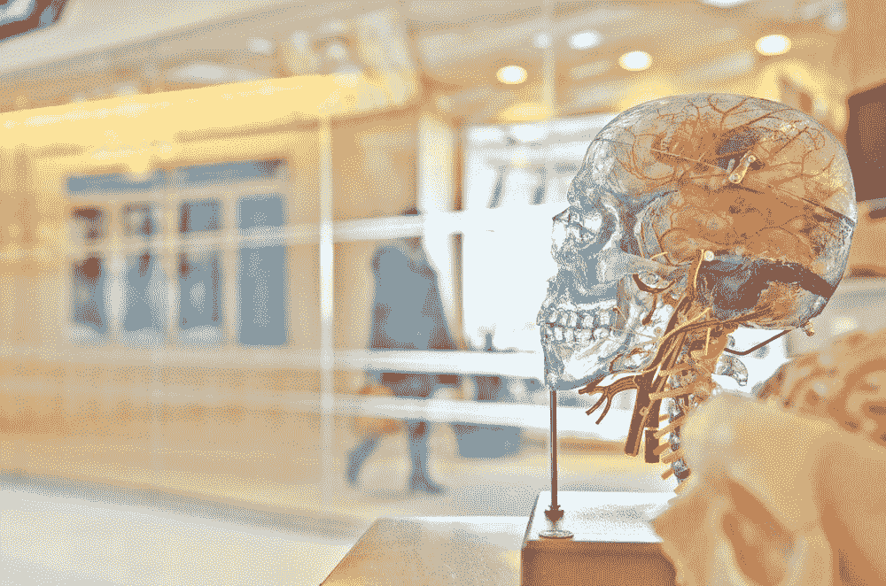
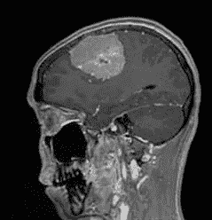

# 构建脑瘤分类应用程序

> 原文：<https://towardsdatascience.com/building-a-brain-tumor-classification-app-e9a0eb9f068?source=collection_archive---------25----------------------->

## 一个真正的机器学习应用程序，从零开始，使用 Dash



来源:https://unsplash.com/photos/rmWtVQN5RzU

在下面的文章中，我将展示一个我从零开始创建的机器学习应用程序。

## 1.目标

我想建立的是一个应用程序，它可以将大脑核磁共振图像作为输入。从那里，应用程序将返回一个预测，说图像上是否有肿瘤。

我发现这个想法很有趣，因为任何人都可以使用这个应用程序来确定是否存在脑瘤。不需要编码技能或关于大脑的知识。

为了实现这一目标，需要完成三个步骤，即创建预测图像类别的模型、创建应用程序以及最后部署应用程序本身。

## 2.构建卷积神经网络模型

CNN 是一类深度神经网络，通常用于分析视觉内容，这正是我在这里想要做的。

我用来建立 CNN 的数据来自这里的。

它包含 3264 幅脑 MRI 图像(2880 幅训练图像和 384 幅测试图像)，分为 4 类:神经胶质瘤肿瘤、脑膜瘤肿瘤、垂体肿瘤和无肿瘤。

我用 Keras 建立模型。对于那些不知道的人，Keras 是一个运行在 Tensorflow 之上的高级 Python 神经网络库。其简单的架构、可读性和整体易用性使其成为使用 Python 进行深度学习时最受欢迎的库之一。

在为 CNN 导入并准备好图像后，我最终构建了以下模型。

```
model = Sequential()model.add(Conv2D(32, (3, 3), input_shape=(150,150,3), use_bias=False))
model.add(Activation('relu'))
model.add(BatchNormalization())
model.add(MaxPooling2D(pool_size=(2, 2)))
model.add(Conv2D(32, (3, 3))) 
model.add(Activation('relu'))
model.add(BatchNormalization())
model.add(MaxPooling2D(pool_size=(2, 2)))
model.add(Dropout(0.25))
model.add(Flatten())
model.add(Dense(64))
model.add(Activation('relu'))
model.add(Dropout(0.25))
model.add(Dense(4))
model.add(Activation('softmax'))model.compile(loss = "categorical_crossentropy", optimizer=keras.optimizers.Adam(learning_rate=0.001), metrics=['accuracy'])
```

我把模型保持得非常简单。它只有两个卷积层，最末端的 softmax 层将返回 MRI 属于 4 类的概率。

然后我根据数据训练这个模型。

```
history = model.fit(trainData, trainLabel,batch_size = 128, epochs = 30 ,validation_data=(testData, testLabel))
```

这个只有 30 个历元的简单模型达到了大约 81%的准确率。那意思很明显，不要把这个 app 当做绝对真理，听医生的！

然后，通过保存模型，这意味着它可以很容易地在 Dash 应用程序中用于预测新图像。

```
model.save('model_final.h5')
```

现在这一部分已经完成，让我们继续使用 Dash 创建应用程序。

## 3.创建应用程序

我使用 Dash 来创建应用程序。该平台允许我们开发高质量的企业级分析应用，而不需要开发人员、JavaScript 或除了基本 Python 技能之外的任何东西。

关于如何构建 Dash 应用的完整教程，请点击[这里](/how-to-build-a-web-based-app-in-50-lines-of-code-using-plotly-and-dash-3953f039b217)。

我做的第一件事是导入运行 dash 应用程序和 keras 模型所需的所有包。之后，就可以构建应用程序了。这是它的完整代码。

那是相当长的，所以让我们检查一些事情。首先，`names`函数的作用是根据模型的预测，给出一个特定的输出(即肿瘤的名称)。

现在，让我们来复习一下回调。它接受一个图像作为输入，即 html。来自`parse_contents`函数的 Img 标签。`list_of_contents[0]`意味着只有上传的第一张图片会被使用(所以上传多张图片是没有意义的)。

然后，以下代码获取 Dash 以 base64 字符串编码的图像，并使其可用于 CNN:

```
 img_data = list_of_contents[0]
  img_data = re.sub('data:image/jpeg;base64,', '', img_data)
  img_data = base64.b64decode(img_data)  
  stream = io.BytesIO(img_data)
  img_pil = Image.open(stream)
```

然后，用`load_model`函数加载之前创建的模型，将图像转换成具有正确形状的 numpy 数组，并用`answ = model.predict(x)`进行预测。这里的好处是，你可以创建任何你想要的 CNN 模型并加载它，应用程序仍然可以工作！

然后，根据该预测，给出关于图像上没有肿瘤的可能性和关于肿瘤的一些事实的第二个预测。

最后，返回 4 个输出(图像、两个预测和事实)，从而结束长时间的回调。

## **4。Heroku** 的部署

随着应用程序的创建，是时候让每个人都可以使用它了。Dash 应用程序可以部署在 Heroku 上，这是一个云应用程序平台，允许您完全免费运行您的应用程序。

要了解如何在 Heroku 上部署 Dash 应用程序，请点击右[此处](/how-to-deploy-your-dash-app-with-heroku-a4ecd25a6205)。

这款应用就在这里:[https://brain-mri-app.herokuapp.com/](https://brain-mri-app.herokuapp.com/)。只是提醒一下，加载应用程序可能需要一段时间。这是因为它会在一段时间后进入睡眠状态(这是 Heroku 免费版的少数不便之处之一)。

这里有一个简短的 GIF 展示了该应用程序应该如何使用。正如您将看到的，这非常简单:

你可以用任何健康大脑的 MRI 图像，或者有神经胶质瘤、脑膜瘤或垂体瘤的大脑图像来尝试。例如，这是一张脑膜瘤的图像，你可以用它来预测。



感谢阅读，我希望你觉得这篇文章有趣！

所有的代码都可以在这个库中找到:[https://github . com/francoistamant/brain-tumor-classifier-app](https://github.com/francoisstamant/brain-tumor-classifier-app)