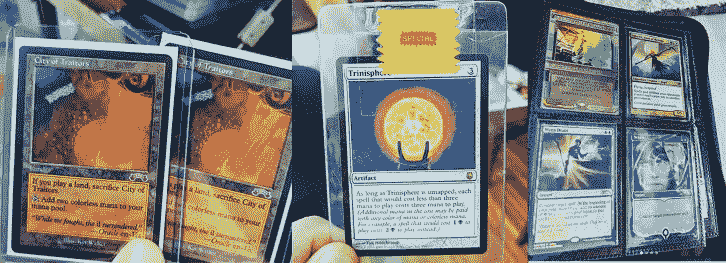
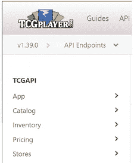
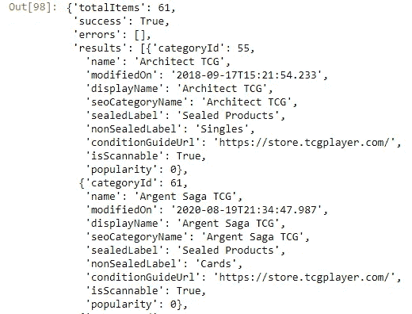
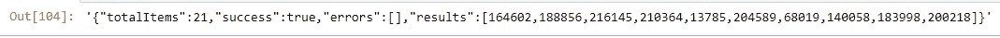
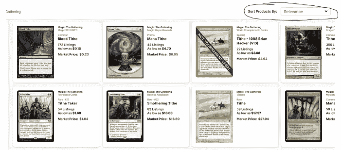
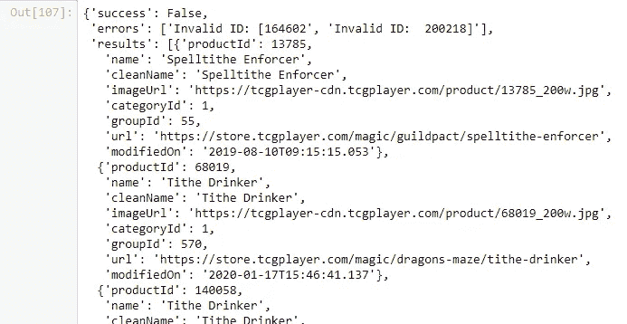

# 构建纸板帝国:使用 Python 介绍 TCGplayer API

> 原文：<https://towardsdatascience.com/building-a-cardboard-empire-introduction-to-the-tcgplayer-api-using-python-fbfc2d62ef51?source=collection_archive---------19----------------------->

## 如何使用 Python 连接到 TCGplayer.com API


韦恩·洛在 [Unsplash](https://unsplash.com?utm_source=medium&utm_medium=referral) 上的照片

# 纸板的生活

我几乎一生都在玩纸牌游戏，并在 90 年代中期大约在二年级的时候开始玩[魔法:聚会(MTG)](https://en.wikipedia.org/wiki/Magic:_The_Gathering) 。虽然这不是一个让我受女孩欢迎的真正爱好，但我断断续续地坚持了下来，并在十几岁的时候花了许多周五晚上在纸牌店打磨构建的锦标赛和增强草案。现在我对编程和数据科学感兴趣，我很高兴了解到在线纸牌游戏市场，[TCGplayer.com](http://tcgplayer.com)有一个免费的 API。

本文将带您了解如何使用 Python 和请求库连接和搜索 TCGplayer API。**完整代码可在底部找到！**



我的魔法中的几张卡片:收集

# 获取 API 密钥

TCGplayer 是一个收集物品的互联网市场，允许用户建立商店，通过它他们可以在线出售他们的库存。API 代表 ***应用编程接口*** 。

> 位于 api.tcgplayer.com 的 TCGplayer API 是一个 RESTful API 应用程序，它与 TCGplayer 商店站点进行交互。存在大量的端点，它们返回目录的所有方面，查找定价信息，并管理个人商店。—[https://docs.tcgplayer.com/docs/welcome](https://docs.tcgplayer.com/docs/welcome)

要访问他们的 API，首先填写他们的申请表:

[](https://developer.tcgplayer.com/developer-application-form.html) [## TCGplayer APIs 开发人员社区和文档

### 此处的所有原创内容均为 2018 TCGplayer，Inc .版权所有。TCGplayer.com 是 TCGplayer，Inc .的商标

developer.tcgplayer.com](https://developer.tcgplayer.com/developer-application-form.html) 

# 使用 Python 通过请求访问 API

一旦你的文书工作被接受，TCGplayer 的代表将通过电子邮件向你发送一个**申请 Id** 、**公钥**和**私钥**。使用这些键，可以使用 Python 中的 [**请求**](https://requests.readthedocs.io/en/master/) 库创建到 API 的连接。根据需要使用 Pip 安装请求:

```
python -m pip install requests
```

# 文件 config.py &管理 API 密钥

***本项目使用 API 密钥*** 。如果你是管理钥匙的新手，确保将它们保存到一个 ***config.py*** 文件中，而不是在你的应用程序中硬编码它们。 **API 密钥非常有价值，必须加以保护**。[将配置文件添加到 gitignore 文件中，防止它也被推送到您的 repo 中*！*](/a-simple-git-workflow-for-github-beginners-and-everyone-else-87e39b50ee08)

## 用你的钥匙

创建*需要**公钥**和**私钥**。一个无记名令牌基本上告诉系统给持有令牌的任何东西以访问权。它是由认证服务器自动生成的。*

```
*#import dependencies
import requests#pull in api keys from config file
from config import public_key, private_key#construct api request
response = requests.**post**(
            "[https://api.tcgplayer.com/token](https://api.tcgplayer.com/token)",

            **headers**={
                "Content-Type": "application/json",
                "Accept": "application/json"},

            **data**=(f"grant_type=client_credentials"
                  f"&client_id={**public_key**}&"
                  f"client_secret={**private_key**}")
        )*
```

*注意我使用了一个 **POST** 请求到 */token* URL。我将包含 API 键的*头*和*数据有效载荷*传递到请求中。返回承载令牌和元数据。*

*使用**查看响应中返回的数据。json()或。正文***

```
*response.**json()**#output
# {'access_token': '**YOUR_GENERATED_TOKEN**',
# 'token_type': 'bearer',
# 'expires_in': 1209599,
# 'userName': '**YOUR_GENERATED_USERNAME**',
# '.issued': 'Sat, 12 Sep 2020 15:40:32 GMT',
# '.expires': 'Sat, 26 Sep 2020 15:40:32 GMT'}*
```

*请注意，不记名令牌已过期。TCGplayer 建议缓存元数据，只在密钥即将过期时重新生成密钥。*

*既然已经生成了不记名令牌，就可以使用它与 API 进行交互了。*

*将无记名令牌保存到变量:*

```
*access = response.json()['access_token']*
```

*将无记名令牌连同单词“**无记名**”一起传入请求**报头**。
TCGplayer 还希望您在头文件中包含一个**用户代理**，这样他们可以更容易地跟踪 API 的使用情况:*

```
*headers = {"accept": "application/json", 
           "Content-Type": "application/json",
           **'User-Agent': 'YOUR_USER_AGENT',
           "Authorization": "bearer " + access**}*
```

*选择要与之交互的 API 端点。我将从**目录>开始，列出所有类别** API 端点，并开始探索！*

**

*TCGplayer.com API 端点*

```
*url = "[https://api.tcgplayer.com/catalog/categories](https://api.tcgplayer.com/catalog/categories)"response = requests.get(url, headers=headers)response.json()*
```

*注意变量 **URL** 是我想要命中的 API 端点。
我将 **URL** 和**头**传递给 *GET* 请求并返回 *JSON* 响应。*

**

*如果我想探索某个特定类别的更多信息，我可以在 API 端点的 URL 中使用 categoryID。例如，下面的 URL 将让我搜索类别 1(魔术聚会是类别 1):*

```
*#search the mtg catalog [https://api.tcgplayer.com/catalog/categories/1/search](https://api.tcgplayer.com/catalog/categories/1/search)*
```

*虽然大多数 API 端点可以通过 GET 请求来访问，但有些端点，如**目录>搜索类别产品**允许您使用 *POST* 请求向请求传递过滤器。*

*比如说我要搜魔:聚拢卡*什一税。我可以将一个**排序**选项，以及**过滤器**和**聚合**传递到 JSON 有效负载中。**

```
*url = "[https://api.tcgplayer.com/catalog/categories/1/search](https://api.tcgplayer.com/catalog/categories/1/search)"**payload** = {"**sort**":"Relevance",
           "**filters**": [{
              "**values**": ["Tithe"],
              "**name**": "productName"
          }]}search_response = requests.request("POST", url, json=payload, headers=headers)search_response.json()*
```

*该请求返回产品 id 列表。根据项目的排序方式，产品 id 列表与结果在 TCGplayer.com 上的显示方式相匹配*

**

*Search_response.text 按相关性排序的 Tithe*

**

*按 TCGplayer.com 的相关性排序的什一税搜索结果*

*要在搜索请求中检索关于卡的信息，只需将逗号分隔的列表传递给 API 端点 URL。*

```
*endpoint = "[https://api.tcgplayer.com/catalog/products/](https://api.tcgplayer.com/catalog/products/)"
productids = str(search_response.json()["results"])url = endpoint + productidsresponse = requests.get( url, headers=headers)response.json()*
```

*注意，我只是将 API 端点与产品 id 列表结合起来。*

**

*response.json()*

> *恭喜你！您现在可以导航和探索 TCGplayer API 了！*

# *最终想法和代码*

*纸牌游戏并没有走向任何地方，它已经成熟成为一个受欢迎的利基市场。魔术:聚会到现在已经有将近 30 年了！使用像 TCGplayer API 这样的工具，有一个独特的机会来进行一些数据分析和数据科学，并开发新的工具和应用程序来帮助玩家建立和管理他们的收藏。通过 TCGplayer API，甚至可以运行您的在线商店！*

*如果你喜欢这篇文章，可以看看我关于编程和数据科学的其他文章:*

*[](https://medium.com/swlh/how-to-create-a-dashboard-to-dominate-the-stock-market-using-python-and-dash-c35a12108c93) [## 如何使用 Python 和 Dash 创建控制股市的仪表板

### 自由期权订单流、价格、基本面、聊天集于一身

medium.com](https://medium.com/swlh/how-to-create-a-dashboard-to-dominate-the-stock-market-using-python-and-dash-c35a12108c93) [](/3-super-simple-projects-to-learn-natural-language-processing-using-python-8ef74c757cd9) [## 使用 Python 学习自然语言处理的 3 个超级简单的项目

### 单词云、垃圾邮件检测和情感分析的简单代码示例

towardsdatascience.com](/3-super-simple-projects-to-learn-natural-language-processing-using-python-8ef74c757cd9) [](/three-data-science-technologies-to-explore-while-you-self-isolate-what-is-docker-airflow-and-78969ba4f5fe) [## 自我隔离时探索三种数据科学技术:什么是 Docker、Airflow 和…

### 探索 Docker、Airflow 和 Elasticsearch，扩展您的数据科学技术堆栈

towardsdatascience.com](/three-data-science-technologies-to-explore-while-you-self-isolate-what-is-docker-airflow-and-78969ba4f5fe) 

## 完全码

下面是完整的代码

```
#import dependencies
import requests#pull in api keys from config file
from config import public_key, private_key#construct api request
response = requests.**post**(
            "[https://api.tcgplayer.com/token](https://api.tcgplayer.com/token)",

            **headers**={
                "Content-Type": "application/json",
                "Accept": "application/json"},

            **data**=(f"grant_type=client_credentials"
                  f"&client_id={**public_key**}&"
                  f"client_secret={**private_key**}")
        )access = response.json()['access_token']headers = {"accept": "application/json", 
           "Content-Type": "application/json",
           **'User-Agent': 'YOUR_USER_AGENT',
           "Authorization": "bearer " + access**}url = "[https://api.tcgplayer.com/catalog/categories](https://api.tcgplayer.com/catalog/categories)"response = requests.get(url, headers=headers)print(response.json())url = "[https://api.tcgplayer.com/catalog/categories/1/search](https://api.tcgplayer.com/catalog/categories/1/search)"**payload** = {"**sort**":"Relevance",
           "**filters**": [{
              "**values**": ["Tithe"],
              "**name**": "productName"
          }]}search_response = requests.request("POST", url, json=payload, headers=headers)print(search_response.json())endpoint = "[https://api.tcgplayer.com/catalog/products/](https://api.tcgplayer.com/catalog/products/)"
productids = str(search_response.json()["results"])url = endpoint + productidsresponse = requests.get( url, headers=headers)response.json()
```

# 谢谢大家！

*   *如果你喜欢这个，* [*在 Medium 上关注我*](https://medium.com/@erickleppen) *获取更多*
*   [*通过订阅*](https://erickleppen.medium.com/membership) 获得对我的内容的完全访问和帮助支持
*   *我们来连线一下*[*LinkedIn*](https://www.linkedin.com/in/erickleppen01/)
*   *用 Python 分析数据？查看我的* [*网站*](https://pythondashboards.com/)

[**—埃里克·克莱本**](http://pythondashboards.com/)*