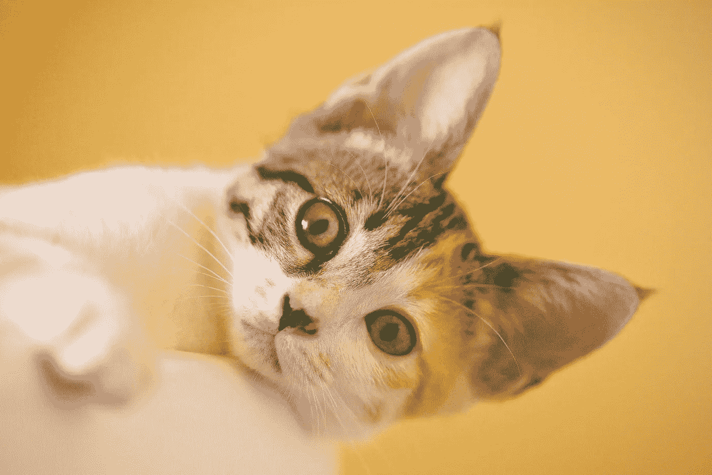
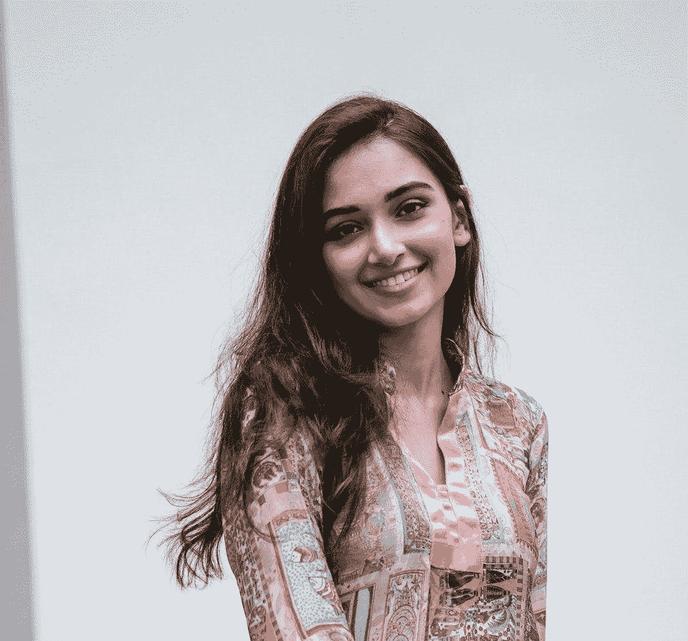
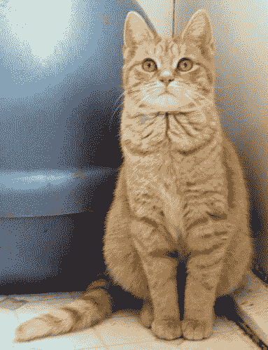
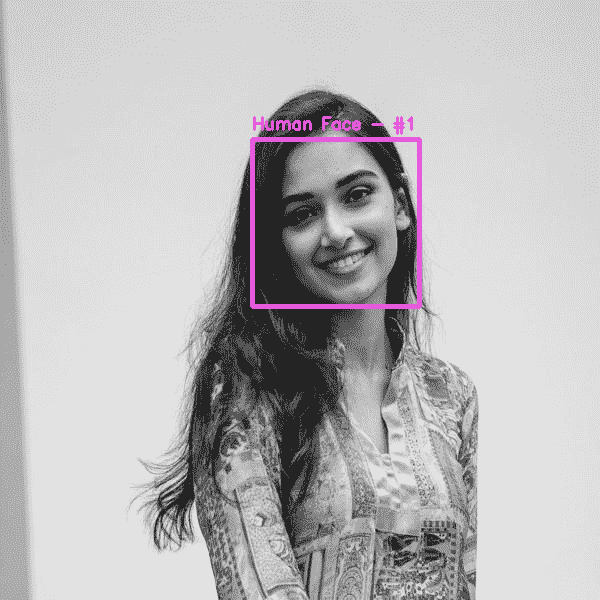
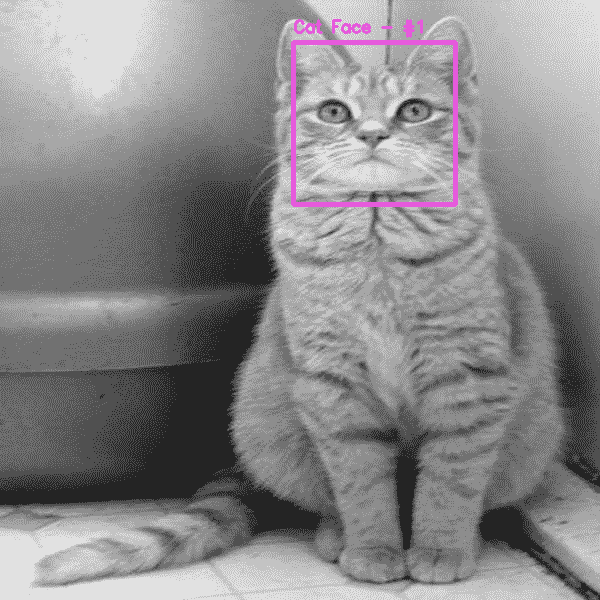
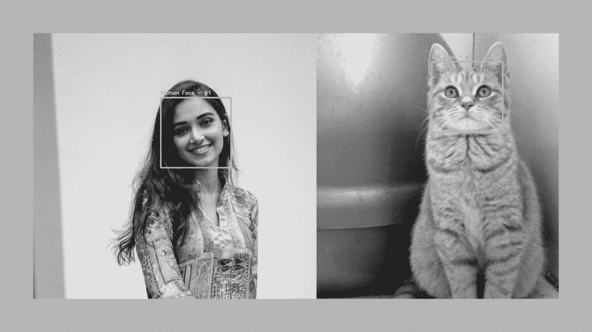

# 用 Python 构建猫脸识别器

> 原文：<https://towardsdatascience.com/building-a-cat-face-recognizer-in-python-92e30d77a661?source=collection_archive---------29----------------------->

## 机器能理解人和猫脸的区别吗？



照片由[丛 H](https://www.pexels.com/@cong-h-613161?utm_content=attributionCopyText&utm_medium=referral&utm_source=pexels) 从[派克斯](https://www.pexels.com/photo/focus-photo-of-short-fur-white-black-and-orange-cat-1404825/?utm_content=attributionCopyText&utm_medium=referral&utm_source=pexels)拍摄

在这篇文章中，我将向你展示如何编写一个简单的程序来检测猫的面孔。在我的人脸检测帖子中，我展示了如何使用 Python 来检测人脸。当我用许多图像测试代码时，我意识到其中一些图像中有动物。但是我们创造的人脸检测模型不能识别动物的脸。然后，我想知道是否有一种方法可以检测图像中的动物面孔，在互联网上做了一些研究后，是的，这是可能的。甚至在 Kaggle 上找到了很多免费的数据集，有几百张图片。Kaggle 是一个寻找免费数据集的好地方，他们也在组织数据科学竞赛。这是一个练习数据科学技能和向他人学习的好地方。无论如何，回到我们的项目。我很高兴在一个程序中结合了人类和猫的面部检测模型，这样我们的机器就可以学习区分人类和猫。这将是一个有趣的项目。我们开始吧！！

# 图书馆

首先，文书工作。当您处理机器学习项目时，安装和导入库是必要的。我们将为这个项目使用两个库，它们被称为 OpenCV 和 Pillow。OpenCV 是一个高度优化的库，专注于实时应用。Pillow 是一个很棒的图像处理库。枕头将作为“枕头”安装，但作为 PIL 进口。它们是一回事，不要混淆。

> OpenCV(开源计算机视觉库)是一个开源的计算机视觉和机器学习软件库。OpenCV 旨在为计算机视觉应用提供一个公共基础设施，并加速机器感知在商业产品中的应用。作为一个 BSD 许可的产品，OpenCV 使得企业利用和修改代码变得很容易。

安装过程非常简单和容易。在您的终端窗口中编写以下代码行:

```
pip install opencv-python pillow
```

安装完成后，我们可以将其导入到我们的程序中。

```
import cv2 from PIL import Image
```

OpenCV 已经包含了许多预先训练好的人脸、眼睛、微笑等分类器。这些 XML 文件存储在 GitHub 文件夹中。我们将使用猫脸检测和人脸检测模型。

以下是链接:

**猫脸:**[https://raw . githubusercontent . com/opencv/opencv/master/data/haarcascades/haarcascade _ frontalcatface _ extended . XML](https://raw.githubusercontent.com/opencv/opencv/master/data/haarcascades/haarcascade_frontalcatface_extended.xml)

**人脸:**[https://raw . githubusercontent . com/opencv/opencv/master/data/haarcascades/haarcascade _ frontal Face _ default . XML](https://raw.githubusercontent.com/opencv/opencv/master/data/haarcascades/haarcascade_frontalface_default.xml)

如果您有帐户，可以从 Github 下载 XML 文件。如果你没有，请随意从上面的链接中复制代码，粘贴到你的文本编辑器中并保存它们。我将它们保存为“catface_detector.xml”和“humanface_detector.xml”。

将文件保存到您的文件夹后，让我们将它们加载到我们的程序中。

```
# Load the cascades 
catface_cascade = cv2.CascadeClassifier('catface_detector.xml') humanface_cascade = cv2.CascadeClassifier('humanface_detector.xml')
```

# 形象

在这一步中，您将选择一个要测试代码的图像。确保你至少有几张图片来检查你程序的准确性。这些图像可以有人类和猫，也可以只有其中一个。如果你很难找到猫的图片，我在 [Kaggle](https://www.kaggle.com/tongpython/cat-and-dog) 上找到了一个免费的数据集。请随意下载并用于该项目。

以下是我将在我们的项目中使用的图片:



照片由 [mentatdgt](https://www.pexels.com/@mentatdgt-330508?utm_content=attributionCopyText&utm_medium=referral&utm_source=pexels) 从[像素](https://www.pexels.com/photo/photo-of-smiling-woman-in-floral-salwar-kameez-posing-2558680/?utm_content=attributionCopyText&utm_medium=referral&utm_source=pexels)拍摄



[https://www.kaggle.com/c/dogs-vs-cats](https://www.kaggle.com/c/dogs-vs-cats)

选择图像后，让我们给它们重新命名。确保图像文件位于您正在处理的同一文件夹中。在保存它们之后，现在我们将对图像做一些修饰。

# 图像处理

在这一步，我们将对图像做一些小的修饰，以便更好地处理。我发表了一篇关于常用图像处理技术的文章。做这些修饰确实有助于我们的机器处理并给出更好的结果。在这个练习中，首先，让我们调整图像的大小，使它们大小相同。接下来，我们将它们转换为灰度，我们的模型处理灰度图像更快。

[](/image-manipulation-in-python-cbb86a61cf0) [## Python 中的图像处理

### 常用图像处理技术逐步指南

towardsdatascience.com](/image-manipulation-in-python-cbb86a61cf0) 

为了使用这些图像编辑技术，我们将使用我们在文章开始时导入的图像模块。

## 调整大小

```
newsize = (600, 600) #First image retouches
imgr1 = Image.open("test1.jpg") 
imgr1 = imgr.resize(newsize) 
imgr1.save("resized1.jpg")#Second image retouches
imgr2 = Image.open("test2.jpg") 
imgr2 = imgr.resize(newsize) 
imgr2.save("resized2.jpg")
```

## 灰度等级

```
imgr1 = imgr1.convert('L') 
imgr1.save('ready1.jpg') imgr2 = imgr2.convert('L') 
imgr2.save("ready2.jpg")
```

## 导入编辑过的图像

最后，让我们将编辑好的图像导入我们的程序，这样我们就可以运行猫脸和人脸检测模型。我们使用 Opencv 库来导入图像。

```
# Read the input image 
img1 = cv2.imread('ready1.jpg')

img2 = cv2.imread('ready2.jpg')
```

# 人脸检测

## 瀑布状物

是时候检测人脸了。我们将运行两行代码。第一个在图像中发现人脸的人。第二步是检测图像中的猫脸。如前所述，我们正在起诉 opencv 分类器。

```
human_faces = humanface_cascade.detectMultiScale(img1,     
scaleFactor=1.3, minNeighbors=5, minSize=(75, 75)) cat_faces = catface_cascade.detectMultiScale(img2, scaleFactor=1.3, 
minNeighbors=5, minSize=(75, 75))
```

## 画矩形

在这一步，我们将围绕检测到的人脸绘制矩形。这些矩形可以是不同的颜色，其厚度也是可调的。

```
for (i, (x, y, w, h)) in enumerate(human_faces): cv2.rectangle(img1, (x, y), (x+w, y+h), (220, 90, 230), 3)      
   cv2.putText(img1, "Human Face - #{}".format(i + 1), (x, y - 10), 
   cv2.FONT_HERSHEY_SIMPLEX, 0.55, (220, 90, 230), 2) for (i, (x, y, w, h)) in enumerate(cat_faces): cv2.rectangle(img2, (x, y), (x+w, y+h), (0,255, 0), 3) 
   cv2.putText(img2, "Cat Faces - #{}".format(i + 1), (x, y - 10), 
   cv2.FONT_HERSHEY_SIMPLEX, 0.55, (0, 0, 255), 2)
```

*   (220，90，230)和(0，255，0)是我们要绘制的矩形的颜色。你可以玩玩它们，看看颜色是怎么变化的。
*   (3)是线条的粗细。您可以更改该值并查看其外观。

## 保存您的结果

最后，我们将保存检测到人脸的图像。要看到你工作的最终结果，最好的方法就是保存下来，然后检查。确保变量名传递正确。在运行最后一段代码之前，如果一切正常，我建议继续检查整个代码。

```
#Saving the images using imwrite methodcv2.imwrite("faces_detected1.png", img1)cv2.imwrite("faces_detected2.png", img2)
```

# 结果

这是我的工作成果。第一个是人脸检测，第二个是猫脸检测结果。如你所见，我们的机器知道哪个是人，哪个是猫脸。我还通过将两张图片合成一张来测试这个程序。我收到的结果可以在下面找到。



faces _ detected1.png



faces _ detected2.png

# 额外的

不要逐个测试每个图像，让我们看看当我们将两个图像组合成一个图像并运行代码时会发生什么。我们可以看到，我们的机器现在能够理解和区分猫和人脸。



结果

恭喜你。！你已经创建了一个程序来检测图像中的猫和人脸。现在，你有一个想法，如何教一台机器同时为你做几件事。希望你喜欢这篇教程，并在今天学到一些新东西。计算机视觉是一个伟大的领域，你可以做的事情是无限的。请随意在不同的图像上测试您的代码，看看它是如何工作的。它可能不适用于所有图像，因为预测依赖于训练数据。在未来的帖子中，我计划向您展示如何用您自己的数据集训练机器，以便它可以为您提供更好的预测。

*跟随我的* [博客](https://medium.com/@lifexplorer) *和* [走向数据科学](https://towardsdatascience.com/) *留下灵感。*

谢谢你，

## 你可能会感兴趣的机器学习项目:

[](/building-a-simple-text-recognizer-in-python-93e453ddb759) [## 用 Python 构建一个简单的文本识别器

### 如何使用文本识别器改进笔记记录过程

towardsdatascience.com](/building-a-simple-text-recognizer-in-python-93e453ddb759) [](/building-a-speech-recognizer-in-python-2dad733949b4) [## 用 Python 构建语音识别器

### 使用谷歌云语音 API 将您的音频文件转换为文本

towardsdatascience.com](/building-a-speech-recognizer-in-python-2dad733949b4)