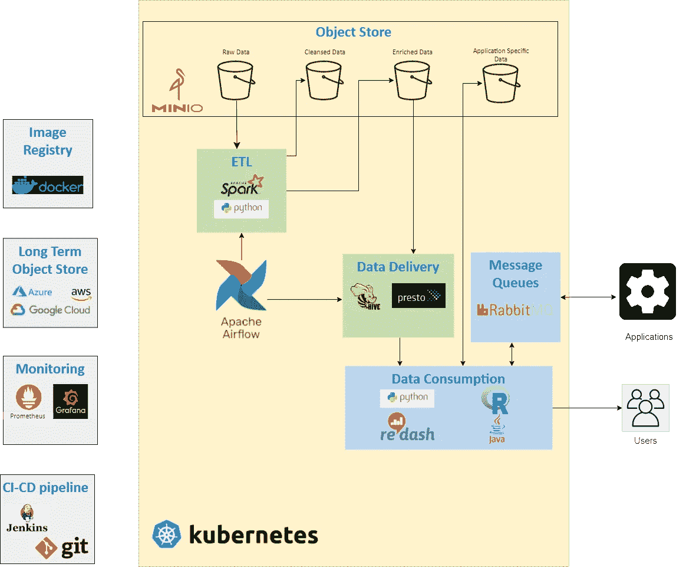

# 构建云原生、云无关的数据湖

> 原文：<https://towardsdatascience.com/building-a-cloud-native-cloud-agnostic-data-lake-376aa2f2aacd?source=collection_archive---------28----------------------->

## 摆脱云供应商的束缚

凯西·霍纳在 [Unsplash](https://unsplash.com?utm_source=medium&utm_medium=referral) 上的照片

> **为什么还要这样做？**

最近，我有机会帮助我的一个客户解决一个有趣的问题。

他们在公共云平台上为特定地区构建了完整的数据湖和分析解决方案，并希望将该解决方案部署到另一个地区。负责管理该解决方案的部门希望该解决方案在不同的公共云平台上实施。

该解决方案基于公共云提供商提供的功能丰富的服务，要在不同的云平台上实施该解决方案，需要进行大量的重新工作。我的客户发现自己被绑上了*金手铐*。

这种特殊情况可能是一种独特的情况，可能适用于大公司，但越来越多的组织现在寻求在任何广泛可用的公共/私有云平台上实施其解决方案的灵活性。毕竟,*云*做出的一个重大承诺是实现解决方案的灵活性，那么现在它怎么能把它拿走呢。

> **有什么解决办法？**

近年来，Kubernetes 已经成为实现云原生但与云无关的解决方案的黄金标准。对我来说，一些突出的好处是:

*   基于 Kubernetes 构建的解决方案可以使用行业标准的模式和工具。这些应用程序是可移植的，随时可以部署在任何平台(公共或私有)上。
*   它通常也比使用云提供商提供的现成服务便宜。
*   随着应用程序变得越来越复杂，Kubernetes 将更多的控制权交给了开发团队，使他们能够轻松地进行构建。
*   有大量的软件发行版可以作为 docker 图像和舵图表，很容易根据您的需要配置它们。

另一方面，基于 Kubernetes 的解决方案需要更多的努力来支持和管理。

好了，现在我们已经奠定了基础，让我们来看看所提议的解决方案的概要设计

作者图片

如您所见，我们使用 Kubernetes 作为我们的数据湖和分析解决方案的基础部分和抽象层，这将分离底层基础架构，并为您提供迁移到任何公共/私有/混合云解决方案的灵活性。

现在，让我们逐一探究该设计中的每个组件:

*   对象存储(Object Store):基于 S3 的存储是我们解决方案的绝佳选择，S3 与 Spark 合作，并且有一个全面的 API 列表(感谢亚马逊)，可以用所有主要的编程语言与 S3 交互。 [MinIO](https://min.io/) 完全符合要求。这是一个高性能，Kubernetes 本机对象存储，并会谈 S3。MinIO 将用于存储与 ETL 和下游处理相关的数据，而对于长期归档，公共云提供商将更加经济实惠。
*   **ETL** :对于我们的 ETL 需求，我们使用了 Spark(具体来说就是 Pyspark)。它是快速的、分布式的，并且与 S3 配合得很好，所以不需要将所有数据导入 HDFS。Spark 原生支持 Kubernetes 已经有一段时间了，未来的管道看起来更有希望。
*   **数据交付**:独立 Hive 元存储和 Presto 的结合让您可以直接从您的 S3 存储中查询数据。Presto 是分布式的、可扩展的，符合我们并行处理的设计模式。它可以通过 JDBC 连接获得，并允许许多应用程序轻松地连接和查询数据。
*   **工作流管理** : [Apache airflow](https://airflow.apache.org/) 是一个基于 Python 的工作流管理工具，它使您能够调度作业，创建复杂的作业依赖关系，定义重试和通知逻辑，所有这些都在 Python 中基于配置-代码的模式中完成。
*   **治理**:我们正在用各种工具和技术构建一个解决方案。使用 DevOps 和适当的日志记录和监控的原则是最重要的。我们将使用 Docker 来管理我们的映像注册表，使用 Git 和 Jenkins 来管理源代码控制和 CI/CD 管道，使用 Prometheus 和 Grafana 来监控我们系统的健康状况。

> **结论**

这个解决方案中有许多组件，从头构建并维护它不是一件简单的任务。对我们来说，这是必要的，在 Kubernetes 上构建定制数据湖和分析解决方案的好处大于坏处。

我将尝试更详细地重新审视这些组件，并提供一些示例代码来帮助开发过程。同时，请随时留下任何反馈/建议/评论。